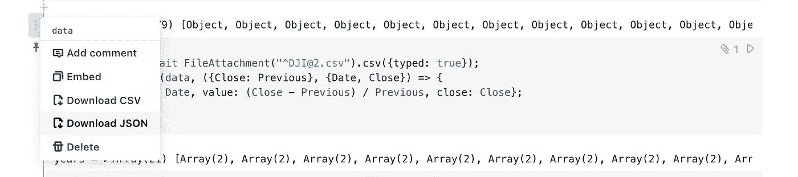
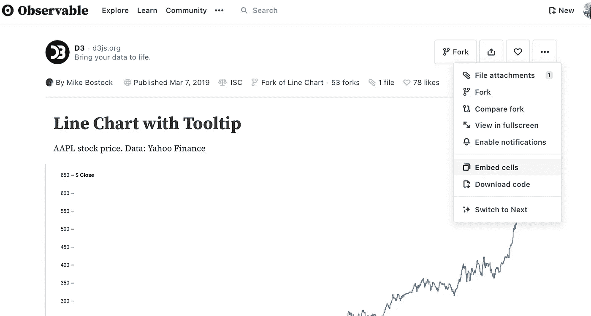
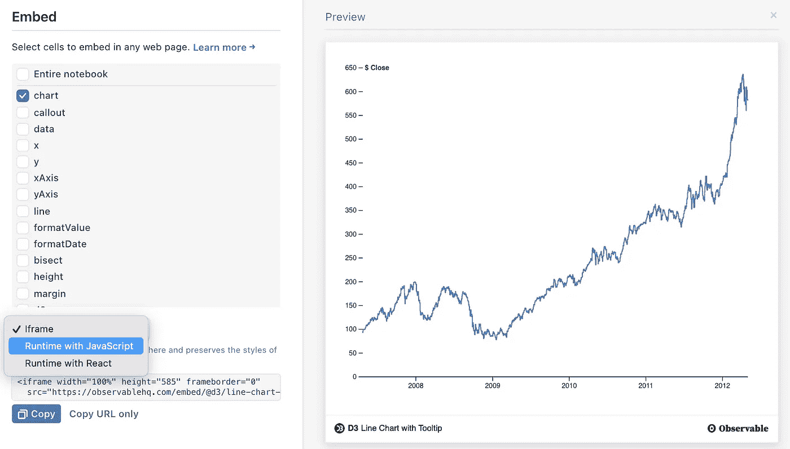
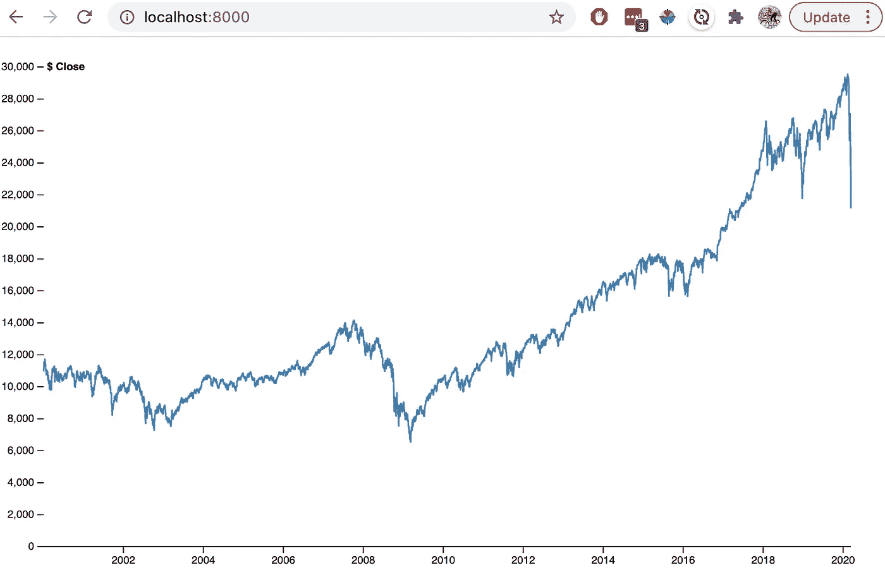

# 嵌入式可观察笔记本

> 原文：<https://towardsdatascience.com/embed-observable-notebooks-492292424923?source=collection_archive---------25----------------------->

## 将所有酷的例子用于你自己的数据，同时将数据保存在本地或你的网络中。


过着最佳觅食生活的鸡。图片作者。

如果你没听说过， [Observable](https://observablehq.com/trending) 是 d3 的创造者 Mike Bostock 带给世界的一个交互编码平台。它体现了 Bret Victor 对[反应式编程的大胆设想，坦率地说，我认为它非常酷。一个缺点:我不擅长核心语言 Javascript。我非常擅长这个，不要误解我，但是我一直对人们在 Observable 上做的事情印象深刻。冒着重复 Observable 团队优秀指南的风险，我只分享一个具体的例子。](https://www.youtube.com/watch?v=8pTEmbeENF4)

如果你被我的指南卡住了，权威参考是[嵌入简介](https://observablehq.com/@observablehq/introduction-to-embedding)、[高级嵌入和下载](https://observablehq.com/@observablehq/downloading-and-embedding-notebooks?collection=@observablehq/embed-trail) g，以及[嵌入故障排除](https://observablehq.com/@observablehq/troubleshooting-embedding?collection=@observablehq/embedding-notebooks)。

现在我们走吧。Mike Bostock 展示了 d3 的两个出色的可视化示例:[带工具提示的折线图](https://observablehq.com/@d3/line-chart-with-tooltip)和[日历视图](https://observablehq.com/@d3/calendar-view)。我给加州大学伯克利分校 MIDS 分校的学生展示了后者，我们很好奇日历视图中显示的数据在折线图中会是什么样子。首先从日历视图下载数据:



下载“数据”变量的 JSON。图片作者。

现在我们有了数据，让我们创建嵌入。从折线图中，单击右上角的三个点，然后选择嵌入:



单击嵌入单元格。图片作者。

现在我们只需要图表，所以只选择图表。确保获得“JavaScript 运行时”,这样我们就可以覆盖数据。



图片作者。

现在您应该有了这段代码:

```
<div id="observablehq-chart-22ee36d2"></div>
<p>Credit: <a href="[https://observablehq.com/@d3/line-chart-with-tooltip](https://observablehq.com/@d3/line-chart-with-tooltip)">Line Chart with Tooltip by D3</a></p><script type="module">
import {Runtime, Inspector} from "[https://cdn.jsdelivr.net/npm/@observablehq/runtime@4/dist/runtime.js](https://cdn.jsdelivr.net/npm/@observablehq/runtime@4/dist/runtime.js)";
import define from "[https://api.observablehq.com/@d3/line-chart-with-tooltip.js?v=3](https://api.observablehq.com/@d3/line-chart-with-tooltip.js?v=3)";
new Runtime().module(define, name => {
  if (name === "chart") return new Inspector(document.querySelector("#observablehq-chart-22ee36d2"));
});
</script>
```

在您已经下载的`data.json`旁边打开一个空的`index.html`，我们将把它嵌入到一个 HTML 容器中(在我的 Atom 编辑器中，我只需键入`html`，并使用补全来获得“外壳”)。它应该是这样的:

```
<!DOCTYPE html>
<html lang="en" dir="ltr">
    <head>
        <meta charset="utf-8">
        <title></title>
    </head>
    <body>
        <div id="observablehq-chart-b01c95fe"></div> <script type="module">
        import {Runtime, Inspector} from "[https://cdn.jsdelivr.net/npm/@observablehq/runtime@4/dist/runtime.js](https://cdn.jsdelivr.net/npm/@observablehq/runtime@4/dist/runtime.js)";
        import define from "[https://api.observablehq.com/@d3/line-chart-with-tooltip.js?v=3](https://api.observablehq.com/@d3/line-chart-with-tooltip.js?v=3)";
        new Runtime().module(define, name => {
            if (name === "chart") return new Inspector(document.querySelector("#observablehq-chart-b01c95fe"));
            return ["x","y","yAxis","bisect","  xAxis","line"].includes(name);
        });
        </script>
    </body>
</html>
```

现在我们将加载数据，首先加载 d3 库并使用它来获取 JSON 文件:

```
<!DOCTYPE html>
<html lang="en" dir="ltr">
    <head>
        <meta charset="utf-8">
        <title></title>
    </head>
    <body>
        <div id="observablehq-chart-b01c95fe"></div> <script src="[https://d3js.org/d3.v7.min.js](https://d3js.org/d3.v7.min.js)"></script>
        <script type="module">
        import {Runtime, Inspector} from "[https://cdn.jsdelivr.net/npm/@observablehq/runtime@4/dist/runtime.js](https://cdn.jsdelivr.net/npm/@observablehq/runtime@4/dist/runtime.js)";
        import define from "[https://api.observablehq.com/@d3/line-chart-with-tooltip.js?v=3](https://api.observablehq.com/@d3/line-chart-with-tooltip.js?v=3)";
        const main = new Runtime().module(define, name => {
            if (name === "chart") return new Inspector(document.querySelector("#observablehq-chart-b01c95fe"));
            return ["x","y","yAxis","bisect","  xAxis","line"].includes(name);
        }); d3.json("data.json").then(function(d) {
            [next bit goes here]
        });
        </script>
    </body>
</html>
```

好的，我不仅仅是加载了 d3 和数据。看还有什么？我还将运行时固定在一个变量中，我用`const main = ...`称之为“main”。

最后，一旦数据被加载，我们只需要覆盖运行时上的数据。为了避免再次重复整个代码块，我们将用我们的覆盖替换`[next bit goes here]`。让我们开始吧，首先用日期制作日期对象并添加轴标签，然后覆盖数据:

```
const newData = Object.assign(d.map(({date, close}) => ({date: new Date(date), value: close})), {y: "$ Close"});
main.redefine("data", newData);
```

而且应该管用！因为我们从本地文件系统请求`data.json`，要查看`index.html`文件，你需要一个本地服务器(你的浏览器保护你免受恶意 JS 文件的攻击！).出于方便，我通常只是用

```
python3 -m http.server
```

当导航到 [http://localhost:8000/](http://localhost:8000/) 查看成品时:



是的，我需要升级我的浏览器。图片作者。

干杯！