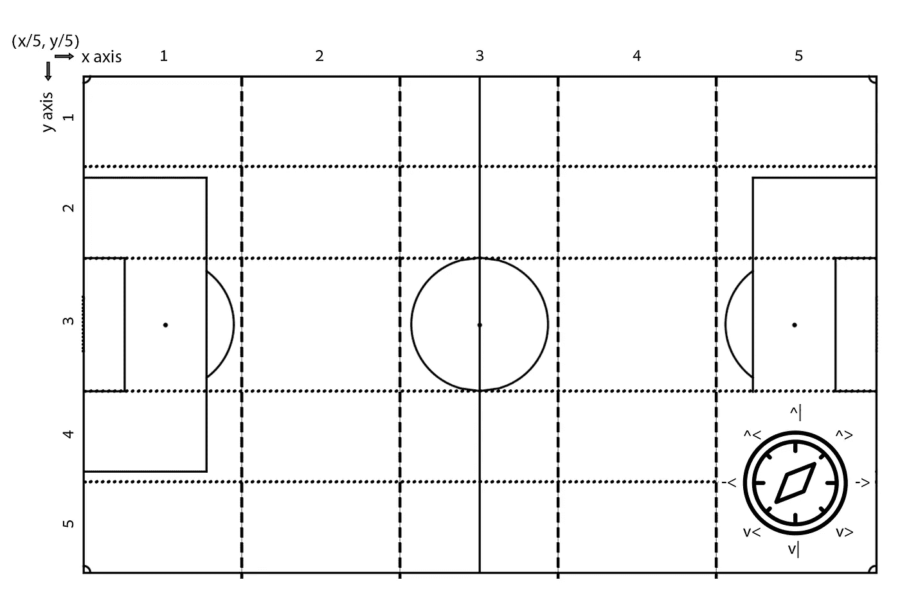
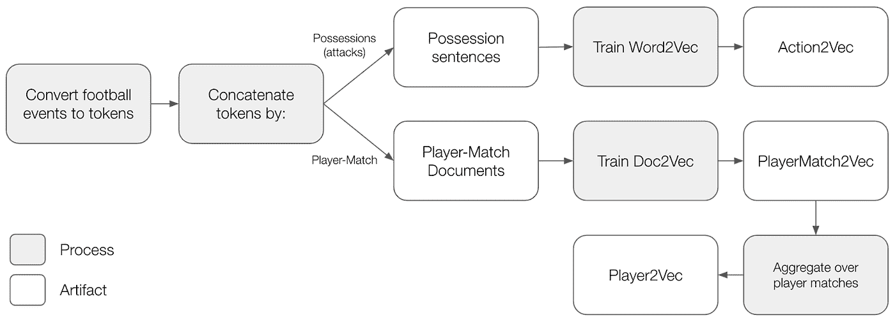
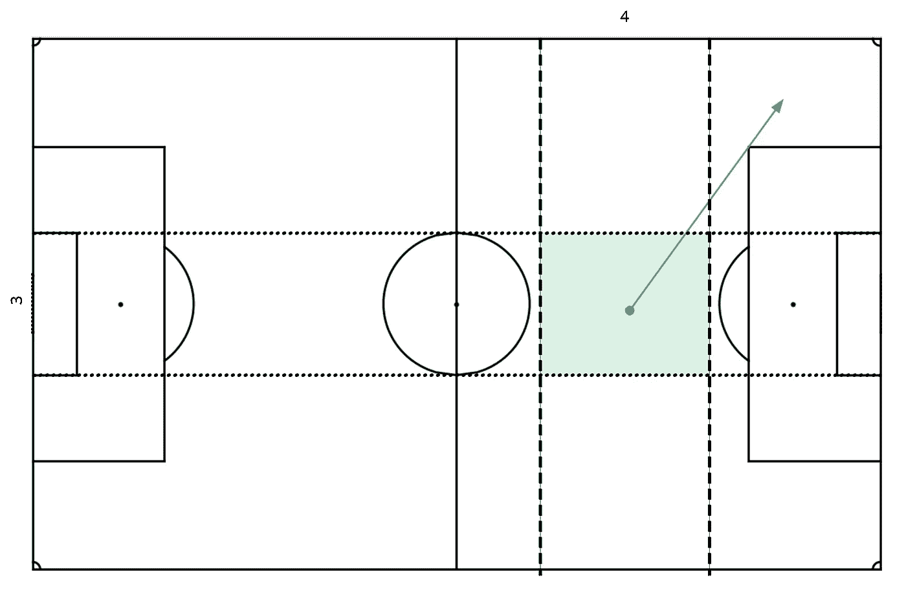
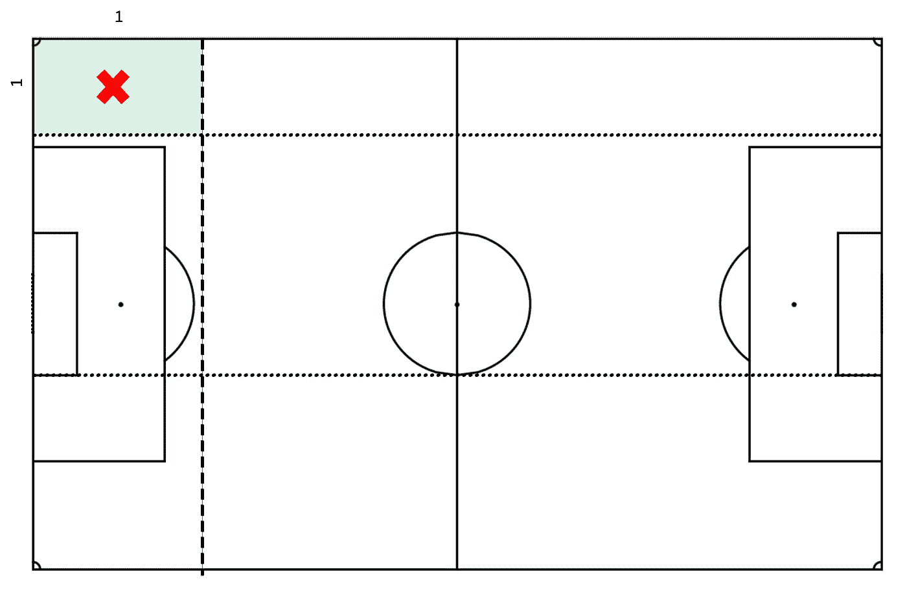
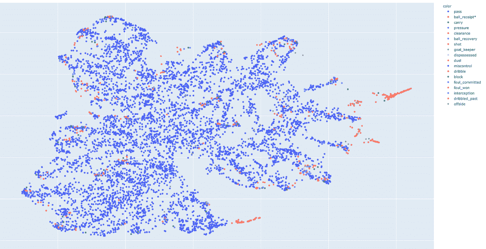
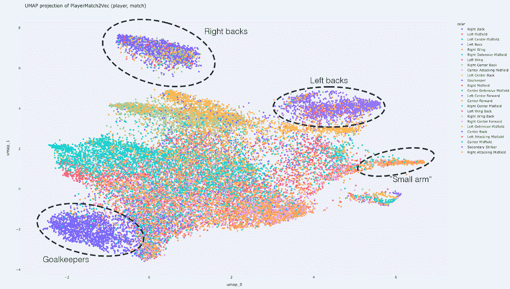
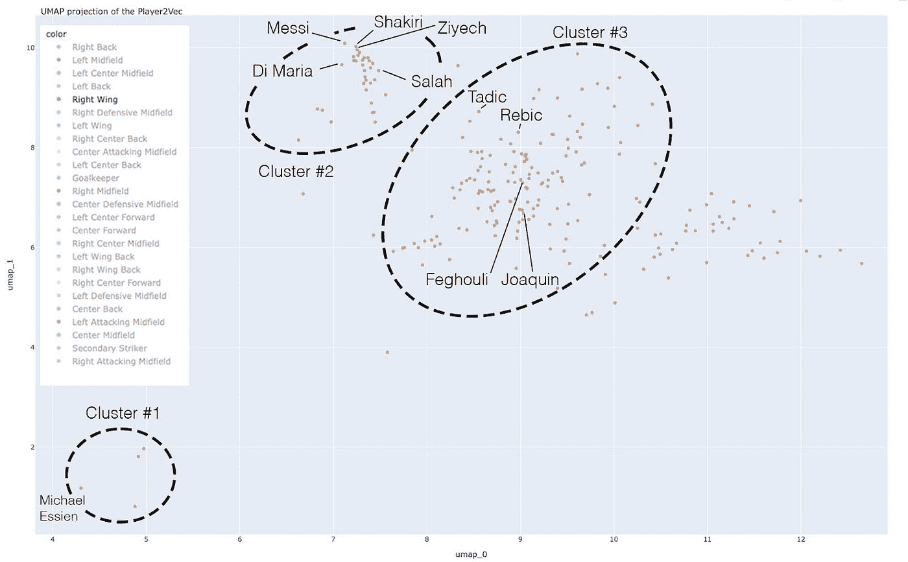

# 使用自然语言处理嵌入足球语言

> 原文：<https://towardsdatascience.com/embedding-the-language-of-football-using-nlp-e52dc153afa6?source=collection_archive---------7----------------------->

## [实践教程](https://towardsdatascience.com/tagged/hands-on-tutorials)

## 使用最先进的 NLP 算法构建体育分析领域未来机器学习解决方案的表示

*形象由* [*胄*](https://unsplash.com/@tetrakiss) *上* [下](https://unsplash.com/?utm_source=medium&utm_medium=referral)下。

世界上有 13 亿人说汉语，这使它成为世界上最通用的语言。有趣的是，最受欢迎的运动——足球——拥有 40 亿粉丝，是它的 3 倍多。任何体育游戏都有严格的规则和格式，就像语法一样，还有一套定义好的动作，就像词汇一样。显然，如果足球是一种正式语言，它将是世界上最受欢迎的语言。

受这一见解的启发，在这部作品中，我试图将当前最先进的表达人类语言的方法，也就是自然语言处理，投射到代表足球的全球语言上。

我将主要关注创建这种表示的动机，以及如何创建它，并在某种程度上验证结果。我的下一篇文章将讨论在表示的基础上开发解释器和 UI，并演示它在足球领域的各种用例中的使用。

这篇文章相当长。为了您的方便，我添加了一个目录。如果你熟悉上面提到的 NLP 概念，可以直接跳到[action 2 vec——嵌入球上动作](#9afc)。

**本作使用的所有代码** [**都可以在 Github**](https://github.com/ofirmg/football2vec) **上的 Football2Vec 库中获得。**

# 目录

*   [动机](#6ec6)
*   [先验知识](#8081)
*   [数据集](#3af8)
*   [构建足球语言](#b8c9)
*   [动作 2Vec —嵌入球上动作](#9afc)
*   [玩家 2 vec——用文字描述玩家](#4b92)
*   我们如何使用它？
*   [寻找相似的玩家](#97d4)
*   [足球类比](#c1e8)
*   [下一步是什么？](#b34f)

# 动机

首先，任何涉及数学模型的复杂任务都需要一种表示，也就是向算法提供数据的方式。具体来说，数据表示是机器学习建模的核心。例如，如果我们想确定一个球员是否适合某个特定的俱乐部，我们首先需要定义如何表示足球运动员和足球俱乐部。表示应该尽可能的通用和描述性，以适应各种各样的用例。文本嵌入满足这些要求。

第二，也是最重要的一点，我一直觉得足球很迷人。我很好奇它会把我引向何方。随着数据变得越来越容易获取，我知道这可能非常有趣，这本身就是做任何事情的正当理由，不是吗？

# 先验知识

这项工作包含了自然语言处理(NLP)中的一些高级概念，如*单词嵌入*、 [*Word2Vec*](https://arxiv.org/abs/1301.3781) 和 [*Doc2Vec*](http://proceedings.mlr.press/v32/le14.html) 。对于那些不熟悉单词嵌入的人来说，它们基本上是单词的密集、低维表示，遵循的思想是单词之间的语义相似度越高，它们在空间上应该越接近。为了更深入地了解它，我强烈推荐[这篇关于单词嵌入的评论](https://medium.com/compassred-data-blog/introduction-to-word-embeddings-and-its-applications-8749fd1eb232)和[Zafar Ali](https://medium.com/@zafaralibagh6/a-simple-word2vec-tutorial-61e64e38a6a1)的简单 word2vec 介绍。

在实践方面，如果你想知道如何使用 Python 实现 Word2Vec，请按照[这个指南](https://medium.com/analytics-vidhya/word2vector-using-gensim-e055d35f1cb4)使用 Gensim 编码 Word2Vec(当然，也可能适用许多其他包，如 Keras / TF / Pytorch /等。).最后，为了绘制 2D 空间上的嵌入，我们使用 [UMAP](https://github.com/lmcinnes/umap) 进行降维，这被认为是最佳实践。

# 数据集

这项工作的数据基于 [Statsbomb](https://statsbomb.com/) [开放数据集](https://github.com/statsbomb/open-data)。它包含约 900 场比赛和来自各种锦标赛的约 900 名 4K 选手(男性和女性)。季节范围在 2003 年到 2020 年之间。值得注意的是，很多赛季只有很少的比赛。数据集中的每场比赛都包含球队元数据(例如，国家、阵容等。)、比赛元数据(例如，舞台、体育场等。)，最重要的是，手动收集和标记事件数据。

比赛事件数据本质上使用丰富的属性来描述持球动作:动作名称、位置、球员名称、时间，以及作为动作结果的可选参数和用于执行动作的球员身体部位。详细的文档可以在[数据集的 Github 库](https://github.com/statsbomb/open-data)上找到。总体而言，该数据集包含约 300 万条事件记录。想了解更多关于足球数据集的信息，请访问[克里斯蒂安·科蒂施克](https://medium.com/@christiankotitschke?source=post_page-----6cc1b7844792--------------------------------)的[这篇精彩评论](https://medium.com/the-sports-scientist/soccer-analytics-data-beginners-guide-6cc1b7844792)。

# 构建足球语言

关于我们的代表，我们定义了两个目标:

1.  表现必须嵌入关于游戏的知识。
2.  表现形式必须尽可能直观。

以下基本原则将指导我们设计语言，只描述重要的东西，同时**模仿人类说话的方式**，尽可能保持简单和直观。

## 遵循人类的说话方式

人们倾向于用丰富的专业语言来描述球员。例如，在寻找新球员时，我们可以说:*“我们需要一个在禁区内得分的目标人物，双腿都有出色的射门能力和良好的头球。他还需要在压力下成功接到长传球……”*。根据这份资料，我们可以想到埃托奥、伊布、苏亚雷斯等球员。

有意思的是，这样复杂的描述，可能会换成一个代表球员的名字。例如，有人可能会说*“给我找另一个苏亚雷斯】*。为此，我们应该**为具有相似人类等级描述的玩家提供相似的表示**。那么，在对足球语言进行建模时，我们需要考虑哪些方面呢？

*   球员做什么——因为我们使用事件数据，我们将仅仅处理有球动作，比如传球、运球等。
*   他在球场上做什么——中锋、边路、防守位置、前锋位置等等。
*   **他是如何做到的——使用身体的哪个部位，持续多长时间，等等。**

我们的结论是，我们需要一个能够捕捉到**的实际行动、空间和背景的表现形式。**

## 为什么是单词嵌入？

在我们开始建模之前，我们应该考虑一些可能的方法。三个因素促使我选择单词嵌入:

1.  单词嵌入直观地编码语义上下文。
2.  单词嵌入是一种强大的数学工具，可以产生最先进的结果。然而，它们的使用效率很高。
3.  这些模型很多都是开源的，就这么简单。

可以用 Word2Vec & Doc2Vec 吗？使用 Word2Vec 和 Doc2Vec 需要验证三个主要假设:(1)句子的正常性，(2)在给定上下文的情况下预测缺失单词的身份的能力，以及(3)定义良好的词汇。接下来，我们将解决这些需求。

## 作为文本数据的事件数据

想想足球在广播里的播报方式，这是现实生活中一种口头的、简洁的消费方式。这对于如何使用事件数据来描述持球动作是一个很好的启发。

事件数据描述了哪些动作发生了，什么时候，在球场上的什么地方，由谁做的。由于这些事件是按时间顺序排列的，我们可以用它们来构建事件的序列，也就是我们语言中的句子。

下一个要解决的问题是——给定一系列真实事件，我们能推断出缺少了什么事件吗？要回答这个问题，请考虑以下一系列操作:

*传到侧翼，传到禁区，___？___，守门员扑救*。

空白处可以放什么？禁区内任何类型的射门或头球都可以。虽然你们大多数人觉得这个谜语很简单，但提出了两个重要的见解:

1.  **知道答案，在某种意义上就是了解足球是如何运作的**。
2.  符合这个缺失单词的所有动作都可以被认为是语义相似的**——拿球并直接试图在禁区内射门的动作。**

## 定义词汇

那么，我们如何用我们的语言将事件编码成单词呢？虽然选择是无穷无尽的，但我决定采用以下方案:

*<动作名称> <动作位置><附加参数>*

*   动作:传球、运球、射门、守门员动作、拦截、接球、持球、脱手、决斗、拦网、犯规、越位和解围。
*   位置—我将音高从左到右水平分成五个箱，从上到下垂直分成五个箱，如下所示:

图 1:动作位置符号。x 轴和 y 轴被分成五个箱。右下角有角度符号。图片作者。

*   其他参数——身体部位、传球高度、传球方向、脚后跟传球、投篮技术类型、动作结果等。

理解**参数选择高度影响结果**是很重要的。例如，我没有考虑任何与行动持续时间相关的参数，这意味着语言在描述玩家时不会捕捉到这个因素。

**概括一下**，我们将使用比赛数据来构建描述足球比赛的令牌。使用这些单词，我们将构造句子，在这些句子上，我们可以训练 Word2Vec 模型来理解足球动作。然后，我们将使用 Doc2Vec 模型来表示足球运动员。

图 2:研究计划。图片作者。

重要的免责声明——这种描述意在**描述玩家执行动作的内容、地点和方式，而不是他们执行得有多好**。在下一篇文章之前，技能水平是我们表述中缺失的一块。例如，我们的模型可以表明一名球员执行与梅西相同的动作，但这并不意味着他和梅西一样优秀。不幸的是，我不相信事件数据能有效衡量玩家的技能水平。

# Action2Vec —嵌入球上动作

有了词汇之后，我们就可以开始造一些关于球上动作的句子了。我们根据球的所有权来分组行动，意思是，每一句话都是一系列的团队行动，直到球被另一个团队丢掉。我们允许连接以下所有物，以防它们短于模型的采样窗口参数。

我们使用具有以下超参数的 [Gensim Word2Vec](https://radimrehurek.com/gensim/models/word2vec.html) :窗口大小为 3，嵌入大小为 32，以及 10 次出现的数据集中的最小单词数。这个模型被输入了我们创建的单词的整数编码。总的来说，我们的词汇表中有大约 19K 个单词。让我们看看我们语言中的两个单词示例，它们的表示，以及足球空间中最接近的(语义)单词。

## 示例 1:单词 ID 3274

*   文字描述: *(4/5，3/5) <传球>:(^<)|高长|左脚*
*   含义:前场位置的长对角线高传球。对角线方向遵循图 2 中解释的符号。
*   单词嵌入= [0.55 -0.57 … -0.13 0.13] (32 x 1 向量)

图 3:字 ID: 3274，字说明: *(4/5，3/5) <关>:(^<)|高长|左脚。*图片作者。

*   最相似的词是 742: *(4/5，3/5) <传球>:(^<)| ground-long | left _ foot*(同样传球，但是在地面上)。第二个最相似的单词对应于相同的传球，但是是用另一只(右)脚。不同身体部位或高度的相同传球之间的高度相似性表明，该模型学习了单词 id 背后的语义，捕捉了游戏逻辑和流程。

## 示例 2:单词 ID 315

*   文字描述: *(1/5，1/5) <运球>:不完整。*
*   含义:防守左侧运球不成功。
*   表示= [-0.45 -0.82 … 1.1 0.97] (32 x 1 向量)。

图 4:单词 ID 315，单词描述: *(1/5，1/5) <运球>:不完整。*图片作者。

*   最相似的词: *(1/5，1/5) <剥夺>* ，意味着模型了解到不成功的运球和剥夺是相似的，因为两者都将自己球队的控球权转移给了对手球队，这是持球者执行的动作的结果。

现在，让我们看看它是如何查找整个词汇表的。为此，我们使用 [UMAP](https://github.com/lmcinnes/umap) 作为一种技术，将维度从 32 维减少到仅仅 2 维。

图 5:完整的 19K 单词 Action2Vec 词汇的 UMAP 投影。图片作者。

我们可以注意到传球的流行，用紫蓝色标出，这是大多数的动作。视觉上，传球的形状像一只巨大的章鱼，到处张开双臂，因为它们连接着所有其他的动作、球员和位置。照片中的文字(粉红色)被十字、收件箱通行证等包围。此外，防守传球距离进攻传球很远，所以在某种意义上，位置也是根据数据推断出来的。话虽如此，重要的是要记住，这仅仅是一个 2D 减少的代表性。

# 播放器 2Vec

## player match 2 vec——用文字描述玩家

如果动作是单词，句子是一系列有序的动作，那么文档通常是后续句子的集合。在我们的例子中，文档是特定时间范围内的后续所有物的列表——一场完整的比赛、一场 10 分钟的比赛等等。然而，文档的这个通用定义同时描述了所有团队成员，而不是单个成员。

有几种可能的方法来构建描述单个玩家的文档。我选择了一个简单的解决方案，通过玩家在定义的范围内的有序“行动包”来定义玩家文档，即一场比赛中的所有**玩家行动。因此，我们可能有多个文档描述数据中的一个玩家。**

为了为每个玩家产生单个向量，我们可以在粒度级别上，例如在他的所有匹配上，对向量进行平均。然而，这样做我们消除了玩家的空间跨度，这可能也是有意义的。为了代表玩家，我们使用了 [Gensim 的 Doc2Vec](https://radimrehurek.com/gensim/models/doc2vec.html) 模型，其参数与 Action2Vec 相似，只是采样窗口较小。

图 PlayerMatch2vec 的 UMAP 投影。每个点代表特定比赛中的一名球员。球员是按位置着色的。图片作者。

图 6 覆盖了数据集中所有玩家的匹配，用玩家的位置来着色。位置是一个非常合理的“解释者”,因为在相同位置的球员通常被要求在相似的位置做相同的动作。比如门将集群，很好区分，非常同质。有趣的是，攻击者在空间上离守门员最近，因为他们触发了守门员的扑救。

更多的异构集群是右后卫和左后卫集群。虽然这两者看起来不相干，但更深入的探究揭示了两个主要的本土后卫集群，如约尔迪·阿尔巴和本杰明·门迪，以及一个包括安东尼奥·瓦伦西亚和丹尼尔·瓦斯等后卫的“桥梁”区域。所有其他位置都位于这三个集群之间。

我猜你想知道右边的“小臂”是什么，它似乎是一个单色的星团。嗯，这个非凡的造型属于一个非凡的球员——**莱昂内尔·梅西**。欢迎你自己探索梅西的集群中包括哪些球员，但不要担心——我会在下一篇文章中亲自挖掘。

## player 2 vec——用一个向量表示每个玩家

为了给每个玩家生成一个向量，我们对所有匹配的表示进行平均。您可以使用下面的交互式图表来探索这一有趣的结果:

图 7:玩家 2vec 的 Plotly 交互式 UMAP 投影，其中所有玩家的匹配被平均到单个向量。球员是按位置着色的。图片作者。

同样，我们可以花几个小时来研究它，并发现许多奇特的见解(以及一些我无法解释的见解)，但我更愿意专注于一个有代表性的例子——对右翼分子的考察:

图 8:数据集中所有右翼分子的 UMAP 投影播放器 2vec。图片作者。

集群#1 是一种异常值，这是有意义的，因为它本质上包含非本地边锋。‘umap _ 1’轴上的最高点是莱昂内尔·梅西。在他的集群中，集群#2，我们可以找到倾向于中间切入的边锋，如穆罕默德·萨拉赫，Xherdan Shakiri 和哈基姆·齐耶什。第三组包括像雷比奇、费古利和华金(皇家贝蒂斯)这样的球员，他们更多地粘在边路，把球传到禁区。

# 怎么会用呢？

## 寻找相似的玩家

还记得这篇文章开头的[寻找新球员签约的例子吗？对我来说，它匹配像埃托奥，兹拉坦伊布拉希莫维奇和路易斯苏亚雷斯这样的球员。那么，当我们根据我们的表述通过](https://docs.google.com/document/d/1cJIuJomMOPfch7I3cGRlroDSuYc78tYEmrFrQjChWdI/edit?pli=1#heading=h.f97ga0fpkuru)[余弦相似度](https://en.wikipedia.org/wiki/Cosine_similarity)来寻找与苏亚雷斯最相似的球员时，我们能期待什么呢？

1.  弗朗西丝卡·科比
2.  兹拉坦·伊布拉西莫维奇
3.  薇薇安·米德马
4.  Samuel Eto'o
5.  托马斯·穆勒
6.  凯蒂·斯坦格尔
7.  大卫·比利亚
8.  克里斯蒂亚诺·罗纳尔多
9.  阿莱克西斯·桑切斯
10.  迭戈弗兰
11.  尼基塔·帕里斯

有趣的是，前三名中有两位女选手，都是成功的前锋[科比](https://en.wikipedia.org/wiki/Fran_Kirby)和[米德玛](https://en.wikipedia.org/wiki/Vivianne_Miedema)。当只检查男性玩家时，**我们得到了我最初列出的确切玩家**。这些结果令人惊讶，因为我在检查结果之前就列出了这个清单(允许怀疑)。想象一下，如果不是稀疏的 4K 顶级球员数据集，我们将拥有一个更大、更完整、最新的所有活跃球员的数据库，会取得什么样的成就！

我们即将完成这篇文章，但是你不能写一篇关于单词嵌入的文章而不展示一些有趣的语义类比。为此，我用 regex 挖掘了我们的词汇，创建了**人工文档**。例如，*运球*文档是保存任何成功运球令牌的一个副本的文档的模型表示。

作为一个“免责声明优先”的人，需要注意的是这种人工文档表示是随机的。此外，为了恰当地表示，文档的设计和结构应该类似于原生文档——这绝不是一项简单的任务。我将在下一篇文章中介绍它。最后，我使用近似符号来提醒自己，这些不是等式，而是与查询向量最相似的文档(通过余弦相似度)。

所以，在怀疑和期待之间找到平衡，让乐趣开始吧！

## 足球类比

与安德烈斯·伊涅斯塔最相似的球员:阿瑟·梅洛(尤文图斯，前巴塞罗那球员)

*   *伊涅斯塔+发件箱得分+收件箱得分~凯文·德布劳内*
*   *伊涅斯塔+发件箱得分——运球~托尼·克罗斯*
*   *伊涅斯塔+收件箱得分~埃登·阿扎尔*

与内马尔最相似的球员:罗纳尔迪尼奥

*   *内马尔——运球(所有位置)~蒂埃里·亨利(巴萨)*
*   *内马尔——边路运球~菲利佩·库蒂尼奥*

与格里兹曼最相似的球员:卡洛斯·贝拉

*   *格里兹曼+运球(所有位置)~阿扬·罗本*
*   *格里兹曼+侧翼运球~米克尔奥亚尔扎巴尔*

与布斯克茨最相似的球员:亚亚·图雷

*   *布斯克茨+运球~蒂亚戈阿尔坎塔拉*

总而言之，在这篇文章中，我们创造了动作嵌入——一种足球动作的表现；和球员嵌入——足球运动员持球动作的表现。就直接价值而言，我们可以使用模型来找到具有特定游戏风格的玩家。我们记得(！)**这是一个描述性的表示，而不是质量指标**。

虽然用它来制作很棒的 gif 可能很酷，但是我们用这一切实际上能达到什么目的呢？有什么好处？所以，如果你读到这里，你肯定有足够的动力，但只是为了让每个人都保持清醒，我们将在这里停下来，并在下一篇文章中继续。

# 下一步是什么？

在下一篇文章中，我们将解释嵌入和玩家的相似之处。为此，我将为大家分享一些**嵌入可交代性**和[掩盖冰山一角 ***技能评估***](/data-driven-evaluation-of-football-players-skills-c1df36d61a4e#dbac) 的做法。最后，我们将使用精彩的[Stramlit](https://streamlit.io/)&[Plotly](https://plotly.com/)Python 包[创建一个令人惊叹的 UI 和交互式可视化](/data-driven-evaluation-of-football-players-skills-c1df36d61a4e/#040c)。所有代码都可以通过 Github 上的 Football2Vec 库获得。下面是另一个有趣的 GIF 图片:

图 9:先睹为快下一篇博文。图片作者。

最后，我真诚地呼吁所有数据收集公司发布更多的公共数据集。跟踪数据也可以捕捉无球运动，标记，压力，速度，战术，等等。我们刚刚经历了足球数据革命的开端，我们请求你们也让我们享受它。毕竟是团队运动。