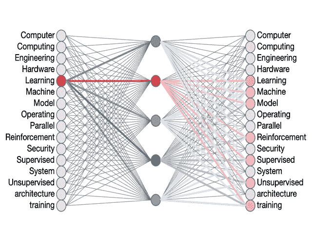
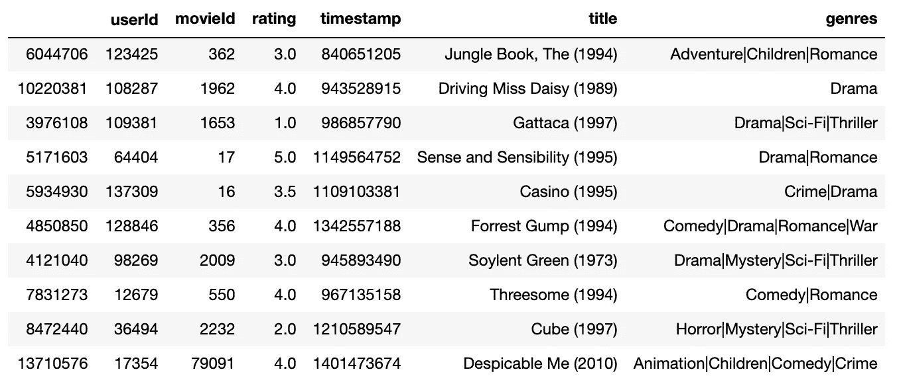

# 嵌入，不仅仅是文字

> 原文：<https://towardsdatascience.com/embeddings-beyond-just-words-2c835678dae2?source=collection_archive---------24----------------------->

## 除了单词之外的空间嵌入的一些应用的好处


帕特里克·托马索在 [Unsplash](https://unsplash.com?utm_source=medium&utm_medium=referral) 上的照片

嵌入是机器学习(ML)中一个方便的概念，大多数时候，像向量和单词表示这样的术语经常出现在上下文中。本文描述了向量大小对 ML 模型意味着什么，以及嵌入与模型输入有什么关系。

嵌入只是一个映射函数，可以将离散的值列表映射到连续的向量空间。连续空间是密集的，用多维向量表示。在稀疏数据上训练模型是一项非常艰巨的任务；因此，在这种情况下，嵌入变得非常有影响力。

# 表现

自然语言处理(NLP)模型使用嵌入来表示单词，主要是在语料库包含许多单词的情况下。机器学习中的单词需要数字表示。嵌入可以帮助建立一个多维空间，通常代表每个单词的语义。
例如，如果我们有 1000 个单词，我们可以用几种技术来表示每个单词:

*   给每个单词分配一个索引:在这种情况下，我们可以为长度为( *n* )的每个单词构建一个向量**。 *n:* 代表词汇量。**


图 1:使用单词包方法编码单词。向量的长度等于词汇量的大小。

*   或者，我们可以将每个单词映射到 n 个嵌入的向量。神经网络学会了如何将语义相似的单词相对地放在一起。这种表示的主要好处是词汇表中的相似单词将被映射到输入空间中的相似区域。认识到这样的区域有助于我们建立多种能力，例如相似性、相关性，这些能力可以在推荐模型中使用。

有更多的编码表示。如果我们在一个巨大的词汇表列表上训练一个模型，我们应该预料到模型正在更新的许多权重，这可能会显著影响模型的性能。

# 单词嵌入

单词嵌入是一种普遍使用的方法，也是一种非常创新的处理输入词汇域的方法。它们在 NLP 问题中被广泛用于建立语言模型。语言模型可以执行许多具有挑战性的任务，例如分类、翻译、情感分析和文本生成。Word2Vec、Glove Vectors 只是构建神经网络来学习给定语料库中的单词嵌入的两个例子。

在图 1 提供的例子中，如果我们的词汇表是 1000 个单词的长度，那么["Machine "，" Learning"]输入数组用两个 1000 维的向量表示。

## 例如:Word2Vec

Word2Vec 是一个依赖机器学习建立模型的学习表示的例子。该模型的目的是计算单词的含义，而不是对其在句子中的出现进行编码。基于每个向量之间的距离来构建词向量。为了建立这个模型，我们使用神经网络来学习将这些向量与预测它们周围单词的隐含意义相关联。

下面的交互式图形说明了如何构建该模型，其中使用单个隐藏层构建了一个神经网络。这个模型使我们能够通过学习输入文本提供的隐式交互来轻松地比较词汇，如图 2 和图 3 所示。



图 2:word 2 vec 学习过程的可视化


图 3:word 2 vec 学习过程的二维可视化

## 示例:神经嵌入

构建神经网络时，我们可以创建一个嵌入层，以较小的维度对输入进行分组。为了说明在 NLP 问题中使用嵌入层，我们将看一个简单的例子。假设我们有十个句子，每个句子包含一些 ML 和其他通用计算主题。

```
sentences = [
    'Machine Learning', 
    'Model training',
    'Supervised learning', 
    'Unsupervised learning', 
    'Reinforcement learning', 
    'Computer Hardware Engineering', 
    'Computer Security', 
    'Computer architecture', 
    'Operating System', 
    'Parallel computing'
]
```

我们将跳过文本处理细节，我们也简化它。例如，我们没有将字符转换成小写字母。然而，本文末尾的链接中提供了完整的代码。对句子中的每个单词进行编码是我们的下一个目标。

```
encoded_sentences = []
for sentence in sentences: 
    encoded_sentences.append(label_encoder.transform(sentence.split(' ')) + 1)
```

如果我们打印出这个数组的内容，我们应该得到如下结果:

```
[array([5, 4]),
 array([ 6, 17]),
 array([11, 16]),
 array([13, 16]),
 array([ 9, 16]),
 array([1, 3, 2]),
 array([ 1, 10]),
 array([ 1, 14]),
 array([ 7, 12]),
 array([ 8, 15])]
```

请注意，第六个句子有三个单词，而所有其他句子都只有两个。因此，我们需要在较短的句子末尾填充零。

```
from keras.preprocessing.sequence import pad_sequences
# Since the sentences size is different, we need to add padding. 
max_length = 3 # No more than three words per sentence 
#padding = post since we need to fill the zeros at the end
padded_enc_sentences = pad_sequences(encoded_sentences, maxlen=max_length, padding='post')
```

让我们再看一眼编码的句子。

```
array([[ 5,  4,  0],
       [ 6, 17,  0],
       [11, 16,  0],
       [13, 16,  0],
       [ 9, 16,  0],
       [ 1,  3,  2],
       [ 1, 10,  0],
       [ 1, 14,  0],
       [ 7, 12,  0],
       [ 8, 15,  0]], dtype=int32)
```

构建嵌入层非常简单。我们将使用 Keras [1]来创建这一层并编译模型。注意，有三个参数传递给嵌入层:input_dim、output_dim 和 input_length。Input_dim 表示语料库的大小(词汇量)，output_dim 是我们想要构建的嵌入向量的大小，以及输入的向量大小。

```
model = Sequential()
embedding_layer = Embedding(input_dim=len(all_tokens), output_dim=2, input_length=3)
model.add(embedding_layer)
model.compile('adam', 'mse')
```

如果我们想要查看句子“机器学习”的嵌入权重，该模型将返回以下权重:

```
array([[[ 0.02791763, -0.02687442],
        [ 0.00129487,  0.02928725],
        [ 0.00248948,  0.04000784]]], dtype=float32)
```

同样值得一提的是，NLP 中的嵌入面临许多挑战。例如，一个句子中的一个单词如果放在另一个上下文中可能有完全不同的意思。有更高级的嵌入方法来补充这种基本方法。

# 超越单词嵌入

正如我们所看到的，嵌入可以给传递给模型的输入提供有价值的见解。它可以有效地作为一种降维技术，同时学习隐藏的关系。

嵌入建模已经与传统算法(如贝叶斯网络)和神经网络(前馈、卷积神经网络等)一起使用。关键特征是嵌入提供了输入到一些可学习的上下文表示中的组合。可以嵌入特性，提供不同数据类型的语义相似性。通常，它们是非结构化的，可以包含图像。

## 应用:

除了 NLP 之外，在许多领域中，嵌入都是非常有用的特征工程任务，这样的例子有很多。

*   学习浏览在线商店时的用户行为。
*   学习在一组给定的数据中发现异常。
*   理解推荐系统的项目-用户关系。
*   学习在一系列交易中发现欺诈。
*   学习蛋白质序列。

## 例如:电影推荐

我们将使用 MovieLens 数据集来学习用户以前对电影的评级，以预测他们接下来有兴趣看什么。数据集可以在 [Kaggle](https://www.kaggle.com/grouplens/movielens-20m-dataset) 上找到。数据集由几个 CSV 文件组成，我们将使用的是“评级”和“电影”。数据集必须准备好合并这两个 CSV 文件，从而产生两千万条包含六列的记录。最小额定值为 0.5，最大额定值为 5。



MovieLens 数据集的示例。

我们的预测模型将学习两列:userId 和 movieId。两列都包含离散的高基数数值。我们将使用嵌入为每个值构建一个密集向量。输入由一个 userId 和一个 movieId 的组合组成，分为两个输入层，每个输入长度为一。

```
# userId input:
user_id_input = Input(shape=(1,), dtype='int64', name='user_id')
# movieId input: 
movie_id_input = Input(shape=(1,), dtype='int64', name='movie_id')
```

我们将创建两个嵌入层:一个用于 userId，另一个用于 movieId。嵌入的大小设置为 8，但可以根据模型的性能进行调整。

```
# Building the embedding layers 
user_embedding_size = 8
movie_embedding_size = 8user_embedding = Embedding(len(unq_users), user_embedding_size, input_length=1, embeddings_regularizer=l2(1e-4))(user_id_input)movie_embedding = Embedding(len(unq_movies), movie_embedding_size, input_length=1, embeddings_regularizer=l2(1e-4))(movie_id_input)
```

现在，在构建模型之前，我们需要设计这两个嵌入层是如何结合在一起的？例如，我们将它们合并为两个独立的输入，或者使用点积。在这个例子中，我们将使用 Keras 点函数。

```
dot_out = dot([user_embedding, movie_embedding], axes=-1, normalize=False)out = Flatten()(dot_out)model = Model(
    inputs = [user_id_input, movie_id_input],
    outputs = out,
)model.compile(Adam(0.001), loss='mse')
```

在上面的编译说明中，我们选择了损失的最小平方误差函数。让我们打印出我们模型的摘要:

```
__________________________________________________________________________________________________
Layer (type)                    Output Shape         Param #     Connected to                     
==================================================================================================
user_id (InputLayer)            (None, 1)            0                                            
__________________________________________________________________________________________________
movie_id (InputLayer)           (None, 1)            0                                            
__________________________________________________________________________________________________
embedding_1 (Embedding)         (None, 1, 8)         1085000     user_id[0][0]                    
__________________________________________________________________________________________________
embedding_2 (Embedding)         (None, 1, 8)         141872      movie_id[0][0]                   
__________________________________________________________________________________________________
dot_1 (Dot)                     (None, 1, 1)         0           embedding_1[0][0]                
                                                                 embedding_2[0][0]                
__________________________________________________________________________________________________
flatten_1 (Flatten)             (None, 1)            0           dot_1[0][0]                      
==================================================================================================
Total params: 1,226,872
Trainable params: 1,226,872
Non-trainable params: 0
```

现在的培训步骤应该很简单:

```
model.fit(
    [df.userId, df.movieId],
    df.rating, 
    batch_size=64, 
    epochs=1, 
    validation_split=.05,
)
```

该模型的实现被简化，因为其目的是向仅使用用户 id 的用户展示嵌入如何捕捉电影之间的相似性。在捕获语义的同时，可以将 userId 和 movieId 列的高维度转换到低维空间。

# 摘要

在本文中，我们演示了嵌入如何向 ML 模型展示发现数据模式的机会。这是产生更有效的低维空间特征的非常有用的技术。我们已经看到单词袋向量是如何被转化成更小的向量的。我们还讨论了在神经网络中使用嵌入作为一个层。如果你使用的是 ML 工具包，比如 Keras，那么要确保向量的大小是固定的。

你可以在我的 Github 上找到完整的代码示例。如果你仍然渴望了解更多，请查看[2]中的速成课程。谢谢大家！

# 参考

[1] Keras，在 https://keras.io/api/layers/core_layers/embedding/[有售](https://keras.io/api/layers/core_layers/embedding/)

[2]嵌入:谷歌的速成课程可在[https://developers . Google . com/machine-learning/Crash-Course/Embeddings/](https://developers.google.com/machine-learning/crash-course/embeddings/)上获得