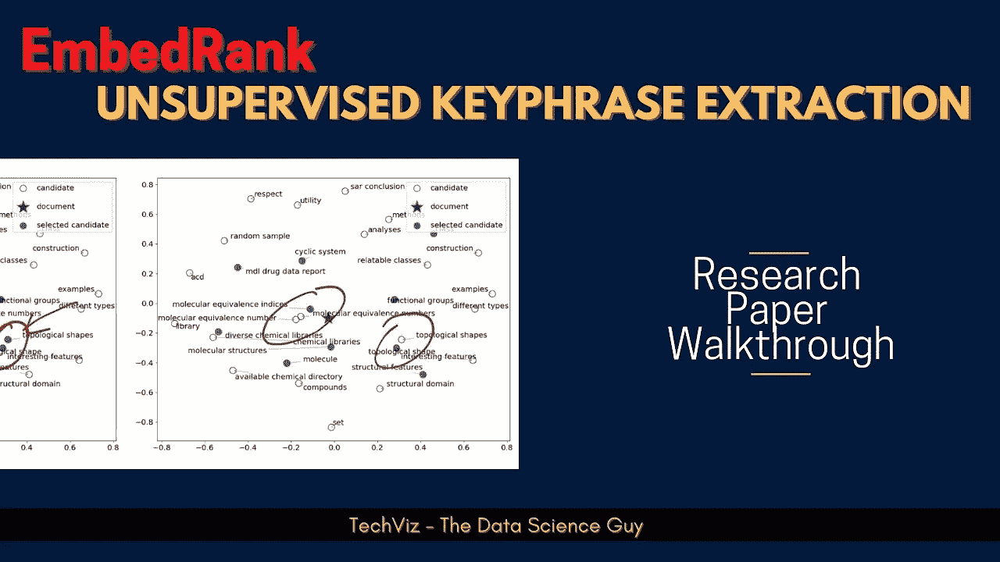
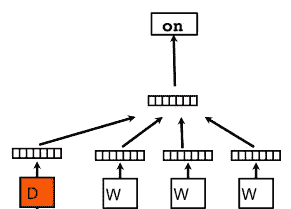
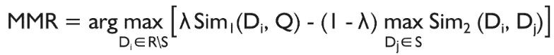
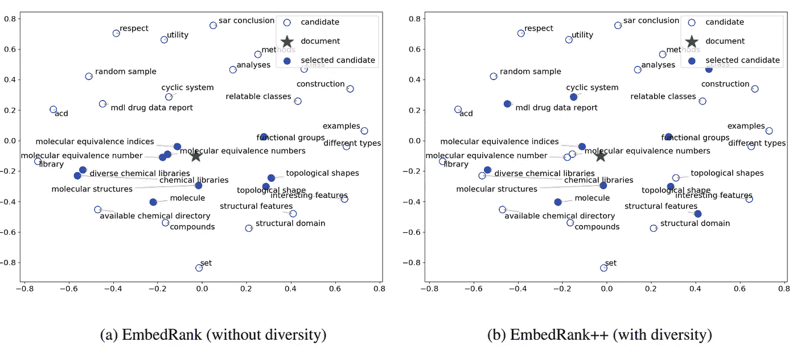
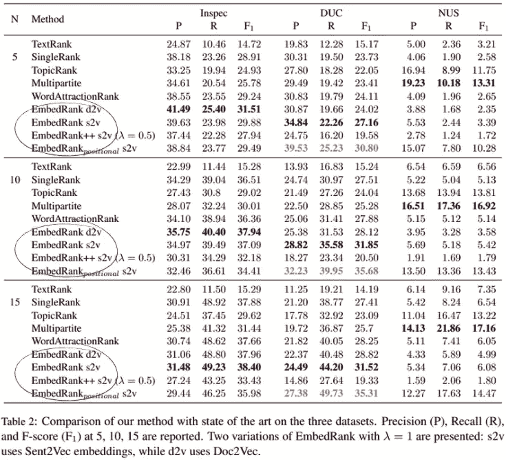

# 使用句子嵌入的简单无监督关键短语抽取

> 原文：<https://towardsdatascience.com/embedviz-simple-unsupervised-keyphrase-extraction-using-sentence-embeddings-97ed5e16ad00?source=collection_archive---------19----------------------->

## **研究论文 E** 解说

作者图片

# 背景

关键词/关键短语提取是**提取与底层文档**相关的重要单词的任务。通过将文档索引为文档别名，它可以让您更快地搜索文档，甚至有助于对这些中心主题的给定文本进行分类。现在，这些可能是**抽象的(来自书面文本之外的相关关键词)或提取的(书面文本中存在的相关关键词)**本质上。两者都有各自的好处，但是在这篇博客中，我们将仔细阅读瑞士电信公司和 EPFL 的研究人员以无人监督的方式进行的关键短语提取的这项非常有趣的工作。作者特别选择了无监督的方式，因为它比有监督的方式具有优势和灵活性，如**域外概括**，不需要**带有关键字的大型手工注释语料库**等。

大多数当前的关键词提取系统在速度和为文档生成一些不相关和冗余的关键词方面具有局限性。在这里，本文作者用自己提出的 [**无监督算法**](https://en.wikipedia.org/wiki/Unsupervised_learning) 解决了这两个问题。

有了这个背景和介绍，让我们直接开始理解这个算法。

**他们提出了一个 3 步管道—**

1.  基于词性序列，从文本中提取候选短语。更准确地说，它们遵循的模式是提取由零个或多个形容词后跟一个或多个名词组成的短语。*它可以被认为是一个正则表达式过滤器****JJ * NN+****覆盖整个文档的文本。*
2.  作为第二步的一部分，他们使用句子嵌入(Sent2Vec 和 Doc2Vec)将候选短语和原始文档嵌入到同一个高维向量空间中。
3.  最后，他们根据给定短语与原始文档的相关程度对每个候选关键短语进行排序，同时最小化他们选择作为最终集合一部分的冗余关键短语的数量。

# Sent2Vec 和 Doc2Vec

虽然方法 **Sent2Vec** 和 **Doc2Vec** 都是流行的嵌入技术，允许我们将任意长度的输入嵌入到固定长度的向量表示中，但是它们有不同的训练方法。

**Sent2Vec** 将句子嵌入定义为句子中出现的上下文单词嵌入的平均值，其中上下文单词嵌入不仅限于单字，还扩展到每个句子中出现的 *n* 个单字。 [*这里有一个 python 包，你可以用它来实现*](https://pypi.org/project/sent2vec/) 。

在 **Doc2Vec** 中，通过添加段落 id 来扩展 word2vec，也作为输入中的一个组件。下图显示了同样的情况。

作者图片

这里， **D** 是文档 id， **w** 是来自某个窗口的文档的单词。我们连接表示并学习分类窗口的中心词。直观上， **w** 代表单词概念的单词向量， **D** —文档向量代表文档的概念。同样你也可以认为 Skipgram 版本是一样的。

作者使用 Sent2Vec 和 Doc2Vec 的预训练模型，其中 **Sent2Vec 表示 700 维的词汇单元**，而 **Doc2vec 表示 300 维的词汇单元**。

# 最大边际关联

在这种情况下， [MMR](https://www.cs.cmu.edu/~jgc/publication/The_Use_MMR_Diversity_Based_LTMIR_1998.pdf) 背后的核心思想是选择与底层文档相关的关键字，并且您选择的每个渐进式关键字与已经选择的关键字集具有最小的相似性。下面的等式显示了相同的数学表达式—

图片来自[来源](http://www.cs.bilkent.edu.tr/~canf/CS533/hwSpring14/eightMinPresentations/handoutMMR.pdf)

这里，等式中的第一项计算文档 Q 和不在所选短语中的每个候选短语 D(i)之间的余弦相似度，由参数λ正则化。等式中的第二项计算每个候选短语和所选短语之间的余弦相似度，并选择最大相似度。也可以在这个位置选择 min，avg fxn，而不是 max。Max 确保我们对相似性进行最大限度的惩罚。λ是有界的 b/w [0，1]，其中，1 将意味着没有多样性，并且将归结为仅基于余弦相似性的选择*(信息量)*，并且将意味着高精度，而λ= 0 将意味着高多样性。这个正则化参数应该基于用例进行调整。理想情况下，应该选择 0.45-0.65 之间的λ值，以在两者之间保持最佳平衡。

我鼓励你也通读一下[这份写得非常好的文件](http://www.cs.bilkent.edu.tr/~canf/CS533/hwSpring14/eightMinPresentations/handoutMMR.pdf)。

从下图中可以看出，没有多样性的结果(MMR)对于形态变化是多余的，而 As，embe bead 的++版本显然有助于减少这些形态相似的关键短语，同时形成最终集。作者选择多样性参数(λ)为 0.5，给予相关性和多样性同等的权重。但是这个参数也可以由用户根据下游应用的要求来调整。

图片来自[来源](https://arxiv.org/pdf/1801.04470.pdf)

# 结果和评价

作者在三个常见的关键词提取数据集上测试了他们的方法—

*   **Inspec** :由来自科学期刊摘要的**2000 篇短文组成。为了对其他算法进行标准测试，他们对来自其他方法的 500 个常见文档(测试集)进行了测试。**
*   **DUC** :由 TREC-9 的 **308 篇中篇报刊文章组成。它们专门提取原始文档的第一个标签中包含的文本(而不是标题和其他元数据中存在的内容)**
*   **NUS** :由 **211 篇长文件(全科学会议论文)**组成，4 到 12 页不等。每个文档都有一组由作者和其他贡献者创建和注释的关键短语。他们根据这些来评估他们的提取物。

修改自[来源](https://arxiv.org/pdf/1801.04470.pdf)

上表展示了所有三个数据集的不同方法在**精度、召回率和 F1 分数**评估指标上的结果。很明显，在大多数情况下，恩贝拉德的表现都优于其他人。

*如果你有兴趣了解更多关于关键词提取算法的知识，那么我有一篇文章讨论 NLP 中的* [*10 种流行的关键词提取算法*](https://medium.com/mlearning-ai/10-popular-keyword-extraction-algorithms-in-natural-language-processing-8975ada5750c) *。一定要去看看！*

我也有一个**多语言字幕的视频漫游**，如果你喜欢看视频而不是文字(就像我一样:D)，一定要看看

如果你仍然对某件事感到困惑，一定要看报纸。另外，向作者问好，感谢他们的贡献。

> ***论文标题:*** *使用句子嵌入的简单无监督关键短语抽取*
> 
> **论文链接:**[https://arxiv.org/pdf/1801.04470.pdf](https://arxiv.org/pdf/1801.04470.pdf)
> 
> ***作者:*** [*卡米尔·本纳尼-斯米尔*](https://arxiv.org/search/cs?searchtype=author&query=Bennani-Smires%2C+K)*[*克劳迪奥·穆萨特*](https://arxiv.org/search/cs?searchtype=author&query=Musat%2C+C)*[*安德雷·霍斯曼*](https://arxiv.org/search/cs?searchtype=author&query=Hossmann%2C+A)*[*迈克尔·贝里斯维尔*](https://arxiv.org/search/cs?searchtype=author&query=Baeriswyl%2C+M)*[*马丁*](https://arxiv.org/search/cs?searchtype=author&query=Jaggi%2C+M)****

**希望这本书值得你花时间去读！**

***谢谢。***