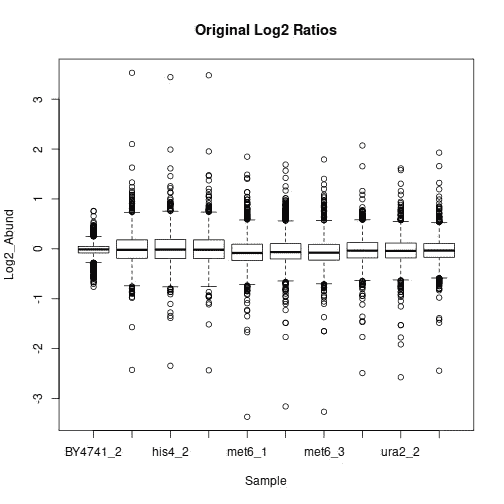
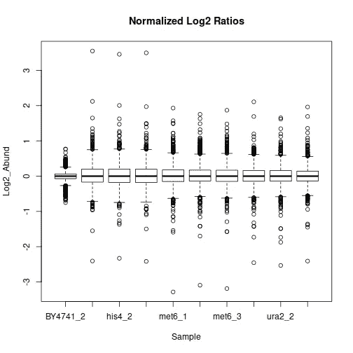
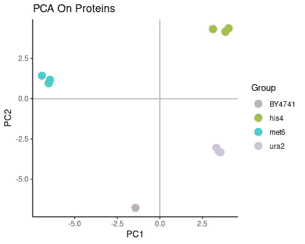
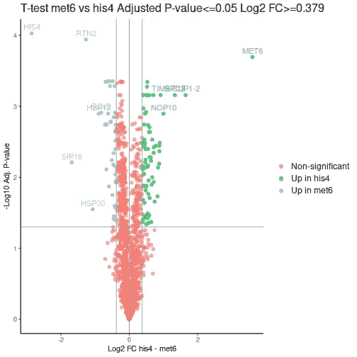
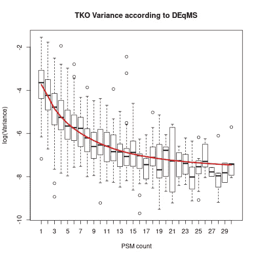
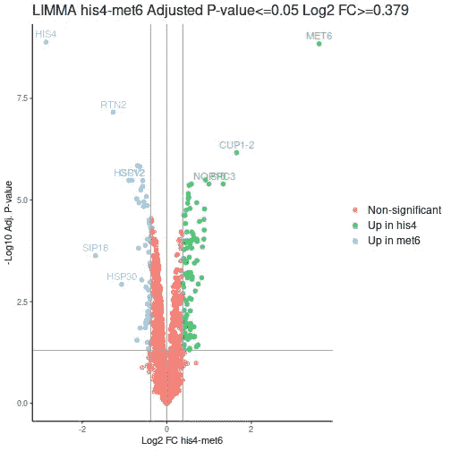
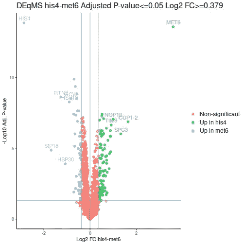
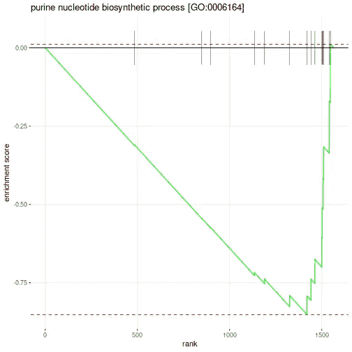

# 拥抱 R 来促进你的蛋白质组分析

> 原文：<https://towardsdatascience.com/embrace-r-to-boost-your-proteomic-analysis-ea6fdc8909e7?source=collection_archive---------7----------------------->

## 一千个数据集的旅程从一个 R 脚本开始


在 [Unsplash](https://unsplash.com?utm_source=medium&utm_medium=referral) 上由 [averie woodard](https://unsplash.com/@averieclaire?utm_source=medium&utm_medium=referral) 拍摄的照片

r 是一种流行的编程语言，特别关注统计计算。它最强的一点是多年来由社区贡献的附带包的宇宙。尽管我自己是一个狂热的 Python 用户，但我不能否认 R 拥有无与伦比的生物信息学( [Bioconductor](https://www.bioconductor.org/) )、统计分析和出版物质量的数据可视化软件包。

我经常使用基于质谱(MS)的蛋白质组数据集，经常使用通用学生 t 检验和方差分析来评估各组样本之间的蛋白质差异丰度。然而，进步并没有停滞不前，科学家们正在开发专门针对生物数据的方法。一个非常流行的用于差异表达分析的 R 包是微阵列数据的线性模型，或 [limma](https://bioconductor.org/packages/release/bioc/html/limma.html) [1]，它适合基因线性模型，但也借用基因之间的信息来产生更稳健的方差估计和更可靠的统计推断。Limma 已经存在了一段时间，现在它被广泛用于通过各种方法获得的基因表达数据，而不仅仅是通过微阵列。

在 limma 之上构建的是另一个 R/Bioconductor 包，称为[DEqMS](https://bioconductor.org/packages/release/bioc/html/DEqMS.html)【2】。它使用特定于质谱的特征，例如每个蛋白质的肽或肽谱匹配(PSM)的数量，以建立依赖于数据的方差先验估计。用我自己的话来说，DEqMS 增强了具有多个 PSM 的蛋白质的 quan 结果的显著性，这是我们确实想看到的，因为多个定量事件增强了观察到的差异表达的可靠性。

[DEqMS 简介](https://bioconductor.org/packages/release/bioc/vignettes/DEqMS/inst/doc/DEqMS-package-vignette.html)包含关于如何使用软件包的清晰解释和指导性示例。然而，我认为后退一点，用从蛋白质表到结果的可视化和导出的所有步骤编写一个 R 脚本可能是有用的，这样一个 R 初学者可以有一个模板来开始和建立。

## 先决条件

完整的脚本可以在 [Github repo](https://github.com/dev-ev/isobaric-prot-wf-r) 中找到，而工作流程的要点将在下面介绍。我在 Ubuntu 20.04 上使用了 [RStudio](https://www.rstudio.com/) IDE 和 R 3.6 来运行脚本。我们从安装所需的软件包开始，其中大部分可能已经安装在您的系统上:

加载包:

## 准备和检查数据

示例数据是内部通过分析市售酵母[三重敲除(TKO)同量异位标记标准](https://www.thermofisher.com/order/catalog/product/A40938#/A40938)生成的。LC-MS 原始文件在[Proteome Discoverer 2.4](https://www.thermofisher.com/order/catalog/product/OPTON-30812?ce=E.21CMD.DL107.39848.01&cid=E.21CMD.DL107.39848.01&ef_id=EAIaIQobChMIia_rv4-u8wIVAq-yCh2J3wI6EAAYASAAEgLKhfD_BwE:G:s&s_kwcid=AL!3652!3!334040549172!e!!g!!proteome%20discoverer#/OPTON-30812?ce=E.21CMD.DL107.39848.01&cid=E.21CMD.DL107.39848.01&ef_id=EAIaIQobChMIia_rv4-u8wIVAq-yCh2J3wI6EAAYASAAEgLKhfD_BwE:G:s&s_kwcid=AL!3652!3!334040549172!e!!g!!proteome%20discoverer)(PD)中处理，输出文件保存为制表符分隔的文本文件，并上传到同一个 Github repo。

TKO 标准由 11 个样品组成:野生型酵母菌株的 2 个副本和分别敲除 HIS4、MET6 或 URA2 基因的每个菌株的 3 个副本。除了明显缺乏相应的蛋白质，敲除引起蛋白质组的扰动，我们也应该能够检测到。

我们首先读取它，并找到具有量化值的列。

```
## [1] 1904   51
```

然后，我们过滤掉污染的蛋白质，添加一个单独的基因名称列，并自动检测和重命名具有定量值的列，根据“丰度”识别它们。比率"字符串中的名称为:

```
##  [1] "BY4741_2" "his4_1"   "his4_2"   "his4_3"   "met6_1"   "met6_2"   "met6_3"   "ura2_1"   "ura2_2"   "ura2_3"
```

在过滤、格式化和对数转换之后，我们可以查看每个样本中定量值的分布:



作者图片

数据可能受益于标准化，以补偿由于样品收集和制备中的微小变化而导致的样品范围内的偏移。实现这一点的一种方法是使样本达到相等的中值，如下所示:



作者图片

主成分分析将向我们展示样本的一般分组:



作者图片

这个图是一个好消息，因为对应于每个敲除菌株的良好分离的组正是我们从这个数据集中所期望的。

## 方差分析和 T 检验

单向方差分析是在我们的情况下以数据集范围的方式分析差异丰度的逻辑方法，因为我们有一个变量(敲除基因)和三组: *his4* 、 *met6* 和 *ura2。*

调整后 p 值的一个常用阈值是 0.05。从实践的角度来看，我们可以进一步优先考虑条件之间具有较大倍数变化(FCs)的蛋白质，因为这些应该更容易通过其他方法来验证。对于像这样的酵母数据集，让我们选择 FC ≥ 30%，(log-FC ≥ log2(1.3))，并查看有多少蛋白质通过这些过滤条件:

```
## [1] 190  9
```

一次比较两组水平的经典方法是学生的 t 检验。让我们以 *met6* 击倒对手和 *his4* 击倒对手为例进行比较:

有多少蛋白质通过了相同的过滤标准(0.05/30%):

```
## [1] 116  11
```

火山图是表示差异丰度数据的常用方法。分类栏将帮助我们突出显示符合设定标准的蛋白质:



作者图片

我们可以直接看到一件好事:我们的 *MET6* 和 *HIS4* 是 3 种蛋白质中具有最低调整 p 值的两种，即最有可能实际差异表达的蛋白质。

## 利马和德克姆斯

DEqMS 是基于 limma 的，所以我们将能够一石二鸟，同时获得两种算法的结果。我们首先选择用于比较的色谱柱(不包括野生型，因为它没有 3 个重复)，定义设计(哪根色谱柱属于哪组)并指出我们想要观察的对比(比较):

函数 *spectraCounteBayes* 是专用于 DEqMS 的部分。我们提取原始数据中每个蛋白质的 PSM 数量信息，然后 *spectraCounteBayes* 用它来计算 *fit4* 中的数据相关方差。让我们看看 PSM 数量和方差之间的关系:



作者图片

这个图有助于理解主要信息:DEqMS 期望具有大量 PSM 的蛋白质具有较少的可变性。因此，这种“可靠的”蛋白质的差异表达应该比具有单一 PSM 的蛋白质的相同丰度差异得到更高的权重。

让我们看看 *met6* 和 *his4* 组相同对比的表格结果:

```
##             logFC     AveExpr         t
## P00815 -2.8532509 -0.54962113 -85.67738
## P05694  3.5999485 -0.85859918  77.41234
## P37291 -0.6922910  0.40048261 -28.07419
## P15992 -0.6353142  0.44930312 -27.22447
## P39954 -0.5661252  0.01364542 -22.95737
## Q12443 -1.2662064  0.60896317 -44.48587##         P.Value    adj.P.Val        B   gene count      sca.t
## P00815 8.428621e-13 1.318236e-09 18.82971 P00815    20 -108.89141
## P05694 1.846004e-12 1.443575e-09 18.37417 P05694    30   96.37396
## P37291 4.585032e-09 1.434198e-06 11.77468 P37291    36  -42.07175
## P15992 5.803328e-09 1.512734e-06 11.53513 P15992    18  -36.62270
## P39954 2.138660e-08 3.344865e-06 10.18583 P39954    22  -31.96714
## Q12443 1.329146e-10 6.929282e-08 15.15264 Q12443     4  -30.06690##         sca.P.Value sca.adj.pval
## P00815 8.998668e-18 1.407392e-14
## P05694 3.360470e-17 2.627888e-14
## P37291 2.531791e-13 1.319907e-10
## P15992 1.121588e-12 4.385408e-10
## P39954 4.810014e-12 1.504572e-09
## Q12443 9.260675e-12 2.413949e-09
```

这里的 P.Value 和 adj.P.Val 来自 limma，而光谱计数调整的 sca。P.Value 和 sca.adj.pval 是 DEqMS 算法的输出。根据 limma 和 DEqMS，对于对比 *his4* vs *met6* ，有多少蛋白质通过了我们的筛选标准:

```
## [1] 148  13
```

```
## [1] 154  13
```

与 t-检验相比，这两种方法在通过阈值的蛋白质数量上都有显著增加。这通常是好的，可能是更有趣的蛋白质。

在几个额外的操作之后，我们可以看火山图。通过 DEqMS，MET6 和 HIS4 蛋白得到极高的负 Log-p 值，因为这些蛋白具有多个 PSM，这是由于它们在样品中的高丰度而不是各自的敲除:



作者图片



作者图片

## 基因集合富集分析

结果的生物学解释将高度依赖于实验系统和研究的目的，这里面有艺术的成分！开始功能解释的一个广泛适用的方法是基因集合富集分析，或[GSEA](https://www.gsea-msigdb.org/gsea/doc/GSEAUserGuideFrame.html)【3】，通过包 [fgsea](http://bioconductor.org/packages/release/bioc/html/fgsea.html) 实现 R。

Fgsea 需要一个排序的基因列表来执行富集分析。为了纳入统计结果和菌株间的倍数变化，我们将计算来自 DEqMS 和 log-FC 的调整后 p 值的乘积，并将其用于排名。我们可以继续使用同一个*的 4-met6* 对比，看看 10 个负面排名值最低的基因:

```
##       HIS4       RTN2      SIP18      HSP12       GCV2
## -39.522063 -10.911242  -8.174439  -7.404254  -6.980468
##       SHM2      HSP26       SAM1       SAH1       GPH1 
##  -6.839459  -5.945264  -5.255033  -4.994689  -4.869912
```

fgsea 的另一个必需输入是一个文件，它用相应的基因注释基因集(途径、功能组)。我们可以从 [Uniprot](https://www.uniprot.org/proteomes/UP000002311) 下载广泛使用且全面的酵母基因本体注释【4】；基因本体联盟的数据可以在[知识共享许可](https://creativecommons.org/licenses/by/4.0/legalcode)下获得。我已经把下载的文件转换成了。gmt 格式，这是 GSEA 的典型格式，使用基因符号作为主要标识符，因为它们比 Uniprot 成员更能为生物学家提供信息。

使用注释文件和我们的基因排序，我们使用默认设置运行富集:

结果文件中的途径得到富集分数(ES)和归一化富集分数(NES)，这些分数指向差异丰富基因中具有最显著过度表达的途径。让我们来看看在负 ES 区最显著富集的 10 条途径:

丰富的 p 值和调整的 p 值并不重要，这可能取决于数据集的大小、注释的类型以及我们应用的设置。我们可以进一步研究其中一条具有最显著负 ES 的途径:



作者图片

哪些基因属于这一途径:

```
"ADE1"   "ADE12"  "ADE13"  "ADE16"  "ADE17"  "ADE2"   "ADE3"   "ADE4"   "ADE5,7" "ADE6"   "ADE8"   "MIS1"   "MTD1"  
"PRS1"   "PRS2"   "PRS3"   "PRS4"   "PRS5"
```

GSEA 可以成为生物学解释的一个方便的起点。至于它的终点，只有天空才是极限！

## 结论

我展示了一个 R 脚本的主要亮点，该脚本使用 DEqMS 算法进行差异丰度分析，对同量异位标记蛋白质组数据进行基本分析和可视化。完整的脚本和示例数据可以在 [Github 存储库](https://github.com/dev-ev/isobaric-prot-wf-r)中找到。

## 参考

[1] M.E. Ritchie，B. Phipson，D. Wu，Y. Hu，C.W. Law，W. Shi 和 G.K. Smyth， [limma 为 RNA 测序和微阵列研究提供差异表达分析](https://academic.oup.com/nar/article/43/7/e47/2414268) (2015)，*核酸研究*， **43** (7)，e47 — *开放获取*。

[2] Y. Zhu，L.M. Orre，Y.Z. Tran，G. Mermelekas，H.J. Johansson，A. Malyutina，S. Anders 和 J. Lehtiö，DEqMS: [差异蛋白质表达分析中精确方差估计的方法](https://www.mcponline.org/article/S1535-9476(20)34997-5/fulltext) (2020)，*分子细胞蛋白质组学*，**19**(6):1047–1057—*开放存取*。

[3] A. Subramanian *等* [基因集合富集分析:一种基于知识的方法，用于解释全基因组表达谱](https://www.pnas.org/content/102/43/15545)(2005)*PNAS*，102 (43)，15545–15550。

[4] M. Ashburner *等人*。[基因本体论:统一生物学的工具](https://pubmed.ncbi.nlm.nih.gov/10802651/)(2000)*Nat Genet*，25(1)，25–9。