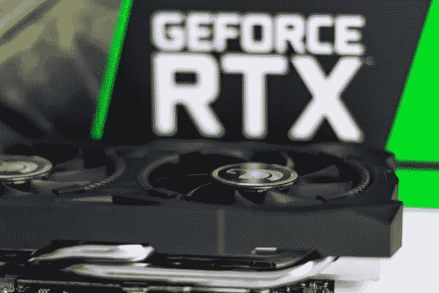
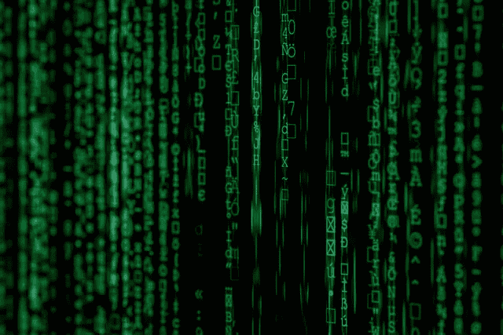

# 机器学习和深度学习的出现

> 原文：<https://towardsdatascience.com/emerging-of-machine-learning-and-deep-learning-ddf8e3e5e85e?source=collection_archive---------28----------------------->

## 数据、计算资源、算法和开源框架

马特·保罗·卡塔拉诺在 [Unsplash](https://unsplash.com/?utm_source=unsplash&utm_medium=referral&utm_content=creditCopyText) 上的照片

深度学习(DL)和机器学习(ML)是人工智能(AI)的两个子集。ML 不同于传统的编程，它能够从数据中学习，而不需要提供明确的规则。它可以识别数据背后隐藏的模式。ML 对于分析结构化数据很方便。当我们考虑模型的复杂性时，DL 超越了 ML。它提供了一种人工神经网络(ANN)方法。DL 对于分析非结构化数据(图像、文本、语音等)非常有用。).ML 不太适合这些类型的数据。

在过去的几十年里，ML 和 DL 一直存在于我们身边。这两种技术的出现是由于以下因素:

*   **大批量数据**
*   **计算资源**
*   **算法**
*   **开源框架**

这篇文章是关于这四个导致 ML 和 DL 出现的因素的。

# 大量数据

由 [Alexander Sinn](https://unsplash.com/@swimstaralex?utm_source=unsplash&utm_medium=referral&utm_content=creditCopyText) 在 [Unsplash](https://unsplash.com/?utm_source=unsplash&utm_medium=referral&utm_content=creditCopyText) 上拍摄

在这个数字时代，智能设备(手机、笔记本电脑等)的使用。)和 web 服务有了显著的增长。这产生了大量不同格式的数据，如文本、图像、语音、数字等。大多数人使用社交媒体。当你在一个帖子上贴上一个赞，也是一种数据。当您对从在线网站购买的产品进行评论时，它是一种文本数据，可用于获得关于客户满意度的宝贵见解。

数据是 ML 和 DL 中最有价值的资产。最近，ML 和 DL 技术以各种方式用于处理数据:

*   **数据提取:**数据不到我们手里。我们应该从各种来源提取它们。这些来源包括网页、数据库、图像等。ML 和 DL 技术被广泛用于从这些来源中提取数据。
*   **数据预处理:**现实世界的数据大多是杂乱无章的。在使用它们之前，我们需要对它们进行预处理。缺失值处理和异常值检测是最基本的数据预处理任务。除了一般方法之外，ML 和 DL 技术也用于此。
*   **建模:**为了分析数据，我们需要创建模型。大部分都是 ML 和 DL 的型号。这些模型可以从数据中学习，并对新的未知数据进行预测。

# 计算资源

照片由[克里斯蒂安·威迪格](https://unsplash.com/@christianw?utm_source=unsplash&utm_medium=referral&utm_content=creditCopyText)在 [Unsplash](https://unsplash.com/?utm_source=unsplash&utm_medium=referral&utm_content=creditCopyText) 上拍摄

计算资源的可用性导致了 ML 和 DL 的出现。拥有大量超参数的 ML 模型需要强大的计算能力。层数多的深度学习模型也需要强大的计算能力。图形处理单元(GPU)提供这些任务所需的计算能力。现在一台 GPU 好的电脑，价格也能买得起。

还有一点就是**云计算**的存在。你不需要在你的本地机器上有强大的硬件来运行消耗能量的算法。借助云软件，你可以随时随地运行它们。大多数服务都是免费的。但是，在使用这些服务时，您需要支付一些额外的费用。AWS 和微软 Azure 是当今众所周知的云计算服务。

# 算法

马库斯·斯皮斯克在 [Unsplash](https://unsplash.com/?utm_source=unsplash&utm_medium=referral&utm_content=creditCopyText) 上拍摄的照片

算法上的重大改进使得 ML 和 DL 技术更加有用。如今，算法可用于任何类型的数据。线性回归、逻辑回归、支持向量机等可用于线性数据。决策树、随机森林、XGBoost(基于树的算法)可用于非线性数据。随机森林和 XGBoost 算法非常强大，因此它们的预测非常准确。

卷积神经网络(CNN)可用于图像数据。递归神经网络(RNNs)可用于文本或序列数据。

为了利用神经网络，你需要有大量的数据。一般最大似然算法的性能不会随着数据量的增加而提高。如果您有大量数据，使用神经网络将提高模型的性能。

# 开源框架

在 [Unsplash](https://unsplash.com/?utm_source=unsplash&utm_medium=referral&utm_content=creditCopyText) 上由 [Hitesh Choudhary](https://unsplash.com/@hiteshchoudhary?utm_source=unsplash&utm_medium=referral&utm_content=creditCopyText) 拍摄的照片

上述算法和许多其他算法都可以通过开源框架免费获得。Python 有 ML 和 DL 任务的高层框架。

对于一般的 ML，Scikit-learn 是最好的框架。它的语法非常一致。它包括许多机器学习模型，可以使用几行代码轻松实现。Google 开发的 TensorFlow 和 Keras 是最流行的 DL 框架。脸书的 PyTorch 是 DL 框架的另一个很好的选择。

这些框架背后有强大的社区。他们经常给这些框架添加新的东西。高度标准的文档也是可用的，因此任何人都可以参考它们来学习更多关于这些框架的知识。

下次见，祝大家学习愉快！同时，你可以在以下网址阅读我的其他帖子:

【https://rukshanpramoditha.medium.com 

**鲁克山·普拉莫迪塔
2021–07–10**