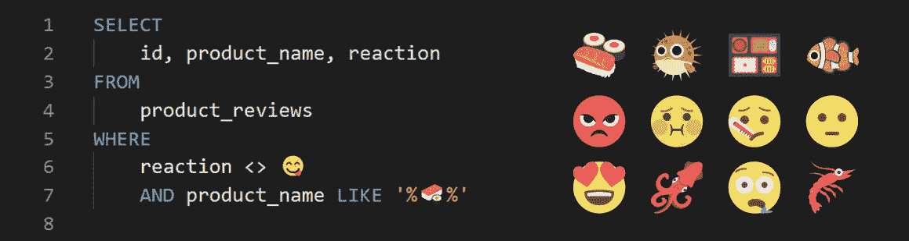
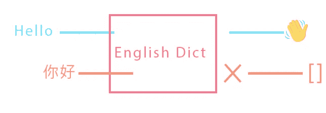
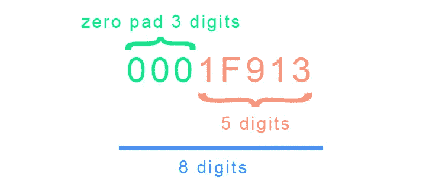

# 数据中的表情符号🤓

> 原文：<https://towardsdatascience.com/emojis-in-your-data-9a5513ead2dd?source=collection_archive---------20----------------------->

## 你需要知道的关于你的数据库或数据集中的表情符号的一切。



由作者创建的标题

让我们面对现实吧，现在是 2021 年，表情符号是不可避免的。从聊天到产品评论，有时甚至是用户名，你都可以看到它。今天我们将回答一些问题:

*   [什么是表情符号](#8cec)
*   [表情符号是如何存储在数据库中的](#c150)
*   [在我的数据集或数据库中保留表情符号有多重要](#8f39)
*   [接下来是什么🤷](#55df)

# 什么是表情符号

每个人都知道表情符号是什么，但它们到底是什么？它们是图像还是字体，为什么不同的系统会以不同的方式显示同一个笑的表情符号？对于初学者来说，表情符号是一个[字形](https://en.wikipedia.org/wiki/Glyph)，把它当成一个字体。在每个笑脸的背后，表情符号是一个十六进制代码点。

拿🤓“书呆子脸”表情符号为例，其十六进制码位(用 *U+* 表示)为 *U+1F913* 如[表情百科](https://emojipedia.org/nerd-face/)所列。每个代码点都引用一个被普遍理解的叫做 Unicode 的字典上的东西。如果字典里有这个词，你会得到它的定义。



如果你试着在英语词典中查找一个中文单词，你将得不到那个单词的定义。这个概念适用于 Unicode 在您的系统上的工作方式。如果您的系统不包含代码点的标志符号，它将无法显示🤓。就像你对来自剑桥或牛津的同一个英语单词有不同的定义一样，不同的系统也有它们自己的字形设计，而不会偏离原意。

# 表情符号是如何存储在数据库中的

现在你知道表情符号是如何由计算机系统表示的，我们如何存储或如何存储到数据库中？我们知道表情符号只是十六进制代码点，我们是否需要有一个特殊的 Unicode 列类型，或者我们是否将它存储为字符串并在以后解析为表情符号？

在大多数数据库中，你可以通知引擎这个特殊的字符块应该被存储为 Unicode 而不是字符串，这个过程叫做 *\escape* 。下面是几个在数据库中转义和存储表情符号的例子。不同的数据库在存储转义字符方面有稍微不同的要求，所以一定要仔细阅读每个关于转义的数据库文档。

```
-- POSTGRES
SELECT ('\+01F913'), (U&'\+01F913'), (U&'\d83e\dd13')-- POSTGRES RESULT: "\+01F913", "🤓", 🤓" -- BIG QUERY
SELECT ('\U0001F913')-- BIG QUERY RESULT: "🤓"
```

如 Postgres 示例所示，第一列按字面意义存储为字符串' \+01F913 '。通过使用*U&作为第二列进行转义，数据库现在明白了这个字符块不是一个常规字符串，而应该理解为一个十六进制序列。*



作者图片

注意我们在 1F913 前面加了一个 0，这是因为这里的 [Postgres 文档](https://www.postgresql.org/docs/9.3/sql-syntax-lexical.html)规定 Unicode 转义需要“*一个反斜杠，后跟一个加号，再后跟一个六位数的十六进制码位号*”。我们的原始代码点只有 5 位数字，因此我们必须在不改变含义的情况下，对代码点进行零填充，使其成为 6 位数字。第三列是代码单元代理对的示例。代码单元的代理项对构成一个代码点。正如在同一 Postgres 文档中提到的，代理对(16 位+16 位)的存在是为了组成大于 U+FFFF (16 位)的码位。

f(十六进制)= 1111(二进制)= 4 位
FFFF = 1111 1111 1111 1111 = 16 位

这使得可用的代码点数量增加到了一百万以上。然而，这是我们最不关心的，因为 Postgres 会在存储它之前将代理对组合成一个代码点。最后一列基本上只是以字节存储十六进制代码。

BigQuery 也是如此，在他们的文档中[这里](https://cloud.google.com/bigquery/docs/reference/standard-sql/lexical#string_and_bytes_literals)，他们指出他们的 Unicode 转义需要 *8 位数字*。因此，如上例所示，我们将对 Unicode 进行零填充。

# 在我的数据集或数据库中保留表情符号有多重要


作者图片

两份非常相似的英文文本，但在表达方式上却大相径庭。随着这种趋势的继续，表情符号越来越成为表达情感的方式，NLP 模型和数据集应该适应存储和处理这种信息。新的表情符号不断增加，随着变体或肤色的引入，复杂性也增加了。适应每一个表情符号可能并不容易，但是值得注意的是[unicode.org](https://home.unicode.org/emoji/emoji-frequency/)有一个表情符号频率列表，可以帮助我们了解我们应该注意的少数表情符号。

毫无疑问，在数据库中存储表情符号已经成为一种常见的做法，而且应该如此。谷歌有一份白皮书，可以在这里找到该白皮书指出，启用包括表情符号在内的最大可用字符集是存储用户密码的良好做法之一。大多数在线购物平台上的产品名称和描述也包含表情符号，我们绝对不希望在用户保存表情符号或在你为自己的商业案例进行推理时将它们删除。

# 下一步是什么🤷

表情符号将会一直存在，这取决于开发者如何管理这些额外的信息，也取决于数据从业者如何理解这些信息。


图片取自作者的电报信息

表情符号已经成为我们日常对话中不可或缺的一部分，在某些情况下，它还是问题的答案。管理这些信息，无论是用相关的英文单词替换表情符号，还是将其编码为另一个符号，都是值得考虑的事情。

以下是一些很酷的工具，可能会帮助您更好地理解 Unicode(排名不分先后):

[Unicode 到十六进制转换器](http://www.ltg.ed.ac.uk/~richard/utf-8.cgi?input=1F913&mode=hex)

[Unicode 代码转换器](https://r12a.github.io/app-conversion/)

[Unicode 及其字节表](https://apps.timwhitlock.info/emoji/tables/unicode)

[表情百科](https://emojipedia.org/)

[unicode.org](https://home.unicode.org/)

[Unicode 代理对理解和计算器](https://datacadamia.com/data/type/text/surrogate)