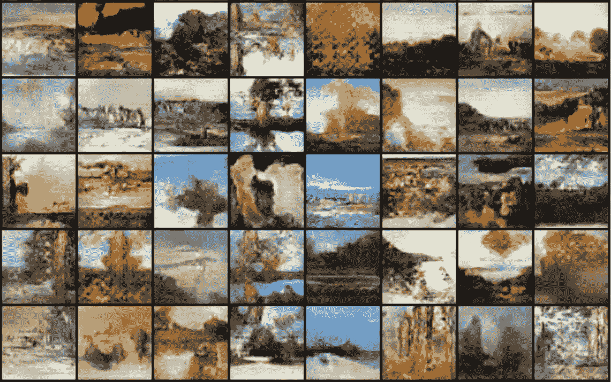
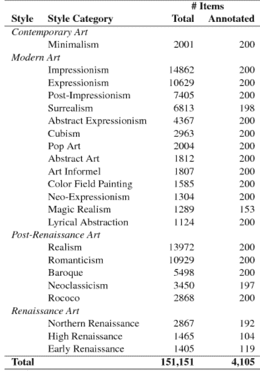
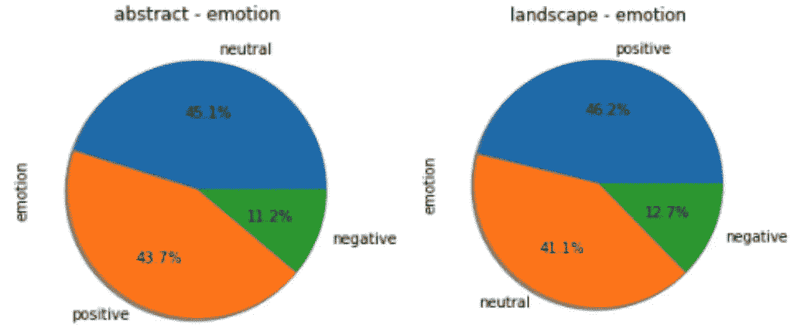
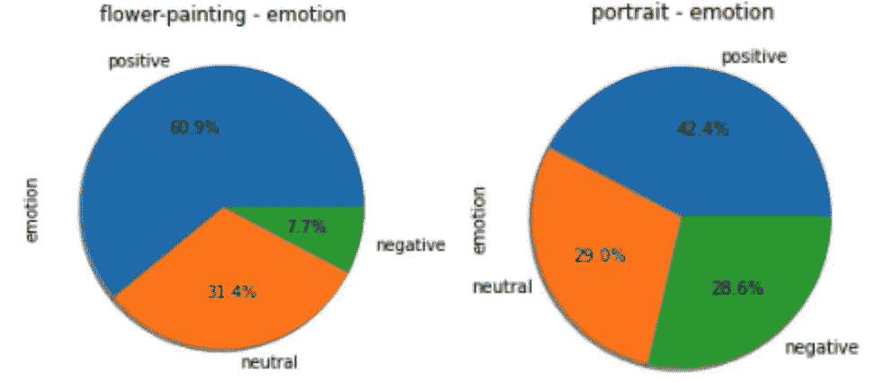
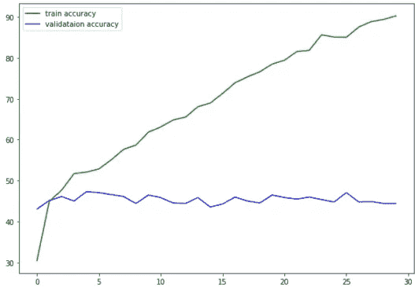
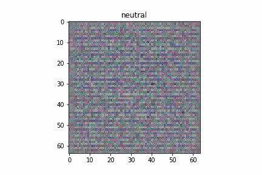

# 基于情感的 C-GAN 艺术生成

> 原文：<https://towardsdatascience.com/emotion-based-art-generation-using-c-gan-de9abed6fa2f?source=collection_archive---------17----------------------->

## AI 能有创造力，通过艺术理解情感吗？



基于深度学习的艺术生成:风景+正面情感，作者图像

# 介绍

随着基于深度学习的图像生成和情感分类解决方案的出现，我在想，我们是否可以将这两个目标结合起来，建立一个模型，以一种简单的情感(积极、消极和中性)作为输入，并生成一件艺术作品，以某种方式整合之前提供的情感。


照片由[伊戈尔·米斯克](https://unsplash.com/@igormiske?utm_source=medium&utm_medium=referral)在 [Unsplash](https://unsplash.com?utm_source=medium&utm_medium=referral) 拍摄

这个项目带来了计算机科学和艺术中的哲学问题。

当我们看一幅画时，一种情绪是仅仅来自视觉刺激还是有其他无意识的因素影响我们的感觉？如果是这样的话，这些视觉刺激一般会唤起一种共同的感觉吗，不管观看者是谁？

大多数艺术家和情感专家会拒绝这两个建议，他们会回答说，每个人都有自己的欣赏，受自己的生活经历的指导，情感的起源很难破译。

我将把这些哲学问题留给引言，并希望像神经网络这样令人惊讶的系统能够提取出可能导致基本情绪的一般模式。例如，深色可能会引起负面反应，而亮色/彩色可能会引起正面反应。

令人惊讶的是，我第一次想利用数据集中隐藏的偏见，并最终利用它们来创造艺术！

# 数据集

→ [**Wiki-Art**](https://www.kaggle.com/ipythonx/wikiart-gangogh-creating-art-gan) :视觉艺术百科([https://www.wikiart.org/](https://www.wikiart.org/)，公开可用数据集)

Wiki-Art 是一个大型数据集，包含来自 100 多个国家的博物馆、大学、市政厅和其他市政建筑的绘画图像。这些作品大多不公开展出。维基艺术包含了 195 位不同艺术家的作品。该数据集有近 **100，000** 幅图像。该数据集在 **Kaggle** 中可用，并提供各种风格类别:`'abstract', 'animal-painting', 'cityscape', 'figurative', 'flower-painting', 'genre-painting', 'landscape', 'marina', 'mythological-painting', 'nude-painting-nu', 'portrait', 'religious-painting', 'still-life', 'symbolic-painting'.`


[来自维基百科的图片](https://paperswithcode.com/dataset/wikiart)

→ [维基-艺术情感](http://saifmohammad.com/WebPages/wikiartemotions.html)

> 由 Art. Saif M. Mohammad 和 Svetlana Kiritchenko 唤起的情感注释数据集。在*2018 年 5 月日本宫崎第 11 版语言资源与评价会议论文集(LREC-2018)* 。



[wikiartemotion](https://aclanthology.org/L18-1197.pdf)数据集的汇总表(Mohammad、Saif 和 Svetlana Kiritchenko)。

**Wiki-Art Emotions** 由 **4105** 张用情感标注的艺术图片组成，由 WikiArt 构建而成。每个图像都被标注了至少一个到二十个情感类别。

为了简单起见，我合并了几种情绪，每张图片只有 3 种最终情绪(积极的、消极的和中性的)。例如，我把“后悔”、“恐惧”合并成一个消极的类别。同样，我将“乐观”、“爱”归入积极的类别。最后，对于**中性**类别，我合并了“中性”、“谦逊”等标签。

我意识到，只有 3 个类别和 4105 幅图像，我定制的维基艺术情感版本不足以训练一个生成性对抗神经网络(该模型将遭受崩溃模式)。

因此，我决定创建一个图像分类器，它将一张图像作为输入，并将其分为 3 种情绪类别(积极、消极和中性)，这样我就可以使用这个分类器来标记原始 WikiArt dataset 中的其他数据。我将在下一节讨论我用来构建图像-情感分类器的模型的架构。

总的来说，我最终得到了一个由 95808 张图片组成的维基艺术情感，这 95808 张图片被标记为 3 种基本情感:**积极(43792 张图片)、消极(33091 张图片)、**和**中性(18925 张图片)。**

因为我已经有了构建情感到图像生成器的目标，所以我不想通过允许选择生成的假画的风格来增加任务的复杂性。

相反，我决定构建几个情感到图像生成器，分别用于以下风格:**抽象(15000 张图像)、花卉绘画(1800 张图像)、风景(15000 张图像)、**和**肖像(15000 张图像)。**

以下是每种所选风格的“情绪”分布:



作者图片

# 模型

正如您在上一节中可能已经猜到的，我使用了两个模型来实现生成基于情感的艺术的目标。我创建的第一个模型是“图像到情感”分类器，我将其用作数据增强的标记工具，第二个模型(也更有趣)是“情感到图像”生成器。

## **图像到情感**

使用来自原始 wiki-art 情感数据集的 4105 幅图像，我使用 Pytorch 训练了一个预训练的深度卷积神经网络。

我用于迁移学习任务的基础架构是 VGG16:


[VGG16 架构](https://arxiv.org/abs/1409.1556)

除了这个预训练的 ConvNet，我还添加了一个具有 3 个输出神经元的多层感知器(针对每种情绪)。我完全冻结了 VGG16，因为我假设最初学习的特性(使用 Imagenet)足够通用，可以提取绘画中常见的视觉模式。

我还利用 Pytorch 变换来使用数据扩充技术(裁剪、翻转等)。

以下是我获得的训练图:



作者图片

很明显，我的模型遭受了过度拟合，因为验证曲线是平坦的，并且不遵循学习曲线。正如我所料，这意味着我的“图像到情绪”分类器未能提取一般特征来分类情绪。
经过几次尝试和实验，我意识到，以这样的数据量和任务的复杂性，我可能不会得到更好的结果。同样很有可能的是，数据本身非常主观(正如艺术专家倾向于解释的那样)，对于神经网络来说没有意义。

所以我决定继续前进，希望我的 VGG16 在用大型 Wiki-Art 数据集标记剩余的艺术图像方面不会太差。注意，我在数据集部分描述的统计数据是由这个模型生成的。

## **情感到图像**

使用新标记的绘画图像，我决定训练 4 个情感到图像生成器(每种风格一个:抽象、花卉绘画、风景和肖像)。

对于情绪到图像模型，我决定使用条件生成对抗性神经网络(CGAN)，下面是它的架构图:


[CGAN 架构](https://www.researchgate.net/publication/330593980_Paired_3D_Model_Generation_with_Conditional_Generative_Adversarial_Networks/figures?lo=1)(来自 [Alptekin Temizel](https://www.researchgate.net/profile/Alptekin-Temizel) )

它是一个有两个演员(像大多数 GANs 一样)的神经网络训练，一个被称为生成器(G)，负责生成与给定的 C 类(这里是我们基于情感的绘画)相关的 64x64 假图像，另一个被称为鉴别器(D)，负责检测图像是真是假。

发生器 G 由噪声向量 Z(通常称为潜在空间)与类别 C(这里是情感)的编码向量连接而成。

鉴别器 D 由两个部分提供:由 G 产生的应该属于类别 C 的假图像和实际上属于类别 C 的真实图像。这两个图像，假图像和真实图像，与类别 C 的编码版本连接在一起(使得 D 也具有要区分的类别的信息)。

使用反向传播和梯度下降来训练发生器 G 和鉴别器 D。

关于 GANs(以及 CGANs)有趣的事情是，G 更善于从 D 的反馈中学习，同样，D 通过观察 G 的工作更善于检测伪造的图像。这就像一场战斗，两个战斗者在整个游戏中学会了压制对方。

在训练过程中，我们可以看到发电机越来越好:



风景(左)和花卉(右)G 训练，图片作者

最后，一旦训练完成，我们只保留生成器 G 来生成作为输入提供的给定类 C 的新的假图像。

换句话说，我可以只通过向我训练过的生成器提供一个噪声向量和一个编码的情感类来生成一幅应该具有“正面”(或“负面”，或“中性”)类的绘画(风景、肖像等)。

## 推理

在这篇文章的最后，我与你分享我在 Github 库中的代码，这样你就可以生成你自己的基于情感的绘画。

```
git clone [https://github.com/MarvinMartin24/CGAN-Emotion-Art/](https://github.com/MarvinMartin24/CGAN-Emotion-Art/)# python3 generator_64.py STYLE EMOTION NUM_IMG_TO_GENERATEpython3 generator_64.py landscape positive 20
python3 generator_64.py portrait negative 2
```

# 结果


鲜花+正片(图片由作者提供)


肖像+负片(图片由作者提供)


风景+正片(作者图片)


抽象+神经(作者图片)

我为你生成了几幅基于情感的画作，它们的伟大之处在于它们在风格上相当现实(抽象、风景、肖像和花卉)。然而，相对于输入中提供的情感，结果的质量相当令人失望。

看起来 CGAN 并没有产生任何特定情感的特征。这并不奇怪，因为训练数据集本身是由 VGG16 标记的，而 vgg 16 也不理解它。我希望颜色或形状会随着情绪的变化而变化，但事实似乎并非如此。再说一遍，这个项目纯粹是为了好玩和探索，我也预料到结果会是那样。

# 密码

部署在 Heroku 上的 GitHub 存储库和 [Flask Web 应用](https://neurogram.herokuapp.com/):

[](https://github.com/MarvinMartin24/CGAN-Emotion-Art) [## GitHub-Marvin Martin 24/CGAN-情感-艺术

### 从 Wiki-Art 情感，我们建立了一个 VGG16 分类器(98%训练 acc - 50 val acc ),具有 3 个情感类别(积极的…

github.com](https://github.com/MarvinMartin24/CGAN-Emotion-Art) 

**图像到情感** : VGG16(识别情感，不考虑艺术风格)

[](https://colab.research.google.com/drive/1ZqtZx9DP0FoW0SyzHikjCOHjzPznFf0d?usp=sharing) [## 谷歌联合实验室

### 编辑描述

colab.research.google.com](https://colab.research.google.com/drive/1ZqtZx9DP0FoW0SyzHikjCOHjzPznFf0d?usp=sharing) 

**情感到图像**:条件生成对抗性神经网络(基于情感的人像)

[](https://colab.research.google.com/drive/1dQcHAClX1fjBNvt-hMauWEg7x4m7Kq3V?usp=sharing) [## 谷歌联合实验室

### 编辑描述

colab.research.google.com](https://colab.research.google.com/drive/1dQcHAClX1fjBNvt-hMauWEg7x4m7Kq3V?usp=sharing) 

# 类似项目

→谭，万良等 [*用于对绘画所唤起的情绪进行分类的 CNN 模型*](https://web.stanford.edu/~yuwangme/project_doc/CS231N_Report.pdf) 。技术报告，美国斯坦福大学 SVL 实验室，2018 年

→ Alvarez-Melis、David 和 Judith Amores。[《情感甘》:以情感促发艺术的生成。](https://nips2017creativity.github.io/doc/The_Emotional_GAN.pdf)*2017 neur IPS 面向创意和设计的机器学习工作坊*。2017.

# **结论**

我真的很喜欢探索艺术发挥作用的深度学习的这一部分。我很高兴看到生成的图像不断改进。就结果而言，我会再次得出结论，深度学习不是魔法，我们需要定性数据和明确的任务来帮助模型理解任务。在这个项目中，这两个要求都不存在。然而，从纯粹的艺术角度来看，这个实验非常有趣。

***重要提示:***

*Wiki-Art emotion 是根据本文开头讨论的特定研究目标创建的。不建议将数据集用于商业应用，对个人进行推断，以及在数据差异很大的环境中构建机器学习系统。不要使用数据集从人们的面部表情中自动检测他们的情绪。关于数据集的更多问题，请访问*[*http://saifmohammad.com/WebPages/wikiartemotions.html*](http://saifmohammad.com/WebPages/wikiartemotions.html)*。*

请随时在评论区与我分享您的反馈和想法💻🔥💻。

谢谢大家！