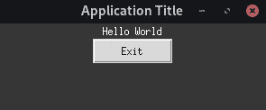

# 使用 Tkinter GUI 增强 Docker 的能力

> 原文：<https://towardsdatascience.com/empowering-docker-using-tkinter-gui-bf076d9e4974?source=collection_archive---------5----------------------->

## 通过 Docker 的 GUI 对于许多应用程序来说是至关重要的。


边境摄影师在 [Unsplash](https://unsplash.com) 拍摄的照片。

在几种情况下，创建一个可以在 Docker 中访问的图形用户界面(GUI)会很有用，例如在开发需要可视化图像和视频的机器学习应用程序时。但是，需要几个步骤才能在主机上查看 GUI。在本文中，我们将使用 Tkinter 在 Python 中创建一个简单的 GUI，可以通过 Docker 访问它。

## 目录

在本文中，我们将涵盖几个步骤。前两步是在 Docker 中运行 Tkinter GUI 应用程序所必需的。其他步骤是可选的，用于获得如何使用 Tkinter 和 Docker 增强开发阶段的额外信息。这些步骤是:

1.  使用 Tkinter 创建非常简单的应用程序。
2.  创建一个简单的 Docker 映像，并在 Docker 容器中运行 Tkinter 应用程序。
3.  使用 shell 脚本简化 Docker 运行命令。(可选)
4.  允许 GUI 的持续开发。(可选)

## 先决条件

本文只在 Linux 上测试过，可能不适用于其他操作系统。你也应该已经安装了 Docker。

## 目录结构

下面是目录结构的概述。这些文件将用于本文，因此您可以预先创建它们。

```
app/
├─ tkinter_app.py
Dockerfile
run.sh (optional)
```

# Tkinter

因为本文的目标是演示如何通过 Docker 访问 GUI，所以创建了一个如下所示的简单窗口。这个 GUI 包含文本和一个退出应用程序的按钮。



简单的 Tkinter 应用程序。

为了创建这个简单的应用程序，使用了下面的代码。

创建简单 Tkinter 应用程序的代码。

# 码头工人

然后，应该创建一个 docker 文件，其中包含以下代码。在这个 Docker 文件中，我们将 Docker 映像的基础设置为 Python 3.8.12 的精简版本。之后，我们更新包信息并安装 Tkinter。最后两行用 Python 运行命令 */app/tkinter_app.py* 。

创建 docker 文件的代码。

## 构建 Docker 映像

在 Docker 文件所在的目录中，应该执行以下命令来构建 Docker 映像:

```
docker build -t tkinter_in_docker .
```

上面的命令构建了一个名为 *tkinter_in_docker* 的 Docker 映像。

## 运行 Docker 容器

既然已经构建了 Docker 映像，我们可以运行 Docker 映像的 Docker 容器。要做到这一点，需要获得许可，这可能会有一些安全问题。在本文中，我们将采用一种安全的方法。然而，还有其他更安全的方法，在[这里](http://wiki.ros.org/docker/Tutorials/GUI#The_simple_way)有所涉及。在本文中，我们将使用以下命令输入我们自己的用户凭证:

```
# Read the above before pasting
docker run -u=$(id -u $USER):$(id -g $USER) \
           -e DISPLAY=$DISPLAY \
           -v /tmp/.X11-unix:/tmp/.X11-unix:rw \
           -v $(pwd)/app:/app \
           --rm \
           tkinter_in_docker
```

在上面的代码中，- *u* 用于设置用户名，- *e* 用于设置显示，第一个 *-v* 在 X11-unix 中创建了一个卷来提供显示，第二个 *-v* 创建了另一个卷，Docker 容器可以在其中访问我们的 Tkinter 应用程序，最后我们使用- rm 来在使用后自动删除容器。

# 使用 Shell 脚本简化 Docker 运行(可选)

上面介绍的复杂的 Docker run 命令可以通过创建一个简单的 bash 文件来简化，如下所示:

简化 Docker 运行命令的 Shell 脚本。

要使 shell 脚本可执行，您可以运行以下命令:

```
chmod +x ./run.sh
```

现在，您只需使用以下命令即可运行它:

```
./run.sh
```

# GUI 的持续开发(可选)

在我们的场景中，我们为应用程序 *tkinter_app.py* 和准备了一个文件，因此几乎没有理由使用 Python 在 Docker 容器中手动运行它。然而，对于较大的应用程序，可能希望在 Docker 环境中运行单独的脚本，而不是每次都运行同一个脚本。

要允许持续开发，请遵循以下步骤:

*   注释 Docker 文件中的第 11 行和第 12 行，防止 Docker 自动运行 *tkinter_app.py* 。
*   使用以下 Docker build 命令用新的更改来重建映像:

```
docker build -t tkinter_in_docker .
```

*   要运行 Docker 容器并与之交互，请使用以下命令:

```
# Read "Running Docker Container" before running this command
docker run -u=$(id -u $USER):$(id -g $USER) \
           -e DISPLAY=$DISPLAY \
           -v /tmp/.X11-unix:/tmp/.X11-unix:rw \
           -v $(pwd)/app:/app \
           --rm \
           -it \
           tkinter_in_docker \
           /bin/bash
```

上面的命令基于前面的 Docker run 命令。*-添加 it* 是为了在 Docker 环境中获得一个交互终端，添加 */bin/bash* 是为了使用 bash 运行它。如果需要，您可以用 shell 脚本中的命令替换上面的命令，这在前面已经介绍过了。

*   导航到位于/app/中的应用程序目录。
*   使用命令运行应用程序:

```
python tkinter_app.py
```

因为我们已经通过 Docker run 命令设置了一个共享卷，所以我们现在能够在本地使用一个 IDE 并不断地改变我们的应用程序，而不需要重新启动 Docker 容器。

***注意*** *:要分离 docker 容器(退出 Docker 容器)，按 Ctrl+d。*

# 结论

在本文中，您使用 Tkinter 开发了一个简单的 GUI 应用程序，您可以通过 Docker 运行它。这是一项需要掌握的强大技能，尤其是在数据科学领域，因为运行交互式隔离 GUI 环境的可能性很大。现在，您应该能够进一步开发自己的应用程序了。

# 感谢阅读

这是我第一篇关于媒体的文章，因此非常感谢反馈。