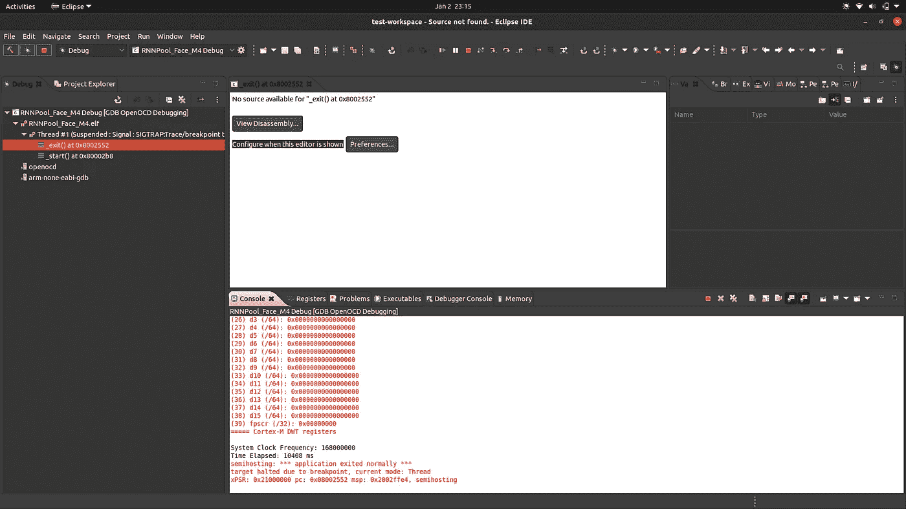

# 利用 RNNPool 运算符和 SeeDot 编译器在微型微控制器上实现精确的计算机视觉

> 原文：<https://towardsdatascience.com/enabling-accurate-computer-vision-on-tiny-microcontrollers-with-rnnpool-operator-and-seedot-d6944930dcf9?source=collection_archive---------31----------------------->

## [理解大数据](https://towardsdatascience.com/tagged/making-sense-of-big-data)

## 关于使用微软 [EdgeML](https://github.com/microsoft/EdgeML/) 存储库在 ARM Cortex-M 类设备上训练、量化和部署精确人脸检测模型的教程。

# 摘要

*卷积神经网络*在计算需求方面很昂贵，但在工作 *RAM* 需求方面更是如此。主要原因是它们有很大的中间激活图。这是在低资源设备上部署的主要障碍。所以这给我们留下了两个选择:

1.  **减少通道数量，**根据经验观察，这会导致总体性能不佳。
2.  **减少行/列的数量，**这就引出了一个问题，我们如何通过池化/步长卷积来减少行/列？

当应用标准池操作来快速减少行/列的数量时，会导致准确性的严重下降。 *RNNPool* 是一个新的池操作符，可以显著减少行/列，而不会显著降低准确性。我们的工作已经在 NeurIPS 的 20 篇论文和 NeurIPS 的聚焦演讲中发表。[这篇微软研究博客文章](https://www.microsoft.com/en-us/research/blog/seeing-on-tiny-battery-powered-microcontrollers-with-rnnpool/?OCID=msr_blog_RNNPool_NeurIPS_tw)对新运营商及其含义进行了高度概括。

这篇文章讲述了如何使用 RNNPool 来减少 CNN 的内存需求。我们通过走极端来说明它的多功能性，即在一个微型微控制器上实现人脸检测。在资源受限的环境中部署解决方案的另一个关键方面是*量化*模型(如 [Joel Nicholls](https://medium.com/@joel_34050) 在此[清晰地解释的那样](https://medium.com/@joel_34050/quantization-in-deep-learning-478417eab72b)，以便它可以在没有浮点运算的微控制器上执行，利用 8 位和 16 位整数计算的速度和内存优势。这篇文章还展示了[微软印度研究院](https://www.microsoft.com/en-us/research/lab/microsoft-research-india/)的 [SeeDot](https://pldi19.sigplan.org/details/pldi-2019-papers/65/Compiling-KB-Sized-Machine-Learning-Models-to-Tiny-IoT-Devices) (现在的[狡猾天狗](https://2020.splashcon.org/details/splash-2020-oopsla/58/Shiftry-RNN-Inference-in-2KB-of-RAM))编译器的功能，它可以用来量化基于 *RNNPool* 的 *PyTorch* 模型，并生成具有最佳内存使用的 *C* 代码。

最后，这篇文章展示了如何将 *RNNPool* 和 *SeeDot* 放在一起，在一个 *ST* 微控制器上训练和部署人脸检测模型，该微控制器包含一个 *ARM Cortex-M3/M4* 级微处理器(或更高版本)，其 *RAM* 小于 256 KBs。

# RNNPool 运算符:什么和为什么？

池运算符通常用于对激活图进行下采样。典型的池操作符是*平均池*和*最大池*。它们在感受野上执行“粗略”操作，因此是不准确的。


*RNNPool* 使用 4 遍 rnn 聚合大块激活图。(作者供图)

rnn 是有趣的，因为它们需要少量的内存，但在计算方面可能比卷积更昂贵。然而，通过大幅缩小激活图的大小，RNNs 可以将几种标准视觉架构的总计算量减少 2-4 倍。

```
╔═══════════════╦═════════════════════════╦═════════════════════════╗
║     Model     ║     Standard Models     ║  RNNPool-based Models   ║
╠═══════════════╬═════╦══════╦══════╦═════╬═════╦══════╦══════╦═════╣
║               ║Acc. ║Params║ RAM  ║MAdds║Acc. ║Params║ RAM  ║MAdds║
║               ║     ║      ║      ║     ║     ║      ║      ║     ║
║MobileNetV2    ║94.20║2.20M ║2.29MB║0.30G║**94.40**║**2.00M** ║**0.24MB**║**0.23G**║
║EfficientNet-B0║96.00║4.03M ║2.29MB║0.39G║**96.40**║**3.90M** ║**0.25MB**║**0.33G**║
║ResNet18       ║**94.80**║11.20M║3.06MB║1.80G║94.40║**10.60M**║**0.38MB**║**0.95G**║
║DenseNet121    ║**95.40**║6.96M ║3.06MB║2.83G║94.80║**5.60M** ║**0.77MB**║**1.04G**║
║GoogLeNet      ║**96.00**║9.96M ║3.06MB║1.57G║95.60║**9.35M** ║**0.78MB**║**0.81G**║
╚═══════════════╩═════╩══════╩══════╩═════╩═════╩══════╩══════╩═════╝
```

> cImageNet-10 数据集上有无 RNNPool 层的推理复杂度和准确性比较。

由于 *RNNPool* 是一个更“细粒度”和更好学习的池操作符，它也可以导致更高的准确性。

```
 ╔═════════════════════════════════╦══════════╦════════╦════════╗
  ║             Method              ║ Accuracy ║  MAdds ║ Params ║
  ╠═════════════════════════════════╬══════════╬════════╬════════╣
  ║ Base Network                    ║    94.20 ║ 0.300G ║  2.2M  ║
  ║ Last Layer RNNPool              ║    95.00 ║ 0.334G ║  2.9M  ║
  ║ Average Pooling                 ║    90.80 ║ **0.200G** ║  **2.0M**  ║
  ║ Max Pooling                     ║    92.80 ║ **0.200G** ║  **2.0M**  ║
  ║ Strided Convolution             ║    93.00 ║ 0.258G ║  2.1M  ║
  ║ ReNet                           ║    92.20 ║ 0.296G ║  2.3M  ║
  ║ RNNPoolLayer                    ║    94.40 ║ 0.226G ║  **2.0M**  ║
  ║ RNNPoolLayer+Last Layer RNNPool ║    **95.60** ║ 0.260G ║  2.7M  ║
  ╚═════════════════════════════════╩══════════╩════════╩════════╝
```

> 在 ImageNet-10 数据集上，各种下采样和池操作符对 MobileNetV2 的准确性、推理复杂性和模型大小的影响。

# 我们可以用 RNNPool 操作符做什么？

我们将了解如何使用 *RNNPool* 来构建适合部署在微控制器上的紧凑型人脸检测架构。

我们将从流行的 [S3FD](http://openaccess.thecvf.com/content_ICCV_2017/papers/Zhang_S3FD_Single_Shot_ICCV_2017_paper.pdf) 架构开始。 *S3FD* 使用一个 *CNN* 为基础的主干网络——[vgg 16](https://arxiv.org/abs/1409.1556)——进行特征提取。为了提高效率，我们使用 *RNNPool* 和 [*MBConv*](https://arxiv.org/abs/1801.04381) 模块来修改这个主干。检测层附着在该网络的不同深度，以检测不同比例的边界框中的人脸。每个检测图层使用单个卷积图层来预测每个空间位置的 6 个输出值，其中 4 个是边界框坐标，2 个是类。

```
 ╔═══════════╦══════════════╦═══════════╦═════════════╦════════╗
   ║   Input   ║   Operator   ║ Expansion ║ Out Channel ║ Stride ║
   ╠═══════════╬══════════════╬═══════════╬═════════════╬════════╣
   ║ 320x240x1 ║ Conv2D 3x3   ║     1     ║       4     ║    2   ║
   ║ 160x120x4 ║ RNNPoolLayer ║     1     ║      64     ║    4   ║
   ║ 40x30x64  ║ Bottleneck   ║     2     ║      32     ║    1   ║
   ║ 40x30x32  ║ Bottleneck   ║     2     ║      32     ║    1   ║
   ║ 40x30x32  ║ Bottleneck   ║     2     ║      64     ║    2   ║
   ║ 20x15x64  ║ Bottleneck   ║     2     ║      64     ║    1   ║
   ╚═══════════╩══════════════╩═══════════╩═════════════╩════════╝
```

> 引入卷积后开始使用 RNNPool。

# EdgeML + SeeDot:模型训练、量化和代码生成

在这里，我们提供了一个端到端的管道，用于在[宽面数据集](http://shuoyang1213.me/WIDERFACE/)(用 *PyTorch* 编写的模型)上训练我们设计的模型，在 [SCUT-Head Part B 数据集](https://github.com/HCIILAB/SCUT-HEAD-Dataset-Release)上对它们进行微调，使用 *SeeDot* 编译器对它们进行量化，并生成 *C* 代码，这些代码可以定制为部署在一系列低端微控制器上。我们选择这些数据集专门为会议室人数计算场景训练模型。

我们在这里展示了两个可以直接部署在 M4 级微控制器上的示例模型:

1.  ***rnn pool _ Face _ QVGA _ Monochrome:****一个具有 14 个 MBConv 层的模型，在验证数据集上提供高的贴图得分(预测和实际边界框之间的重叠)。这种型号非常适合精度至关重要的情况。*
2.  ***RNNPool _ Face _ M4:****预测延迟较低的较小模型，具有 4 个 MBConv 层，并且 rnn pool 层的权重稀疏，从而提供合理的映射得分。这种模式非常适合延迟至关重要的情况。*

```
 ╔═════════════════════╦═════════════════╦═════════╗
         ║       Metrics       ║ QVGA MONOCHROME ║ FACE M4 ║
         ╠═════════════════════╬═════════════════╬═════════╣
         ║ Flash Size (KB)     ║       450       ║   **160**   ║
         ║ Peak RAM Usage (KB) ║       **185**       ║   **185**   ║
         ║ Accuracy (mAP)      ║       **0.61**      ║   0.58  ║
         ║ Compute (MACs)      ║       228M      ║   **110M**  ║
         ║ Latency (seconds)   ║       20.3      ║   **10.5**  ║
         ╚═════════════════════╩═════════════════╩═════════╝
```

*Jupyter* 笔记本可以配置在第一个单元中，在两种不同型号和其他训练环境配置之间切换。每个命令都附有详细说明其用途的注释。更详细的解释，也可以参考[自述文件](https://github.com/microsoft/EdgeML/blob/master/examples/pytorch/vision/Face_Detection/README.md)。

用于端到端训练、量化和代码生成的 Jupyter 笔记本。

截至这篇博客发表时，我们还在添加对自动化 *PyTorch 到 TFLite* 转换器的支持，以允许感兴趣的用户使用 *RNNPool + SeeDot* 构建和训练定制模型，适合在低资源设备上部署。

由微软印度研究院维护的 [EdgeML](https://github.com/Microsoft/EdgeML) 存储库中提供了将这个端到端管道组合在一起的所有必需代码。另外， *Jupyter* 笔记本可以在[这里](https://gist.github.com/ShikharJ/38de343d5da3eafb46aa90847300a0c5)访问。

在第一个单元中设置配置并运行整个笔记本后，生成的代码将被转储到*EdgeML/tools/SeeDot/m3 dump/*文件夹中。因此，我们现在可以在微控制器上部署这些代码。

# 设置部署环境

我们在 [NUCLEO-F439ZI 电路板](https://www.st.com/en/evaluation-tools/nucleo-f439zi.html)上部署了我们的模型，并在相同的环境中对我们的代码运行了基准测试。或者，可以选择满足 192 KBs 基本 RAM 可用性和 450 KBs 闪存可用性(对于*rnn pool _ Face _ QVGA _ Monochrome*型号)和 170 KBs(对于 *RNNPool_Face_M4* 型号)的任何其他微控制器板。

要详细了解如何设置与 *ARM Cortex-M* 类设备相关的开发环境，我们建议读者参考 [Carmine Novello 的精彩著作](https://leanpub.com/mastering-stm32)以及[他关于该主题的惊人的工程博客](https://www.carminenoviello.com/category/programming/)。

1)安装 [*Java*](https://www.java.com/en/download/manual.jsp) (版本 *8* 或更好)。

2.安装用于 C/c++T3 的 [*Eclipse IDE(版本*2020–09*在 Linux 和 Windows 上测试)。*](https://www.eclipse.org/downloads/packages/release/2020-09/r/eclipse-ide-cc-developers)

3.安装 [*CDT* 和 *GNU ARM* 嵌入式 CDT 插件](https://github.com/eclipse-embed-cdt/eclipse-plugins)用于 Eclipse(转到*帮助- >安装新软件)..*且看下图)。


正在安装 CDT 插件。(作者截图)

点击下拉菜单中的 *CDT* 链接，选择 *CDT 主要功能*选项。点击下一个> 的*，并按照*窗口中的剩余安装说明进行操作。**

此外，使用上面提供的链接进行*添加..*ARM Embedded CDT 插件链接到一组软件安装源，如下图所示，同时安装 *Embedded CDT* 工具。


挑选稳定的插件安装通道。(作者截图)


将该频道添加到软件安装站点列表中，并将其命名为 **GNU MCU Eclipse 插件**。(作者截图)


点击**下一个>** 安装上图所示的所有资源，然后从那里开始。(作者截图)

4.安装 *libusb-1.0* (仅适用于基于 Linux 的系统，使用命令):

```
$ sudo apt-get install libusb-1.0
```

5.安装 [*GNU Arm 嵌入式工具链*](https://developer.arm.com/tools-and-software/open-source-software/developer-tools/gnu-toolchain/gnu-rm/downloads) ，其中包括 Arm 直接提供的基于 GNU GCC 的 Cortex-M 设备交叉编译器(版本 *2020-q2* 已在 Linux 和 Windows 上测试)。

6.安装 [*OpenOCD*](http://openocd.org/getting-openocd/) 软件，用于调试选择的板(版本 *0.10.0* 在 Linux 和 Windows 上测试)。

7.**可选:**安装 [*ST-LINK 固件升级软件*](https://www.st.com/en/development-tools/stsw-link007.html) 并升级板卡固件(仅在第一次使用板卡时)。

8.**可选:**根据具体要求，安装 [*STM32CubeMX 软件*](https://www.st.com/en/development-tools/stm32cubemx.html) 为您的微控制器生成初始化代码。

现在，人们可以通过以下两种方式部署代码:

1.  使用 *STM32CubeMX* (取决于具体的功能需求)生成初始化代码，从头开始设置一个新项目，并添加生成的*。c* 和*。h* 文件分别保存到 *src/* 和 *include/* 文件夹。
2.  使用我们的一个示例部署片段(此处[可用](https://github.com/microsoft/EdgeML/blob/SeeDOT-Face-Detection/examples/pytorch/vision/Face_Detection/sample%20codes/M4%20Deployment%20Codes.zip)，其中我们使用 *STM32CubeMX* (此处[可用](https://github.com/microsoft/EdgeML/blob/SeeDOT-Face-Detection/examples/pytorch/vision/Face_Detection/sample%20codes/M4%20Initialization%20Codes.zip))生成一个最低要求的初始化代码，并将我们的 SeeDot 生成的代码添加到这个基本示例中。这些示例代码片段已经针对速度进行了进一步优化，执行速度可以提高 15%左右。

这里，我们只关注后一种选择。然而，我们鼓励感兴趣的读者也尝试一下前一种选择。

要部署代码，只需将整个文件夹复制粘贴到您的 *Eclipse* 工作区目录中，如下所示。


1)在 Eclipse 中打开一个新的/现有的工作区。(作者截图)


2)点击**导入项目..**选项。(作者截图)


3)点击**已有项目进入工作区**选项，加载下载的文件夹。(作者截图)


4)浏览到包含我们示例代码的下载文件夹，并点击**完成**。(作者截图)


5)从**项目浏览器**菜单可以看到，项目导入过程现在已经完成。(作者截图)

使用 *Eclipse GUI* 设置下载编译器的路径，并使用编译器工具链构建项目二进制文件，如下所示。


1)点击 ***项目*** *标签，选择* ***属性*** *选项，导航到* ***手臂工具链路径*******MCU****下拉菜单。*(作者截图)*

**

**2)浏览到前面提到的* ***GNU ARM 嵌入式工具链*** *的安装目录。*(作者截图)*

**

**3)导航到****bin/****目录里面，点击* ***打开。*** (作者截图)*

**

**4)点击* ***应用并关闭，*** *再次导航到* ***项目*** *标签页，选择* ***构建项目*** *选项生成交叉编译的二进制文件。*(作者截图)*

*最后一步，我们需要设置一个调试配置。我们通过 *OpenOCD* 来实现这一点，它允许我们通过主机本身来控制一步一步的调试。*

**

*1)点击 ***运行*** *选项卡，选择* ***调试配置..*** *选项，并双击* ***GDB OpenOCD 调试*** *选项即会创建一个新的配置。*(作者截图)*

**

**2)选择生成的配置并填写* ***主*** *页签明细，最后点击* ***应用*** *。*(作者截图)*

**

**3)导航到* ***调试器*** *选项卡填写 OpenOCD 安装路径，完成后点击* ***应用*** *。*(作者截图)*

**

**4)导航到* ***启动*** *选项卡，如图所示设置配置，点击* ***应用*** *。*(作者截图)*

*现在，我们准备在我们选择的微控制器上运行编译好的二进制文件。只需将电路板连接到 PC，然后点击*调试*按钮。运行 *OpenOCD* 的控制台应启动，并立即停止。*

**

*点击**调试**选项，您会得到以下提示。选择**开关**选项，程序将在 **main()的第一行执行处停止。**(作者截图)*

# *最终部署*

*将缩放后的图像作为输入(作为 *input_image* 变量存储在 *main.h* 文件中)，我们在我们选择的模型上执行整个流水线，并根据需要设置输出目录(在 *main.c* 文件的 *run_test()* 函数中提到)。使用*[scale _ image . py](https://github.com/microsoft/EdgeML/blob/SeeDOT-Face-Detection/examples/pytorch/vision/Face_Detection/scale_image.py)*文件可以完成任意图像的缩放过程。简单地运行，***

```
***$ IS_QVGA_MONO=1 python scale_image.py --image_path <path_to_image> --scale <scaleForX value in m3dump/scales.h file> > output.txt***
```

***并从 *output.txt* 文件中复制粘贴整个文本，替换 *main.h* 中的 *input_image* 变量。***

***该模型为它认为是面部的图像的每个区域生成位置( *loc* )和置信度( *conf* )边界框。***

******

***1)点击 **Resume** 选项，继续执行整个流水线。(作者截图)***

******

***(左)我们看到连接板上的两个 LED 亮起，一个是通信 LED，在红色和绿色之间闪烁(使用 OpenOCD 表示 PC 设备通信),另一个是绿色电源 LED。(右图)点击 **Resume** ，我们会看到一个蓝色 LED 灯瞬间亮起，表示微控制器上核心图像处理流水线执行的开始和结束。该 LED 还可用于测量设备处理图像所花费的时间。(图片由作者提供)***

******

***2)过了一会儿，我们看到一个时间流逝计数器，和一个半托管退出消息，表明结果已经被写到提到的输出目录，现在执行已经完成。(作者截图)***

***最后，我们需要将获得的输出叠加到原始图像上，以获得最终所需的输出。为此，可以简单地使用 [eval_fromquant.py](https://github.com/microsoft/EdgeML/blob/SeeDOT-Face-Detection/examples/pytorch/vision/Face_Detection/eval_fromquant.py) 脚本:***

```
***$ IS_QVGA_MONO=1 python eval_fromquant.py --save_dir <output image directory> --thresh <threshold value for bounding boxes> --image_dir <input image directory containing original test image> --trace_file <path to output file generated by microcontroller> --scale <scaleForY value in m3dump/scales.h file>***
```

***这给了我们想要的输出图像，它的副本将被存储在这个文件夹中。***

******

***微软印度研究院研究小组的样本图像。(图片经作者许可复制)***

******

***来自 **RNNPool_Face_M4** (最小延迟)模型的相应输出(阈值:0.45)。(图片经作者许可编辑)***

******

***来自**rnn pool _ Face _ QVGA _ Monochrome**(最高精度)模型的相应输出(阈值:0.60)。(图片经作者许可编辑)***

# ***结论***

***因此，我们在 *C* 中有一个功能性的人脸检测流水线，它可以在一个微型微控制器上执行。我们可以向微控制器输入一幅图像，执行代码以生成这些 *conf* 和 *loc* 输出，并将这些输出发送回主机 PC 以获得最终图像，其中边界框如图所示叠加在一起。***

***人们可以通过将相机模块集成到微控制器来进一步扩展这一想法，以进行实时图像捕捉和处理。遗憾的是，对这项工作的技术细节的阐述超出了本文的范围。为此，我们在 *RNNPool_Face_M4* 型号的基础上，试验了一个 200 万像素的 OmniVision OV7670 摄像头模块。同样的代码可以在[这里](https://github.com/microsoft/EdgeML/blob/SeeDOT-Face-Detection/examples/pytorch/vision/Face_Detection/sample%20codes/M4%20Deployment%20Codes.zip)查看(标题 *RNNPool_Face_M4 相机*)。***

******

***一个 **NUCLEO-F439** 板，附带 **OV7670** 摄像机。(作者供图)***

******

***设备拍摄的样本。(作者供图)***

> ***这篇博文是由微软印度研究院的许多优秀的研究人员、研究员和实习生共同努力的结果。感谢 [Oindrila Saha](https://oindrilasaha.github.io/) 、 [Aayan Kumar](https://www.linkedin.com/in/aayan-kumar-a40969100/) 、 [Harsha Vardhan Simhadri](http://harsha-simhadri.org/) 、 [Prateek Jain](http://www.prateekjain.org/) 和 [Rahul Sharma](https://cs.stanford.edu/people/sharmar/) 对本文不同章节的贡献。***