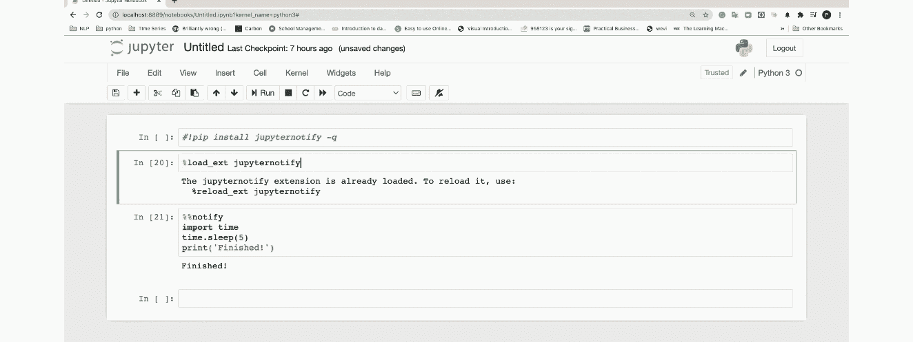
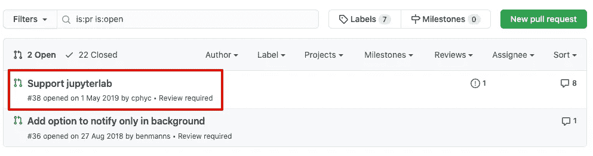
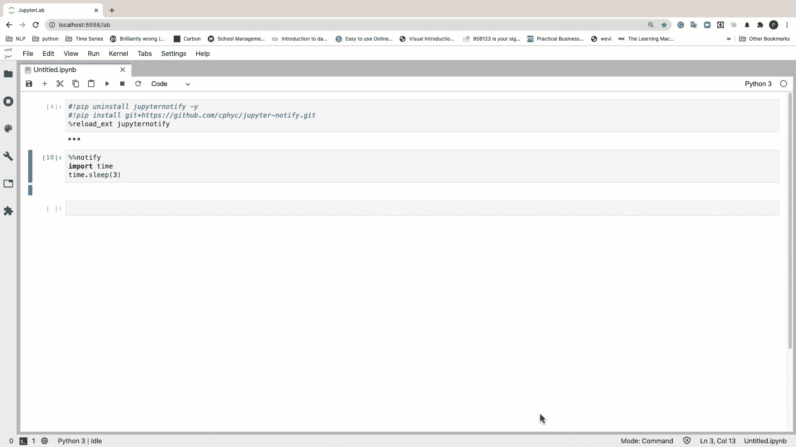

# 在 Jupyter 笔记本中启用单元格完成通知

> 原文：<https://towardsdatascience.com/enabling-notifications-in-your-jupyter-notebooks-for-cell-completion-68d82b02bbc6?source=collection_archive---------11----------------------->

## 当长时间运行的单元完成执行时得到通知。


在 Unsplash[上由](https://unsplash.com?utm_source=medium&utm_medium=referral) [Manja Vitolic](https://unsplash.com/@madhatterzone?utm_source=medium&utm_medium=referral) 拍摄的照片

如果你是一个 Jupyter 笔记本用户，一定有过这样的场景，某个特定的单元格花了很多时间来完成执行。这在机器学习、超参数优化中的模型训练期间，甚至在运行冗长的计算等时尤其常见。如果是的话，那么一旦这个过程完成，浏览器就会通知你，这就非常方便了。通过这种方式，您将能够导航到其他选项卡，并且只有在收到完成通知后才能返回到您的机器学习实验。事实证明，有一个 Jupyter 扩展可以做到这一点，它被非常恰当地命名为 [**Notify**](https://github.com/ShopRunner/jupyter-notify) **。**在本文中，我们将了解如何使用 notify 在 **Jupyter 笔记本**和 **Jupyter 实验室**中启用通知。

# 通知:浏览器通知单元格完成的一个 Jupyter 魔术

[Notify](https://github.com/ShopRunner/jupyter-notify) 是一个 Jupyter 笔记本扩展，一旦一个长时间运行的单元格通过浏览器通知完成执行，它就会通知用户。Chrome 和 Firefox 支持 Notify。然而，如果你面临任何关于安装的问题，你可以按照这些[详细说明](https://github.com/ShopRunner/jupyter-notify/issues/46#issuecomment-907348833)来启动和运行。

现在让我们看看如何安装和使用这个包。

## 装置

安装可以通过 pip 完成

```
pip install jupyternotify
```

或通过以下来源:

```
git clone git@github.com:ShopRunner/jupyter-notify.git
cd jupyter-notify/
virtualenv venv
source venv/bin/activate
pip install -r requirements.txt
jupyter notebook
```

# 在 Jupyter 笔记本中启用通知

首先，我们将看看如何在 Jupyter 笔记本中启用通知。在笔记本的第一个单元格中输入以下文本:

```
%load_ext jupyternotify
```

当您第一次运行此单元时，您的浏览器会要求您允许在笔记本中发出通知。你应该按“是”现在我们都准备好了。在这里，我将向您展示一小段代码，使用`sleep() function.` 该函数在给定的秒数内暂停(等待)当前线程的执行。

```
%%notify
import time
time.sleep(10)
print('Finished!')
```

在执行上述单元格时，您将在浏览器中得到以下通知:



作者 GIF

当您单击通知的正文时，它会将您直接带到浏览器窗口和包含您的笔记本的选项卡。

# 在 Jupyter 实验室中启用通知

虽然目前 Jupyter 实验室没有官方支持，但我找到了一个解决方法。显然，一个用户已经提交了一个带有解决方案的拉请求，但是它还没有被合并。然而，该解决方案确实可以无缝地工作。



来源:https://github.com/ShopRunner/jupyter-notify/pull/38

将以下内容粘贴到 Jupyter Lab 单元格中，后跟您希望运行的代码:

```
!pip uninstall jupyternotify -y
!pip install git+[https://github.com/cphyc/jupyter-notify.git](https://github.com/cphyc/jupyter-notify.git)
%reload_ext jupyternotify
```

我们现在将使用与上面相同的代码来检查通知是否被启用。

```
%%notify
import time
time.sleep(5) 
```



作者 GIF

# 自定义通知消息

如果您希望有一个更好的通知消息，代码可以很容易地调整这样做。

```
%%notify -m "Congrats.The process has finished"
import time
time.sleep(3) 
```


还有许多其他选项可用，例如，在单元格中间触发通知或在一定时间后自动触发通知。我强烈建议你查看软件包的 [GitHub 库](https://github.com/ShopRunner/jupyter-notify)以获取详细信息。

# 结论

像通知这样琐碎的功能可能是有益的，特别是当您经常处理需要大量时间执行的流程时。能够导航到另一个选项卡甚至桌面，并且在运行的进程结束时仍然得到通知，这是非常方便的。有时候，像 jupyternotify 这样的小插件确实可以帮助提高用户的工作效率。