# 启用 Amazon SageMaker Studio 资源的自助供应

> 原文：<https://towardsdatascience.com/enabling-self-service-provisioning-of-amazon-sagemaker-studio-resources-7ac017925016?source=collection_archive---------27----------------------->

## 使用 AWS 服务目录工厂管理 SageMaker Studio 的分步指南

在大多数大型企业中，标准化、供应和确保管理 ML 环境是中央 IT 团队的责任。

迪米特里·阿尼金在 [Unsplash](https://unsplash.com/?utm_source=unsplash&utm_medium=referral&utm_content=creditCopyText) 上拍摄的照片

我[最近出版了](/automating-the-setup-of-sagemaker-studio-custom-images-4a3433fd7148)一份持续交付定制图像的指南，IT 团队可以在为他们的最终用户建立 SageMaker Studio 时使用。

在本帖中，我们将更进一步，使用 [AWS 服务目录](https://aws.amazon.com/servicecatalog/?aws-service-catalog.sort-by=item.additionalFields.createdDate&aws-service-catalog.sort-order=desc)来实现经批准的 SageMaker Studio 环境的自助供应。

作者图片

我们将为 SageMaker Studio 创建一个服务目录组合，其中包含批准的域、用户配置文件、模板化 MLOps 项目和自定义映像管道。我们将使用 [AWS 服务目录工厂](https://service-catalog-tools-workshop.com/tools.html)自动部署我们的产品组合。

快速访问亚马逊 SageMaker 工作室、 [AWS 服务目录工具研讨会](https://service-catalog-tools-workshop.com/)和 [AWS 管理&治理博客](https://aws.amazon.com/blogs/mt/tag/aws-service-catalog/)可能是一个好的开始，如果这些东西对你来说听起来很新的话。

# 演练概述

我们将通过 3 个步骤实现自助式工作室环境:

*   我们将首先安装服务目录工厂，并为我们的工作室设置创建一个文件夹。
*   然后，我们将把工作室产品的模板添加到文件夹中。
*   最后，我将展示终端用户如何使用 AWS 服务目录自助服务 Studio 环境。

# 先决条件

要浏览此示例，请确保您具备以下条件:

1.  这是建立在 AWS 服务目录工厂之上的。确保您熟悉 [AWS 服务目录工具研讨会](https://service-catalog-tools-workshop.com/)中显示的概念。
2.  从您的环境中使用代码提交的能力。
3.  这个 [GitHub 库](https://github.com/SofianHamiti/aws-service-catalog-sagemaker-studio)克隆到您的环境中

# 步骤 1:使用服务目录工厂创建工作室组合

借助服务目录工厂，我们可以在 YAML 定义产品组合。YAML 文件包含我们想要管理的投资组合和产品的定义。对 AWS CodeCommit repo 中的 YAML 文件的更新会触发 AWS 代码管道，并反映服务目录组合中的更改。

通过 CI/CD 渠道管理投资组合是一个非常好的方法。

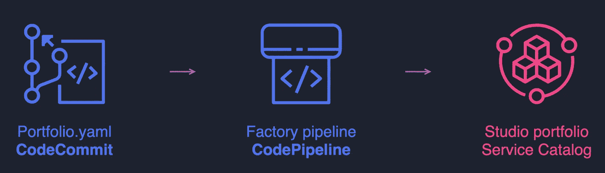

作者图片:使用服务目录工厂管理项目组合

## 在您的帐户中安装服务目录工厂

您可以通过[按照本车间页面](https://service-catalog-tools-workshop.com/installation/20-service-catalog-factory.html)上的说明安装工厂。

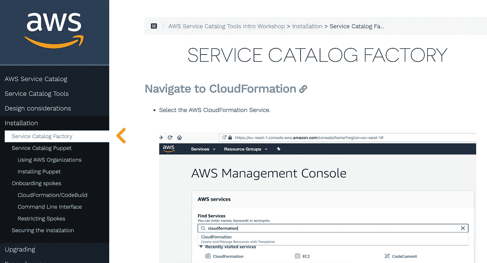

图片由作者提供:遵循本页中[的安装说明。](https://service-catalog-tools-workshop.com/installation/20-service-catalog-factory.html)

确保在 **EnabledRegions** 字段中输入您的 AWS 区域 ID。在这个例子中，我将 SCMSourceProvider 设置为 **CodeCommit** ，但是如果需要的话，可以随意放置其他代码源。

工厂堆栈将在 CodeCommit 中创建**ServiceCatalogFactory**repo，并在 CodePipeline 中创建关联的**service catalog-factory-pipeline**。

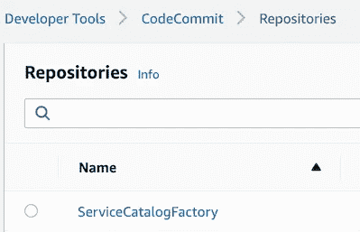

Image by author:您可以将创建的 CodeCommit repo 克隆到您的环境中

## 创建您的工作室产品组合

接下来，您需要将这个文件夹中的内容[推入 CodeCommit repo **main** 分支。它将触发管道并部署](https://github.com/SofianHamiti/aws-service-catalog-sagemaker-studio/tree/master/ServiceCatalogFactory)[我为您准备的示例组合](https://github.com/SofianHamiti/aws-service-catalog-sagemaker-studio/blob/master/ServiceCatalogFactory/portfolios/sagemaker-studio.yaml)。

在 **sagemaker-studio.yaml** 文件中，您可以编辑以下行，并向您帐户中的 IAM 组/用户授予投资组合访问权限:

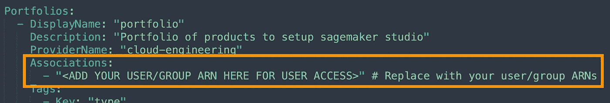

作者图片

进入主分支机构几分钟后，您应该会在服务目录中看到您的产品组合:

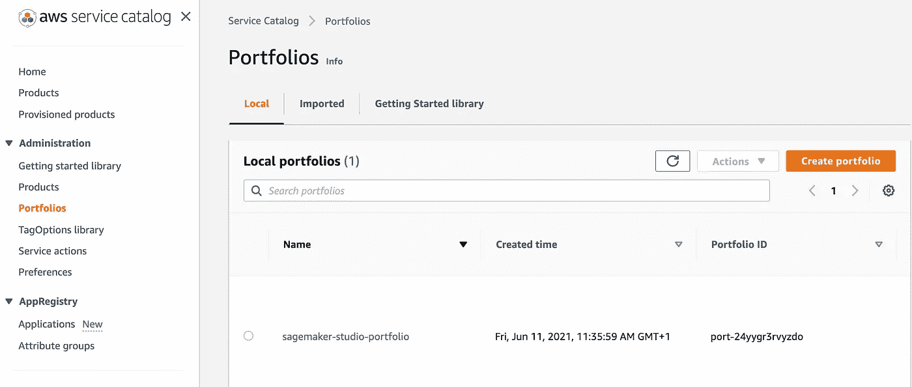

作者图片

从现在开始，每次您提交时，管道将自动更新服务目录中的产品组合。

# 步骤 2:将工作室产品添加到产品组合中

这里，我们在产品组合中创建了 4 个示例产品:

*   **域**在该区域创建一个工作室域。
*   **用户配置文件**将一个工作室用户添加到域中。
*   **启动项目**，根据 MLOps 项目模板创建 SageMaker 项目。
*   **自定义图像**创建一个工作室自定义图像管道，如我之前的帖子中的[所示。](/automating-the-setup-of-sagemaker-studio-custom-images-4a3433fd7148)

服务目录工厂允许您随着时间的推移轻松地向产品组合添加新产品和版本。该过程在车间的[日常使用章节](https://service-catalog-tools-workshop.com/every-day-use.html)中进行了说明

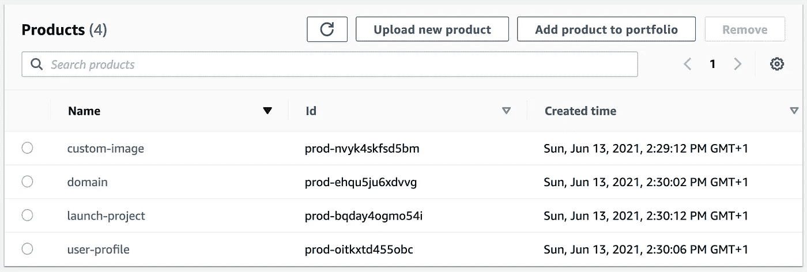

作者图片:您现在可以在服务目录控制台中看到产品组合

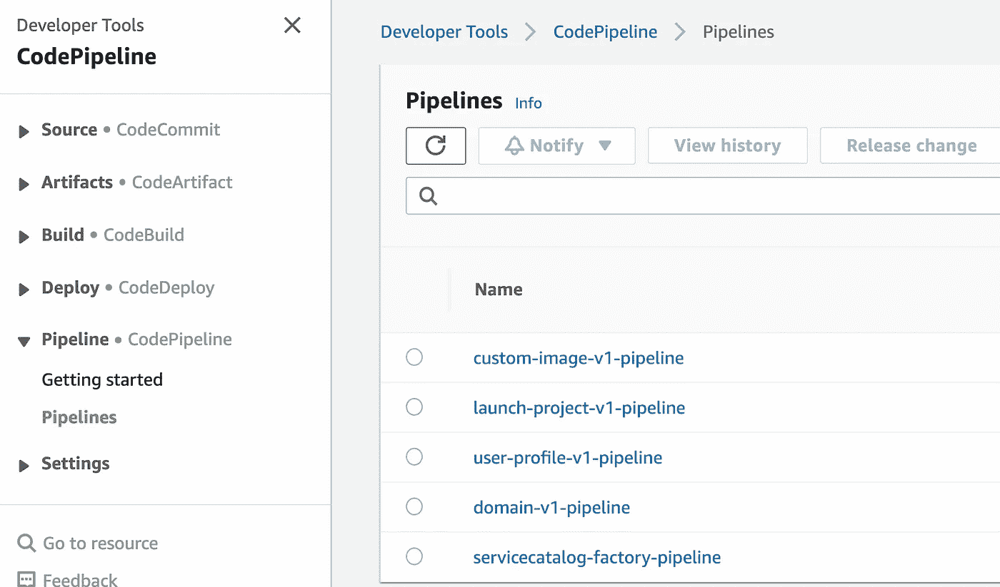

作者图片:服务目录工厂还为每个组合产品创建了一个管道

接下来，您需要为每个投资组合产品创建一个相应的 CodeCommit repo。每个代码管道都将被连接到一个 repo 主分支，并在您提交时更新产品。整个设置如下所示:

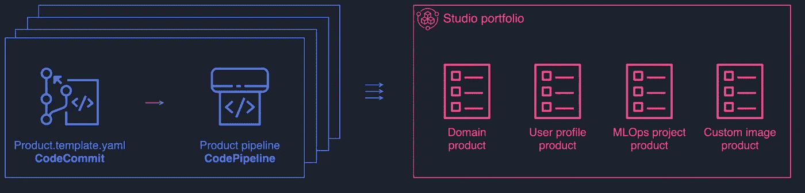

作者图片

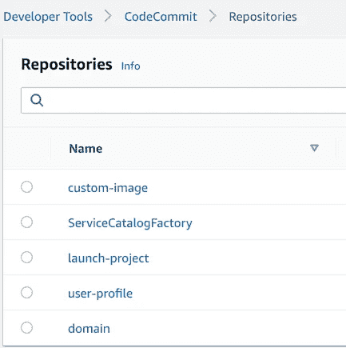

作者图片:我创建后的回复

现在，您可以将我准备的文件夹的内容[推送到它们的 CodeCommit repo **main** 分支中。每个回购都有一个名为 **product.template.yaml** 的云信息文件，它定义了产品本身。在这篇文章中，我主要通过](https://github.com/SofianHamiti/aws-service-catalog-sagemaker-studio)[原生云形成类型](https://docs.aws.amazon.com/AWSCloudFormation/latest/UserGuide/AWS_SageMaker.html)来定义 SageMaker 资源。

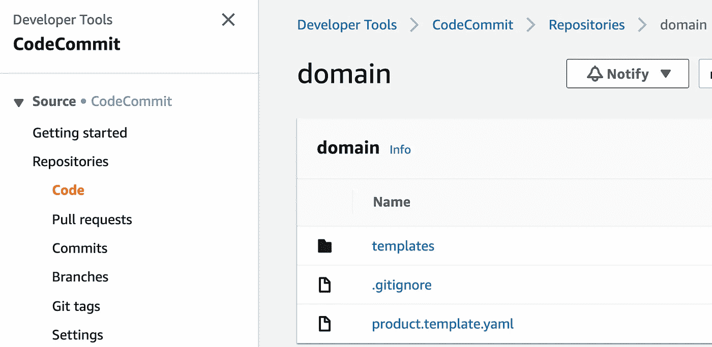

图片作者:下面是我推送到主分支后的域代码回购

# 步骤 3:自助式工作室环境

现在，有权访问投资组合的用户应该能够看到他们可用的产品。

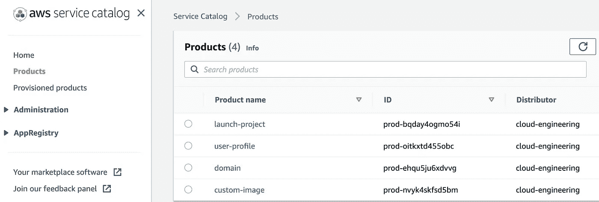

作者图片

通常情况下，您将首先启动**域**产品，这是一个一次性的设置。然后，您可以将**用户配置文件**添加到域中，启动 MLOps 项目，等等。

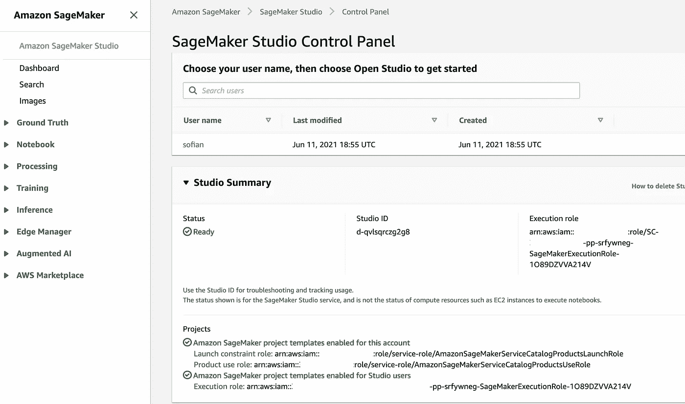

作者图片:从服务目录启动的我的 SageMaker Studio 域和用户配置文件的视图

**注意:**我已经在域产品中添加了一个 Lambda 函数来[使 Studio 用户能够访问](https://docs.aws.amazon.com/sagemaker/latest/dg/sagemaker-projects-studio-updates.html) MLOps 项目模板。创建 Studio 用户配置文件时，可以引用 Lambda 函数 ARN，这样用户就可以访问项目。

# 结论

借助 AWS 服务目录，组织的 IT 团队可以创建和管理在 AWS 上使用的批准资源目录。

在这篇文章中，我展示了如何使用服务目录工厂为您的最终用户实现 SageMaker 资源的自助供应。随着时间的推移，这种设置将允许您轻松地向 ML 平台添加新产品和新版本。

为了更进一步，您还可以访问[在 AWS 上构建安全的企业机器学习平台](https://docs.aws.amazon.com/whitepapers/latest/build-secure-enterprise-ml-platform/build-secure-enterprise-ml-platform.html)白皮书，该白皮书提供了在 AWS 上构建安全的企业 ML 平台的指导。