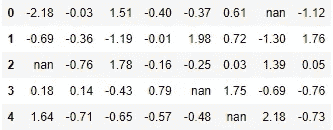

# 增强的表格数据可视化(Pandas)

> 原文：<https://towardsdatascience.com/enchanced-tabular-data-visualization-pandas-4fd77e125bd5?source=collection_archive---------17----------------------->

## 改进熊猫数据帧表示的简单而有效的技术


来自 [Pixabay](https://pixabay.com/photos/hopscotch-steps-numbers-six-seven-3878606/)

在本文中，我们将讨论一些有用的选项和函数，以便在 pandas 中将数据帧有效地可视化为一组表格数据。让我们从为进一步的实验创建一个数据框架开始:

```
import pandas as pd
import numpy as npdf = pd.DataFrame(np.random.randn(20, 40))# Renaming columns
df.columns = [x for x in 'abcdefghijklmnopqrstuvwxyzABCDEFGHIJKLMN']# Adding some missing values 
df.iloc[3,4] = np.nan
df.iloc[2,0] = np.nan
df.iloc[4,5] = np.nan
df.iloc[0,6] = np.nan
df.head()
```


作者图片

**注意:**本文中的代码是在 pandas 版本 1.3.2 中运行的。有些函数相当新，在旧版本中会抛出错误。

# 自定义显示的列数和浮点精度

看着上面的数据框架，我们可能想解决两件事:

1.  显示数据框的所有列。现在，从`k`到`D`的列是隐藏的。
2.  限制浮点值的精度。

让我们检查显示的列数和浮点精度的默认值:

```
print(pd.options.display.max_columns)
print(pd.options.display.precision)**Output:** 20
6
```

我们想要显示所有列(`len(df.columns)`)并且精度为 2 个小数点，所以我们必须重新分配这两个选项:我们想要显示所有列(`len(df.columns)`)并且精度为 2 个小数点，所以我们必须重新分配这两个选项:

```
pd.options.display.max_columns = len(df.columns)
pd.options.display.precision = 2print(pd.options.display.max_columns)
print(pd.options.display.precision)
df.head()**Output:** 40
2
```


作者图片

# 压制科学符号

既然我们可以看到所有列中的值，并且以更容易理解的形式显示，另一个问题出现了:一些浮点数以科学记数法显示(例如，7.85e-1 而不是 0.785)。为了解决这个问题，我们应该显式地为`float_format`属性指定必要的格式(在我们的例子中是 2 个小数点):

```
pd.options.display.float_format = '{:.2f}'.format
df.head()
```


作者图片

# 隐藏索引和标题

在接下来的实验中，让我们从主数据帧(`df`)中截取一个较小的数据帧(`df1`):

```
df1 = df.iloc[:5,:8]
df1
```


作者图片

我们可能想要隐藏数据帧中的索引或标题(或两者都隐藏)。为此，我们应该使用`DataFrame.style`属性创建一个 Styler 类的实例，并对其应用相应的方法`hide_index()`或`hide_columns()`。我们将在接下来的所有实验中使用这个属性。

```
df1.style.hide_index()
```


作者图片

```
df1.style.hide_columns()
```



作者图片

链接这些方法(`df1.style.hide_index().hide_columns()`)将隐藏索引和头。我们还可以注意到，当使用`DataFrame.style`属性时，`NaN`值显示为`nan`。

# 总是显示索引或标题

在其他一些情况下，我们可能希望，正好相反，当滚动数据帧时，索引(或标题)总是可见的。对于大数据帧尤其方便，所以还是回到我们最初的`df`。这里用的方法是`set_sticky()`。根据我们想要粘贴的内容，我们应该传入`axis='index'`或`axis='columns'`:

```
df.style.set_sticky(axis='index')
```


作者图片

```
df.style.set_sticky(axis='columns')
```


作者图片

# 突出显示特定值:特定范围内的空值、最小值、最大值[](http://localhost:8888/notebooks/Desktop/Dataquest/Guided%20Project_%20Clean%20And%20Analyze%20Employee%20Exit%20Surveys/Untitled.ipynb#Highlighting-particular-values:-null,-minimum,-maximum,-values-from-a-certain-range)

为了突出空值，我们可以使用一个内置函数`highlight_null()`:

```
df1.style.highlight_null()
```


作者图片

默认颜色是红色，但是我们可以通过传入一个可选参数`null_color`来改变它。此外，可以只显示一个或几个选定列(或行)的空值。我们使用`subset`参数，传入列名(或行索引)或名称列表(索引):

```
df1.style.highlight_null(null_color='lime', subset=['e', 'g'])
```


作者图片

为了突出显示数据帧每一列中的最小值和最大值，我们可以应用方法`highlight_min()`和`highlight_max()`:

```
df1.style.highlight_min()
```


作者图片

```
df1.style.highlight_max()
```


作者图片

默认颜色可以通过传入一个可选参数`color`来改变。同样在这里，我们可以使用`subset`参数只选择一列或几列来显示最小值或最大值。当然，我们可以链接这两种方法:

```
df1.style.highlight_min(color='cyan', subset='d').highlight_max(color='magenta', subset='d')
```


作者图片

默认情况下，最小值和最大值按列显示。如果我们需要这样的行信息，我们必须指定`axis='columns'`:

```
df1.style.highlight_min(axis='columns')
```


作者图片

在这种情况下，如果我们只想选择一行或几行而不是整个数据帧，我们应该为`subset`传入相应的值:行索引。

最后，可以使用`highlight_between()`方法突出显示选定范围的值。除了已经熟悉的参数`color`和`subset`，我们还必须指定`left`和/或`right`参数，以及可选的`inclusive`，默认为`'both'`(其他可能的值为`'neither'`、`'left'`或`'right'`):

```
df1.style.highlight_between(left=-0.1, right=0.1, inclusive='neither')
```


作者图片

# 将数据帧值显示为热图

有两种奇怪的方法可以根据数值的数值范围，以渐变、类似热图的风格突出显示单元格或其中的文本:`background_gradient()`和`text_gradient()`。两种方法都需要安装 matplotlib(不一定要导入)。

```
df1.style.background_gradient()
```


作者图片

```
df1.style.text_gradient()
```


作者图片

除了`subset`，我们可以调整以下参数:

*   `cmap`—matplotlib 色彩映射表(默认为`'PuBu'`)，
*   `axis` —按列(`axis='index'`)、按行(`axis='columns'`)或整个数据帧(默认)对值进行着色。
*   `low`、`high` —基于原始基于数据的范围的相应部分，在低端/高端扩展梯度的范围，
*   `vmin`、`vmax` —定义一个对应于色彩映射表最小/最大值的数据值(默认为最小/最大数据值)。
*   `text_color_threshold` —仅在`background_gradient()`中使用，决定文本颜色的亮/暗变化，以增强整个单元格背景颜色的文本可见性(默认为 0.408)。

让我们试着调整一些参数:

```
df1.style.text_gradient(cmap='cool', subset=3, axis='columns', vmin=-2)
```


作者图片

# 结论

在 Python 中，还有许多其他方式可以灵活地定制表格可视化:应用更高级的文本格式、控制数据切片、更改文本字体、修改单元格边界属性、分配悬停效果等。一般来说，我们可以用任何定制逻辑应用我们需要的任何函数，当使用`DataFrame.style`属性时，可以使用各种各样的 CSS 样式元素。在本文中，我们考虑了一些最常见的任务，这些任务比其他任务使用得更频繁，导致创建了用于这些目的的内置函数，这些函数具有简单明了的语法和高度可定制的输出。

感谢阅读！

**你会发现这些文章也很有趣:**

[](https://levelup.gitconnected.com/when-a-python-gotcha-leads-to-wrong-results-2447f379fdfe) [## 当 Python 陷阱导致错误结果时

### 一个奇怪的难以调试的带有舍入数字的 Python 故障

levelup.gitconnected.com](https://levelup.gitconnected.com/when-a-python-gotcha-leads-to-wrong-results-2447f379fdfe) [](https://betterprogramming.pub/read-your-horoscope-in-python-91ca561910e1) [## 如何用 Python 阅读你的星座运势

### 用 Python 找乐子

better 编程. pub](https://betterprogramming.pub/read-your-horoscope-in-python-91ca561910e1) [](https://python.plainenglish.io/the-little-prince-on-a-word-cloud-8c912b9e587e) [## 用 Python 为《小王子》生成单词云

### 文字云上的小王子:我们可以这样解开他的一些谜团吗？

python .平原英语. io](https://python.plainenglish.io/the-little-prince-on-a-word-cloud-8c912b9e587e)