# 分类变量编码:一次性编码与虚拟编码

> 原文：<https://towardsdatascience.com/encoding-categorical-variables-one-hot-vs-dummy-encoding-6d5b9c46e2db?source=collection_archive---------0----------------------->

## 用 Pandas 和 Scikit 实现-学习

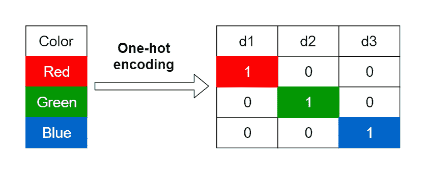

(图片由作者提供，用 draw.io 制作)

您经常会在数据集中找到分类变量。分类变量的值有有限数量的类别或标签。例如， ***性别*** 是一个分类变量，可以取“男性”和“女性”为其值。

# 分类变量的类型

分类变量主要分为两种类型:

*   **有序分类变量:**这些分类变量的值遵循自然顺序。例如，在变量*中，其“小学”、“某学院”和“研究生学历”的值遵循一个顺序，即“研究生学历”是最高的学历，“小学”是最低的。*
*   ***名义分类变量:**这些分类变量的值 ***而非*** 遵循自然顺序。例如， ***性别*** 是一个名词性分类变量，其“男性”和“女性”的值不遵循顺序。*

# *什么是分类变量编码，我们为什么需要它？*

*分类变量通常有字符串值。许多机器学习算法不支持输入变量的字符串值。因此，我们需要用数字替换这些字符串值。这个过程被称为**分类变量编码**。*

# *编码类型*

*这里，我们将讨论两种不同类型的编码:*

*   *一键编码*
*   *虚拟编码*

*我们将从一次性编码开始。*

## *一键编码*

*在一次性编码中，我们创建一组新的虚拟(二进制)变量，它等于变量中类别的数量(k)。例如，假设我们有一个分类变量 ***Color*** ，它有三个类别，称为“红色”、“绿色”和“蓝色”，我们需要使用三个虚拟变量，使用一键编码对这个变量进行编码。虚拟(二进制)变量只取值 0 或 1 来表示排除或包含某个类别。*

*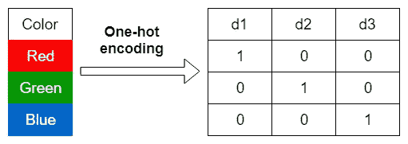*

*一键编码(图片由作者提供)*

*在独热编码中，*

*   *“红色”被编码为大小为 3 的[1 0 0]向量。*
*   *“绿色”被编码为大小为 3 的[0 1 0]向量。*
*   *“蓝色”被编码为大小为 3 的[0 0 1]矢量。*

## *虚拟编码*

*虚拟编码也使用虚拟(二进制)变量。哑元编码使用 k-1 个哑元变量，而不是创建与变量中类别数(k)相等的多个哑元变量。要使用哑编码对三个类别的相同 ***颜色*** 变量进行编码，我们只需要使用两个哑变量。*

*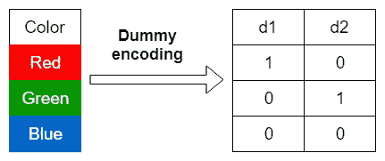*

*虚拟编码(图片由作者提供)*

*在虚拟编码中，*

*   *“红色”被编码为大小为 2 的[1 0]向量。*
*   *“绿色”被编码为大小为 2 的[0-1]向量。*
*   *“蓝色”被编码为大小为 2 的[0 0]向量。*

*虚拟编码消除了一次性编码中存在的重复类别。*

# *熊猫的实施*

*通过使用它的 **get_dummies** 函数，可以在 Pandas 中实现一位热编码和虚拟编码。*

```
*import pandas as pdpd.**get_dummies**(*data*, *prefix*, *dummy_na*,*columns*, *drop_first*)*
```

*   ****数据*** —这里我们指定需要编码的数据。它可以是 NumPy 数组、Pandas 系列或 DataFrame。*
*   ****前缀*** —如果我们指定一个前缀，它将添加到列名中，这样我们就可以很容易地识别列。前缀可以指定为单个列名的字符串。对于多个列名，它被定义为将列名映射到前缀的字典。有关更多详细信息，请参见下面的示例。*
*   ****dummy_na*** —如果为 False(默认)，则在对变量进行编码时忽略缺失值(nan)。如果为真，这将在单独的类别中返回缺失的数据。*
*   ****列*** —指定要编码的列名。如果无(默认)，将对 ***数据*** 参数中的所有分类列进行编码。如果将列名指定为列表，则只对指定的列进行编码。*
*   ****drop_first*** —这是最重要的参数。这需要一个布尔值，真或假。如果为 False(默认值)，将执行一键编码。如果为真，这将删除每个分类变量的第一个类别，为每个分类变量创建 k-1 个虚拟变量，并执行虚拟编码。*

*现在，我们使用 [***钻石***](https://www.kaggle.com/shivam2503/diamonds) 数据集(参见底部的源代码和许可证信息)来查看这两种类型的编码。*

```
*import pandas as pddf = pd.read_csv("diamonds.csv")
df.head()*
```

*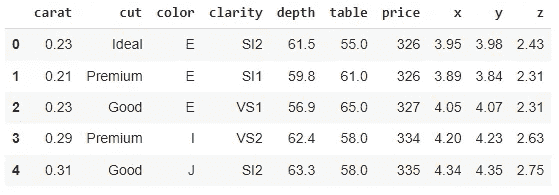*

*钻石数据集的前几行(图片由作者提供)*

```
*df.shape*
```

*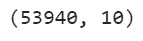*

*(图片由作者提供)*

*数据集包含 53，940 个实例和 10 个变量。*

*让我们看看数据集中是否有丢失的值。*

```
*df.isnull().sum().sum()*
```

*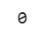*

*(图片由作者提供)*

*因为这会返回 0，所以数据集中没有丢失的值。*

*让我们看看数据集中有多少分类变量。*

```
*df.info()*
```

*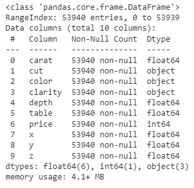*

*钻石数据集变量信息(图片由作者提供)*

*分类变量有 ***对象*** 或 ***类别*** 数据类型。因此，数据集中有 3 个分类变量。它们是**切割**、**颜色**和**净度**。*

*让我们看看**切割**变量的独特类别或标签。*

```
*df["cut"].unique()*
```

*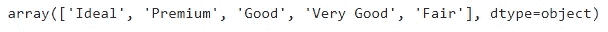*

***切割**变量的独特类别(图片由作者提供)*

*在**切割**变量中有 5 个独特的类别。为了对这个变量进行编码，我们需要在一键编码中创建 5 个伪变量，在伪编码中创建 4 个伪变量。*

*同样地，**颜色**和**清晰度**变量也有独特的类别。*

```
*df["color"].unique()*
```

*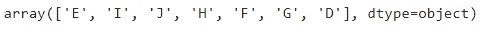*

***颜色**变量的独特类别(图片由作者提供)*

```
*df["clarity"].unique()*
```

*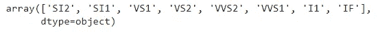*

***透明度**变量的独特类别(图片由作者提供)*

## *用 Pandas 实现一键编码*

*现在，我们单独对**颜色**变量应用一键编码，看看结果。*

```
*one_hot = pd.get_dummies(df["color"],
                         prefix="color",
                         **drop_first=False**)one_hot*
```

*这将返回编码数据的熊猫数据帧。让我们看看它的前几行。*

*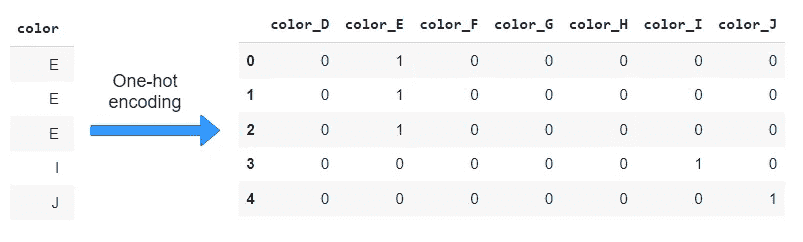*

*(图片由作者提供)*

*查看前缀参数中指定的文本是如何与**颜色**的类别名称组合在一起的。*

*现在，我们将**颜色**变量的一键编码添加到数据集中。*

```
*one_hot_df = pd.get_dummies(df, prefix="color", 
                            columns=["color"], 
                            **drop_first=False**)one_hot_df.head()*
```

*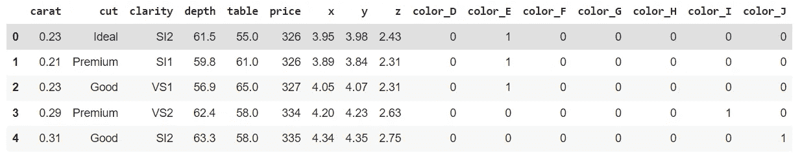*

*(图片由作者提供)*

*现在，我们对数据集中的所有分类变量应用一次性编码。*

```
*one_hot_df = pd.get_dummies(df, prefix={'color':'color',
                                        'cut':'cut',
                                        'clarity':'clarity'},
                            **drop_first=False**)*
```

*现在，我们看到了编码数据集的形状。*

```
*one_hot_df.shape*
```

*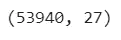*

*(图片由作者提供)*

*编码数据集有 27 个变量。这是因为在对分类变量进行编码时，一键编码增加了 20 个额外的虚拟变量。因此，一键编码扩展了数据集中的特征空间(维度)。*

## *用 Pandas 实现虚拟编码*

*要对数据实现虚拟编码，您可以遵循在一键编码中执行的相同步骤。唯一不同的是，你应该将 ***drop_first*** 参数设置为 True 而不是 False。*

```
*dummy_df = pd.get_dummies(df, prefix={'color':'color', 
                                      'cut':'cut',
                                      'clarity':'clarity'},
                          **drop_first=True**)*
```

*现在，我们看到了编码数据集的形状。*

```
*dummy_df.shape*
```

*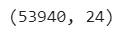*

*(图片由作者提供)*

*编码数据集有 24 个变量。这是因为哑编码在对分类变量进行编码时增加了 17 个额外的哑变量。因此，虚拟编码也扩展了数据集中的特征空间(维度)。*

# *用 Scikit-learn 实现*

*通过使用 Scikit-learn 的 **OneHotEncoder** 函数，可以在 Scikit-learn 中实现单热编码和伪编码。*

```
*from sklearn.preprocessing import OneHotEncoderohe = **OneHotEncoder**(*categories*, *drop*, *sparse*)encoded_data = ohe.fit_transform(original_data)
#Returns a NumPy array of encoded data*
```

*   ****类别*** —默认为**【自动】**自动确定每个变量中的类别。*
*   ****删除*** —默认为无，执行一键编码。要执行虚拟编码，将该参数设置为**‘first’**，这将删除每个变量的第一个类别。*
*   ****稀疏*** —设置为 False 以 NumPy 数组的形式返回输出。默认值为 True，这将返回一个稀疏矩阵。*

## *用 Scikit-learn 实现一键编码*

*这里，我们也使用相同的 ***钻石*** 数据集。我们对数据集中的所有分类变量应用一次性编码。*

```
*from sklearn.preprocessing import OneHotEncoderohe = OneHotEncoder(categories='auto', 
                    drop=None,sparse=False)ohe_df = pd.DataFrame(ohe.fit_transform(df)*
```

*现在，我们看到了编码数据集的形状。*

*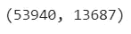*

*(图片由作者提供)*

*哦。什么？编码数据集有 13，687 个变量。这可能发生吗？是的，这是因为 Scikit-learn 的 **OneHotEncoder()** 函数也为数字变量创建了虚拟变量。为了避免这种情况，我们应该在调用它的 **fit_transform** 方法时只传递分类数据。*

```
*ohe_df = pd.DataFrame(ohe.fit_transform(df[['cut', 
                                            'color', 'clarity']]))*
```

*但是，这仅返回编码的分类数据，而不是包含数值变量的整个数据集。*

*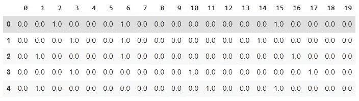*

*(图片由作者提供)*

## *用 Scikit-learn 实现虚拟编码*

*您可以简单地通过将 ***下降*** 参数指定为**‘第一’**来实现。*

```
*ohe = OneHotEncoder(categories='auto', 
                    drop='first',sparse=False)*
```

# *何时使用独热编码和虚拟编码*

*这两种类型的编码都可以用来编码序数和名义分类变量。然而，如果您严格地想要保持有序分类变量的自然顺序，您可以使用**标签编码**来代替我们上面讨论的两种编码。*

*假设我们有一个分类变量 ***质量*** ，有三个类别，称为“一般”、“良好”和“优质”。这些类别的自然顺序是:*

```
*Fair < Good < Premium => 0 < 1 < 2*
```

*我们可以这样编码。*

*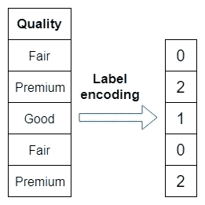*

*标签编码(图片由作者提供)*

*标签编码的一个优点是，它根本不扩展特征空间，因为我们只是用数字替换类别名称。这里，我们不使用虚拟变量。*

*标签编码的主要缺点是机器学习算法可能会认为编码类别之间可能存在关系。例如，某个算法可能会将 Premium (2)解释为 Good (1)的两倍。实际上，类别之间没有这种关系。*

*为了避免这种情况，标签编码应该只应用于目标(y)值，而不是输入(X)值。*

*可以通过使用 Scikit-learn 的 **LabelEncoder** 函数来应用标签编码。现在，我们将它应用于钻石数据集中的****切割**变量。这仅用于说明目的，因为我们不使用标签编码来编码输入(X)值。***

```
***from sklearn.preprocessing import LabelEncoderdf['cut_enc'] = LabelEncoder().fit_transform(df['cut'])
df.head(10)***
```

***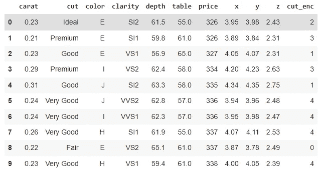***

***(图片由作者提供)***

***右边添加了新的编码数据列(cut_enc)。我们现在可以移除**切割**变量。***

# ***Pandas get_dummies()函数相对于 Scikit-learn onehotencode()函数的优势***

*   *****get_dummies()** 函数返回带有变量名的编码数据。我们还可以在每个分类变量名称中为虚拟变量添加前缀。***
*   *****get_dummies()** 函数返回包含数字变量的整个数据集。***

# ***伪编码相对于一位热码编码的优势***

*   ***两者都通过添加虚拟变量来扩展数据集中的特征空间(维度)。然而，哑元编码比一位热码编码添加更少的哑元变量。***
*   ***虚拟编码删除了每个分类变量中的重复类别。这避免了虚拟变量陷阱。***

***今天的帖子到此结束。***

***如果您有任何反馈，请告诉我。***

***同时，你可以 [**注册成为会员**](https://rukshanpramoditha.medium.com/membership) 来获得我写的每一个故事，我会收到你的一部分会员费。***

***非常感谢你一直以来的支持！下一个故事再见。祝大家学习愉快！***

*****钻石数据集来源:*****

******钻石*** 数据集可在[https://www.kaggle.com/shivam2503/diamonds](https://www.kaggle.com/shivam2503/diamonds)下载***

*****钻石数据集许可证:*****

******钻石*** 数据集由公共领域许可证授权，如[此处](https://www.kaggle.com/general/116302)所定义。这意味着数据集已经捐赠给公众。***

***[鲁克山普拉莫迪塔](https://medium.com/u/f90a3bb1d400?source=post_page-----6d5b9c46e2db--------------------------------)
**2021–12–16*****