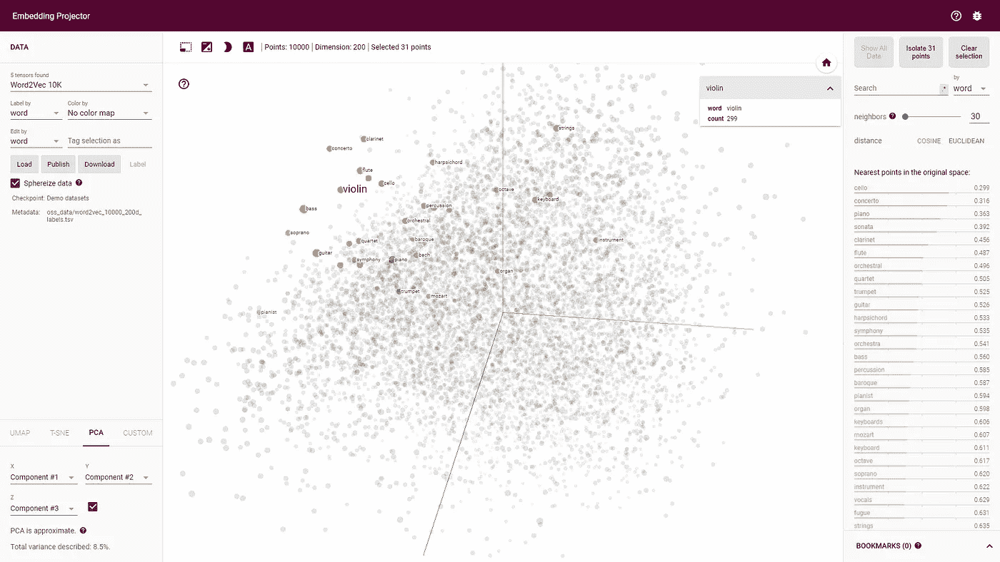
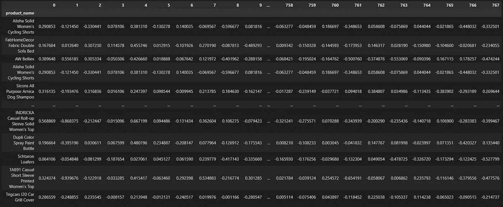
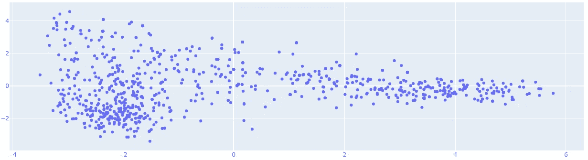
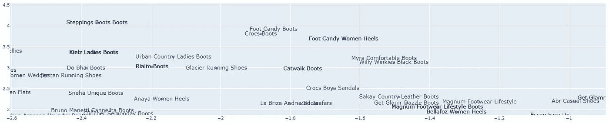

# 用转换器编码数据

> 原文：<https://towardsdatascience.com/encoding-data-with-transformers-d14445e96ead?source=collection_archive---------11----------------------->

## 相关事件

## 如何使用基于转换器的技术来执行数据编码

数据编码是人工智能领域最新的技术进步之一。通过使用编码器模型，我们可以将分类数据转换为数字数据，这使我们能够进行比较，了解数据之间的关系，提出建议，改进搜索…

在这篇文章中，我将解释如何通过使用安装在 [RelevanceAI](https://relevance.ai/) 库中的一个模型，将一组文章(文本数据)转换成向量(数字数据)。

如果您希望使用 API，可以遵循一个快速入门指南，使用基于向量的技术对数据集执行第一次语义搜索。

## 什么是编码

编码意味着我们将分类数据转换成数字数据。有非常基本的编码类型，例如，one_hot 编码或基于索引的编码。然而，当我们处理文本数据时，最高级的编码形式可以使用嵌入来完成。

嵌入能够扫描单词集，并将每个单词放入多维空间，本质上是将每个单词转换成一个向量。一旦模型被训练，语料库中的每个单词都被适当地放置到具有相似含义的单词附近的数学空间中。

您可以使用[谷歌的嵌入投影仪](https://projector.tensorflow.org/)来体验嵌入的乐趣:



Tensorflow 嵌入式投影仪，检索自:【https://projector.tensorflow.org/ 

这项技术对现在搜索的工作方式产生了巨大的影响，在搜索引擎、推荐系统和计算机视觉中找到了大多数应用。

## 有多少编码器？

直到几年前，最流行的文本编码器是 word2vec。由于有几种模型，你可以将每个单词转换成空间中相应的向量。然而，这被称为静态嵌入，这意味着向量永远不会改变:该模型是一个字一个字地编码，而忽略了句子的上下文:我们可以做得更好！

这个问题的答案现在以变形金刚模型的形式出现了。这些编码器使用[动态嵌入](https://www.youtube.com/watch?v=2uQ6bgemuLw&t=87s):根据周围的单词，每个单词可以有不同的向量。

可以想象，这比使用静态嵌入要精确得多:RelevanceAI 致力于使用同样的技术。

## 用几行代码编码数据

要对文本数据进行编码，您唯一需要做的就是下载 vectorhub 库，该库托管相关的编码器:

```
#encode on local
from vectorhub.encoders.text.sentence_transformers import SentenceTransformer2Vec
model = SentenceTransformer2Vec("bert-base-uncased")df_json = model.encode_documents(documents=df_json, fields=['raw'])
df_json
```

# 编码大数据

因为尝试使用更大的数据集总是有用的，所以您可以通过 relevance API 使用我们的数据集。让我们尝试编码一个数据集，我们将在后面的文章中使用它来上传到您的相关工作空间，并尝试几种方法:

## 1.安装 relevanceai 和 vectorhub

第一步是在你的笔记本上安装 relevanceai。安装非常简单，因为它使用 pip。

```
!pip install vectorhub[encoders-text-sentence-transformers]
!pip install -U relevanceaiimport relevanceai
print(relevanceai.__version__)
#restart notebook if you are updating the API rather than just installing it for the first timeOutput:
0.12.17
```

## 2.加载数据集

RelevanceAI 允许您下载几个可能的样本数据集。在这种情况下，我将使用约有 20.000 个样本的 **flipkart 数据集**。要下载它，只需使用以下代码:

```
from relevanceai import datasetsjson_files = datasets.get_flipkart_dataset()
json_files
```

## 3.数据集架构

上传过程结束后，现在让我们检查数据集的模式:我们可以看到它的所有字段。到目前为止，还没有任何字段被编码。

```
{'_id': 0,
  'product_name': "Alisha Solid Women's Cycling Shorts",
  'description': "Key Features of Alisha Solid...",
  'retail_price': 999.0},
 {'_id': 1,
  'product_name': 'FabHomeDecor Fabric Double Sofa Bed',
  'description': "FabHomeDecor Fabric Double ...",
  'retail_price': 32157.0},
 {'_id': 2,
  'product_name': 'AW Bellies',
  'description': 'Key Features of AW Bellies Sandals...',
  'retail_price': 999.0},
 {'_id': 3,
  'product_name': "Alisha Solid Women's Cycling Shorts",
  'description': "Key Features of Alisha Solid Women's Cycling...",
  'retail_price': 699.0},
```

## 4.执行编码

要开始在本地执行文本数据的编码，您可以通过 vectorhub 库轻松访问我们的一些 transformers 模型。执行编码非常简单，您只需要传入指定您希望编码的字段的 **json_files** 数据:

```
#encode on local
from vectorhub.encoders.text.sentence_transformers import SentenceTransformer2Vec
model = SentenceTransformer2Vec("bert-base-uncased")df_json = model.encode_documents(documents=json_files[0:1000], fields=['product_name'])
df_json
```

我将只编码前 1000 个样本，否则，编码器可能会运行一段时间。大约一分钟后，输出如下:如您所见，字典中添加了一个包含向量的新字段。

```
Output:
[{'_id': 0,
  'product_name': "Alisha Solid Women's Cycling Shorts",
  'description': "Key Features of Alisha Solid Women's...",
  'retail_price': 999.0,
  'product_name_sentence_transformers_vector_': [0.29085323214530945,
   -0.12144982814788818,
   -0.33044129610061646,
   0.07810567319393158,
   0.3813101351261139,
   -0.13027772307395935,
```

## 5.为可视化准备数据

因为您还没有将数据集上传到 relevanceAI 中(我们将在下一篇文章中向您展示如何做到这一点)，所以您必须手动可视化您的数据。下面是一个示例代码，您可以使用它将输出字典转换成 pandas 数据帧。

```
import numpy as np
import pandas as pddf = pd.DataFrame(df_json)
df_vectors = pd.DataFrame(np.column_stack(list(zip(*df[['product_name_sentence_transformers_vector_']].values))))
df_vectors.index = df['product_name']
df_vectors
```



转换成熊猫数据帧的结果，图片由作者提供

## 6.可视化数据

因为数据由 768 列组成，为了可视化，您需要压缩它。您可以使用主成分分析轻松可视化您的数据。要知道，有很多更先进的技术来获得相同的结果，但这将足以快速浏览数据。

```
from sklearn.decomposition import PCA
import matplotlib.pyplot as pltpca = PCA(n_components=2, svd_solver='auto')
pca_result = pca.fit_transform(df_vectors.values)
#display(df)fig = plt.figure(figsize=(14, 8))
x = list(pca_result[:,0])
y = list(pca_result[:,1])
# x and y given as array_like objects
import plotly.express as px
fig = px.scatter(df, x=x, y=y, hover_name=df_vectors.index)
fig.update_traces(textfont_size=10)
fig.show()
```

精彩！所有这 1000 个样本都被放置在太空中，现在我们可以看到它们了。



1000 个产品的数据压缩，图片由作者提供

通过放大数据，我们可以了解每个产品与另一个产品的关系:



放大数据压缩，按作者显示文本和图像