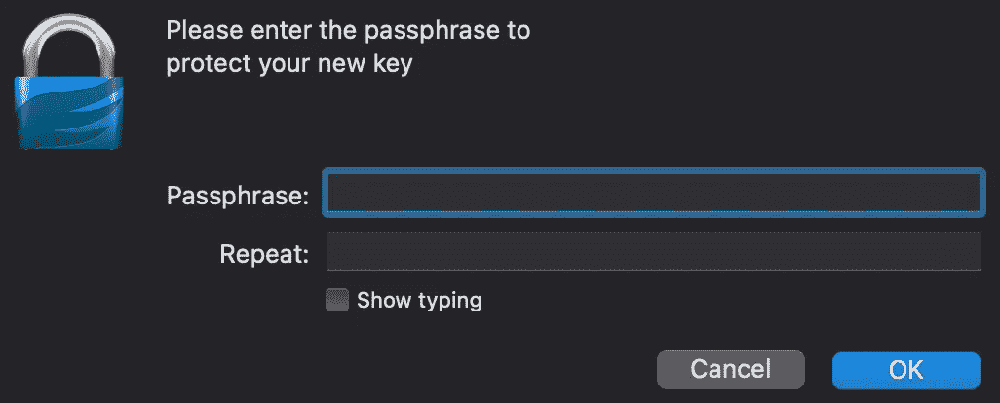

# 使用 GPG 轻松加密您的文件

> 原文：<https://towardsdatascience.com/encrypting-your-file-made-easy-with-gpg-4b9c147e854?source=collection_archive---------12----------------------->

## 学习软件工具

## 了解一个免费的个人加密开源工具


照片由[飞:D](https://unsplash.com/@flyd2069?utm_source=medium&utm_medium=referral) 在 [Unsplash](https://unsplash.com?utm_source=medium&utm_medium=referral) 上拍摄

Y 你有一个文件，你想在发送给你的朋友之前加密它，你会怎么做？有很多工具可以做到。下面是一个广为人知的 IT 友好工具， [Gnu 私人卫队(又名 GPG)](https://gnupg.org/) 。

*   它是开源的:[https://github.com/gpg/gnupg](https://github.com/gpg/gnupg)
*   可以免费下载:[https://gnupg.org/download/](https://gnupg.org/download/)
*   它使用非对称加密，即私钥对公钥

不错！使用它也很简单。

# 生成密钥对

下载后，第一步是生成您的密钥

```
gpg --generate-key
```

它将为您提供几个步骤来生成您的密钥，只需您的姓名、电子邮件和 ok，如下面的粗体所示。

```
Real name: **My Name**
Email address: **myname@mail.com**
You selected this USER-ID:
    "My Name <myname@mail.com>"
Change (N)ame, (E)mail, or (O)kay/(Q)uit? **O**
```

之后，它会问你需要记住的最重要的事情，你的秘密短语。



一旦您输入您的机密短语，它将显示在下面。

```
pub   rsa3072 2021-04-27 [SC] [expires: 2023-04-27]
      C0419C440EF637AD9D39A89137BF9320BC0410A4
uid                      My Name <myname@mail.com>
sub   rsa3072 2021-04-27 [E] [expires: 2023-04-27]
```

恭喜你。您已经生成了密钥对(公钥和私钥)。

为了识别您的密钥，我在这里称之为`**<key-id>**`,您可以使用

*   名字
*   电子邮件
*   或者生成的数字的最后 8 位数字，即`BC0410A4`。这个我也叫`**<digit-key-id>**`

> 如果您想对密钥生成有更多的控制，请使用`gpg --full-generate-key`

# 验证您的密钥是否已创建

要验证您的密钥是否已创建，只需键入

```
gpg -k
```

您将能够看到您的密钥已创建

> 要删除，只需输入`gpg --delete-key **<key-id>**`。如果您的密钥对既有私钥又有公钥，您首先需要`--delete-secret-key`。

# 将您的公钥发送给您的朋友

有两种方法发送给你的朋友

## 手动导出

手动方式是导出并发送给你的朋友

```
// Binary based
gpg --export **<key-id>** > mypublickey.pgp// OR// ASCII based
gpg --export --armor **<key-id>** > mypublickey.asc
```

然后把文件发给你的朋友。然后他们可以使用导入到他们的 gpg

```
// Binary based
gpg --import mypublickey.pgp// OR// ASCII based
gpg --import mypublickey.asc
```

## 发送到密钥服务器

您可以使用将您的公钥上传到服务器

```
gpg --keyserver **<key-server>** --send-keys **<digit-key-id>**
```

密钥服务器的一个例子是`hkp://pool.sks-keyservers.net`

然后你的朋友可以使用

```
gpg --keyserver **<key-server>** --recv-keys **<digit-key-id>**
```

成功后，您的朋友可以看到信息

```
gpg: key **<8-digi-key-id>**: "**<name>** **<mail>**" not changed
gpg: Total number processed: 1
gpg:              unchanged: 1
```

您的朋友也可以使用`gpg -k`命令来检查密钥。

> 也可以使用下面的命令搜索一个键

```
gpg --keyserver **<key-server>** --search-keys **<key-id>**
```

> 将显示一个键列表，用户可以通过键入用空格分隔的数字来选择要导入的键，例如`1 3`表示选择第一个和第三个键。更多信息[点击这里](https://www.privex.io/articles/what-is-gpg)。

# 用公钥加密你的文件

现在你的朋友在发送文件之前可以先用下面的命令加密它。

```
gpg -r <key-id> -e file.ext
```

`file.ext`可以是二进制或 ASCII。

输出文件是`file.ext.gpg`。这是可以安全发送的加密文件。

> 提示:你也可以用多个公钥
> `gpg -r **<key-id-1>** -r **<key-id-2>** -e file.ext` 加密一个文件，这样它就可以被发送给多个接收者

# 用私钥解密文件

一旦您收到了`gpg`文件，您可以使用

```
gpg -d file.ext.gpg > **<filenameyoulike>**
```

在您解密之前，系统会提示您输入机密短语。

# 移动您的密钥集(私钥和公钥)

您可能知道，您密钥集存储在您的机器上。有时候，你必须改变你的机器。那么，如何将您的密钥集转移到另一台机器上呢？

您可以使用下面的命令

```
// Binary based
gpg --export-secret-key **<key-id>** > mysecretkey.pgp// OR// ASCII based
gpg --export-secret-key --armor **<key-id>** > mysecretkey.asc
```

在成功导出之前，它会提示您输入密码。

一旦完成，现在你可以将你的文件复制到另一台机器上并导入。

要导入密钥，请使用正常的导入步骤。对于导入，您也会被提示输入机密短语。因此，记住你的秘密短语是很重要的。

# GPG 的其他用途

除了加密文件，你还可以用 GPG 做很多其他的事情，例如

*   [加密邮件](https://www.techrepublic.com/article/how-to-install-and-use-gpg-suite-to-encrypt-email-with-apple-mail/)
*   [Github 访问加密](https://blog.usejournal.com/gpg-for-dummies-5bdde94fa36d)
*   [加密 Maven 库](https://medium.com/mobile-app-development-publication/upload-to-mavencentral-made-easy-for-android-library-30d2b83af0c7)

要获得更多的 gpg 命令，请点击查看[。](https://www.devdungeon.com/content/gpg-tutorial)

安全自由地享受加密！