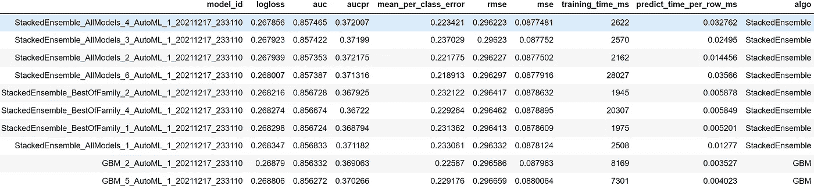

# H2O AutoML、MLflow、FastAPI 和 Streamlit 的端到端 AutoML 管道

> 原文：<https://towardsdatascience.com/end-to-end-automl-train-and-serve-with-h2o-mlflow-fastapi-and-streamlit-5d36eedfe606?source=collection_archive---------10----------------------->

## 关于使用一系列强大工具来培训和服务保险交叉销售的 AutoML 渠道的简单易懂的综合指南


[乔治·菲兹莫里斯](https://unsplash.com/@fitzmaug?utm_source=medium&utm_medium=referral)在 [Unsplash](https://unsplash.com?utm_source=medium&utm_medium=referral) 上拍照

传统的机器学习( **ML** )模型开发耗时、资源密集，需要高度的技术专业知识和多行代码。

随着自动化机器学习( **AutoML** )的出现，这一模型开发过程已经加速，允许数据科学家高效地生成高性能和可扩展的模型。

然而，除了模型开发，在一个生产就绪的 ML 系统中还有多个组件需要大量的工作。

在本综合指南中，我们将探讨如何使用 H2O AutoML、MLflow、FastAPI 和 Streamlit 的强大功能来建立、培训和服务一个 ML 系统。


ML 代码只是 ML 生产系统的一小部分

# 内容

> ***(1)***[*业务上下文*](#6194) ***(2)***[*工具概述*](#fb1d) ***(3)***[*分步实施*](#e6ac)

# *(1)商业背景*

***保险中的交叉销售**是推销与客户已有保单互补的产品的做法。*

*交叉销售创造了双赢局面，客户可以以较低的捆绑价格获得全面的保护。与此同时，保险公司可以通过提高保单转换来增加收入。*

*该项目旨在通过建立一个 ML 渠道来**识别有兴趣购买额外车辆保险的健康保险客户**，从而使交叉销售更加高效和有针对性。*

**

*[医学家](https://unsplash.com/@medienstuermer?utm_source=medium&utm_medium=referral)在 [Unsplash](https://unsplash.com?utm_source=medium&utm_medium=referral) 上拍摄的照片*

# *(2)工具概述*

## *H2O 汽车公司*

**

*在 [Apache 许可 2.0](https://github.com/h2oai/h2o-3/blob/master/LICENSE) 下使用的图像*

*[**H2O**](https://docs.h2o.ai/h2o/latest-stable/h2o-docs/welcome.html) 是一个开源的、分布式的、可扩展的平台，使用户能够在企业环境中轻松构建和生产 ML 模型。*

*H2O 的主要特色之一是 [**H2O 汽车**](https://docs.h2o.ai/h2o/latest-stable/h2o-docs/automl.html) ，这是一项自动化 ML 工作流程的服务，包括多个模型的自动训练和调整。*

*这种自动化允许团队关注其他重要的组件，例如数据预处理、特征工程和模型部署。*

## *MLflow*

**

*在 [Apache 2.0 许可下使用的图像](https://github.com/mlflow/mlflow/blob/master/LICENSE.txt)*

*[**MLflow**](https://mlflow.org/) 是一个管理 ML 生命周期的开源平台，包括实验、部署和中央模型注册中心的创建。*

*[**ML flow Tracking**](https://www.mlflow.org/docs/latest/tracking.html)[组件](https://www.mlflow.org/docs/latest/concepts.html)是一个 API，它**记录并加载**ML 模型实验的参数、代码版本和工件。*

*MLflow 还附带了一个[***mlflow . H2O***](https://www.mlflow.org/docs/latest/python_api/mlflow.h2o.html)API 模块，该模块集成了 H2O AutoML 运行与 ml flow 跟踪。*

## *FastAPI*

**

*根据[麻省理工学院许可](https://github.com/tiangolo/fastapi/blob/master/LICENSE)使用图像*

*[**FastAPI**](https://fastapi.tiangolo.com/) 是一个快速高效的 web 框架，用于在 Python 中构建 API。它的设计是用户友好的、直观的和生产就绪的。*

*将我们的 ML 模型部署为 FastAPI 端点的目的是在将我们的测试数据解析到 API 中之后，能够容易地检索预测结果。*

## *细流*

**

*在[品牌条款下使用的图像](https://streamlit.io/brand)*

*[**Streamlit**](https://streamlit.io/) 是一个开源的应用框架，可以在几分钟内将数据脚本转化为可共享的 web 应用。它有助于为技术和非技术用户创建用户友好的前端界面。*

*用户界面允许我们通过 FastAPI 端点将数据上传到后端管道，然后点击鼠标下载预测。*

## ***虚拟环境设置***

*我们首先使用 [*venv* 模块](https://docs.python.org/3/library/venv.html#creating-virtual-environments)创建一个 Python 虚拟环境(参见下面的设置截图)。*

*激活虚拟环境后，我们根据 [*需求，用`pip install -r requirements.txt`安装必要的包。*](https://github.com/kennethleungty/End-to-End-AutoML-Insurance/blob/main/requirements.txt)*

**

*虚拟环境的设置(命名为 *env_automl* ) |图片作者*

# *(3)分步实施*

***这个项目的 GitHub repo 可以在** [**这里**](https://github.com/kennethleungty/End-to-End-AutoML-Insurance) 找到，在这里可以找到跟随的代码。*

# *㈠数据获取和勘探*

*我们将使用[健康保险交叉销售预测](https://www.kaggle.com/anmolkumar/health-insurance-cross-sell-prediction)数据，我们可以通过 Kaggle API 检索这些数据。*

*要使用 API，请转到“帐户”选项卡(*kaggle.com/<用户名>/帐户*)，然后选择“**创建 API 令牌**”。这个动作触发下载包含您的 API 凭证的 *kaggle.json* 文件。*

**

*我们使用 [*opendatasets*](https://github.com/JovianML/opendatasets) 包(与`pip install opendatasets`一起安装)和凭证来检索原始数据:*

*数据集包含 12 个**特征**，描述 38 万+ **健康保险投保人**的概况。所有的数据都被匿名化和数字化，以确保隐私和保密性。*

***目标**变量是 ***响应*** ，客户购买额外车辆保险的**兴趣**的二元度量(其中 **1** 表示正兴趣)。*

*其他变量如下:*

*   ***id:** 每个客户的唯一标识符*
*   ***性别:**客户性别*
*   ***年龄:**客户年龄(岁)*
*   ***驾驶执照:**客户是否持有驾驶执照(1)*
*   ***Region_Code:** 客户所在地区的唯一代码*
*   ***以前投保:**客户是否已经投保车辆保险(1)*
*   ***车龄:**客户车辆的车龄*
*   ***车辆损坏:**客户的车辆在过去(1)是否损坏*
*   ***年度 _ 保费:**客户一年支付的保费总额*
*   ***保单销售渠道:**保险代理人联系客户的渠道的匿名代码，例如电话、面谈*
*   ***年份:**客户在保险公司工作的天数*

# *(二)数据预处理*

*数据预处理和特征工程是任何数据科学项目的关键步骤。以下是所采取步骤的摘要:*

*   ***标签编码*性别*变量的**(*1 =女性，0 =男性*)*
*   ***分类变量的一键编码***
*   ***为更清晰起见，重命名一键编码变量的***
*   ***数值变量的最小-最大缩放比例***

**因为重点是展示端到端管道的设置，所以执行的转换没有尽可能广泛。在现实世界中，作为以数据为中心的方法的一部分，这一步值得深入研究。**

# *㈢H2O 和物流设置*

*在对处理过的数据集开始模型训练之前，我们首先初始化一个 **H2O 实例**和一个 **MLflow 客户端**。*

## ***H2O 初始化***

*一个 H2O 实例的初始化可以用`h2o.init()`来完成，之后它将在`127.0.0.1:54321`连接一个本地 H2O 服务器。*

*H2O 连接成功后，将显示以下打印输出。*

**

*成功连接到 H2O 本地服务器后的输出|图片作者*

## *MLflow 初始化*

*MLflow 用`client = MlflowClient()`初始化，这创建了一个管理我们的实验运行的 [MLflow 跟踪服务器](https://www.mlflow.org/docs/latest/python_api/mlflow.tracking.html)客户端。*

*一个 MLflow 实验可以包含多个 ML 训练运行，所以我们从**创建和设置**我们的第一个实验(`automl-insurance`)开始。默认情况下，日志记录在本地的`/mlruns`子文件夹中。*

**

*MLflow 实验设置的打印输出|作者提供的图片*

*MLflow 有一个**用户界面**用于浏览我们的 ML 实验。我们可以通过在命令提示符下(从项目目录中)运行`mlflow ui`，然后访问本地主机 URL `127.0.0.1:5000`来访问该界面。*

**

*按作者初始化 MLflow 跟踪 UI |图像的命令*

**

*MLflow 实验跟踪的用户界面|作者图片*

*除了本地文件存储之外，还有各种[后端](https://mlflow.org/docs/latest/tracking.html#backend-stores)和[工件](https://mlflow.org/docs/latest/tracking.html#artifact-stores)存储配置，用于将运行[记录](https://www.mlflow.org/docs/latest/tracking.html#how-runs-and-artifacts-are-recorded)到 SQLAlchemy 兼容数据库或远程跟踪服务器。*

# *(四)H2O 汽车公司的物流跟踪培训*

*将我们的数据作为 H2O 数据框导入，定义目标和预测特征，并将目标变量设置为分类变量(用于**二元分类**)后，我们可以开始模型训练设置。*

*H2O [AutoML](https://docs.h2o.ai/h2o/latest-stable/h2o-docs/automl.html) 提供了一个包装器函数`H2OAutoML()`，它自动执行各种 ML 算法的训练。*

*当我们初始化一个 AutoML 实例(`aml = H2OAutoML()`)时，我们使用`mlflow.start_run()`将它包装在一个 MLflow 上下文管理器中，以便将模型记录在一个活动的 MLflow 运行中。*

*以下是对 AutoML 实例参数的解释:*

*   *`**max_models**` —在自动运行中构建的模型的最大数量*
*   *`**seed**` —再现性随机种子*
*   *`**balance_classes**` —指示是否对少数类进行过采样以平衡类分布。*
*   *`**sort_metric**` —指定用于在 AutoML 运行结束时对排行榜进行排序的指标*
*   *`**verbosity**` —培训期间要打印的后端消息类型*
*   *`**exclude_algos**` —指定建模时要跳过的算法(*我排除了* [*GLM*](https://docs.h2o.ai/h2o/latest-stable/h2o-docs/data-science/glm.html) *和*[*DRF*](https://docs.h2o.ai/h2o/latest-stable/h2o-docs/data-science/drf.html)*以便重点放在*[*GBM*](https://docs.h2o.ai/h2o/latest-stable/h2o-docs/data-science/gbm.html)*算法)**

***然后，我们可以用一行代码启动 AutoML 培训**:*

**考虑在*[*Google Colab*](https://colab.research.google.com/)*

# *(五)记录最佳 AutoML 模型*

*训练完成后，我们会获得一个显示候选型号列表的**排行榜**。该表根据前面指定的`sort_metric`性能指标(**日志损失**)进行排序。*

**

*排行榜中的 10 大算法|作者图片*

*排行榜显示，基于对数损失值(0.267856)，堆叠集合模型**' stacked ensemble _ all models _ 4 '**具有**最佳**性能。*

*H2O 的**堆叠集成**是一个监督的 ML 模型，它使用 [**堆叠**](https://www.geeksforgeeks.org/stacking-in-machine-learning/) 找到各种算法的最佳组合。算法的堆叠提供了比任何组成学习算法更好的预测性能。*

*接下来要做的是记录**最佳** AutoML 模型(又名 **AutoML leader** )。作为日志记录的一部分，我们还导入了`mlflow.h2o`模块。我们希望记录 AutoML 模型的三个方面:*

*   *指标(例如，对数损失、AUC)*
*   *模型工件*
*   *排行榜(保存为工件文件夹中的 CSV 文件)*

**您可以使用*[***train . py***](https://github.com/kennethleungty/End-to-End-AutoML-Insurance/blob/main/train.py)*脚本执行 AutoML 训练。这可以通过命令提示符下的* `python train.py — —target ‘Response'` *来完成。**

*H2O 还提供 [**模型可解释性**](http://docs.h2o.ai/h2o/latest-stable/h2o-docs/explain.html) 让你向技术和商业利益相关者解释模型的内部运作。*

# *㈥生成和评估预测*

*在多次运行一个实验(或不同的实验)后，我们希望选择最佳模型进行模型推断。*

*我们可以使用`mlflow.search_runs()`来寻找性能最好的模型，`mlflow.h2o.load_model()`来加载 H2O 模型，而`.predict()`来生成预测。*

*AutoML 模型与像**XGBoost with randomized search cv**这样的基线模型相比表现如何？以下是评估他们的预测后的结果:*

**

*两种模型的性能指标比较|图片由作者提供*

*AutoML 型号**略胜基准** **。这种更好的性能证明了 AutoML 能够快速、轻松地交付高性能模型。***

**请务必查看详细描述这两个模型的训练和预测的笔记本:**

*   *[*02 _ XGBoost _ Baseline _ model . ipynb*](https://github.com/kennethleungty/End-to-End-AutoML-Insurance/blob/main/notebooks/02_XGBoost_Baseline_Model.ipynb)*
*   *[*03 _ H2O _ AutoML _ with _ ml flow . ipynb*](https://github.com/kennethleungty/End-to-End-AutoML-Insurance/blob/main/notebooks/03_H2O_AutoML_with_MLflow.ipynb)*

# *FastAPI 设置*

*既然我们已经选择了我们的最佳模型，那么是时候将它部署为 FastAPI 端点了。我们的目标是创建一个**后端**服务器，在那里我们的模型被加载并通过 HTTP 请求进行实时预测。*

*在一个新的 Python 脚本`main.py`中，我们用`app = FastAPI()`创建了一个 FastAPI 实例，然后设置一个路径操作`@app.post("/predict")`来生成并返回预测。*

*我们还包括 H2O 和 MLflow 初始化的代码，以及来自 [**步骤 vi**](#e4f9) 的模型推断的代码。*

*[**步骤六**](#e4f9) 中的模型推理代码旨在从所有实验中检索最佳模型，但您可以更改 ID 参数，以便使用特定实验运行的模型。*

*路径操作符将接收测试数据作为一个**字节的**文件对象，所以我们使用`BytesIO`作为将数据转换成 [H2O 帧](https://docs.h2o.ai/h2o/latest-stable/h2o-py/docs/frame.html)的一部分。*

*最后，我们需要一个包含模型预测的 JSON 输出。可以使用来自`fastapi.responses`的`JSONResponse`将输出作为 JSON 文件返回。*

**你可以在*[***main . py***](https://github.com/kennethleungty/End-to-End-AutoML-Insurance/blob/main/backend/main.py)*脚本中找到完整的 FastAPI 代码。**

*最后一部分是通过运行*uvi corn*服务器(从存储脚本的`backend`子目录中)来激活我们的 FastAPI 端点，方法是使用以下命令:*

```
*uvicorn main:app --host 0.0.0.0 --port 8000*
```

**

*运行 uvicorn 服务器启动 FastAPI | Image by author 的命令行*

*FastAPI 端点将在本地机器上提供服务，我们可以在`127.0.0.1:8000/docs`(或`localhost:8000/docs`)访问 API 接口*

**

*浏览器中的 FastAPI 用户界面|作者图片*

*我们看到我们的`/predict`路径操作符出现在 FastAPI 接口的 */docs* 页面上，表明 API 已经准备好通过 POST 请求接收数据。*

*当我们点击 POST 部分时，我们看到 API 已经被正确设置为接收**二进制文件**，例如 CSV 文件。*

**

*FastAPI endpoint |作者图片的帖子部分*

*此时，我们已经可以通过使用 Jupyter 笔记本中的`requests`模块和几行 Python 代码来检索预测了。*

*然而，**让这个系统更上一层楼的一个好方法是建立一个带有**图形用户界面**的**网络应用**，用户只需点击几次鼠标**就可以上传数据和下载预测。*

# *(八)设置和构建 Streamlit 网络应用程序*

*Streamlit 提供了一个简单的框架来构建 web 应用，使数据团队能够随时展示他们的 ML 产品。*

*web 应用程序的目标是让用户上传数据文件，运行模型推理，然后将预测下载为 JSON 文件，所有这些都无需编写任何代码。*

*我们创建了一个新脚本`app.py`来存放以下关键组件的 Streamlit 代码:*

*   *用于选择 CSV 或 Excel 测试数据集文件的文件上传程序*
*   *将文件作为 Pandas 数据帧读取，并显示前五行(用于完整性检查)*
*   *将数据帧转换成一个**字节的**文件对象*
*   *显示一个'**开始预测'**按钮，点击该按钮，将通过`requests.post()`将 BytesIO 对象解析为 FastAPI 端点*
*   *完成模型推断后，会出现一个“**下载**”按钮，供用户将预测下载为 JSON 文件。*

*作为模型推理的一部分，我们还包括端点的定义— `[http://localhost:8000/predict](http://localhost:8000/predict.)`。*

**在 GitHub repo 中，可以在*[***app . py***](https://github.com/kennethleungty/End-to-End-AutoML-Insurance/blob/main/frontend/app.py)*脚本中找到完整的 Streamlit 代码。**

# *㈨初始化 FastAPI 和 Streamlit 服务器*

*到目前为止，FastAPI 和 Streamlit 函数的所有 Python 脚本都已经准备好了。接下来，我们在命令提示符下初始化两个服务器。*

*(1)如果您的*uvicon*服务器(用于 FastAPI)仍然从 [**步骤 vii**](#dcd1) 运行，您可以保持原样。否则，打开一个新的命令提示符，转到包含`main.py`脚本的`/backend`子目录，并输入:*

```
*uvicorn main:app --host 0.0.0.0 --port 8000*
```

*(2)打开**另一个单独的**命令提示符，用`streamlit run app.py`初始化 Streamlit 服务器(从包含脚本的`frontend`文件夹)*

**

*运行 start Streamlit server | Image by author 的命令行*

# *(x)运行预测并下载结果*

*随着 FastAPI 和 Streamlit 服务器的启动和运行，是时候通过前往`http://localhost:8501`访问我们的 Streamlit web 应用程序了。*

*下面这张 gif 图说明了 web app 从数据上传到预测下载的简单性。*

**注:用于演示预测的文件为*[***data/processed/test . CSV***](https://github.com/kennethleungty/End-to-End-AutoML-Insurance/tree/main/backend/data/processed)*

**

*Streamlit web 应用程序演示|作者图片*

*以下是 JSON 输出的快照，包含对每个客户的预测(1 或 0):*

**

*包含模型预测的 JSON 输出|作者图片*

# *(4)向前迈进*

*让我们回顾一下我们所做的事情。我们首先进行 **H2O AutoML** 培训和 **MLflow** 跟踪，开发各种 ML 模型。*

*然后，我们检索性能最佳的模型，并使用 **FastAPI** 将其部署为端点。最后，我们创建了一个 **Streamlit** web 应用程序来轻松上传测试集数据和下载模型预测。*

*你可以在这里 找到项目 GitHub repo [**。**](https://github.com/kennethleungty/End-to-End-AutoML-Insurance)*

*虽然到目前为止，在成功构建我们的端到端 ML 管道方面已经做了大量的工作，但是我们还需要几个步骤来完成整个画面。这些任务包括:*

*   *将整个 ML 应用程序和部署放在云上的**docking***
*   *Docker 中的管道**编排**(如气流、Kedro)*

*下面是这篇文章的续集，我们使用 Docker 来封装整个管道:*

*[](/how-to-dockerize-machine-learning-applications-built-with-h2o-mlflow-fastapi-and-streamlit-a56221035eb5) [## 如何对接用 H2O、MLflow、FastAPI 和 Streamlit 构建的机器学习应用

### 用 Docker 容器化多服务 ML 应用的简单指南

towardsdatascience.com](/how-to-dockerize-machine-learning-applications-built-with-h2o-mlflow-fastapi-and-streamlit-a56221035eb5)* 

# *在你走之前*

*欢迎您加入我们的数据科学学习之旅！关注我的 [Medium](https://kennethleungty.medium.com/) 页面和 [GitHub](https://github.com/kennethleungty) 了解更多精彩的数据科学内容。同时，享受构建端到端 AutoML 解决方案的乐趣！*

*[](/key-learning-points-from-mlops-specialization-course-2-13af51e22d90) [## MLOps 专业化认证的关键学习点—课程 2

### 面向生产的机器学习工程(MLOps)课程概述

towardsdatascience.com](/key-learning-points-from-mlops-specialization-course-2-13af51e22d90) [](/autoxgb-for-financial-fraud-detection-f88f30d4734a) [## 利用 AutoXGB 进行金融欺诈检测

### AutoXGB 与标准 XGBoost 在检测欺诈性信用卡交易方面的对比

towardsdatascience.com](/autoxgb-for-financial-fraud-detection-f88f30d4734a) [](https://kennethleungty.medium.com/membership) [## 通过我的推荐链接加入媒体-梁建华

### 作为一个媒体会员，你的会员费的一部分会给你阅读的作家，你可以完全接触到每一个故事…

kennethleungty.medium.com](https://kennethleungty.medium.com/membership)*