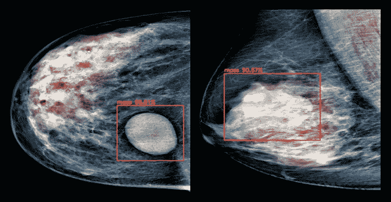
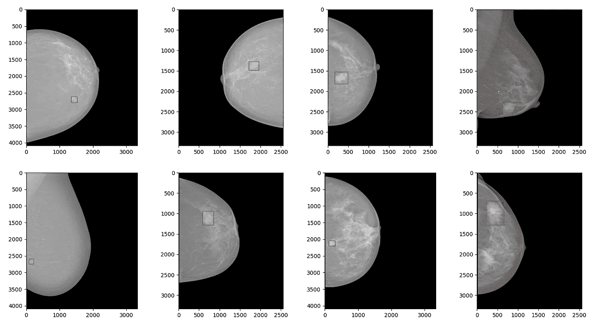
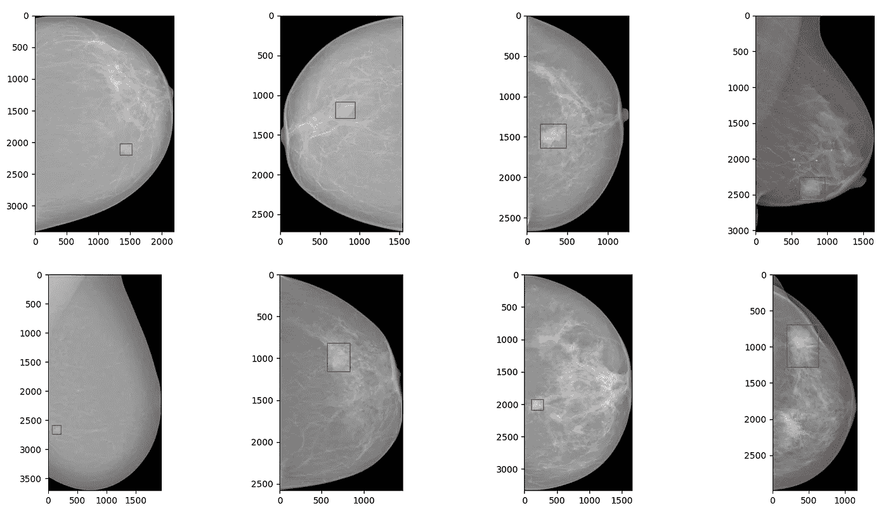
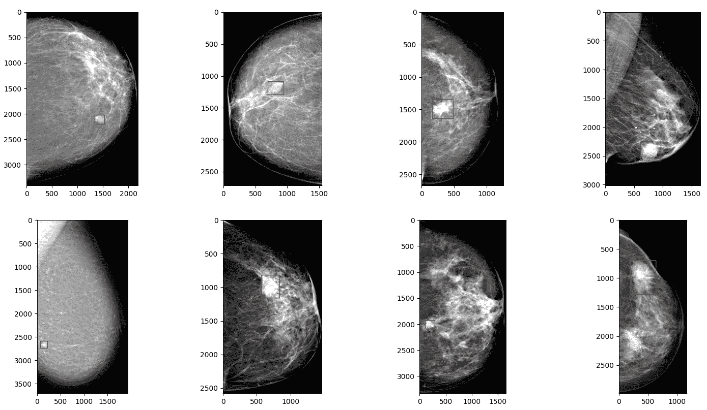
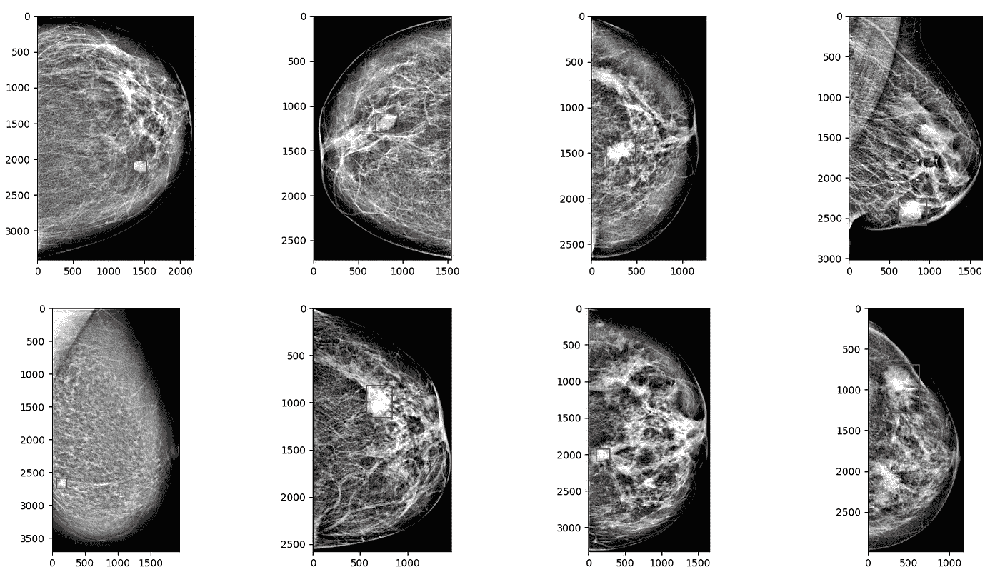
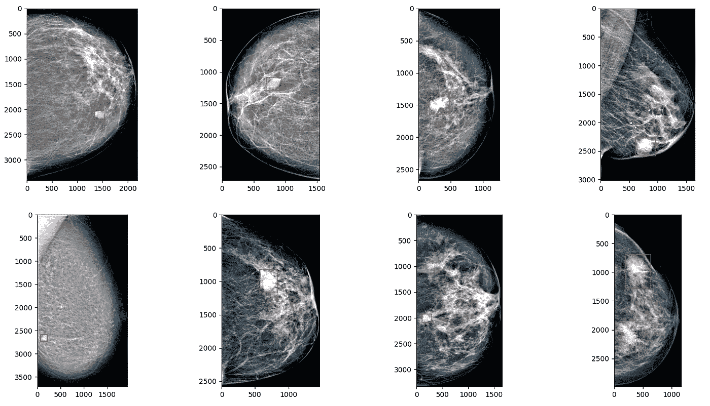
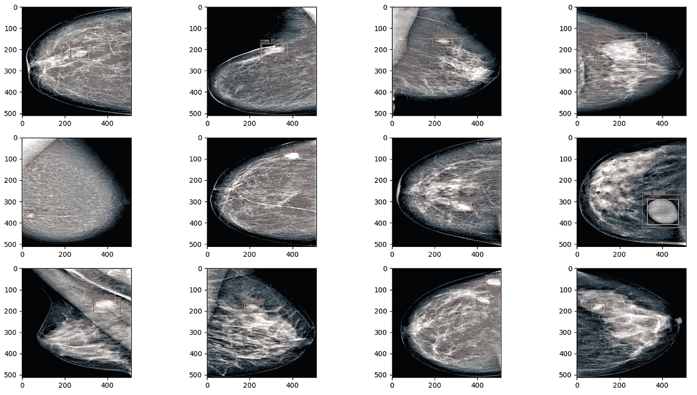
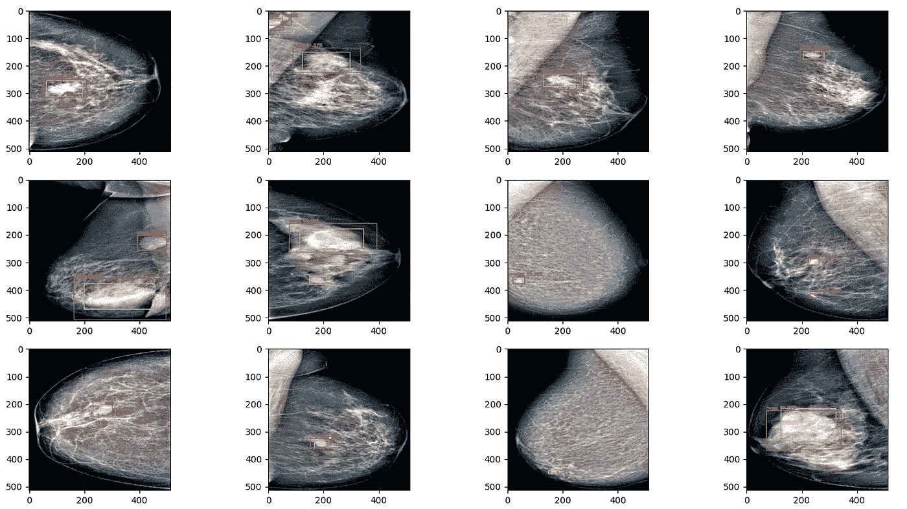

# 使用 Python 进行端到端乳腺癌检测—第 1 部分

> 原文：<https://towardsdatascience.com/end-to-end-breast-cancer-detection-in-python-part-1-13a1695d455?source=collection_archive---------13----------------------->

## 第 1 部分:用 YOLOv4 检测乳腺肿块



来自已实现框架的检测。图片作者。

根据[cancer.org 的说法，](https://www.cancer.org/cancer/breast-cancer/about/how-common-is-breast-cancer.html)乳腺癌是美国女性最常见的癌症。在美国，女性患乳腺癌的几率是八分之一。在这一系列文章中，我们将展示如何应用深度学习和图像处理来检测恶性乳腺肿块。我们将首先关注检测乳腺肿块(第 1 部分)，然后我们将对其进行分割(第 2 部分)，最后我们将对肿块进行良性或恶性分类(第 3 部分)。

# 数据描述

存在两种类型的乳房 x 线照相术:*胶片屏*和最近的*全视场数字乳房 x 线照相术*。在本文中，我使用了广播数据集中的[。它包含 115 个病例，共 410 张 DICOM 格式的*全视场数字乳腺摄影**。*数据库中记录了四种不同类型的乳腺疾病，包括肿块、钙化、不对称和扭曲。仅选择肿块病变，得到 106 幅图像。每幅图像都配有由专家以 XML 格式制作的精确轮廓。对于检测部分，由于我们不需要分割质量，轮廓被转换成包围盒。下面您可以找到将病灶的遮罩转换为 YOLO 格式注释的代码:](http://medicalresearch.inescporto.pt/breastresearch/index.php/Get_INbreast_Database)

下面显示了数据集中的一些样本以及相应生成的边界框:



为 INbreast 数据集生成的 bboxes 示例

# 图像处理

## 种植

正如我们所看到的，许多像素是背景像素，没有带来任何信息。为了避免*质量*像素的比例被低估，我们可以裁剪 ROI，即乳房区域。这可以通过 OpenCV 和 Otsu 的阈值技术来实现:



裁剪 ROI 后的结果。

然后，受[1]的启发，我应用了 3 个预处理步骤。这 3 个步骤包括:

*   截断归一化
*   图像增强
*   图像合成

## 截断归一化

即使在裁剪后，图像仍然由许多黑色像素组成。如果我们按原样对图像进行归一化，这可能会对检测产生负面影响(因为乳房区域会显得不那么强烈)。这里的目标是标准化乳房区域中像素的强度分布。可以参考原文看算法细节[1]。下面我提供了我的 python 实现:



乳房感兴趣区域像素截断和归一化后的结果。

## 图像增强

为了增强乳房区域以及肿块病变的对比度，应用了对比度受限的自适应直方图均衡化(CLAHE)算法，限幅 1 和 2:



应用 clip_limit=2 的 CLAHE 后的结果

## 图像合成

应用这三个步骤后，肿块病变变得更加清晰。这将提高 Yolov4 的准确性。在最后一步中，合成 3 通道图像，并由截断和归一化图像、具有限幅 1 的对比度增强图像和具有限幅 2 的对比度增强图像组成[1]。



图像增强管道的最终结果。

# 培训程序

YOLOv4 已用于对增强图像执行质量检测。与两阶段检测器相比，当需要上下文时，一阶段检测器特别有效。如[1]中所解释的，当背景独立于前景时，两阶段检测器是有用的，因为第一阶段提取 ROI。然而，Cao，H [1]提到，在乳腺肿块检测中，病变并不独立于乳腺区域，因此一级检测器可能更有效。为了正确评估算法的性能，我将数据集分成 3 部分:

*   训练集由 80%的图像组成
*   验证集由 10%的图像组成
*   测试集由 10%的图像组成

由于生成的训练集很小，已经应用了数据扩充(仅在训练集上)。每张图片都被随机旋转、翻转和移动放大了 8 倍。YOLO 负责其他增强，如镶嵌数据增强等；参见[2]。我使用与上述相同的程序进行了双重交叉验证。

# 结果

为了评估检测器，我使用了召回率和假阴性率(FNR)指标。请注意，在癌症检测中，具有非常低的 FNR 和高召回率非常重要(否则我们会错过潜在的癌症)。如果预测边界框和地面真值之间的并集上的交集(IOU)大于 0.25，则检测被认为是真阳性(TP)。此外，边界框只有在其置信度大于 0.25 时才会被考虑。在验证集和测试集上对结果进行了评估。

```
 Validation set evaluation
+--------+----+----+----+--------+------+
|        | TP | FP | FN | Recall | FNR  |
+--------+----+----+----+--------+------+
| Fold 1 | 10 |  3 |  1 |   0.91 | 0.07 |
| Fold 2 | 11 |  1 |  1 |   0.92 | 0.08 |
+--------+----+----+----+--------+------+ Test set evaluation
+--------+----+----+----+--------+------+
|        | TP | FP | FN | Recall | FNR  |
+--------+----+----+----+--------+------+
| Fold 1 | 12 |  1 |  0 |      1 |    0 |
| Fold 2 | 11 |  4 |  2 |   0.85 | 0.13 |
+--------+----+----+----+--------+------+
```

YOLOv4 在乳腺肿块检测中似乎非常高效。我在验证和测试集上实现了 **92%** 的平均召回率，这与文献中的最新结果一致(【1】实现了 **91.3%** 的召回率)。该模型似乎在 fold2 测试集中的小肿块病变上有点困难。我在 8GB 英伟达 RTX 2080 GPU 上训练 Yolov4。这迫使我将图像大小限制在 512x512。拥有更多的资源和数据可以让我们在更强大的模型上训练算法，如最先进的 YOLOv4-P7 和更高分辨率的图像。这将提高小质量区域的精度。以下是两次折叠期间测试集的结果(看不见的图像):



我们的检测器应用于 fold-1 的不可见图像:100%召回。红色代表预测，黄色代表事实



我们的检测器应用于 fold-2 的不可见图像:85%的召回率。红色代表预测，黄色代表事实

# 结论

我们用 YOLOv4 用 python 训练了一个高精度的乳腺肿块检测器。这部分归功于有效的图像预处理步骤。结果真的很有希望，并且与文献中的结果相似。在接下来的文章中，我们将看到如何分割质量。已经具有能够裁剪质量的检测器将有助于仅在质量区域上训练分割模型。然后我们再对一个肿块是否恶性进行分类。敬请期待；)

*注意:我提供了在* [*我的 github*](https://github.com/Guarouba/breast_mass_detection) *:)* 上为训练 YOLO 创建数据集和我的配置文件的脚本

# **参考文献**

*   [1]曹，H. (2020).基于无锚架构的数字乳腺摄影中乳腺肿块检测。 *ArXiv，abs/2009.00857* 。
*   [2]波奇科夫斯基，王，陈，廖，H. (2020).YOLOv4:物体检测的最佳速度和精确度。 *ArXiv，abs/2004.10934* 。
*   [3]安塔里·马，马斯尼·马，崔山，韩，金茨。一个完全集成的计算机辅助诊断系统，用于通过深度学习检测、分割和分类进行数字 X 射线乳房 x 光检查。国际医学信息学杂志。2018 年 9 月；117:44–54.DOI:10.1016/j . ijmedinf . 2018 . 06 . 003