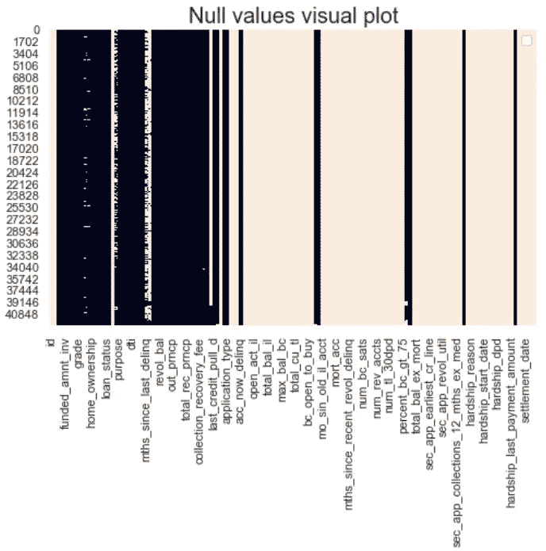
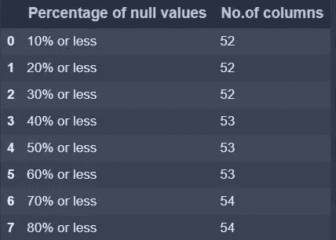
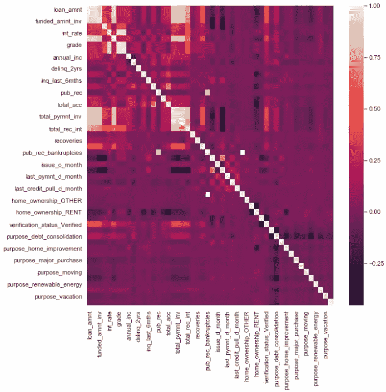
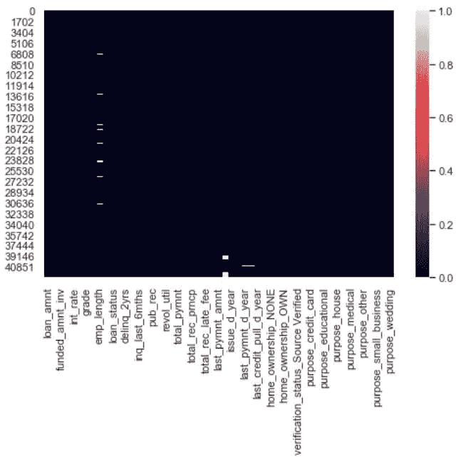
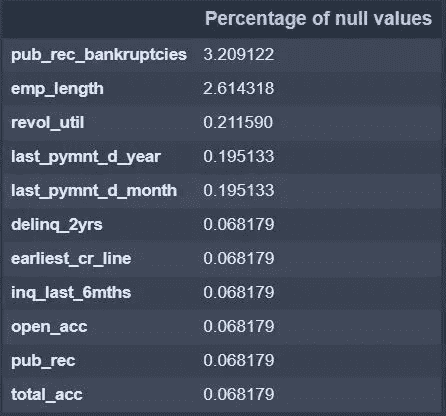
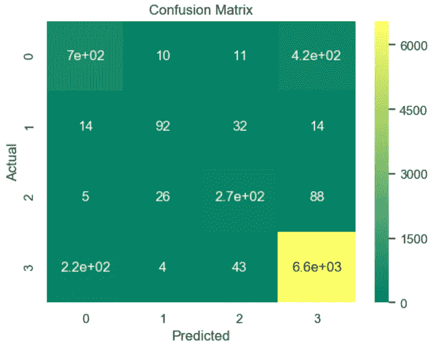
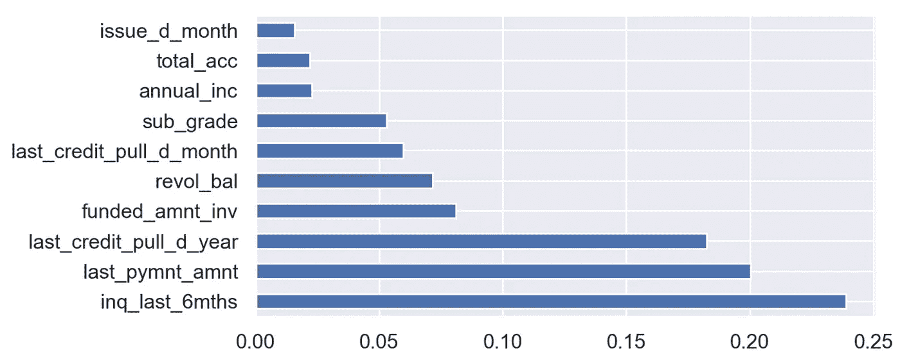

# 端到端案例研究(分类):Lending Club 数据

> 原文：<https://towardsdatascience.com/end-to-end-case-study-classification-lending-club-data-489f8a1b100a?source=collection_archive---------5----------------------->

Avinash Kumar 在 [Unsplash](https://unsplash.com?utm_source=medium&utm_medium=referral) 上拍摄的照片

**Lending Club** 是一个借贷平台，它以基于信用记录和其他因素的利率将**钱**借给有需要的人。在这篇博客中，我们将分析这些数据，并根据我们的需要对其进行预处理，并建立一个机器学习模型，该模型可以根据他/她与 Lending Club 的交易历史来识别潜在的违约者。你可以在这里 找到数据 [***。***](https://drive.google.com/drive/folders/1A74WpM8ayIfvzfrkFRFzFyBh27djL4YE?usp=sharing)

该数据集包含 42538 行和 144 列。在这 144 列中，大多数列的值为空。

事实上，总体数据中有 63.15%的值是空值。因此，小心处理这些空值非常重要，因为它们会显著影响我们的结果。

**空值可视化绘图:**

**处理空值:**

处理空值是这里的一项重要任务。在下面的代码中，您可以看到 144 列中只有 53 列的空值小于 40%。

表 1

在上表中，每行代表 144 列中空值少于特定百分比的列数。例如，行 1 表示有 52 列，每列中的空值不到 10%。

通过考虑空值少于 40%的列，我们能够将总列数从 144 减少到 53。

**了解特征**

理解特征/列很重要，因为数据中出现的一些分类列是以数值的形式出现的，反之亦然。我首先尝试检查每一列，但后来明白对所有 53 列执行这些操作会非常麻烦。因此，我决定首先删除那些不会给数据增加价值的列，然后分析每个字段。

检查对象:

丢弃不必要的对象:

检查数字列:

删除不必要的数字列:

在检查数据之后，我们已经删除了这 53 列中总共 18 列没有为我们的数据增加价值的数据。我们能够将列数从 53 列减少到 35 列，我们仍将努力减少列数。

**将分类列转换为数字列:**

我们已经将分类列转换为数字列，方法是根据它们表示的数据类型执行一键编码或标签编码。例如，对 *['home_ownership '，' verification_status '，' purpose ']【T1]列执行一个热编码，而对“grade”和“sub grade”列执行标签编码，因为它们本质上是序数。*

一个热门编码:

标签编码:

用标签编码值更新等级列:

**将日期时间列转换为数字列:**

列 *['issue_d '，' last_pymnt_d '，' last_credit_pull_d']* 是日期时间列，通过使用 pandas 日期时间模块进一步分为月和年。新列分别命名为*'发行日'，'发行日'，'发行日'，'最后一年'，'最后一年'，'最后一年'，'最后一年'，'最后一年'，'最后一年'，'最后一年'。*

**将对象转换为数字列:**

列 *int_rate* 和 *term* 被存储为对象。我们已经执行了必要的字符串操作，将它们转换成数字列。

**检查相关性:**现在我们已经将所有列转换为数字列，我们将检查相关性。

相关热图

有几列具有高相关性，但是在解决我们的问题时没有考虑这些列。例如，在尝试对贷款是否将由客户偿还进行分类时，我们不会考虑任何未来交易，如 *total_pymnt* 和 *total_pymnt_inv* 。因此，这里没有删除这些列。

**处理空值:**

让我们在显著清理列之后检查是否有空值。

空值图

正如我们所看到的，我们仍然可以在数据中找到一些空值。我们将检查这些空值并采取必要的措施。

让我们检查空值百分比最高的列。

空值的百分比

有些列的空值百分比非常小(不到 1%)。在那里，我们可以用各自列的中值替换空值。

对于空值百分比很高的列，我们将在非空值的基础上运行模型，并预测相应列中缺少的值。

由于没有空值，我们将进入下一步，即建立机器学习模型。

## 分类

我们分类任务的目标是确定客户(请求贷款的人)是否能够偿还贷款以及利息金额。因为我们有一些列包含贷款日期的未来交易信息(如贷款后每月支付贷款分期付款等。)，我们将它们从预处理的数据集中删除，以进行分类任务。

我们分类任务的目标是根据客户(请求贷款的客户)在获得贷款后与贷方的历史交易来确定其是否会违约。

让我们删除几个包含冲销贷款信息的列。
分类中删除的列:
*['total_pymnt '，' total_pymnt_inv '，' total_rec_prncp '，' total_rec_int '，' total_rec_late_fee '，' recoveries']*

“loan_status”列用作目标变量，根据记录对客户进行分类。“loan_status”列有 4 个唯一值，为了便于表示，所有值都用标签编码。该列的标签如下:

使用 VIF 检查要素之间的多重共线性，然后删除值高于阈值的列。

我们已经删除了具有高 VIF 因子(10 或以上)的列。

**模型建筑**

在对目标变量进行标签编码后，我们将数据以 70:30 的比例拆分为训练和测试数据。

我们使用了 sklearn 的 cross_val_score 和以得分为 f1 分的网格搜索 cv 来考察每个模型在每个折叠中的表现。下图显示了每个型号在 3 个折叠中的 F1 分数。橙色线代表每个模型的平均 F1 分数，而 IQR 代表这些分数的方差。

从上图我们可以说 **bagging 分类器**是最稳定的模型，加权 F1 得分的均值最高，方差最小。

使用 bagging 分类器建立模型。

装袋分级机的分类报告

该模型的准确率为 0.89，F1 平均得分为 0.75。

最终混淆矩阵:

Bagging 分类器模型的混淆矩阵

由于 bagging 分类器没有特征重要性选项，我们使用决策树来寻找特征重要性。

决策树模型的特征重要性

**结论**:

在这篇博客中，我们广泛地介绍了这些数据所需的预处理步骤，然后使用网格搜索和 KFolds 找到了最适合的模型。我希望这篇博客已经让你对解决分类问题有了一个总体的了解。更多详细代码，请参考[https://github.com/pawanreddy-u/lendingclub9](https://github.com/pawanreddy-u/lendingclub)