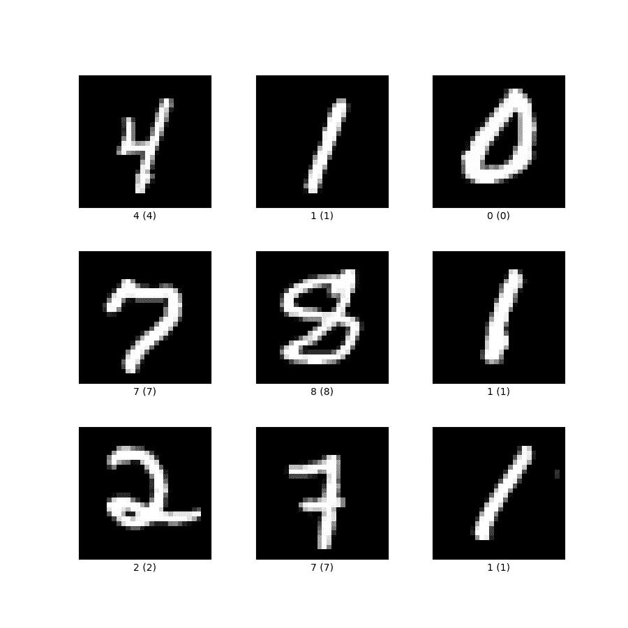
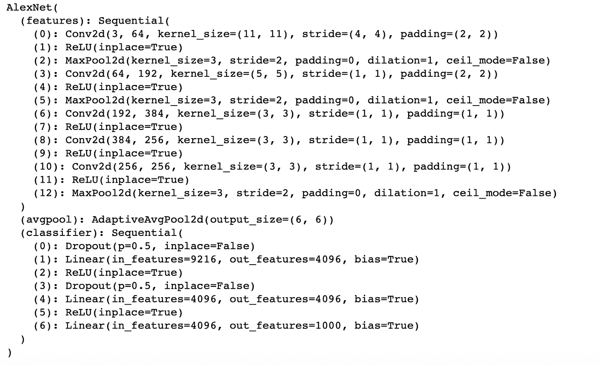

# 5 分钟内完成端到端计算机视觉管道

> 原文：<https://towardsdatascience.com/end-to-end-computer-vision-pipeline-in-5-minutes-e43e47a9c04a?source=collection_archive---------12----------------------->

## 如何使用 TorchVision 在不到 5 分钟的时间内编写一个完整的计算机视觉管道

编写一个完整而快速的计算机视觉管道，用于产品原型制作或作为构建更复杂系统的构件，正变得越来越重要。在这里，我们将讨论如何使用流行的 TorchVision 库在 5 分钟或更短的时间内做到这一点。


里卡多·安南达尔在 [Unsplash](https://unsplash.com?utm_source=medium&utm_medium=referral) 上拍摄的照片

# 目录

1.  做好准备
2.  数据集准备
3.  模型构建
4.  模型评估
5.  结论

# 做好准备

首先，您应该安装 PyTorch 和 TorchVision 库。建议您在*康达*虚拟环境中进行。

1.  进入 [PyTorch](https://pytorch.org/get-started/locally/) 安装页面，将写好的命令行复制粘贴到您的终端，例如:

```
conda install pytorch torchvision torchaudio -c pytorch
```

2.通过在终端中运行以下命令，确保安装已经完成。如果没有输出，那么你已经完成了这一部分！

```
python -c "import torch"
python -c "import torchvision"
```

# 数据集准备

对于本教程，我们将使用一个更受欢迎的数据集 **MNIST** (从 0 到 9 的数字图像集合)。



tensorflow.org MNIST 数据集(资料来源)

首先，我们将对数据集进行转换，以便它们能够很好地适应我们即将推出的 AlexNet 模型(即**将**输入图像调整为 224，**将**MNIST 图像转换为张量格式)。

```
import torch
from torchvision import datasets, transforms, models
from torch.autograd import Variabletransform = transforms.Compose(
    [
        transforms.Resize(224),
        transforms.ToTensor(),
    ])
```

然后，我们通过传递上面的 transform 对象来下载训练集和测试集。

```
mnist_trainset = datasets.MNIST(root='./data', train=True, download=True, transform=transform)mnist_testset = datasets.MNIST(root='./data', train=False, download=True, transform=transform)
```

其中*根*表示下载和存储数据的目录。

通过找出数据集的大小来检查您的下载是否完成。

```
len(mnist_trainset)
>>> 60000 len(mnist_testset)
>>> 10000
```

然后，我们需要创建用于批处理目的的 dataloader。

```
train_loader = torch.utils.data.DataLoader(mnist_trainset,
                                          batch_size=4,
                                          shuffle=True)test_loader = torch.utils.data.DataLoader(mnist_testset,
                                          batch_size=4,
                                          shuffle=True)
```

# 模型构建

初始化模型也很容易。为了便于讨论，我们将使用带有预训练权重的 [AlexNet](https://arxiv.org/abs/1404.5997) (您可以选择使用随机权重初始化模型，并使用上述基准数据集或使用您自己的预定义数据集重新训练它)。你可以在这里找到火炬视觉[支持的模型集合。](https://pytorch.org/vision/stable/models.html)

```
alexnet = models.alexnet(pretrained= True)
```

在那里您可以通过运行

```
alexnet
```



AlexNet 模型摘要

上面的第一行表示(*功能*)块中的 *Conv2d* 层的输入通道大小为 3 (RGB)，而我们的 MNIST 数据集只有一个颜色通道:

```
alexnet.features[0] = torch.nn.Conv2d(**1**,64, kernel_size=(11,11), stride=(4,4), padding=(2,2))
```

进一步的修改也可以像这样容易地完成！

# 模型评估

现在，我们准备训练我们的模型。

1.  **定义损失函数和优化器**

对于这种情况，我们分别使用交叉熵和随机梯度下降(SGD)。

```
criterion=torch.nn.CrossEntropyLoss()
optimizer=torch.optim.SGD(alexnet.parameters(),lr=0.01,momentum=0.9)
```

2.**训练和验证**

```
print ("Training begins...")
num_of_epochs = 3for epoch in range(num_of_epochs):
    running_loss=0
    for i, data in enumerate(train_loader, 0):
        image, label = data

        image = Variable(image)
        label = Variable(label)
        optimizer.zero_grad()

        outputs = alexnet(image)
        loss = criterion(outputs, label)

        loss.backward()
        optimizer.step()

        running_loss += loss.data

        if i%100==99:
            print (f'[epoch {epoch + 1}, imgs {i + 1}] loss:  {running_loss/100}')
            running_loss = 0print("Training finishes...")
```

上述训练和验证子程序是标准的(即涉及 zero_grad()、backward()和 step()函数)。当然，你可以修改超参数，包括训练时期，学习率等，以达到最优化。

3.**推论**

与训练类似，我们可以通过以下方式进行推断:

```
alexnet.eval()
correct=0
total=0for data in test_loader:
    images, labels = data
    outputs = alexnet(Variable(images))
    _ , predicted = torch.max(outputs, 1)
    total += labels.size(0)
```

# 结论

您刚刚构建了一个端到端的 CV 管道，从数据获取、转换、模型构建、培训、验证到推理，全部在五分钟之内完成！我还演示了如何轻松地修改您的模型以适应您自己的数据集。可以在整个模型中进行类似的调整。

***做订阅我的邮件简讯:***[*https://tinyurl.com/2npw2fnz*](https://tinyurl.com/2npw2fnz)****在那里我定期用通俗易懂的语言和漂亮的可视化方式总结 AI 研究论文。****