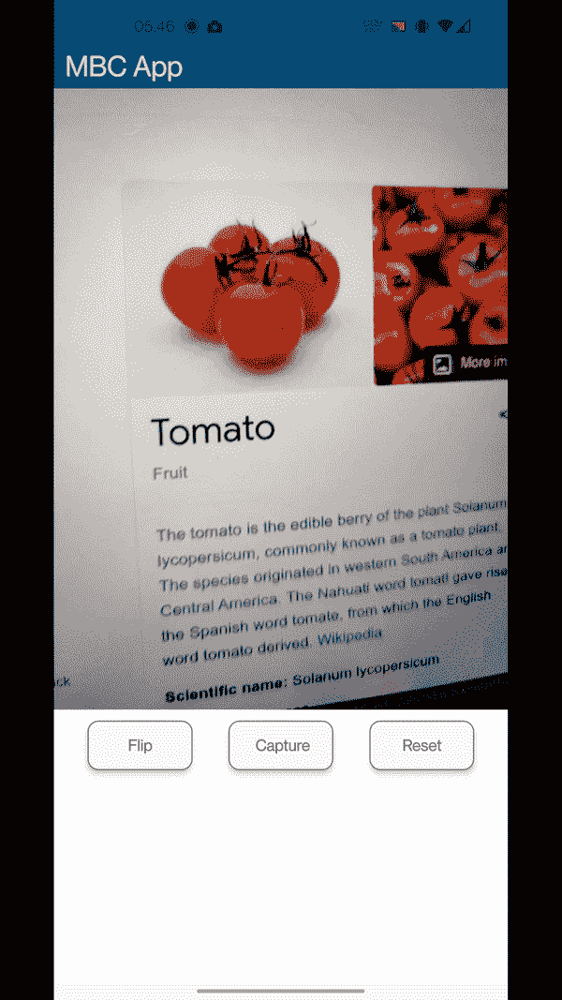
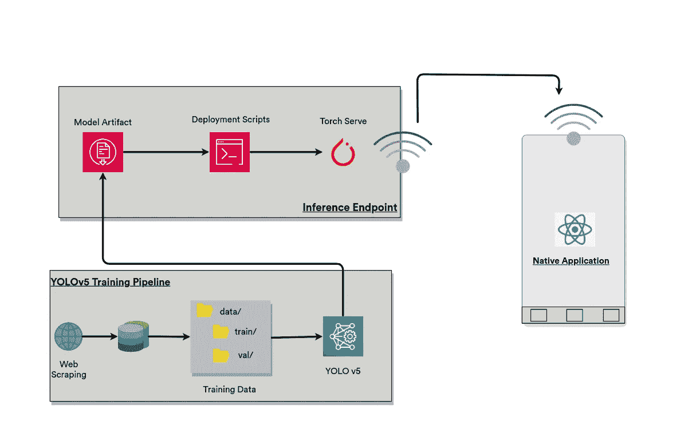
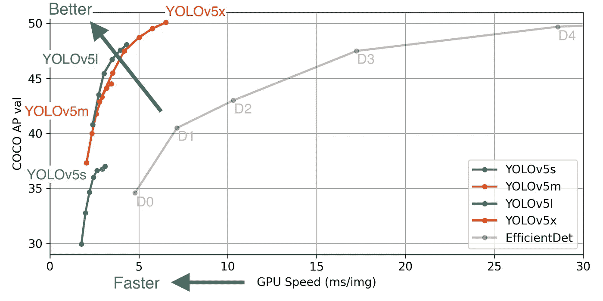
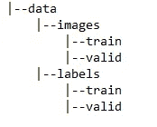
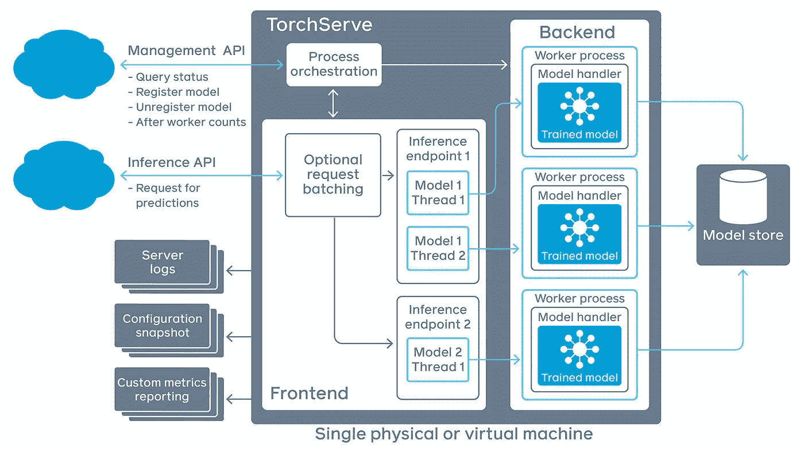
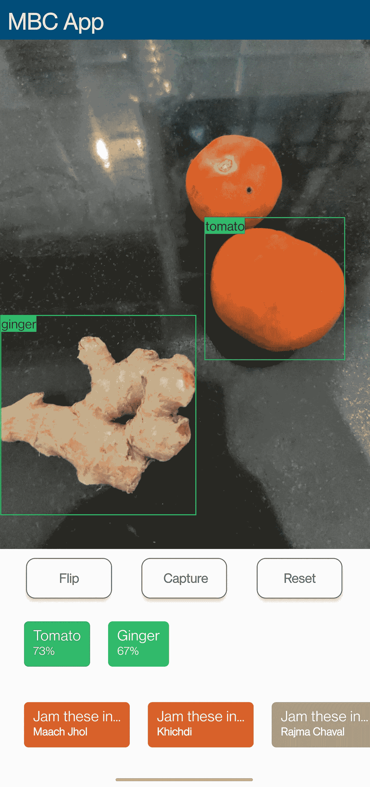

# 端到端深度学习:一个不同的视角

> 原文：<https://towardsdatascience.com/end-to-end-deep-learning-a-different-perspective-de9467697bf0?source=collection_archive---------25----------------------->

## [实践教程](https://towardsdatascience.com/tagged/hands-on-tutorials)

## 用 YOLOv5，TorchServe & React Native 从一个想法到一个原生应用


由[凯文·Ku](https://unsplash.com/@ikukevk?utm_source=medium&utm_medium=referral)在 [Unsplash](https://unsplash.com?utm_source=medium&utm_medium=referral) 上拍摄的照片

每当有一篇关于端到端深度学习项目的文章，它都包括训练深度学习模型，部署 Flask API，然后确保它工作，或者它广泛地包括使用 Streamlit 或类似的东西创建 web 演示。这种方法的问题在于，它谈论的是一条已经过尝试和测试的直截了当的典型路径。它只需要用一个等效物替换拼图中的一片，比如用*分类模型*替换*情感分析模型*，等等，一个新的项目就可以创建了，但是线框基本保持不变。从教育的角度来看，这种方法是非常有效的，因为它教给你关于领域的知识，但是从工程的角度来看，一个典型的深度学习项目可能会有很大的不同。

工程更多的是设计和建造。知道“如何做”比遵循一个固定的模式或一步一步地建立一个项目更重要。在 2021 年，当有这么多可供选择的框架，解决同一问题的多种方法，部署模型的不同方法，以及为它们构建演示时，知道选择哪一个是很重要的，更重要的是知道如何从可用选项中选择一个。

**注意**:对于本文的其余部分，项目和深度学习项目可以互换使用。

当一个人开始学习深度学习概念时，项目是为了学习特定的技术或子领域，如 NLP 或 CV。今天，如果你去像[https://paperswithcode.com/](https://paperswithcode.com/)这样的资源，你会发现对不同问题的研究，这些问题已经成为跨领域的，或者已经变得非常难以用传统的监督学习方法解决，因此为了解决这些问题，像自我监督学习、半监督学习、因果推理等方法已经被实验。这就引出了一个重要的问题，什么是处理项目的好方法？应该选择一个领域，并在此基础上解决问题，还是应该选择一个问题，并了解解决它需要什么？让我们试着在这篇文章中回答这些问题。

本文的其余部分将讨论一个特定项目的过程，它的一些组件可能不像其他组件那样熟悉，但是重点是引导您完成这个过程，特别是处理这样一个项目的思维过程，而不是作为特定项目的教程。为了与没有任何固定路径或固定模式的想法产生共鸣，这篇文章是如何制定项目的文章之一，它省略了与讨论不直接相关的细节。

在进一步讨论之前，让我们先看看这个项目的最终产品和它所涉及的内容。



这个项目包括建立一个应用程序，当显示食物成分时，会告诉你这些成分可以用在哪些菜肴中。该应用程序的简单用例是捕获配料的图像，应用程序将检测配料本身，并向您提供检测到的配料列表以及可能使用这些配料的食谱。



项目架构

这个项目分为三个不同的部分。第一部分包括使用深度学习模型来检测食品成分，第二部分包括创建一个端点来将其部署为服务，第三部分包括在原生应用程序中实际使用它。

在这一点上，您一定想知道，这与任何其他一帆风顺的项目演练或演示有什么不同，但是随着您继续阅读，差异将变得越来越明显。本文的目的不是一步一步地灌输创建这样一个项目的过程，而是给你一个直觉，告诉你在创建这样一个项目的过程中需要做些什么，以及在不同的阶段需要做哪些积极的决策。

在这一点上，如果说解决问题或从事项目没有固定的模式，但总有一些东西是有帮助的，那就有点多余了。

> “选择让你兴奋的事情。选择一些鼓励你努力的事情。”
> 
> - [阿布舍克·塔库尔](https://www.linkedin.com/in/abhi1thakur/)

知道你在做什么很重要，但是知道你为什么要做同样重要。当事情不像你希望或期望的那样运行时，它会非常有用(这种情况经常发生！).它让你受到鼓舞，让你对项目有一个清晰的视角。但仅此而已。这是拼图中唯一的伪集。其余的可以在我们进行项目时研究。

让我们谈一谈这个项目的动机吧。我是《厨艺大师》的超级粉丝(大部分都是)，对于那些生活在岩石下，从来没有看过它的人来说，只需要知道它是关于烹饪的。节目中有一个环节叫做*神秘盒子挑战*，要求参赛者在给定一些神秘配料的情况下做出一道菜。这让我思考如何在深度学习和软件工程的舒适区解决这个问题。灯泡熄灭了，于是诞生了 ***MBC App*** 的想法。

在这一点上，稍微继续一下，讨论一下这个过程与现实生活中的项目有多接近是很好的。通常情况下，要么是现有的产品，要么是正在开发的新产品，使用任何类型的人工智能都是一种选择，在今天的时代，从初创公司到大型科技巨头，都将人工智能作为他们解决方案的第一选择，因此我们的思维过程在某种程度上符合行业的思维过程。

既然我们已经解决了动机，并且我们已经决定不遵循任何特定的途径来解决问题，难道我们根本就没有想到解决方案吗？嗯，这对我们这些深度学习爱好者来说也太大胆了。需要明确区分过程和方法。“过程”是一个宽泛的术语，描述了解决问题需要做什么，而做这件事的方法可能有很大的不同，而方法则是谈论完成某件特定事情的步骤。例如，知道是将一个问题作为回归还是分类来处理，可能是这个过程的一部分，而从 ResNet、EfficientNet、VGG 中选择哪一个特定的主干可以由特定的方法组成。

所以，让我们来谈谈解决手头问题的过程。我们需要一种获得原料的方法。这可以简单到让用户输入名字，但为什么他们不直接用谷歌搜索，而不用我们如此热情打造的应用程序呢？那么，这可能是一个多类问题，用户只需点击或上传食材的图片，应用程序就会基于此推荐食谱吗？可能是一个很好的选择，但是听起来太安全了，不适合尝试。那么有什么替代方案呢？我们可以使用对象检测来检测不同的成分。即使这样也是一种选择，是从监督的角度接近它，还是使用一些自我监督的定位技术。然而，后者超出了我们的讨论范围，所以我们将坚持使用对象检测。

既然已经解决了这个问题，我们想如何创建这个应用程序呢？它应该是一个脚本，用户在安装完所有依赖项后会在他们的系统上运行它，还是应该是一个 web 部署？对于我们试图解决的问题来说，这两种选择听起来都是错误的，而创建一个可以在一开始就使用的本地应用程序听起来既用户友好又适合这项任务。

现在让我们深入到构成这个项目的三个不同的部分，并谈论他们各自的工作。

# YOLOv5 培训渠道

我们决定使用一个对象检测模型来检测不同的成分，作为流程的一部分，但我们当时没有决定如何完成，以及从各种可用选项中为其选择什么规范。有各种流行的目标检测模型，如 fast-RCNN，Mask-RCNN，SSD，YOLO 等。你可以找到对这些模型进行全面比较的论文，但我们宁愿保持简短，并证明我们的选择，而不是专注于我们没有选择的那些模型。



来源:https://github.com/ultralytics/yolov5

[YOLO v5](https://github.com/ultralytics/yolov5) 是这些物体检测模型列表中的最新成员之一。它在 GPU 上的预测速度以及 [COCO metric](https://cocodataset.org/#detection-eval) (范围从 0 到 1)方面都优于所有最近的模型。它有一个编写良好的代码库，并且根据项目的规模和需求，它提供了各种可供选择的方案。除此之外，它还提供了很好的可移植性。虽然是用 Pytorch 编写的，但它可以转换成 Onnx、CoreML、TFLite 和 Torchscript(我们将使用这些格式)等格式。此外，它转换成 Onnx 本身的能力打开了许多可能性。因此，由于其编写良好的代码库和良好的可移植性，我们选择 YOLOv5 作为我们的对象检测模型，特别是 YOLOv5m，作为速度和平均精度(AP)之间的良好权衡。

太好了！现在，我们需要做的就是训练对象检测模型，我们准备好了，对吗？为了打破泡沫，没有。我们谈了很多关于过程的问题，但我们没有谈到数据本身，这是任何数据科学管道的主要元素之一。所以我们先把模型和流程别上，再说数据。

先说此时的另一大区别。我们总是听到诸如“*大数据”*、“*数据是新的黄金*”、“*大量数据*”之类的术语和短语，但事实是非结构化和未处理的数据大量存在。同样，当我们开始学习深度学习和数据科学时，我们会遇到像 Iris 或 MNIST 等数据集。这些都是经过良好处理的数据，要做到这一点需要付出努力。这种努力大部分时间都没有实现，但可以考虑管理一个包含 70，000 张不同数字、不同笔迹的图像的数据集，或者更大、与项目更相关的数据集，如 COCO 数据集。收集和处理如此大规模的数据集既不容易也不便宜。大多数时候，在专业场景中，与任务相关的数据是不可用的，甚至在考虑开始整个训练-测试-实验循环之前，需要收集、整理和处理这些数据。

这就是我们的情况。我们需要一个食品成分的数据集，以及所有这些图像中不同标签的边界框信息。剧透一下，这样的数据集并不容易获得，因此我们需要付出额外的努力来自己准备数据集，这与其说是一个有趣的编码挑战，不如说是一个枯燥的手工任务，但同样是整个生命周期中非常重要的一部分。

项目生命周期中的这一步包括我们收集数据，用边界框信息对其进行注释，在将数据传递给模型进行训练之前对其进行结构化。为了简单起见，我们宁愿选择用 10-20 种配料，而不是一大堆配料，不眠之夜，一壶满满的咖啡。食材是根据它们在[印度食物 101](https://www.kaggle.com/nehaprabhavalkar/indian-food-101) 数据集中不同菜肴中的出现频率来选择的。截至目前，只选择了 10 种成分。这个数据集在后面的部分也很重要，那时我们将不得不根据公认的配料来预测菜肴，但后面会有更多的内容。

> 咖哩叶、咖喱酱、酥油、姜、果酱、牛奶、米粉、糖、番茄、乌拉尔豆

现在我们已经有了我们想要处理的前 10 种菜肴的列表，我们需要一种收集这些数据的方法，并且也是一种结构良好的方法。有多种方法可以做到这一点。人们可以四处炫耀他们的摄影技术，并获得这 10 种成分的图像，但这听起来太耗费体力了。工程学也是关于狡猾和懒惰的，这导致了艰苦工作的巧妙替代。因此，一个简单的替代方法是从不同的免费来源和网络搜索下载数据。但是更聪明的方法是编写一个网络抓取器，从不同的免费来源自动获取数据。

我们选择第三个选项。编写一个 web scraper 来为我们完成这项任务，比我们自己手动点击和收集图像要好。我们收集数据的方式是，每个标签(食品成分)都有一个单独的文件夹，我们可以控制想要抓取的图像数量。

```
**food-ingredients**/
      |--**curry-leaves**/
      |--**garam-masala**/
      .
      .
      .
      |--**urad-dal**/
```

在回到模型本身之前，还有一项任务没有完成，并且与前一项任务相比，备选方案更少。在每个图像上标注和创建边界框的任务。我们可以使用像 [LabelImg](https://pypi.org/project/labelImg/) 这样的工具手动完成这项工作，或者我们可以选择一些完全不同的方法，比如半监督对象定位，但是我们不要谈论后者，因为它超出了本讨论的范围。让我们沿着这条轨道，手动注释数据。YOLO v5 项目期望一个非常特殊的数据目录结构:



文件夹结构

因此，我们转换上述数据，用下面这段代码复制上述文件夹结构:

之后，使用 LabelImg 工具，我们为*列*和*列*中的每个图像生成边界框。当我们回到最初的动机，提醒自己当初为什么要做这个项目的时候。

太好了！既然标记已经完成，数据也已经正确组织，我们可以继续在自定义数据集上训练 YOLO v5 模型。我们将使用 yolov5m 并编写我们的数据配置，如下所示:

既然现在一切都准备好了，剩下的就是以期望的格式训练和导出我们的模型，供以后使用。因为它涉及到在本地或通过 Google Colab 之类的服务运行一些脚本，所以在这里可以很容易地跳过，培训和整个第 1 部分的参考资料可以在这里找到:

<https://github.com/himanshu-dutta/mbc-object-detection-yolov5>  

# 推理终点



来源:[https://github.com/pytorch/serve](https://github.com/pytorch/serve)

在服务于机器学习或深度学习模型时，有多种选择可供选择。从更熟悉的 *Streamlit* 和 *Flask* 到稍微少谈的“*edge 上的部署”、*以及不断涌现的新选项，比如 FastAPI(我还没玩过)。

我们需要选择最适合我们目的的选项。由于我们决定为项目创建一个本地应用程序，我们可以选择本地部署模型，选项有[*【Onnxjs】*](https://github.com/onnx/onnx)或 [*TensorFlow.js*](https://github.com/tensorflow/tfjs) 。这个选项的问题是，Onnx 不能与 React Native 一起正常工作(因为应用程序将使用它来构建)，尽管 TF.js 有一个兼容 React Native 的框架，但它有一些需要解决的错误。这限制了我们创建 API 端点的选择。为此，我们选择 [TorchServe](https://pytorch.org/serve/) ，它本质上使用 C++绑定来部署 Torchscript 模型。选择 TorchServe 的原因是可以编写端点的 pythonic 风格，以及它的 Torchscript 部署，这是速度的原因。

端点处理程序由方法组成，这些方法无论如何都是您的代码库(在我们的例子中是 YOLOv5 代码库)的一部分。它由以下方法组成:

```
**__init__**: Used to initialize the endpoint, can be image transforms, or encoders for text, etc.**preprocess**: Method used to process the input batch before feeding it to the model and making inference, such as given an input image, transforming it in the desired way.**inferencce**: This method is where the actual inference happens. The preprocessed input is passed to the model, and output is obtained from it. Other smaller changes to the output can also be performed here.**postprocess:** After the inference is made the output is passed to this method, where the output can be packaged in the desired way, before the response is made for the given input, such as converting class index to label names, etc.Note: Although the method names are predefined, what is actually done inside these methods is completely upto us. Above are the suggeested best practices.
```

现在我们已经有了端点处理程序，所有需要的就是实际的端点函数，它只是简单地做我们在处理程序中描述的事情，预处理数据，对数据进行推断，并进行后处理以返回响应。

可以使用类似如下的命令部署端点:

上面的脚本简单地将我们保存的模型归档到一个兼容的" *model archive"* 文件中，该文件打包了所有必需的脚本、模型图和权重，然后该文件被传递给 *TorchServe* 命令来启动端点。

# 本机应用程序

第三部分对项目来说非常具体。有多种方法来演示或创建一个完整的项目前端。有时将你的工作打包成一个库或框架是很好的，在其他时候，它可以是一个完整的 web 或本地应用程序。此外，还有像 Streamlit 这样的选项，当您必须快速简单地演示某些东西时，这些选项真的非常有用。但是作为一个工程背景的人，学习一些新的东西是需要做的。

对于特定的项目，编写原生应用程序最有意义。但为了讨论方便，我们来考虑一下其他选项。一个相近的替代方案是部署一个简单的 web 应用程序。由于我们在 *React Native* 中工作，如果我们考虑以后在 *React* 中工作，很多代码本身是可重用的，所以代码库具有良好的可重用性。除此之外，web 应用程序不像本地应用程序那样用户友好，因此我们将继续使用本地应用程序。

虽然我们已经决定了应用程序的用例，但是我们还没有弄清楚用例要实现需要做什么。对此有两个好的选择:

*   我们可以让用户将相机指向食物成分，应用程序将继续对我们的端点进行异步调用，并根据响应继续建议食谱。为了让这种替代方案发挥作用，我们的端点必须具有高响应性，这有时是不可能的，因为端点可能运行在 CPU 上。与此同时，API 调用必须连续进行，这对于用例来说是多余的。
*   另一种方法是让用户单击食物成分的图像，然后调用 API 来获得推断，根据推断可以建议食谱。

由于后一种选择更可行，我们继续进行。在决定了进行推理的首选方式之后，我们现在需要决定应用程序所需的 UI 和组件。我们肯定需要一个*相机*组件和一个*图像*组件(用于显示静态图像)，此外还需要一些按钮供用户点击图像、翻转相机等，以及一个可以列出配料和食谱的部分。在检测到的成分周围画出边界框也很好。这些元素中的大部分已经内置在 React Native 中，但是我们必须自己构建*“边界框”*组件。

“*边界框*组件是一个透明的矩形框，左上角有一个文本组件，它直接呈现在图像组件上。现在我们所有的组件都准备好了，我们需要将它们组装成一个工作应用程序，它本身将是一个单屏幕应用程序，看起来就像我们在开始时看到的图像。进行推断的代码如下所示:

它只是以 Base64 字符串的形式发送图像，并将响应组织成合适的格式，传递给不同的组件进行渲染和进一步处理。它还确保成分的预测边界框和标签具有高于设定阈值的置信度。

现在，我们需要根据检测到的成分来建议一些食谱，这可以是从对一些现有服务进行外部 API 调用到在应用程序本身中拥有食谱记录的任何范围。为了简单起见，我们将使用从*“印度食物 101”*数据集提取的食谱列表，并使用该列表根据检测到的成分来建议食谱。

现在，这取决于我们如何互动和用户友好，我们希望这个应用程序。如果我们愿意，我们甚至可以添加更多的用例和特性。但是由于我们到目前为止所开发的应用程序符合我们最初的想法，我们将在此停止。



应用程序屏幕

希望这篇文章能给你提供一个很好的动机去研究和寻找你自己的项目工作方式，而不是遵循任何固定的模式。每个项目都有一些要传授的知识，但重要的是将这些知识用于未来的努力，包括技术性和非技术性的。

# 项目参考

[1][https://github . com/himan Shu-dutta/MBC-object-detection-yolov 5](https://github.com/himanshu-dutta/mbc-object-detection-yolov5)

[2]https://github.com/himanshu-dutta/mystery-box-challenge-app

# 参考

[1] [Yolo v5](https://github.com/ultralytics/yolov5)

[2] [火炬服务器](https://pytorch.org/serve/) & [Pytorch](https://github.com/pytorch/pytorch)

[3] [反应原生](https://reactnative.dev/)