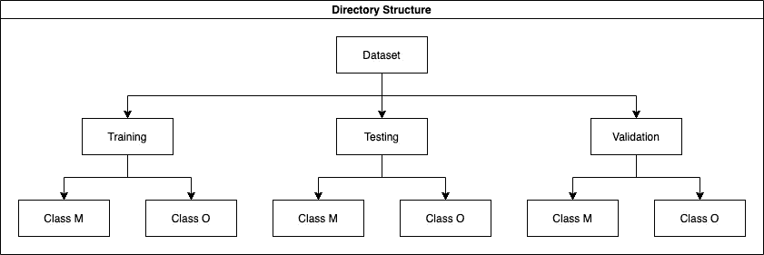
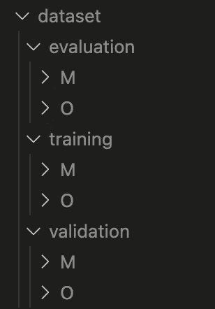
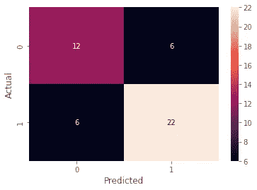
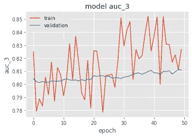
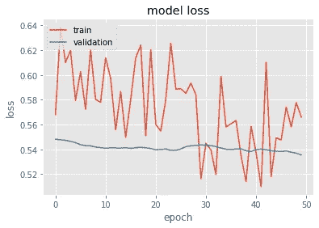

# 端到端深度学习项目:第 1 部分

> 原文：<https://towardsdatascience.com/end-to-end-deep-learning-project-part-1-930af1e1e191?source=collection_archive---------6----------------------->

## 初学者的数据科学

## 用 Keras 实现迁移学习的高效网络图像分类模型

*注意:这是从零开始实现深度学习项目的两部分系列的第一部分。第 1 部分包括问题陈述的设置、数据预处理、迁移学习背后的直觉、特征提取、微调和模型评估。* [*第二部分*](https://varshitasher.medium.com/deploying-an-end-to-end-deep-learning-project-with-few-clicks-part-2-89009cff6f16) *涵盖了 Flask app 的实现及其在 Heroku 上的后续部署。为了保持连续性，请遵循教程。代码在*[*Github*](https://github.com/V-Sher/house-interior-prediction)*上。*


你可以在这里玩烧瓶应用程序。

# 介绍

我非常幸运地在这样的环境中工作:( a)数据生成的基础设施和架构随时可用,( b)数据争论由分析师处理,( c) MLOps 由数据工程师的独立部门处理。这些额外津贴给了我自由，让我可以专注于我最喜欢的事情——数据建模。话虽如此，如果我不得不独自完成一个完整的项目，我总是想至少学习一些基础知识。这正是这篇文章背后的动机。

我决定实施一个端到端 **DL** 项目，因为存在一些主要与他们的部署相关的挑战——由于我们必须处理的模型的大小——以及对模型进行微调以适应我们特定的用例。

该项目将包括三个部分:

*   第 1 部分:设置(虚拟环境、训练数据集等。)、模型训练(用 Keras 微调、学习曲线监控等。)，测试。
*   第 2 部分:构建 Flask 应用程序并在 Heroku 上部署。

这个由两部分组成的系列的目的是为您提供源代码、提示、技巧，并熟悉使用深度学习模型时常见的运行时错误。我确信这些在[在数据科学面试](/step-by-step-guide-to-explaining-your-ml-project-during-a-data-science-interview-81dfaaa408bf)中解释项目时会派上用场。

*提醒:这篇文章(以及后续文章)中的一些内容将会被详细讨论，因为它的目的是让人们(尤其是早期研究人员)理解一些设计决策背后的原因/利弊，并在面试中完美地回答这些问题。*

<https://github.com/V-Sher/house-interior-prediction>  

# 第 1 部分:设置

## 虚拟环境

使用终端，在项目目录中创建一个名为`e2eproject`的虚拟环境，并激活它。

```
python3 -m venv e2eproject
source e2eproject/bin/activate
```

## 资料组

我们将使用 Kaggle 公开发布的[房子房间数据集](https://www.kaggle.com/robinreni/house-rooms-image-dataset)。

您可以手动下载它，然后将它移动到您的项目目录*或*中。在终端中使用以下命令将它直接下载到您的项目目录中。
*附注:在运行以下命令之前，确保您在项目目录中。*

```
kaggle datasets download -d robinreni/house-rooms-image-dataset — unzip
```

## 工作

我们将致力于**图像分类任务**。具体来说，我们将开发一个模型，该模型可以检测给定卧室图像的房屋内部是*现代(M 类)*还是*古老(O 类)*。这种模型可以在再抵押期间或在出售财产时用于财产估价。

你可能已经注意到了，这个数据集是没有标签的，然而，我的一个朋友慷慨地提供了大约 450 张图片的手工标签。(标签已在 Github repo 中提供。)尽管这不是一个很大的数据集规模，但我们仍然能够在保留的测试集上达到几乎 80%的准确率。此外，用于微调、改进模型度量等的适当技术。以确定是否值得花费更多的时间来标记额外的数据点。

# 第二部分:模特培训

让我们创建`model.ipynb`笔记本。

## 装置

```
from tensorflow.keras.preprocessing.image import ImageDataGenerator
from tensorflow.keras.applications import EfficientNetB0
from tensorflow.keras.callbacks import EarlyStopping
from tensorflow.keras.callbacks import ModelCheckpoint
from tensorflow.keras.layers import BatchNormalization
from tensorflow.keras.layers import Dropout
from tensorflow.keras.layers import Dense
from tensorflow.keras.layers import Input
from tensorflow.keras.optimizers import Adam
from tensorflow.keras.models import Modelfrom sklearn.metrics import classification_report, confusion_matrix
from sklearn.model_selection import train_test_split
from imutils import paths
from tqdm import tqdmimport matplotlib.pyplot as plt
import numpy as np
import tensorflow as tf
import seaborn as sns
import numpy as np
import shutil
import os
```

*注意:你可能需要做一些* `*pip install XXX*` *来让上面的单元格工作。*

## 辅助变量和函数

```
ORIG_INPUT_DATASET = "House_Room_Dataset/Bedroom"TRAIN = "training"
VAL = evaluation"
TEST = "testing"BASE_PATH = "dataset"
BATCH_SIZE = 32
CLASSES = ["Modern", "Old"]
```

我们将只处理卧室图片，因此`ORIG_INPUT_DATASET`指向卧室子目录。`BASE_PATH`是我们将存储图像的训练、测试和验证分割的目录的路径。这将是空的。

```
*def* plot_hist(*hist*, *metric*):
     if *metric* == 'auc':
            plt.plot(*hist*.history["auc"])
            plt.plot(*hist*.history["val_auc"]) else:
            plt.plot(*hist*.history["loss"])
            plt.plot(*hist*.history["val_loss"]) plt.style.use("ggplot")
     plt.title("model {}".format(*metric*))
     plt.ylabel("{}".format(*metric*))
     plt.xlabel("epoch")
     plt.legend(["train", "validation"], *loc*="upper left")
     plt.show()
```

这是一些样板代码，用于绘制两种类型的学习曲线——AUC 对 epoch 和 loss 对 epoch。

*注意:如果您使用的是除* `*auc*` *之外的指标，比如说* `*accuracy*` *，请确保将上面代码片段中的* `*auc*` *更新为* `*accuracy*` *，将* `*val_auc*` *更新为* `*val_accuracy*` *。*

## 加载标签

(`[labels.txt](https://github.com/V-Sher/house-interior-prediction/blob/main/labels.txt)`已作为回购的一部分。)

```
*# Reading labels from the txt file*
with open("labels.txt", 'r') as f:
      manual_labels = f.read()*# Extracting individual labels into a list*
labels = [i for i in manual_labels]
len(labels)********* OUTPUT **********
451
```

要检查数据集是否平衡:

```
from collections import Counterprint(Counter(labels).keys()) 
print(Counter(labels).values())********* OUTPUT **********
*dict_keys(['O', 'M'])
dict_values([271, 180])*
```

看起来在我们的数据集中，老房子比现代房子多(尽管差距不是很大)。因此，抛弃准确性并选择更适合处理类别不平衡的指标，即 AUC(ROC 曲线下面积)是有意义的。

## 列车测试验证拆分

在我们进行分割之前，对文件名进行排序是很重要的，因为我们有第*个* 451 图像的标签(在`House_Room_Dataset/Bedroom` 子目录中),而不仅仅是随机的 451 图像。默认情况下，`os.listdir()`以随机的顺序返回文件，我们不应该依赖它。

```
*# sorting files in the order they appear*
files = os.listdir(ORIG_INPUT_DATASET)
files.sort(*key*=*lambda* *f*: *int*(f.split('_')[1].split('.')[0]))# checking to see the correct file order
files[:5]********* OUTPUT **********
['bed_1.jpg', 'bed_2.jpg', 'bed_3.jpg', 'bed_4.jpg', 'bed_8.jpg']
```

现在我们知道我们有正确的 451 张图片，让我们继续进行训练-测试-验证分割。我们将分别分配大约 75%、15%和 10%的数据用于训练、验证和测试。

```
*# splitting files into train and test sets*
trainX, testX, trainY, testY =  train_test_split(files[:len(labels)], 
                 labels, 
                 *stratify*=labels, 
                 *train_size*=0.90)*# further splitting of train set into train and val sets*
trainX, valX, trainY, valY = train_test_split(trainX, trainY, *stratify*=trainY, *train_size*=0.85)*# Checking the size of train, test, eval*
len(trainX), len(trainY), len(valX), len(valY),  len(testX), len(testY)********* OUTPUT **********
(344, 344, 61, 61, 46, 46)
```

使用 Sklearn 的`train_test_split()`方法，我们首先将整个数据集分割成训练集和测试集，然后将训练数据再次分割成训练集和验证集。由`labels`到`stratify`是很重要的，因为我们想要在所有三个集合(训练、测试和验证)中按比例分配现代和旧图像。

## 构建训练数据集目录

在代码的后面，您会注意到，在训练期间，我们不会将整个数据集加载到内存中。相反，我们将利用 Keras 的`[.flow_from_directory()](https://keras.io/api/preprocessing/image/)`功能来实现批处理。但是，该函数希望数据被组织到如下目录中:



*图 Keras 中批量读取图像的目录结构。M 级*和 O 级*分别指*现代*和*旧*。*

为了让我们的图像文件以上述格式组织起来，我们将使用下面这个简短的片段:


当代码片段运行时，您应该能够使用 `[tqdm](/data-scientists-guide-to-efficient-coding-in-python-670c78a7bf79)` [模块](/data-scientists-guide-to-efficient-coding-in-python-670c78a7bf79)看到进度，一旦它完成，您将发现创建了三个新的子目录— `dataset/training`、`dataset/evaluation`和`dataset/validation`，在每个子目录中，将有两个子子目录，分别用于现代和古老的房屋。



作为健全性检查，让我们看看在每个子目录中有预期数量的图像。

```
trainPath = os.path.join(BASE_PATH, TRAIN)
valPath = os.path.join(BASE_PATH, VAL)
testPath = os.path.join(BASE_PATH, TEST)totalTrain = len(*list*(paths.list_images(trainPath)))
totalVal = len(*list*(paths.list_images(valPath)))
totalTest = len(*list*(paths.list_images(testPath)))print(totalTrain, totalTest, totalVal)********** OUTPUT *******
344 46 61
```

*注意:如果您的自定义数据是下面描述的结构，有一个有用的 python 包叫做*[*split _ folders*](https://github.com/jfilter/split-folders)*可以用来获取图 1 中定义的目录结构中的数据。*

```
dataset/
    class1/
        img1.jpg
        img2.jpg
        ...
    class2/
        img3.jpg
        ...
    ...
```

## 图像预处理

因为我们处理的样本量相当有限，所以通常建议使用旋转、缩放、平移等方法随机放大图像。

> 虽然认为数据扩充增加了可用的训练数据量可能很诱人，但它实际上做的是获取训练样本并对其应用随机变换[ [来源](https://www.pyimagesearch.com/2019/07/08/keras-imagedatagenerator-and-data-augmentation/) ]。总体而言，样本量保持不变。

Keras 允许亮度，旋转，缩放，剪切等随机增强。使用[图像数据生成器](https://www.tensorflow.org/api_docs/python/tf/keras/preprocessing/image/ImageDataGenerator)，最好的部分是所有这些都是在模型拟合过程中动态完成*，也就是说，您不需要预先计算它们。*

***训练数据扩充**:*

```
*trainAug = ImageDataGenerator(
*rotation_range*=90,
*zoom_range*=[0.5, 1.0],
*width_shift_range*=0.3,
*height_shift_range*=0.25,
*shear_range*=0.15,
*horizontal_flip*=True,
*fill_mode*="nearest",
*brightness_range*=[0.2, 1.0]
)*
```

*`width_shift`、`height_shift`、`zoom_range`、`rotation_range`等大部分参数应该是直观的(如果没有，看一下*官方 Keras* [*文档*](https://www.tensorflow.org/api_docs/python/tf/keras/preprocessing/image/ImageDataGenerator#args) *)* 。*

*需要注意的重要一点是，当您执行缩放或旋转操作时，图像中可能会产生一些空白区域/像素，必须使用`fill_mode`中提到的适当技术进行填充。*

***验证数据扩充**:*

```
*valAug = ImageDataGenerator()*
```

*您将会看到，在为验证数据初始化数据扩充对象时，我们没有提供任何参数。这意味着我们将对它们都使用默认值，即 0。换句话说，我们没有应用任何扩展(没有缩放，宽度移动，水平翻转，等等。)添加到验证集，因为在训练期间评估模型时，该集应被视为测试集。*

***测试数据扩充:***

```
*testAug = ImageDataGenerator()*
```

*遵循与上面相同的逻辑，我们没有对测试集应用任何扩充。*

***创建数据生成器***

*如前所述，我们需要创建一些数据生成器，以便在训练期间将这些增强图像成批地提供给模型。为此，我们可以使用`[flow_from_directory()](https://www.tensorflow.org/api_docs/python/tf/keras/preprocessing/image/ImageDataGenerator#flow_from_directory)` [发生器函数](https://www.tensorflow.org/api_docs/python/tf/keras/preprocessing/image/ImageDataGenerator#flow_from_directory)。*

```
**# Create training batches whilst creating augmented images on the fly*trainGen = trainAug.flow_from_directory(
*directory*=trainPath,
*target_size*=(224,224),
*save_to_dir*='dataset/augmented/train',
*save_prefix*='train',
*shuffle*=True
)*# Create val batches* valGen = valAug.flow_from_directory(
*directory*=valPath,
*target_size*=(224,224),
*shuffle*=True
)*
```

*需要考虑的几件重要事情:*

*   *在每种情况下，`directory`被设置为训练(或验证)图像所在的路径。*
*   *将`target_size`指定为`(224,224)`可以确保所有图像都将被调整到这个尺寸。*
*   *我们还将把`save_to_dir`设置为保存增强图像(前缀在`save_prefix`中指定)的目录路径，这些图像将在训练过程中动态创建。这提供了一个很好的健全性检查，以查看图像是否得到了应有的随机变换。*注意:如果你想事先检查一下，也就是在训练开始之前，这里有一个我在*[*stack overflow*](https://stackoverflow.com/questions/63818153/does-keras-imagedatagenerator-randomly-apply-transformations-to-every-image)*上找到的快速片段。**
*   *最后，`shuffle`被设置为`True`,因为我们希望样本在批处理生成器中被混洗，这样当`model.fit()`请求一个批处理时，就会给出随机样本。这样做将确保不同时期之间的批次看起来不一样，并最终使模型更加健壮。*

```
**# Create test batches*testGen = testAug.flow_from_directory(
*directory*=testPath,
*target_size*=(224,224),
*shuffle*=False
)*
```

*除了为`testGen`设置正确的`directory`路径，还有一件主要的事情需要考虑:*

*   *`shuffle`必须设置为`False`。*

*你问，为什么？
因为，现在**我们不希望样本在测试批次生成器**中被混洗。只有当 shuffle 设定为 False 时，才会按照提供的文件名称的顺序创建批处理。在模型评估期间，需要将文件名(即真实标签，可使用`*testGen.classes*`访问)与预测标签进行匹配。*

**有趣的事实:如果你现在检查* `*trainGen.classes*` *的输出，希望它们被打乱，你会失望的。为什么？因为当在模型拟合期间请求一个批次时，洗牌是动态发生的。【*[*stack overflow*](https://stackoverflow.com/questions/60927259/keras-flow-from-directory-shuffle-not-working-properly)*】。**

## *训练过程背后的直觉*

*我们可以从头开始训练一个模型，但这肯定会表现不佳——主要是因为我们的数据集如此之小。在这种情况下，利用**迁移学习**的力量是有意义的。*

> *迁移学习是指在新数据集上微调预训练模型的过程。这使它能够识别从未训练过的类！*

*简而言之，迁移学习允许我们利用模型在训练中获得的知识来识别狗和猫，这样它现在可以用来预测房子内部是否现代。*

*但是它为什么会起作用呢？
因为我们挑选的任何基础模型(即预训练模型)通常都是在如此大的图像语料库上训练的，所以一般来说，它能够学习图像的良好矢量表示。剩下要做的就是在区分定制类时使用这些表示(在我们的例子中，是老房子还是现代房子)。*

**鸣谢:我想花点时间对我在这篇文章的研究阶段发现的几个博客(* [*这个*](https://keras.io/examples/vision/image_classification_efficientnet_fine_tuning/) *，* [*这个*](https://www.pyimagesearch.com/2019/06/03/fine-tuning-with-keras-and-deep-learning/) ，*[*这个*](/a-bunch-of-tips-and-tricks-for-training-deep-neural-networks-3ca24c31ddc8) *)大声疾呼。这些被证明是真正的瑰宝，帮助我详细理解了迁移学习的概念。我真的很感激你所有的见解，这些见解让我为我的读者简化了代码/解释。***

****使用 Keras 进行迁移学习****

**迁移学习包括两个主要步骤:**

*   ****特征提取**:将一个预先训练好的模型(并冻结其权重)作为基础模型，然后在基础模型上训练一个新的分类器*，使其准确输出 N 个值(其中 N 为类别数)。**
*   ****【可选】微调**:一旦训练好分类器，从基础模型中解冻几个**层，使其很好地适应新的数据集。**

***新的分类器可以是:**

*   **密集层的堆叠(即完全连接的层)。**

**运筹学**

*   **单个全局池层(将整个要素地图缩小为单个值— `maxpool`、`avgpool`)。这是优选的，因为有 0 个参数需要优化(因此是本文的选择)，所以过度拟合较少。**

****根据您的数据集与预训练模型最初训练时的数据集的不同程度，少数会有所不同。请记住，如果两个数据集非常相似，那么只解冻所有图层的一部分可能会有所帮助。**

**微调步骤虽然是可选的，但对于自定义数据集与训练基本模型的数据集完全不同的用例来说，这一步非常重要。此外，与特征提取步骤相比，这可能需要更多的历元。因为更多的时期粗略地转化为更高的过拟合机会，所以建议在仔细监控损失/精度曲线之后使用(模型训练的)早期停止。**

****型号选择背后的直觉****

**回到这个百万美元的问题——我们应该选择哪个模型作为微调的基础模型？显然，有相当多的选项可用，可以在 Keras 文档中找到[这里](https://keras.io/api/applications/#available-models)。虽然我最初的选择是 ResNet-50，因为它很受欢迎，但我最终决定继续使用 [**EfficientNet**](https://keras.io/api/applications/efficientnet/) ，因为它们可以[实现与 SOTA 型号类似的结果，同时需要更少的 FLOPS](https://arxiv.org/pdf/1905.11946v5.pdf) 。此外，[论文](https://arxiv.org/pdf/1905.11946v5.pdf)提到它们的**性能在** **迁移学习任务**上与 SOTA 模型不相上下，同时平均需要的参数少 9.6 倍。哇哦⭐️**

**EfficientNet 模型有很多种(EfficientNetB0、EfficientNetB1、…… EfficientB7)，它们在架构(即网络深度、宽度)和资源限制方面略有不同。这些模型中的每一个都需要特定图像形状的图像，如本[表](https://keras.io/examples/vision/image_classification_efficientnet_fine_tuning/#keras-implementation-of-efficientnet)中所述。鉴于我们正在使用`224x224`分辨率的图像，我们将使用 **EfficientNetB0。****

## ****特征提取步骤的模型训练****

***注意:在本教程中，我们将使用 Tensorflow 的 Keras API。如果您是 Keras 新手，我已经写了两个初级 Keras 教程(*[*part 1*](/beginners-guide-to-building-artificial-neural-networks-using-keras-in-python-bdc4989dab00)*，*[*part 2*](/beginners-guide-to-building-convolutional-neural-networks-using-tensorflow-s-keras-api-in-python-6e8035e28238)*)，内容涵盖了网络架构、神经元、激活函数、隐藏层(密集、下降、最大池、展平)等，比这里讨论的要详细得多。请随时参考他们的快速复习！***

**我们从使用`imagenet`权重创建一个`EfficientNetB0`基础模型开始。**

```
**baseModel = EfficientNetB0(
            *weights*="imagenet",
            *include_top*=False, # make sure top layer is not included
            *input_tensor*=Input(*shape*=(224, 224, 3)),
            *pooling*="avg"
           )**
```

**需要考虑的事情很少:**

*   **`include_top`必须设置为`False`，因为 EfficientNet 网络架构中的顶层(即最终层)是一个`Dense`层，它输出 1000 个对应于 ImageNet 数据集的类。我们显然不需要这个！**
*   **如果您没记错的话，我们选择新的分类器作为全局池层(而不是密集层的堆栈)。好消息是，Keras API 已经允许我们在实例化`EfficientNetB0`对象的同时完成这个*。我们可以简单地将`pooling`参数设置为`avg`。默认为`None`。***

**下一步是通过将每层的`trainable`设置为`False`来冻结权重:**

```
***# freeze the weights*for layer in baseModel.layers:
      layer.trainable = False**
```

**现在是时候在上面创建一个新的分类器了，它将准确地产生两个类(`M`或`O`)。为此，我们需要确保这个分类器模型的最后一层是具有两个输出神经元的`Dense`层。在这两者之间，我们还包括了`BatchNormalization`和`Dropout`层，用于正则化。**

```
***# training a new classifier on top (Functional Keras Model)*x = baseModel.output
Layer_1 = BatchNormalization()(x)
Layer_2 = Dropout(0.5)(Layer_1)
output_layer = Dense(len(CLASSES), *activation*="softmax")(Layer_2)model = Model(*inputs* = baseModel.input, *outputs* = output_layer)**
```

***注意:有两种方法可以建立这个 Keras 分类器模型:顺序的(最基本的)和功能的(对于具有多个输入/输出的复杂网络)。上面的代码片段是作为一个功能网络编写的，因为如果您使用* `*model.summary()*` *来检查它，它会使网络架构更加清晰。同样，我们可以创建一个类似下面的序列模型，结果将是相同的。***

```
***# Another way to create the classifier on top of basemodel*model = tf.keras.Sequential()
model.add(baseModel)
model.add(BatchNormalization())
model.add(Dropout(0.5))
model.add(Dense(len(CLASSES), activation="softmax"))**
```

**最后，让我们用`Adam`优化器和一个相对较大的`learning_rate = 1e-3`来编译模型。由于我们有两个可能的输出类，我们将监控`binary_crossentropy`损失(如果您处理两个以上的类，请使用`categorical_crossentropy`)并根据`tf.keras.metrics.AUC`中实现的 AUC 度量评估模型的有效性。**

```
***# compile*opt = Adam(*learning_rate*=1e-3)
model.compile(*optimizer*=opt, 
              *loss*='binary_crossentropy', 
              *metrics*=[tf.keras.metrics.AUC()]
              )**
```

**在使用`fit()`训练模型之前要做的最后一件事是实现`EarlyStopping`和`ModelCheckpoint`。**

**前者将确保模型不会在不必要的情况下训练更多的时期。这是通过监控`val_loss`来完成的，一旦没有进一步的改进，即不能进一步最小化，训练就停止。**

**后者将在给定的文件路径中保存最佳模型——在我们的例子中是`feature_extraction.h5`。我们将再次监控验证损失，并保存所有时期的最佳模型。**

***注意:这里有一篇优秀的* [*文章*](https://machinelearningmastery.com/how-to-stop-training-deep-neural-networks-at-the-right-time-using-early-stopping/) *更详细地解释了早期停止和模型检查点实现！***

```
***# implementing early stopping* es = EarlyStopping(
     *monitor*='val_loss',  #metric to monitor
     *mode*='min',  # whether to min or max the metric monitored
     *patience*=10, # epochs to wait before declaring stopped training
     *verbose*=1  # output epoch when training was stopped
     )*# implementing model checkpoint* mc = ModelCheckpoint(
      'feature_extraction.h5',
       *monitor*='val_loss',
       *mode*='min',
       *verbose*=1, # display epoch+accuracy everytime model is saved
       *save_best_only*=True
      )**
```

**最后，是模型训练的时候了:**

```
***# Training the model*hist = model.fit(
       *x*=trainGen,
       *epochs*=25,
       *verbose*=2,
       *validation_data*=valGen,
       *steps_per_epoch*=totalTrain // BATCH_SIZE,
       *callbacks*=[es, mc]
      )**
```

****

**最终时期的损失和 AUC 分数**

**快速看一下 AUC 和损失曲线，我们可以找到模型收敛的证据(意味着模型已经准备好进行微调)。**

******

AUC 和损失的学习曲线** 

**右图中一个有趣的观察结果是，我们的验证损失低于训练损失。起初，我认为有一些数据泄漏的问题，但后来我发现了这篇优秀的[文章](https://www.pyimagesearch.com/2019/10/14/why-is-my-validation-loss-lower-than-my-training-loss/)解释了为什么这是完全正常的，有时会在训练中发生。**

**总结两个可能的原因(从文章本身):**

*   **原因#1:正规化(如辍学)只适用于培训期间，而不是在验证期间。因为正则化牺牲训练精度来提高验证/测试精度，所以验证损失可以低于训练损失。**
*   **原因#2:我们的验证集太小(只有 61 幅图像)，也许它比训练集更容易，即[不具有代表性的验证数据集](https://machinelearningmastery.com/learning-curves-for-diagnosing-machine-learning-model-performance/#unrepresentative-validation-dataset)。**

## **特征提取步骤后的模型测试**

**我们将使用一些样板代码来评估使用`.predict()`获得的模型预测。记住`predIdxs`将类似于`[0.8, 0.2]`，即`M`和`O`两个类的 softmax 值，所以确保使用`np.argmax`选择两个中的最大值。我们使用`testGen.class_indices`来检查从类名到类索引的映射。**

```
**testGen.reset()predIdxs = model.predict(
             *x*=testGen,
             *steps*=(totalTest // BATCH_SIZE) + 1
            )predIdxs = np.argmax(predIdxs, *axis* = 1)
print("No. of test images", len(predIdxs))
print(testGen.class_indices)cm = confusion_matrix(testGen.classes, predIdxs)
heatmap = sns.heatmap(cm, *annot*=True)
plt.xlabel("Predicted")
plt.ylabel("Actual")
plt.show()********* OUTPUT********
No. of test images 46 
{'M': 0, 'O': 1}**
```

****

## **微调步骤的模型训练**

**我们将从解冻当前模型的最后几层开始，但是，我们不应该随意打开或关闭层。有许多技术和技巧可用于微调模型(例如，参见[这个](https://keras.io/examples/vision/image_classification_efficientnet_fine_tuning/#tips-for-fine-tuning-efficientnet)和[这个](https://keras.io/guides/transfer_learning/#finetuning)),但有一些是我发现最有用的:**

*   **当在该步骤编译模型时，与特征提取步骤相比，使用甚至更小的学习速率。较小的学习速率意味着需要更多的历元，因为每次更新时网络权重的变化较小。**
*   **这些层需要保持冷冻。**
*   **在网络架构中，卷积块需要在整体 **中打开或关闭**。
    例如:考虑`model.summary()`输出的最后几行。正如你所看到的，这些层被整齐地组织成块，最后一块是`block7d`。首先，我们将解冻`block7d`中的所有图层(然而，任何`BathcNormalization`图层都将保持原样)以及随后的 7 个图层(其中大部分是我们在构建新的分类器头时定义的)。总的来说，网络的最后 20 层将是解冻的候选层。******

```
****____________________________________________________________________
Layer (type)                    Output Shape         Param #     ====================================================================
                              .
                              .
                              .block6d_project_conv (Conv2D)   (None, 7, 7, 192)    221184      ____________________________________________________________________block6d_project_bn (BatchNormal (None, 7, 7, 192)    768     ____________________________________________________________________block6d_drop (Dropout)          (None, 7, 7, 192)    0           ____________________________________________________________________block6d_add (Add)               (None, 7, 7, 192)    0           ____________________________________________________________________block7a_expand_conv (Conv2D)    (None, 7, 7, 1152)   221184 ____________________________________________________________________block7a_expand_bn (BatchNormali (None, 7, 7, 1152)   4608        ________________________________________________________________block7a_expand_activation (Acti (None, 7, 7, 1152)   0           ____________________________________________________________________block7a_dwconv (DepthwiseConv2D (None, 7, 7, 1152)   10368 ____________________________________________________________________ .
                              .
                              .****
```

****我已经将用于微调的代码捆绑到一个名为`fine_tune_model()`的函数中。大部分代码是从特征提取步骤开始重复的。****

```
*****def* fine_tune_model(*model*): *# unfreeze last conv block i.e. block7a* for layer in *model*.layers[-20:]:
          if not isinstance(layer, BatchNormalization):
               layer.trainable = True *# check which of these are trainable and which aren't*     for layer in *model*.layers:
          print("{}: {}".format(layer, layer.trainable)) *# compile (with an even smaller learning rate)*     opt = Adam(*learning_rate*=1e-5)
 *model*.compile(
             *optimizer*=opt,
             *loss*='binary_crossentropy',
             *metrics*=[tf.keras.metrics.AUC()]
             ) return *model*model_fine_tuned = fine_tune_model(model)****
```

****因为微调也将使用相同的数据发生器，即`trainGen`、`valGen`和`testGen`，所以重置它们以便它们从数据集中的第一个样本开始非常重要。****

```
****trainGen.reset()
valGen.reset()
testGen.reset()****
```

****最后，让我们设置提前停止和模型检查点(注意，我们已经将`patience`增加到 20，因为我们现在将训练更长时间，即 50 `epochs`)，然后开始训练。****

```
*****# implementing early stopping* es_tune = EarlyStopping(
     *monitor*='val_loss', 
     *mode*='min',  
     *patience*=20, 
     *verbose*=1  
     )*# implementing model checkpoint* mc_tune = ModelCheckpoint(
      'fine_tuned_house.h5',
       *monitor*='val_loss',
       *mode*='min',
       *verbose*=1, 
       *save_best_only*=True
      )hist = model_fine_tuned.fit(
      *x*=trainGen,
      *steps_per_epoch*=totalTrain // BATCH_SIZE,
      *validation_data*=valGen,
      *epochs*=50,
      *verbose*=2,
      *callbacks*=[es_tune, mc_tune]
     )****
```

********

## ****特征提取步骤后的模型测试****

********

****通过与之前的混淆矩阵进行比较，我们只成功地将正确预测的图像数量增加了 2 个(参见两张热图中的对角线值)。****

****作为最后的健全性检查，查看这个微调步骤是否显示出任何过度拟合的迹象也是很好的。****

****************

******验证损失**不稳定，稳定在 0.55 左右，表明模型没有过度拟合。总的来说，验证集预测的 **AUC** 确实随着更多的时期变得更好，但回报却在减少。(简单地说，更长时间的培训似乎不会对我们的案例有实质性的帮助)。****

****起初，我认为训练曲线的波动是由于批量大小，因为它们在网络如何学习中发挥了作用。类似地，过大的学习速率会阻碍收敛，并导致损失函数波动，陷入局部最小值。然而，无论是增加批量还是降低学习率都无助于平滑梯度。****

****想到的另一种可能的解释是，网络已经达到了其关于给定数据集的容量，即，它不能再从中学习更多。这是可能的，因为我们正在尝试训练一个相对较大的网络(记住，我们已经解冻了一些额外的层，这意味着存在更多的可训练参数)，仅使用 344 个样本，这些样本无法提供足够的信息来学习问题(进一步)。****

*****注意:在将更多图像推进训练过程以希望改进模型之前，可能值得对模型超参数、train:val 分割、预训练权重的选择(来自* [*嘈杂学生*](https://github.com/google-research/noisystudent) *训练的权重已知比来自 ImageNet 训练的权重更好*<https://arxiv.org/pdf/1911.04252.pdf>**)以及网络架构本身进行修改。******

# ****未来的工作****

****在最近的[论文](https://arxiv.org/pdf/1911.04252.pdf)和[视频](https://youtu.be/q7PjrmGNx5A?t=2240)中已经证实，使用未标记和标记数据集的联合训练优于管道，在管道中，我们首先使用未标记数据进行预训练，然后在标记数据上进行微调。这被称为半监督学习，将是我们下一个教程的重点。这将允许我们充分利用数据集中难以获得标签的剩余图像。****

****坚持了这么久，很值得称赞。🥂****

****前往[第 2 部分](https://varshitasher.medium.com/deploying-an-end-to-end-deep-learning-project-with-few-clicks-part-2-89009cff6f16)了解如何将这个训练好的模型包装在 flask 应用程序中。我们还准备写一个又快又脏的前端，最后在 Heroku 上部署 app。****

****在那之前:)****

****我喜欢写循序渐进的初学者指南、操作指南、面试问题、ML/AI 中使用的解码术语等。如果你想完全访问我的所有文章(以及其他媒体上的文章)，那么你可以使用 [***我的链接***](https://varshitasher.medium.com/membership)**这里* ***注册。********

****</deploying-an-end-to-end-deep-learning-project-with-few-clicks-part-2-89009cff6f16>  </fine-tuning-hubert-for-emotion-recognition-in-custom-audio-data-using-huggingface-c2d516b41cd8>  <https://varshitasher.medium.com/six-reasons-to-switch-to-this-podcast-app-today-3a396ada0a2b>  </understanding-python-imports-init-py-and-pythonpath-once-and-for-all-4c5249ab6355> ****