# 利用 Docker 和 Apache Airflow 从头开始构建端到端机器学习管道

> 原文：<https://towardsdatascience.com/end-to-end-machine-learning-pipeline-with-docker-and-apache-airflow-from-scratch-35f6a75f57ad?source=collection_archive---------6----------------------->

## 从环境设置到管道实施

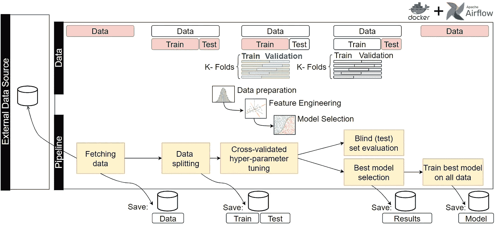

作者图片

# 介绍

这篇文章描述了用 **Docker** 在 **Apache Airflow** 上实现一个示例**机器学习管道**，涵盖了从头开始设置一个工作**本地环境**所需的所有步骤。

# 问题是

让我们想象一下，有一个 Jupyter 笔记本，上面有一个完善的机器学习实验，包括从原始数据到相当高性能的模型的所有阶段。

在我们的场景中，新的输入数据是由每天的批次提供的，一旦提供了新的批次，就应该执行训练过程，以便调整模型的参数来适应数据变化。

此外，应跟踪训练条件和参数以及表现，目的是监测不同训练期的结果。

最后，获得的模型应该被保存起来，并提供给其他系统用于推理，同时允许对每个生成的模型进行版本控制。

因此，我们希望创建一个管道来:

1.  从外部来源获取每日批次，并存储它们以备将来使用。
2.  将数据拆分为训练集和测试集，并存储它们以供参考。
3.  为超参数调整执行 k 倍交叉验证训练，并选择最佳参数集。
4.  评估测试集的性能。
5.  存储实验结果(最佳参数、训练条件、测试集性能)
6.  对所有数据(训练集和测试集)拟合最佳估计值。
7.  保存获得的模型以备将来使用。

这些要求可以通过以下渠道实现:

图片作者。

我们将使用 **Apache Airflow** 实现这个管道，这是一个流行的开源 orchestrator，允许以编程方式创作、调度和监控工作流。

# 环境设置

设置很简单，唯一的先决条件是安装了 **Docker Compose** 。

我们从 Airflow 的官方 Docker Compose yaml 文件开始，并应用以下更改:

1.  将*air flow _ _ CORE _ _ EXECUTOR*设置为 *LocalExecutor* ，因为我们的目的是在本地运行管道。
2.  删除 *Redis* 、 *Flower* 和 *Worker* 服务及其依赖项的定义，因为本地执行不需要它们。
3.  将*air flow _ _ CORE _ _ LOAD _ EXAMPLES*设置为 *false* ，因为我们不希望在访问 web UI 时加载本地示例。
4.  用*$ { _ PIP _ ADDITIONAL _ REQUIREMENTS:-scikit-learn }*填充*_ PIP _ ADDITIONAL _ REQUIREMENTS*，因为我们将在本例中使用 scikit-learn 库。
5.  再创建两个 Docker 卷，分别为:
    5.1 *。/data:/opt/airflow/data* ，以便存储数据。
    5.2 *。/models:/opt/airflow/models* ，用于存储模型对象。

*docker-compose.yaml* 文件如下:

一旦文件保存在项目的新文件夹中，我们可以从命令行运行:

我们可以通过执行以下命令来检查正在运行的容器:

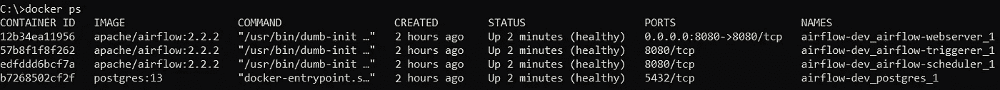

图片作者。

我们还可以检查 web 服务器生成的日志:

作者图片

确认 web UI 正确启动，并且可以通过位于 *localhost:8080* 的浏览器访问:

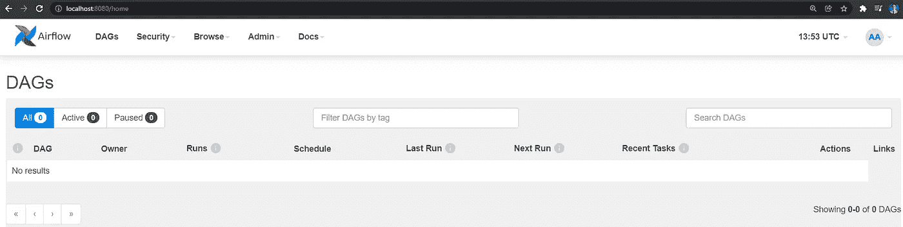

气流 UI。登录凭证在 Docker 撰写配置文件中定义。图片作者。

由于尚未创建 DAG，UI 显示一个空列表。

由于我们将连接到 PosgreSQL 数据库，我们必须创建一个**连接**对象:从主页中，我们应该选择*管理*，然后选择*连接，*，最后*添加一条新记录*。在编制表格时，我们应注明 *Postgres* 为连接类型:

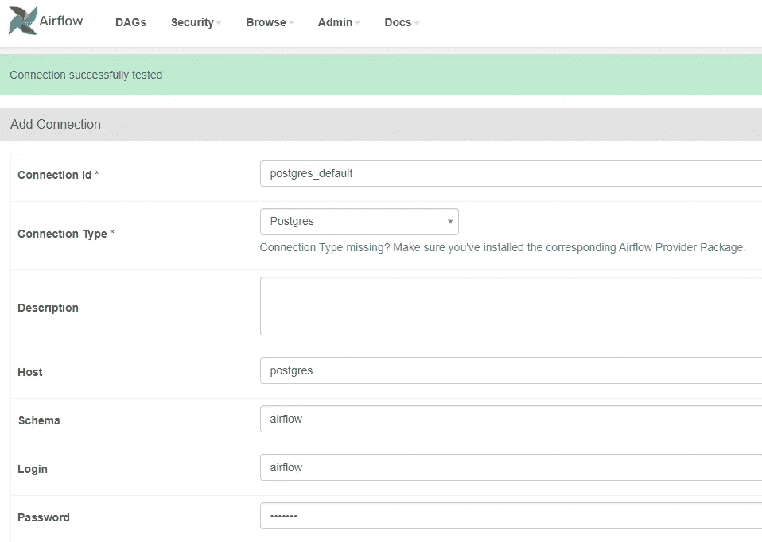

连接的创建形式:连接用于与外部源交互。图片作者。

值得注意的是，在 UI 中指定的*连接 Id* 将在 Python 代码中使用，以与 PostgreSQL 数据库进行交互。

我们现在可以在主机上的项目根目录下的“ *dags* ”文件夹下创建我们的管道，它们将被 Airflow 自动解析并在 UI 中可用。

# 管道实施

我们可以把任何工作流程想象成一系列有序的步骤。

在 Airflow 中，组成工作流的每一步都被称为**任务**，但是仅仅有任务是不够的，因为我们需要知道何时要执行它们，以什么顺序执行，它们之间的关系和依赖关系。

因此，我们需要将我们的原子步骤包装在一个**配置文件**中，该文件在一个结构化的工作流中组织分散的活动。

在 Airflow 中，这个配置文件被称为 **DAG⁴** (有向无环图)，它代表了我们管道的主干。

简化的 DAG 可能如下所示:

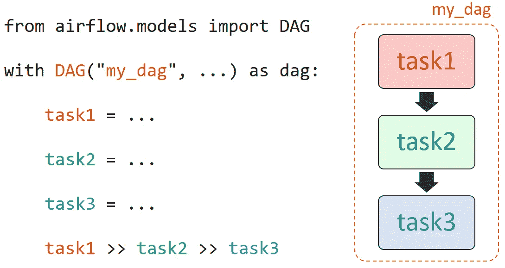

图片作者。

我们可能还希望并行运行特定的任务。例如，在交叉验证训练后，我们可能希望保存超参数调整中出现的最佳参数集，同时在整个数据集上拟合最佳估计量。

这可以通过*任务组*对象来实现:

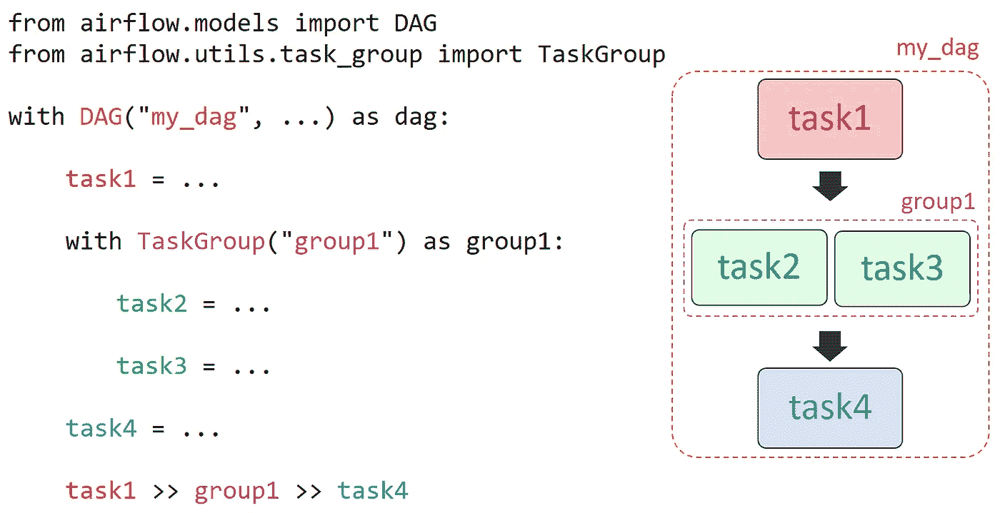

任务 2 和任务 3 可以并行执行。图片作者。

我们现在可以在项目的 *dags* 文件夹下创建 Python 文件 *ml_pipeline.py* :

所有任务都是从名为 **operators⁵** 的预定义模板中创建的。特别是，我们使用 **PostgresOperator** 对 PostgreSQL 执行静态 SQL 查询，使用 **PythonOperator** 执行 Python 代码。

在 *dags* 文件夹下，我们可以创建一个名为 *utils* 的子文件夹来存储每个任务调用的函数。

在 *utils* 文件夹中，我们首先创建一个简单的配置文件来存储所有与训练相关的参数(例如训练-测试分割率等)和持久性(数据库连接、模式、表等):

我们还创建了一个函数，它将在与 docker compose 配置文件中定义的数据量相关联的路径中加载和保存数据文件:

第一个任务函数获取批处理数据。对于这个例子，我们将简单地从 scikit-learn 加载“*乳腺癌数据集*”⁶，以避免我们的测试环境中的外部依赖性:

然后，我们的数据集被分成:

*   *训练集*:用于交叉验证程序，以便找到最佳参数集(超参数调整)。
*   *测试集*:用于估计样本外性能。

同时，我们在 PostgreSQL 数据库上保存一份批处理数据的副本:

我们执行 k 倍交叉验证训练，以找到最佳的超参数集。我们的培训程序包括:

*   缩放训练数据。
*   执行主成分分析(PCA)进行降维。
*   拟合逻辑回归分类器。

一旦训练过程完成，我们用最佳估计器评估测试集的性能。

实验结果保存在 PostgreSQL 数据库中:

现在，我们可以在整个数据集上拟合最佳估计值，并最终使模型可用于推断:

在第一个任务中执行的两条 SQL 语句放在 *sql* 子文件夹中:

项目文件夹结构现在如下所示:

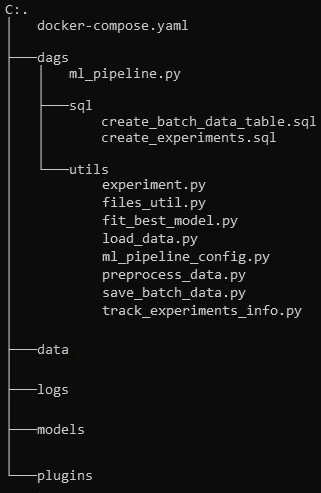

项目文件夹的结构。图片作者。

通过在 *localhost:8080* 打开浏览器，我们的 DAG 应该是可见的:

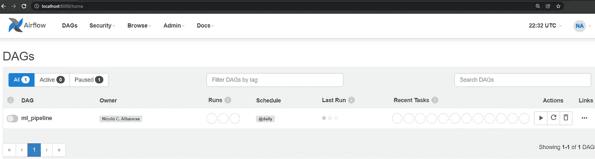

通过单击 DAG 的名称，可以在专用视图中查看更多信息:

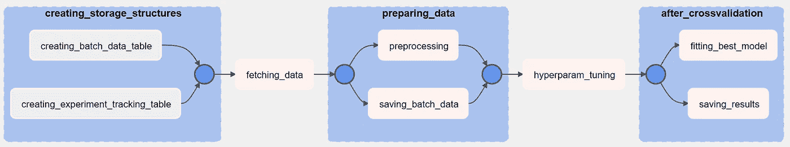

气流用户界面的图形视图中显示的管道。图片作者。

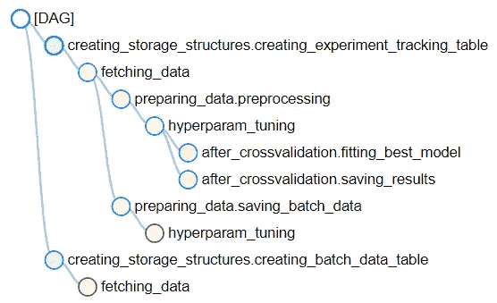

出现在气流用户界面树视图中的管道。图片作者。

# 执行管道

我们可以通过启用 DAG 名称左侧的滑块并按下屏幕右侧的*播放*按钮，从气流 UI 触发管道。

一旦触发工作流，就可以实时监控其进度，因为每个任务都根据 DAG 的定义进行排队和运行:

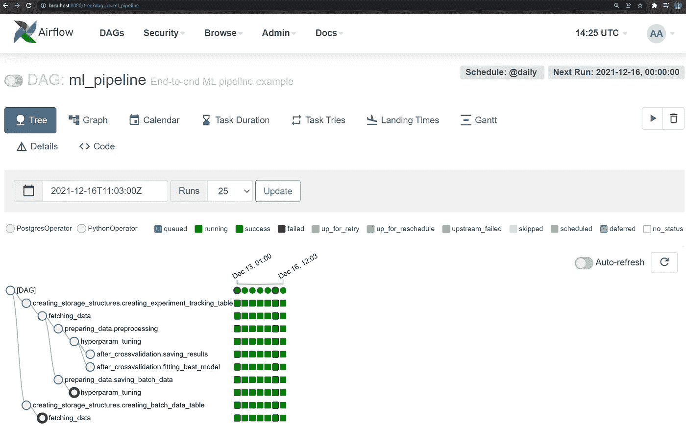

DAG 执行后，所有任务都呈现“成功”状态。图片作者。

我们还可以通过甘特图观察每项任务花了多长时间。不出所料，k 倍交叉验证训练是最耗时的任务:

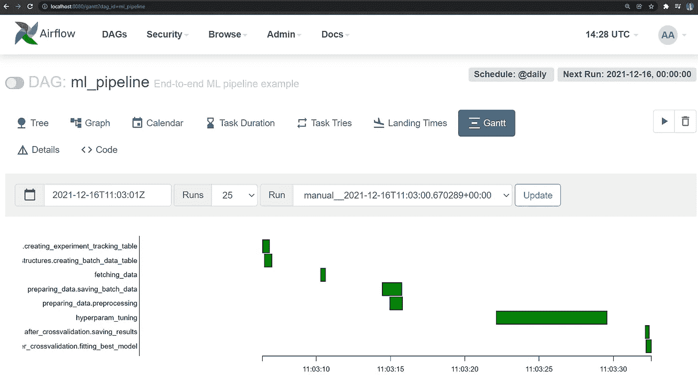

甘特图视图。图片作者。

模型和数据分别保存在*模型*和*数据*项目文件夹中，这得益于通过 Docker compose 配置文件安装在容器上的卷。

我们还可以从容器内部观察它们，如下所示:

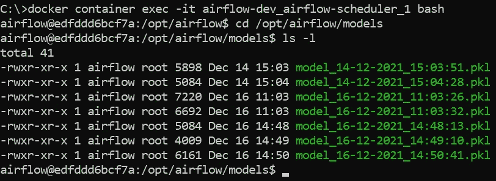

图片作者。

我们将传入的批处理数据和训练结果保存在与 Airflow metastore 关联的本地 PostgreSQL 中的数据库表中。

我们可以从命令行检查这些表:

图片作者。

通过该表，我们可以跟踪不同的跑步、训练条件和最佳参数，以及测试集的准确性。

类似地，我们可以检查获取后保存的批量数据:

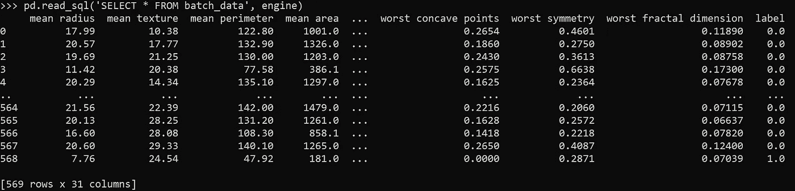

图片作者。

# 结论

Apache Airflow 是一个流行的开源 orchestrator。我们通过 Docker Compose 安装了它，并将其配置为在本地环境中运行。我们还实现了一个完全可操作的机器学习管道。

在这个例子中，为了简单起见，避免了额外的服务和到外部工具的连接。

重要的是要记住:

1.  气流是一个**的指挥者**。理想情况下，它应该**而不是**执行任务，而是简单地将它们包装在一个允许调度、监控和扩展的逻辑结构中。
2.  我们利用**本地执行器**来实现一个用于测试目的的本地工作环境。尽管如此，为了能够将任务扩展和推送到工作节点，应该使用其他类型的执行器，例如**芹菜 Executor⁸** 或**库伯内特 Executor⁹** 。
3.  我们将数据存储在与气流的 metastore 相关联的本机 **PostgreSQL** 中。这允许创建一个工作示例，而无需指定进一步的服务。然而，职责分离和生命周期解耦需要将管道数据存储在编制器组件的外部。
4.  我们通过利用*_ PIP _ ADDITIONAL _ REQUIREMENTS*配置属性安装了所需的依赖项。虽然对于测试来说很方便，但是不建议在生产系统中使用。自定义图像应建立而不是⁰.
5.  在涉及**大型数据集**的真实世界场景中，Python 和 Pandas(以及 csv 文件)不会是最有利于数据操作的方法，而 **Spark** 则更可取。
6.  **使用 Apache Airflow 的最佳实践**可在此处找到。

# 参考

[1][https://airflow.apache.org/](https://airflow.apache.org/)

[2][https://docs.docker.com/compose/install/](https://docs.docker.com/compose/install/)

【3】[https://air flow . Apache . org/docs/Apache-air flow/stable/docker-compose . YAML](https://airflow.apache.org/docs/apache-airflow/stable/docker-compose.yaml)

【4】[https://air flow . Apache . org/docs/Apache-air flow/stable/concepts/DAGs . html](https://airflow.apache.org/docs/apache-airflow/stable/concepts/dags.html)

[5][https://air flow . Apache . org/docs/Apache-air flow/stable/concepts/operators . html](https://airflow.apache.org/docs/apache-airflow/stable/concepts/operators.html)

[6][https://archive . ics . UCI . edu/ml/datasets/Breast+Cancer+Wisconsin+(诊断)](https://archive.ics.uci.edu/ml/datasets/Breast+Cancer+Wisconsin+(Diagnostic))

[https://github.com/NicoloAlbanese/airflow-ml-pipeline-mvp](https://github.com/NicoloAlbanese/airflow-ml-pipeline-mvp)

【8】[https://air flow . Apache . org/docs/Apache-air flow/stable/executor/celery . html](https://airflow.apache.org/docs/apache-airflow/stable/executor/celery.html)

[9][https://air flow . Apache . org/docs/Apache-air flow/stable/executor/kubernetes . html](https://airflow.apache.org/docs/apache-airflow/stable/executor/kubernetes.html)

[https://airflow.apache.org/docs/docker-stack/build.html](https://airflow.apache.org/docs/docker-stack/build.html)

[11][https://air flow . Apache . org/docs/Apache-air flow/stable/best-practices . html](https://airflow.apache.org/docs/apache-airflow/stable/best-practices.html)