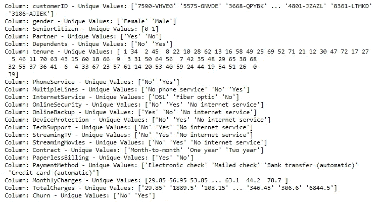
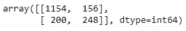

# 端到端机器学习项目:电信客户流失

> 原文：<https://towardsdatascience.com/end-to-end-machine-learning-project-telco-customer-churn-90744a8df97d?source=collection_archive---------0----------------------->

## [实践教程](https://towardsdatascience.com/tagged/hands-on-tutorials)

## 分析 IBM 电信数据(Kaggle 数据集)

杰里米·贝赞格在 Unsplash 上的照片

预测**客户流失**对于**电信公司**能够有效留住客户至关重要。获得新客户比留住现有客户的成本更高。出于这个原因，大型电信公司正在寻求开发模型来预测哪些客户更有可能改变并采取相应的行动。

在本文中，我们建立了一个模型来**预测客户流失**的可能性，方法是分析其特征:(1) **人口统计信息**、( 2) **账户信息**和(3) **服务信息**。目标是获得一个数据驱动的解决方案，使我们能够降低流失率，从而提高客户满意度和公司收入。

# 数据集

本文中使用的数据集可在**ka ggle(**CC BY-NC-ND**)**和中获得，包含**十九列(自变量)**，表明一个虚构电信公司的客户的**特征。`Churn`列(**响应变量**)表示客户是否在上个月离开。类别`No`包括上个月没有离开公司的客户，而类别`Yes`包括决定终止与公司关系的客户。分析的目标是获得**客户特征和流失**之间的关系。**

<https://www.kaggle.com/blastchar/telco-customer-churn>  

原始的 IBM 数据可以在下面的链接中找到:

  

Kaggle 中可用的数据集是对原始 IBM 数据的改编。

# 项目步骤

该项目由以下部分组成:

1.  **数据读取**
2.  **探索性数据分析和数据清洗**
3.  **数据可视化**
4.  **特征重要性**
5.  **特色工程**
6.  **设置基线**
7.  **拆分训练集和测试集中的数据**
8.  **评估多种算法**
9.  **选择的算法:梯度增强**
10.  **超参数调谐**
11.  **模型的性能**
12.  **得出结论—总结**

# 1.数据读取

分析的第一步包括**使用`pandas.read_csv`函数读取和存储 Pandas 数据帧中的数据**。

作者创造的形象

作者创造的形象

如上图所示，数据集包含 **19 个自变量**，可分为 3 组:

**(1)人口统计信息**

*   `gender`:客户是女性还是男性(`Female`、`Male`)。
*   `SeniorCitizen`:客户是否为老年人(`0`、`1`)。
*   `Partner`:客户是否有伴侣(`Yes`、`No`)。
*   `Dependents`:客户是否有家属(`Yes`、`No`)。

**(2)客户账户信息**

*   `tenure`:客户在公司的月数(多个不同的数值)。
*   `Contract`:表示客户当前的合同类型(`Month-to-Month`、`One year`、`Two year`)。
*   `PaperlessBilling`:客户是否无纸化开票(`Yes`、`No`)。
*   `PaymentMethod`:客户的付款方式(`Electronic check`、`Mailed check`、`Bank transfer (automatic)`、`Credit Card (automatic)`)。
*   `MontlyCharges`:每月向客户收取的金额(多个不同的数值)。
*   `TotalCharges`:向客户收取的总金额(多个不同的数值)。

**(3)服务信息**

*   `PhoneService`:客户端是否有电话服务(`Yes`、`No`)。
*   `MultipleLines`:客户端是否有多条线路(`No phone service`、`No`、`Yes`)。
*   `InternetServices`:客户是否向公司订购了互联网服务(`DSL`、`Fiber optic`、`No`)
*   `OnlineSecurity`:客户端是否有在线安全(`No internet service`、`No`、`Yes`)。
*   `OnlineBackup`:客户端是否有在线备份(`No internet service`、`No`、`Yes`)。
*   `DeviceProtection`:客户端是否有设备保护(`No internet service`、`No`、`Yes`)。
*   `TechSupport`:客户是否有技术支持(`No internet service`、`No`、`Yes`)。
*   `StreamingTV`:客户端是否有流媒体电视(`No internet service`、`No`、`Yes`)。
*   `StreamingMovies`:客户端是否有流媒体电影(`No internet service`、`No`、`Yes`)。

# 2.探索性数据分析和数据清理

**探索性数据分析**包括分析数据集的主要特征，通常采用**可视化方法**和**汇总统计**。目标是理解数据，发现模式和异常，并在执行进一步评估之前检查假设。

## 缺少值和数据类型

在 EDA 之初，我们希望了解尽可能多的关于数据的信息，这就是`pandas.DataFrame.info`方法派上用场的时候。该方法打印数据帧的**简明摘要，包括列名及其数据类型、非空值的数量以及数据帧使用的内存量。**

作者创造的形象

如上图所示，数据集包含 **7043 个观察值**和 **21 列**。显然，数据集上没有空值；然而，我们观察到列`TotalCharges`被**错误地检测为对象**。该列表示向客户收取的总金额，因此它是一个数字变量。为了进一步分析，我们需要将这个列转换成一个**数字数据类型**。为此，我们可以使用`pd.to_numeric`功能。默认情况下，该函数在看到非数字数据时会引发异常；然而，我们可以使用参数`errors='coerce'`跳过这些情况，用一个`NaN`来代替它们。

我们现在可以观察到列`TotalCharges`有 11 个缺失值。

作者创造的形象

这些观察值的任期也为 0，即使这些条目的`MontlyCharges`不为空。这一信息似乎是矛盾的，因此，我们决定从数据集中删除这些意见。

## 删除 customerID 列

`customerID`一栏对于解释客户是否会流失是没有用的。因此，我们从数据集中删除该列。

## 付款方式面额

如下所示，一些支付方式名称在括号中包含单词 automatic。这些名称太长，无法在进一步的可视化中用作刻度标签。因此，我们从`PaymentMethod`列的条目中删除了括号中的澄清。

# 3.数据可视化

在本节中，我们通过使用可视化来分析数据。

## 响应变量

下面的**条形图**显示了与**响应变量** : `no`和`yes`的每一类相对应的观察值的百分比。如下所示，这是一个不平衡的数据集，因为两个类别在所有观测值中的分布并不均匀，其中`no`是多数类别( **73.42%** )。建模的时候，这种不平衡会导致大量的漏报，我们后面会看到。

作者创造的形象

在本文中，我们将使用**标准化堆积条形图**来分析结果中每个独立分类变量的**影响。**

一个**标准化堆积条形图**使每一列具有相同的高度，因此它对于比较总数没有用处；然而，**非常适合于比较所有独立变量组的响应变量如何变化**。

另一方面，我们使用**直方图**来评估结果中每个独立数值变量的**影响。如前所述，数据集不平衡；因此，我们需要画出每一类的概率密度函数(`density=True`)，以便能够适当地比较两种分布。**

## 人口统计信息

下面的代码为每个人口统计属性(`gender`、`SeniorCitizen`、`Partner`、`Dependents`)创建一个堆积百分比条形图，显示属性的每个类别的`Churn`的百分比。

人口统计信息—由作者创建的图像

如上所示，每个条形是自变量的一个类别，它被细分以显示每个响应类的比例(`No`和`Yes`)。

通过分析**人口统计属性**，我们可以提取出**以下结论**:

*   老年人的流失率几乎是年轻人的两倍。
*   我们不期望性别有显著的预测能力。当客户是男性或女性时，显示出相似的流失率。
*   有**合作伙伴**的客户比没有合作伙伴的客户流失少。

## 客户账户信息—分类变量

正如我们对人口统计属性所做的那样，我们对客户帐户属性的每个类别(`Contract`、`PaperlessBilling`、`PaymentMethod`)评估了`Churn`的百分比。

客户帐户信息—由作者创建的图像

通过分析**客户账户属性**，我们可以得出**以下结论**:

*   与拥有**年度合同**的客户相比，拥有**月度合同**的客户拥有**更高的流失率**。
*   选择**电子支票**作为支付方式的客户更有可能离开公司。
*   订阅**无纸化账单**的客户比未订阅的客户流失更多。

## 客户账户信息—数字变量

下面的图显示了`tenure`、`MontlyCharges`、`TotalCharges`按`Churn`的分布。对于所有数字属性，两个类别(`No`和`Yes`)的分布是不同的，这表明所有属性都将有助于确定客户是否翻盘。

客户帐户信息—由作者创建的图像

通过分析上面的**直方图，我们可以提取出下面的**结论**:**

*   当**月费**高时，流失率往往更大。
*   新客户(任期短的客户)更有可能流失。
*   总费用高的客户不太可能离开公司。

## 服务信息

最后，我们用堆积条形图评估每个类别的服务列的目标百分比。

服务信息—由作者创建的图像

通过评估**服务属性**，我们可以得出**以下结论**:

*   我们不期望**手机属性** ( `PhoneService`和`MultipleLines` ) 有显著的预测能力。两个独立变量中所有类别的流失百分比几乎相同。
*   拥有**在线安全**的客户比没有的客户流失少。
*   没有技术支持的客户比有技术支持的客户更容易流失。

通过查看上面的图表，我们可以确定与检测客户流失最相关的**属性。我们希望这些属性在我们未来的模型中是有区别的。**

# 4.特征重要性

## 互信息—线性和非线性关系的分析

**互信息**基于熵估计测量两个变量之间的相互依赖性。在机器学习中，我们感兴趣的是**评估每个自变量与响应变量**之间的依赖程度。互信息的值越高，相关性程度越高，这表明独立变量将有助于预测目标。

Scikit-Learn 库在`metrics`包中实现了交互信息。下面的代码计算数据集的每个分类变量和`Churn`变量之间的互信息得分。

作者创造的形象

**互信息**不仅能让我们更好地理解我们的数据，还能让我们**识别出完全独立于目标**的预测变量。如上图所示，`gender`、`PhoneService`、`MultipleLines`的互信息得分真的**接近于 0** ，意味着这些变量与目标没有很强的关系。这些信息与我们之前通过可视化数据得出的结论一致。在接下来的步骤中，我们应该考虑在训练前从数据集中删除这些变量，因为它们不能提供预测结果的有用信息。

特征重要性(交互信息得分)-由作者创建的图像

**互信息**将相关性的概念扩展到非线性关系，因为与皮尔逊相关系数不同，该方法**不仅能够检测线性关系，还能够检测非线性关系**。

# 5.特征工程

**特征工程**是**从数据中提取特征并将其转换成适合机器学习模型**的格式的过程。在这个项目中，我们需要转换数字和分类变量。大多数机器学习算法需要数值；因此，**在训练模型之前，应该将数据集中所有可用的分类属性编码到数字标签**中。此外，**我们需要将数字列转换成通用的刻度**。这将防止具有大值的列主导学习过程。在这个项目中实现的技术将在下面详细描述。所有的转换都只使用熊猫来实现；然而，我们也提供了一个使用 Scikit-Learn 的替代实现。如您所见，有多种方法可以解决同一个问题😃。

## 没有修改

`SeniorCitizen`列已经是二进制列，不应修改。

## 标签编码

**标签编码**用于将分类值替换为数值。这个编码**用一个数字标签**替换每个类别。在本项目中，我们使用带有以下二进制变量的标签编码:(1) `gender`、(2) `Partner`、(3) `Dependents`、(4) `PaperlessBilling`、(5) `PhoneService`、(6) `Churn`。

## 一键编码

**一键编码**为分类变量的每一级创建**一个新的二进制列。新列包含 0 和 1，表示数据中是否存在该类别。在这个项目中，我们对以下分类变量应用一键编码:(1) `Contract`、(2) `PaymentMethod`、(3) `MultipleLines`、(4) `InternetServices`、(5) `OnlineSecurity`、(6) `OnlineBackup`、(7) `DeviceProtection`、(8) `TechSupport`、(9) `StreamingTV`和(10) `StreamingMovies`。**

这种编码的主要缺点是数据集的维数显著增加(**维数灾难**)；因此，当分类列有大量唯一值时，应避免使用此方法。

## 正常化

**数据规范化**是机器学习中的常见做法，包括将**数字列**转换为**通用比例。**在机器学习中，有些特征值与其他特征值相差很多倍。具有较高值的特征将主导学习过程；然而，这并不意味着这些变量对预测目标更重要。**数据标准化**将多尺度数据转换为相同尺度。归一化后，所有变量对模型都有**相似的影响**，提高了学习算法的稳定性和性能。

统计学中有多种**归一化技术**。在这个项目中，我们将使用最小-最大方法将数字列(`tenure`、`MontlyCharges`和`TotalCharges`)调整到一个通用的比例。**最小-最大方法**(通常称为**归一化**)通过减去特征的最小值，然后除以范围，将特征重新缩放到 **[0，1]** 的**固定范围**。

# 6.设定基线

在机器学习中，**我们经常使用一个叫做基线的简单分类器来评估一个模型的性能**。在这个分类问题中，**没有流失的客户比率(最频繁的类别)可以用作基线**来评估生成的模型的质量。这些模型应该优于未来预测所考虑的基线能力。

# 7.拆分训练集和测试集中的数据

建立模型的第一步是**将数据分成两组**，通常称为**训练和测试集**。机器学习算法使用训练集来构建模型。测试集包含不属于学习过程的样本，用于评估模型的性能。使用看不见的数据来评估模型的质量以保证客观的评估是很重要的。

训练集和测试集—作者创建的图像

首先，我们创建一个变量`X`来存储数据集的**独立属性**。此外，我们创建一个变量`y`来只存储**目标变量** ( `Churn`)。

然后，我们可以使用`sklearn.model_selection`包中的`train_test_split`函数来创建训练集和测试集。

# 8.评估多种算法

**算法选择是任何机器学习项目中的一个关键挑战**，因为没有一种算法是所有项目中最好的。通常，我们需要评估一组潜在候选人，并选择那些提供更好性能的候选人进行进一步评估。

在这个项目中，我们比较了 **6 种不同的算法，**它们都已经在 Scikit-Learn 中实现。

*   **虚拟分类器(基线)**
*   **K 个最近邻居**
*   **逻辑回归**
*   **支持向量机**
*   **随机森林**
*   **梯度推进**

评估多种算法—图片由作者创建

如下所示，**所有模型在预测精度方面都优于虚拟分类器模型**。因此，我们可以确认**机器学习适用于我们的问题**，因为我们观察到基线上的改进。

重要的是要记住**我们已经使用默认的超参数**训练了所有的算法。许多机器学习算法的准确性对选择用于训练模型的超参数高度敏感。更深入的分析将包括在为超参数调整选择一个(或多个)模型之前，对更广泛的超参数(不仅仅是默认值)进行评估。尽管如此，这超出了本文的范围。在本例中，我们将仅进一步评估使用默认超参数呈现更高准确性的模型。如上所示，这对应于**梯度增强模型**，其显示了接近 80%的准确度。

# 9.选择的算法:梯度增强

**梯度推进**是一种非常流行的机器学习**集成方法**，基于多个模型的**顺序训练**进行预测。在梯度推进中，首先，使用原始数据的随机样本建立一个模型。拟合模型后，进行预测并计算模型的残差。**残差**是实际值和模型预测值之间的差值**。然后，根据前一个树的残差训练一个新的树，再次计算这个新模型的残差。我们重复这个过程，直到达到一个阈值(残差接近 0)，这意味着实际值和预测值之间的差异非常小。最后，**你取所有模型预测**(数据的预测和误差的预测)的总和，做出最终预测。**

梯度推进分类器—由作者创建的图像

我们可以使用来自`sklearn.ensemble`模块的`GradientBoostingClassifier`类，通过 Scikit-Learn 轻松构建一个**梯度增强分类器**。在**创建了模型**之后，我们需要**训练它**(使用`.fit`方法)并且**通过比较预测值(`.predict`方法)和实际的类值来测试它的性能**，正如你在上面的代码中看到的。

如 **Scikit-Learn 文档**(以下链接)所示，`GradientBoostingClassifier`有**多个超参数**；其中一些列举如下:

*   `learning_rate`:每棵树对最终预测的贡献。
*   `n_estimators`:要执行的决策树数量(提升阶段)。
*   `max_depth`:单个回归估计量的最大深度。
*   `max_features`:寻找最佳分割时要考虑的特征数量。
*   `min_samples_split`:分割内部节点所需的最小样本数。

<https://scikit-learn.org/stable/modules/generated/sklearn.ensemble.GradientBoostingClassifier.html>  

下一步是找到超参数的组合，从而对我们的数据进行最佳分类。这个过程称为超参数调整。

# 10.超参数调谐

到目前为止，我们已经将数据分为**训练集**用于**学习模型**的参数，以及**测试集**用于**评估其性能**。机器学习过程的下一步是执行超参数调整。超参数的**选择**包括根据超参数的不同组合测试模型的性能，根据**选择的度量**和**验证方法**选择那些性能最好的。

对于超参数调整，**我们需要将我们的训练数据再次分成一组用于训练的数据和一组用于测试超参数的数据(通常称为验证集)。使用 **k 倍** **交叉验证进行超参数调优**是非常常见的做法。训练集被再次分成 k 个大小相等的样本，1 个样本用于测试，其余 k-1 个样本用于训练模型，重复 k 次。然后，k 个评估度量(在这种情况下是精确度)被平均以产生单个估计量。**

需要强调的是**验证集用于超参数选择，而不是评估我们模型**的最终性能，如下图所示。

交叉验证的超参数调整—图片由作者创建

有多种技术可以找到模型的最佳超参数。最常用的方法有(1) **网格搜索**、(2) **随机搜索**、(3) **贝叶斯优化**。**网格搜索测试超参数的所有组合**并选择表现最好的一个。这是一个非常耗时的方法，尤其是当要尝试的超参数和值的数量非常大的时候。

在**随机搜索**中，您指定一个超参数网格，然后**随机组合被选择**，其中每个超参数组合被采样的机会相等。我们不分析超参数的所有组合，而只分析这些组合的随机样本。这种方法在计算上比尝试所有组合更有效；然而，它也有一些缺点。**随机搜索**的主要缺点是**并非网格的所有区域都被均匀覆盖，**尤其是当从网格中选择的组合数量很少时。

网格搜索与随机搜索——作者创建的图像

我们可以使用`sklearn.model_selection`包中的`RandomSearchCV`类在 Scikit-learn 中实现**随机搜索**。

首先，我们使用字典(`grid_parameters`)指定**超参数值**的网格，其中**键**表示**超参数**，而**值**是我们想要评估的**选项集**。然后，我们定义了`RandomizedSearchCV`对象，用于从这个网格中尝试不同的随机组合。被采样的超参数组合的数量在`n_iter`参数中定义。自然地，增加`n_iter`将在大多数情况下导致更精确的结果，因为更多的组合被采样；然而，在许多情况下，性能的提高并不显著。

作者创造的形象

拟合网格对象后，我们可以使用`best_params_`属性获得**最佳超参数**。如上所述，最好的超参数是: **{'n_estimators': 90，' min_samples_split': 3，' max_features': 'log2 '，' max_depth': 3}** 。

# 11.模型的性能

**机器学习过程**的最后一步是**通过使用混淆矩阵和一些评估指标来检查模型**(最佳超参数)的性能。

## 混淆矩阵

**混淆矩阵**，也称为误差矩阵，用于**通过检查正确和错误分类的观察值数量来评估机器学习模型**的性能。**矩阵的每一列包含预测类别，而每一行代表实际类别，反之亦然**。在完美的分类中，除了对角线之外，混淆矩阵将全为零。主对角线之外的所有元素代表错误分类。重要的是要记住，混淆矩阵允许我们观察错误分类的模式(错误分类的类别和程度)。

在**二元分类问题**中，**混淆矩阵**是一个由 4 个元素组成的 **2 乘 2 矩阵**:

*   **TP(真阳性)**:被正确归类为患病的脊柱问题患者人数。
*   **TN(真阴性)**:被正确分类为健康的无病变患者的数量。
*   **FP(假阳性)**:被错误归类为患病的健康患者人数。
*   **FN(假阴性)**:被误分类为健康的脊柱疾病患者数量。

困惑矩阵——作者创造的图像

**既然模型已经训练好了，是时候使用测试集来评估它的性能了。**首先，我们使用之前的模型(具有最佳超参数的梯度推进分类器)来预测测试数据的类别标签(使用`predict`方法)。然后，我们使用来自`sklearn.metrics`包的`confusion_matrix`函数构建混淆矩阵，以检查哪些观察值被正确分类。输出是一个 NumPy 数组，其中**行表示真实值**而**列表示预测类**。

如上所示，测试数据的 1402 个观察值被模型正确分类(1154 个真阴性和 248 个真阳性)。相反，我们可以观察到 356 个错误分类(156 个假阳性和 200 个假阴性)。

## 评估指标

评估模型的质量是机器学习过程的基本部分。最常用的**绩效评估指标**是根据混淆矩阵的元素计算出来的。

*   **准确性:**它代表被正确分类的预测的比例。准确性是最常用的评估指标；但是，请务必记住，在处理不平衡的数据集时，准确性可能会产生误导。

*   **灵敏度:**表示被识别为阳性的样本(患病患者)的比例。

*   **特异性:**表示阴性样本(健康患者)的比例。

*   **精度:**代表实际正确的正面预测比例。

我们可以使用混淆矩阵的数字来手动计算评估指标。或者，Scikit-learn 已经实现了函数`classification_report`，该函数为**提供了关键评估指标**的摘要。分类报告包含每个类别达到的精度、灵敏度、f1 值和支持度(样本数)。

作者创造的形象

如上图所示，我们获得了 0.55 (248/(200+248))的**灵敏度**和 0.88 (1154/(1154+156))的**特异性**。所获得的模型更准确地预测了不会流失的客户。这不应该让我们感到惊讶，因为**梯度提升分类器通常偏向于具有更多观察值的类别**。

您可能已经注意到，之前的总结不包含分类的准确性。然而，这可以通过使用`metrics`模块中的函数`accuracy_score`很容易地计算出来。

正如您所观察到的，超参数调整几乎没有增加模型的准确性。

# 12.得出结论——总结

在本帖中，我们使用**电信客户流失**数据集完成了一个完整的端到端机器学习项目。我们从清理数据开始，并用可视化分析它。然后，为了能够建立机器学习模型，我们将分类数据转换为数字变量(特征工程)。在转换数据后，我们使用默认参数尝试了 6 种不同的机器学习算法。最后，我们调整了用于模型优化的**梯度提升分类器**(最佳性能模型)的超参数，获得了近 80% (比基线高近 6%)的**准确度。**

需要强调的是，机器学习任务的**确切步骤因项目**而异。虽然在文章中我们遵循了线性过程，但机器学习**项目往往是迭代的，而不是线性过程**，当我们对我们试图解决的问题了解更多时，以前的步骤往往会被重新审视。

阿曼达·伊格莱西亚斯