# 端到端机器学习项目:使用 Flask 和 Heroku 将模型训练和部署为 Web 应用程序

> 原文：<https://towardsdatascience.com/end-to-end-machine-learning-project-train-and-deploy-models-as-web-apps-using-flask-and-heroku-74633096181c?source=collection_archive---------23----------------------->


作者图片


[https://www . pexels . com/photo/high-angle-photo-of-robot-2599244/](https://www.pexels.com/photo/high-angle-photo-of-robot-2599244/)

## *使用机器学习构建糖尿病预测应用*


[https://www . pexels . com/photo/time-lapse-photography-of-blue-lights-373543/](https://www.pexels.com/photo/time-lapse-photography-of-blue-lights-373543/)

商业问题:人工智能未来将发挥巨大作用的领域之一是医学。医生和研究人员一直试图使用**机器学习**和**深度学习**来学习癌症和其他慢性疾病的发生，方法是使用通过我们 DNA 和其他生活方式属性的蛋白质组合获得的数百万个数据点。在未来，我们可能能够提前十年或二十年知道我们患癌症的几率，从而帮助我们避免癌症。幸运的是，在我寻找一个好的医学科学数据集时，我在 Kaggle 上看到了这个皮马印第安人糖尿病数据集。它是从国家糖尿病、消化和肾病研究所收集的。这个数据集很小，有 9 个特征和 768 个观察值，足以解决预测一个人患糖尿病的概率的问题。

下面是我从数据源本身引用的所有特性的简要描述，供您参考。

**链接到数据集**:[*https://www.kaggle.com/uciml/pima-indians-diabetes-database*](https://www.kaggle.com/uciml/pima-indians-diabetes-database)

在阅读之前，请随意感受一下这个应用程序(:):

 [## 糖尿病预测

### 编辑描述

predict-diabetes-using-ml.herokuapp.com](https://predict-diabetes-using-ml.herokuapp.com/) 

# **数据集详情**

**1:怀孕次数:怀孕次数**

**2:葡萄糖:口服葡萄糖耐量试验中 2 小时的血浆葡萄糖浓度。**

**3:血压:舒张压(毫米汞柱)**

**4:皮肤厚度:三头肌皮褶厚度(mm)**

**5:胰岛素:2 小时血清胰岛素(μU/ml)**

**6:身体质量指数:身体质量指数(体重公斤/(身高米)**

**7:糖尿病谱系功能:糖尿病谱系功能**

**8:年龄:年龄(岁)**

**9:结果:768 个类变量(0 或 1)中的 268 个为 1，其余为 0**

所有的变量要么是已知的，要么可以在简单的血液测试中获得，而“结果”(糖尿病/非糖尿病)是我们需要预测的。

我们将探索不同的功能，并在尝试不同的机器学习算法(如**逻辑回归、支持向量机、决策森林、梯度推进**)之前执行各种**预处理技术**，最后我们还将探索**神经网络。一旦我们有了最佳模型，我们将使用 Pickle 保存我们的模型，并使用 Flask web 框架开发一个糖尿病预测应用程序，然后使用 Heroku 部署它。**

我们开始吧。拿杯咖啡！！

结构的简要概述:如果您不想概述准备和建模部分，请随意跳到步骤 2。

**第一步:数据准备和模型建立**

在这一步中，我们将探索数据，进行所需的预处理，并尝试各种机器学习模型，如逻辑回归、支持向量机、随机森林、梯度推进以及神经网络等最先进的模型。

**第二步:使用 Flask 和 HTML 构建应用**

在这里，我们将从步骤 1 中获取性能最好的模型，并使用 Flask 和 HTML 构建一个 web 应用程序。

**步骤 3:使用 Heroku 部署应用**

最终，我们将通过 Heroku 部署我们的工作应用，让全世界使用我们的产品。

# **第一步:数据准备和模型建立**

你可以在我的 Jupiter 笔记本上继续看下去，该笔记本可以从以下网址获得:[*https://github . com/garo disk/Diabetes-prediction-app-using-ML/blob/main/Diabetes % 20 prediction % 20 using % 20 machine % 20 learning . ipynb*](https://github.com/garodisk/Diabetes-prediction-app-using-ML/blob/main/Diabetes%20prediction%20using%20Machine%20Learning.ipynb)

```
#importing reqd libraries
import numpy as np
import pandas as pd
import seaborn as sns
import matplotlib.pyplot as plt
df.head()
```

对于数据的感觉，让我们打印头部:


作者图片

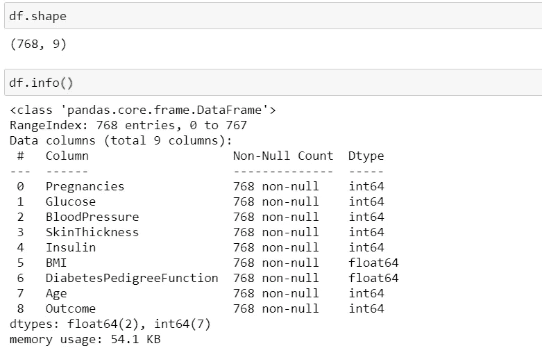

作者图片


作者图片

尽管数据的顶级概览显示没有空值，但更深入的分析显示许多属性都有 0 值，这没有任何意义。**怎么会有人的身体质量指数/皮肤厚度/年龄是 0 呢？**

让我们看看每个属性有多少个零值，并把它们转换成空值。我们稍后将使用插补技术处理这些空值。

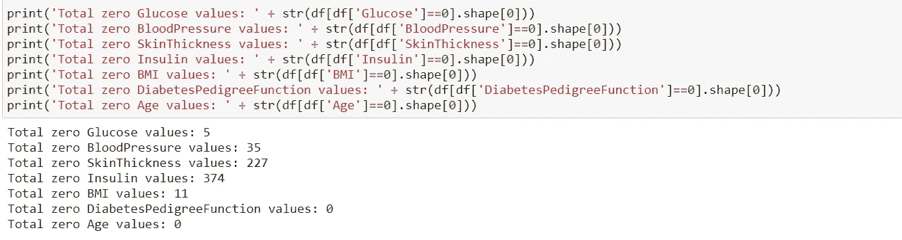

每个属性的值为零(图片由作者提供)

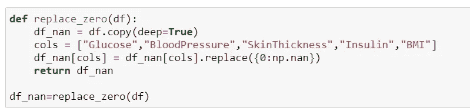

用空值替换零(作者图片)

现在，我们已经将所有的零值转换为空值，我们的下一步是估算这些空值。在这一点上，许多人只是使用一个简单的均值/中位数插补，他们使用整个列进行计算，这是不正确的。

为了输入每个空值，我们将查看结果是否属于糖尿病患者。我们将根据我们将看到的结果，使用特定属性的中值进行估算。如果一个空值属于糖尿病患者，我们将只使用糖尿病患者的记录来寻找中位数，同样，如果它属于非糖尿病患者，我们将使用非糖尿病患者的记录来寻找中位数。

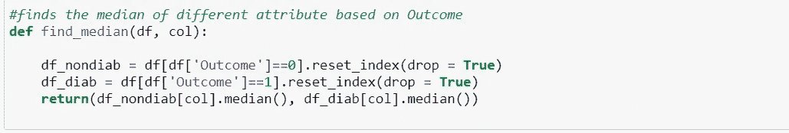

作者图片


基于结果的推断(图片由作者提供)

让我们分析一下**相关图**和**直方图**，以进一步了解数据。


作者图片

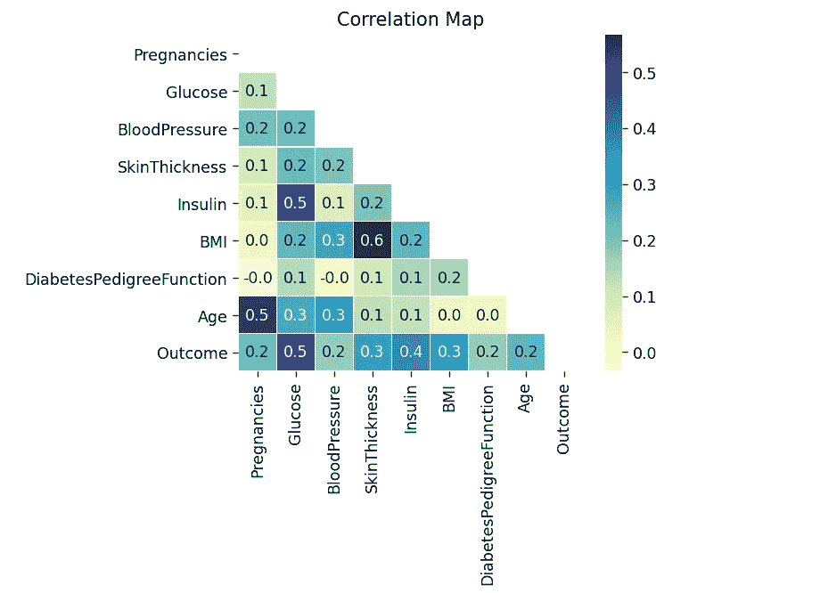

作者图片

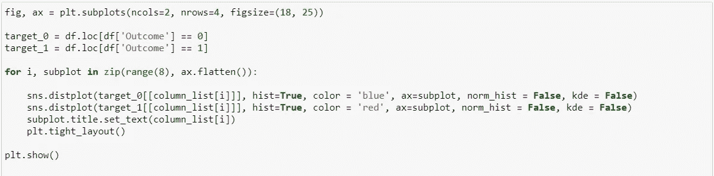

红色部分为糖尿病患者，蓝色部分为非糖尿病患者(图片由作者提供)


作者图片

我们可以看到，对于大多数属性，与非糖尿病人的分布(蓝色部分)相比，糖尿病人的分布(红色部分)向右移动。这基本上告诉我们一个故事，糖尿病患者更可能是一个老年人，具有更高的身体质量指数、皮肤厚度和葡萄糖水平。

接下来，我们将绘制这些属性的箱线图，以清楚地看到这些结果(糖尿病和非糖尿病)的每个属性的分布差异。

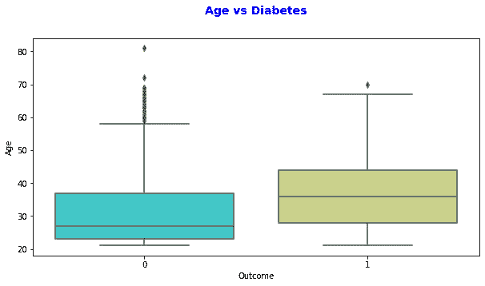

作者图片

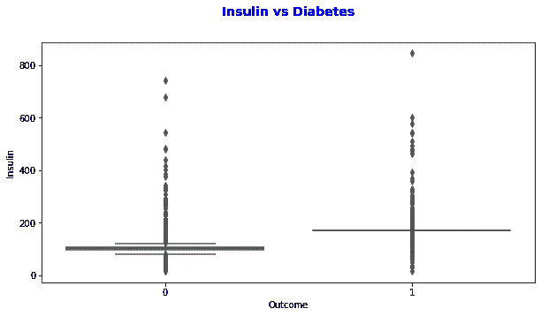

作者图片

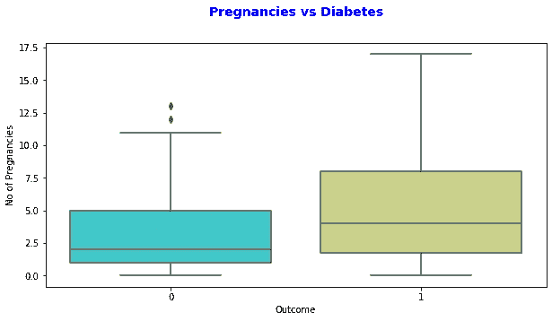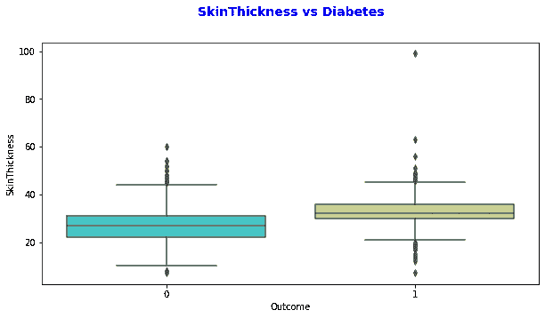

我们现在可以清楚地看到不同之处(图片由作者提供)

这是结果变量的分布:

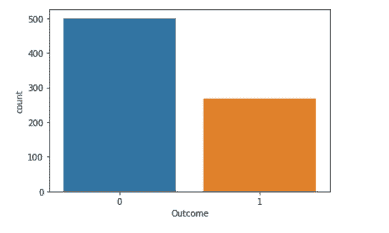

作者图片

该数据包含 500 名非糖尿病人和 268 名糖尿病人。

现在，让我们使用 **PCA** 和 **t-SNE** 将数据可视化在二维平面上，以获得更好的直觉。

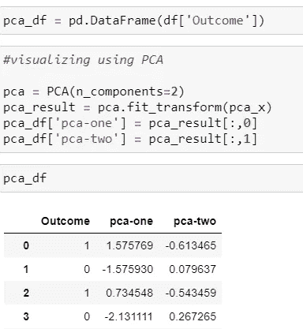

作者图片


作者图片


作者图片

PCA 在 2-d 可视化方面做得相当不错，因为 2 个主成分包含了数据总方差的大约 50%。现在，让我们试试 t-SNE，它更适合在 2-d 上可视化，因为它使用概率分布，并试图使相似的数据点在 2-d 平面上彼此更接近。

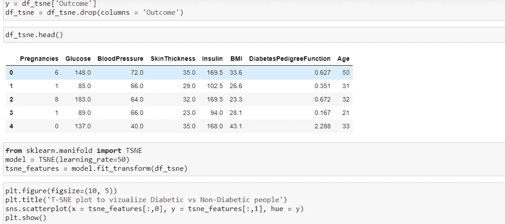

作者图片


作者图片

它确实做了一件伟大的工作。我们可以看到*糖尿病人和非糖尿病人大多聚集在 t-SNE 图上。*

现在，在建模之前，我们必须对数据进行缩放，因为所有属性的缩放比例不同。除了树算法，大多数机器学习算法，尤其是那些使用梯度下降或距离度量的算法，都需要缩放。

讨论最多的两种缩放方法是规范化和标准化。 ***正常化*** 通常意味着将数值重新调整到[0，1]的范围内。 ***标准化*** 通常意味着重新调整数据，使平均值为 0，标准差为 1(单位方差)。

规范化 vs .标准化是机器学习新人中永恒的问题。

*   当您知道数据的分布不符合高斯分布时，可以使用归一化。这在不假设任何数据分布的算法中很有用，例如 K-最近邻和神经网络。
*   另一方面，在数据遵循高斯分布的情况下，标准化会有所帮助。然而，这并不一定是真的。此外，与标准化不同，标准化没有边界范围。因此，即使您的数据中有异常值，它们也不会受到标准化的影响。
*   没有硬性的规则告诉我们什么时候对数据进行规范化或标准化。我们总是可以从将您的模型与原始的、规范化的和标准化的数据进行拟合开始，并比较性能以获得最佳结果。
*   **重要提示:*在训练数据上安装缩放器，然后用它来转换测试数据，这是一个很好的实践。这将避免模型测试过程中的任何数据泄漏。此外，通常不需要目标值的缩放。***

现在，让我们再次查看每个属性的分布，以了解哪些属性遵循高斯分布。

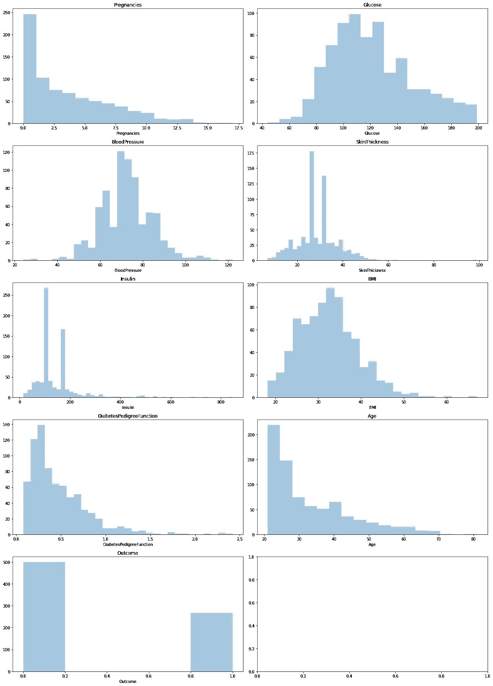

作者图片

只有**葡萄糖**、**血压**和**身体质量指数**遵循高斯分布，其中标准化是有意义的，但是由于没有硬性规定，我们将尝试三种情况并比较它们的性能。

1.  *对所有属性进行标准化，并在测试集上检查逻辑回归模型的性能*
2.  *在所有属性上使用标准化，并在测试集上检查逻辑回归模型的性能*
3.  *对遵循高斯分布的属性使用标准化，对其余属性使用标准化，并观察性能*

在上述 3 种方法中，**归一化法在使用逻辑回归模型的测试集上具有最佳精度 0.83** 。


作者图片


作者图片

**重复注释**:要记住的另一件重要事情是，只在训练集上使用标准标量，然后用它来缩放测试集，以避免数据泄漏。我们还将保存预处理器，以便在我们的机器学习应用程序中进一步使用。

**逻辑回归(准确率- 83%):**

现在，让我们尝试其他机器学习算法:

**K-最近邻(准确率- 87%):**


作者图片

**支持向量机(准确率- 88%-89%):**


作者图片

**随机森林(准确率- 88%-89%):**


作者图片

**梯度增强(准确率- 87%-88%):**

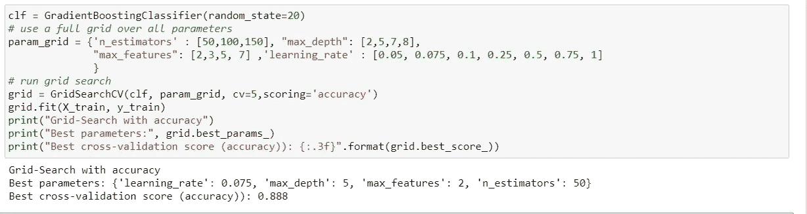

作者图片

在数据集上表现最好的机器学习算法是支持向量机和随机森林；两者的准确率都在 88%到 89%之间，但是支持向量机对于部署来说更加简单，并且当进一步的数据进入训练时将花费更少的时间。在使用 SVM 之前，让我们尝试看看神经网络如何在数据集上执行。


作者图片


作者图片

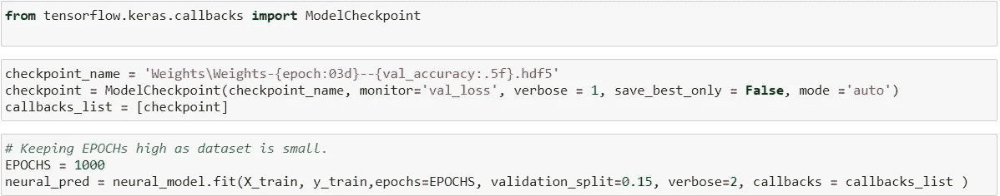

作者图片

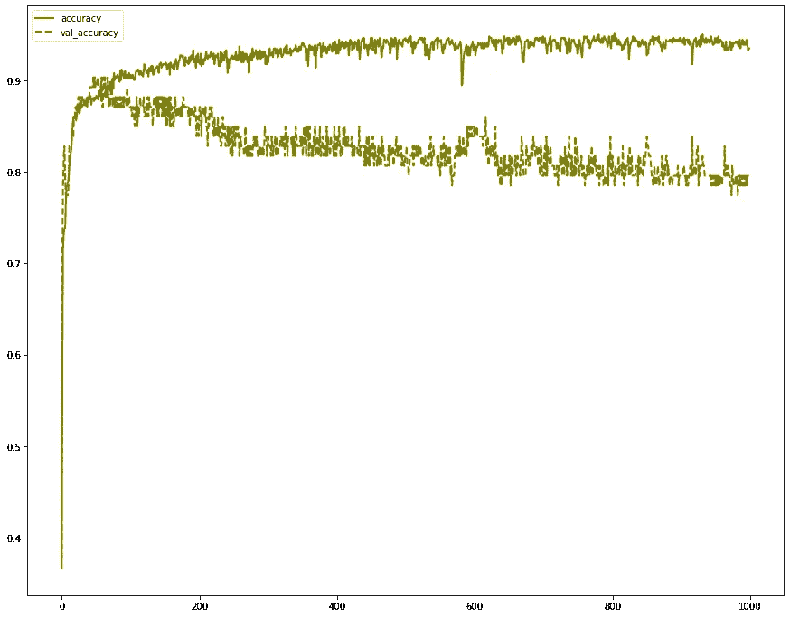

作者图片

*在测试集上，神经网络只有 85%的准确率。这是非常可能的，因为神经网络创建了一组更复杂的隐藏层，但同时，它需要越来越多的例子来获得更好的结果。我们的数据只包含 768 个观察值，它的表现很好。*

**神经网络(准确率- 85%)**

现在，作为最后一步，我们将把预测的 SVM 模型保存到. h5 或。使用类似于`pickle`的库来绑定文件。


作者图片

# **第二步:使用 Flask 和 HTML 构建应用**

下一步是将这个模型打包成一个 **web 服务**，当通过 POST 请求获得数据时，它会返回糖尿病预测概率作为响应。

为此，我们将使用 **Flask web 框架**，这是一个在 Python 中开发 web 服务的常用轻量级框架。

[*Flask*](https://palletsprojects.com/p/flask/) *是一个 web 框架，可以用来比较快速的开发 web 应用。你可以在这里* *找到一个快速开发* [*的演练。*](/deploying-a-keras-deep-learning-model-as-a-web-application-in-p-fc0f2354a7ff)

下面的`**app.py**`文件中的代码本质上是建立主页，并为用户提供***index.html***:

```
#import relevant libraries for flask, html rendering and loading the #ML modelfrom flask import Flask,request, url_for, redirect, render_template
import pickle
import pandas as pdapp = Flask(__name__)#loading the SVM model and the preprocessor
model = pickle.load(open(“svm_model.pkl”, “rb”))
std = pickle.load(open(‘std.pkl’,’rb’))#Index.html will be returned for the input
[@app](http://twitter.com/app).route(‘/’)
def hello_world():
 return render_template(“index.html”)#predict function, POST method to take in inputs
[@app](http://twitter.com/app).route(‘/predict’,methods=[‘POST’,’GET’])
def predict():#take inputs for all the attributes through the HTML form
 pregnancies = request.form[‘1’]
 glucose = request.form[‘2’]
 bloodpressure = request.form[‘3’]
 skinthickness = request.form[‘4’]
 insulin = request.form[‘5’]
 bmi = request.form[‘6’]
 diabetespedigreefunction = request.form[‘7’]
 age = request.form[‘8’]#form a dataframe with the inpus and run the preprocessor as used in the training 
 row_df = pd.DataFrame([pd.Series([pregnancies, glucose, bloodpressure, skinthickness, insulin, bmi, diabetespedigreefunction, age])])
 row_df = pd.DataFrame(std.transform(row_df))

 print(row_df)#predict the probability and return the probability of being a diabetic
 prediction=model.predict_proba(row_df)
 output=’{0:.{1}f}’.format(prediction[0][1], 2)
 output_print = str(float(output)*100)+’%’
 if float(output)>0.5:
 return render_template(‘result.html’,pred=f’You have a chance of having diabetes.\nProbability of you being a diabetic is {output_print}.\nEat clean and exercise regularly’)
 else:
 return render_template(‘result.html’,pred=f’Congratulations, you are safe.\n Probability of you being a diabetic is {output_print}’)if __name__ == ‘__main__’:
 app.run(debug=True)
```

**详细步骤(app.py):**

创建一个新文件 app.py。

导入 flask 模块，通过实例化 Flask 类创建 Flask 应用程序。

```
#import relevant libraries for flask, html rendering and loading the ML modelfrom flask import Flask,request, url_for, redirect, render_template
import pickle
import pandas as pdapp = Flask(__name__)
```

现在，让我们导入保存的**预处理**元素和**模型**。

```
#loading the SVM model and the preprocessor
model = pickle.load(open(“svm_model.pkl”, “rb”))
std = pickle.load(open(‘std.pkl’,’rb’))
```

现在，让我们定义将呈现**index.html**网页(使用 HTML 创建)的**路径**。这个文件有 CSS 运行和外观的背景，并有相关的字段供用户输入属性值。

```
#Index.html will be returned for the input
[@app](http://twitter.com/app).route(‘/’)
def hello_world():
 return render_template(“index.html”)
```

让我们也定义一下`predict/`路线和与之对应的函数，该函数将接受不同的输入值，并使用 SVM 模型返回预测值。

*   *首先，我们将使用请求方法从用户处获取数据***，并将值存储在各自的变量中。**
*   **现在，我们将* ***预处理*** *使用我们上面加载的标量* ***预处理器*** *并使用* ***模型*** *到* ***预测*** *一个人患糖尿病的概率**
*   **接下来，我们将呈现****result.html****页面，并根据* ***预测*** 显示相关输出*

```
*#predict function, POST method to take in inputs
[@app](http://twitter.com/app).route(‘/predict’,methods=[‘POST’,’GET’])
def predict():#take inputs for all the attributes through the HTML form
 pregnancies = request.form[‘1’]
 glucose = request.form[‘2’]
 bloodpressure = request.form[‘3’]
 skinthickness = request.form[‘4’]
 insulin = request.form[‘5’]
 bmi = request.form[‘6’]
 diabetespedigreefunction = request.form[‘7’]
 age = request.form[‘8’]#form a dataframe with the inpus and run the preprocessor as used in the training 
 row_df = pd.DataFrame([pd.Series([pregnancies, glucose, bloodpressure, skinthickness, insulin, bmi, diabetespedigreefunction, age])])
 row_df = pd.DataFrame(std.transform(row_df))

 print(row_df)#predict the probability and return the probability of being a diabetic
 prediction=model.predict_proba(row_df)
 output=’{0:.{1}f}’.format(prediction[0][1], 2)
 output_print = str(float(output)*100)+’%’
 if float(output)>0.5:
 return render_template(‘result.html’,pred=f’You have a chance of having diabetes.\nProbability of you being a diabetic is {output_print}.\nEat clean and exercise regularly’)
 else:
 return render_template(‘result.html’,pred=f’Congratulations, you are safe.\n Probability of you being a diabetic is {output_print}’)*
```

*现在，让我们在运行 flask 应用程序之前放置最后一段代码。*

```
*if __name__ == '__main__':
    app.run(debug=True)*
```

*从终端，我们可以使用 python 环境运行应用程序:*

*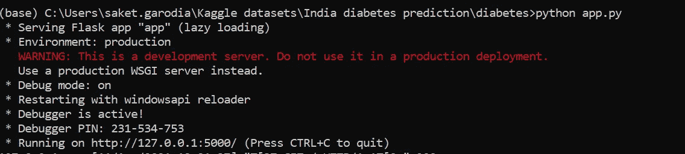*

*作者图片*

*是时候庆祝了。我们的应用程序正在本地运行，如果你也遵循代码。如果没有，不要担心，我们也将为公众部署在 Heroku 上。 [http://127.0.0.1:5000/](http://127.0.0.1:5000/)*

*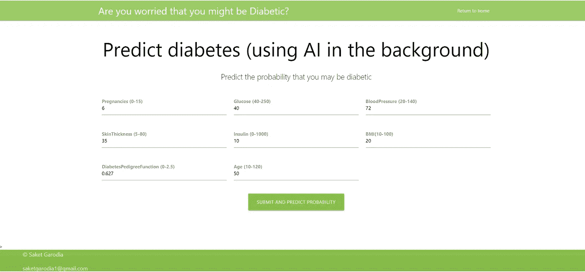*

*主页(图片由作者提供)*

# ***第三步:使用 Heroku 部署应用***

**

*作者图片*

# *什么是 Heroku？*

*Heroku 是一个平台即服务工具，允许开发者托管他们的无服务器代码。这意味着人们可以开发脚本来为特定的目的服务。Heroku 平台本身托管在 AWS(亚马逊网络服务)上，AWS 是一个基础设施即服务工具。*

*我们将使用 Heroku 进行托管，因为他们有一个很好的非商业应用免费层。*

*部署应用程序有多种方式。*最常见的一种方式是* ***构建一个 docker*** *然后将 docker 部署到****Heroku****平台中。在这里，由于数据和模型是公开的，我们将只使用 Github，然后在 Heroku 中部署 Github 存储库。**

*让我们首先为应用程序创建所需的文件夹结构。*

```
*diabetes(root)
 |____templates
      |___index.html  #main html page to enter the data
      |___result.html #Page returned after pressing submit |____static
      |____css  #code for the look and feel of the web app
      |_____js
 |____app.py    #main file with flask and prediction code
 |_____svm_model.pkl    #model
 |_____std.pkl    #preprocessor
 |_____requirements.txt   #Library list with versions
 |_____Procfile*
```

1.  ***模板**:***index.html****包含了引入 web 表单的 HTML 代码，用户可以在其中输入不同属性的值。****【result.html】****包含了预测页面的代码。**
2.  ***static** : static 包含了 CSS，其中包含了 HTML 页面外观的代码*
3.  ***app.py** 是主文件，如前一节所述*
4.  ***svm_model** 和 **std.pkl** 分别是模型和预处理器，将用于在新数据中进行预测*
5.  *requirements.txt 包含了所有被使用的库及其版本的细节*

```
*Flask==1.1.1
gunicorn==19.9.0
itsdangerous==1.1.0
Jinja2==2.10.1
MarkupSafe==1.1.1
Werkzeug==0.15.5
numpy>=1.9.2
scipy>=0.15.1
scikit-learn>=0.18
matplotlib>=1.4.3
pandas>=0.19*
```

***6。Procfile** :包含在服务器上运行应用程序的命令。*

```
*web: gunicorn app:app*
```

*上面的第一个 **app** 是包含我们的应用程序(app.py)和代码的 python 文件的名称。第二个是路由的名称，如下所示。*

```
*#predict function, POST method to take in inputs
[@app](http://twitter.com/app).route(‘/predict’,methods=[‘POST’,’GET’])
def predict():#take inputs for all the attributes through the HTML form
 pregnancies = request.form[‘1’]
 glucose = request.form[‘2’]
 bloodpressure = request.form[‘3’]
 skinthickness = request.form[‘4’]
 insulin = request.form[‘5’]
 bmi = request.form[‘6’]
 diabetespedigreefunction = request.form[‘7’]
 age = request.form[‘8’]*
```

****guni corn:****并发处理传入 HTTP 请求的 web 应用程序比一次只处理一个请求的 Web 应用程序更有效地利用 dyno 资源。因此，我们建议在开发和运行生产服务时使用支持并发请求处理的 web 服务器。**

*现在我们已经万事俱备，下一步是**将项目提交给一个新的 Github 库。***

*我刚刚在一个新的 Github 存储库中上传了糖尿病根文件夹，以及上面描述的结构中的所有文件。*

**

*作者图片*

**

*Github 截图(图片由作者提供)*

*我们只需要创建一个 Heroku 帐户，创建一个新的应用程序，连接到 Github 并部署我们新创建的存储库。*

**

*创建新应用程序(图片由作者提供)*

*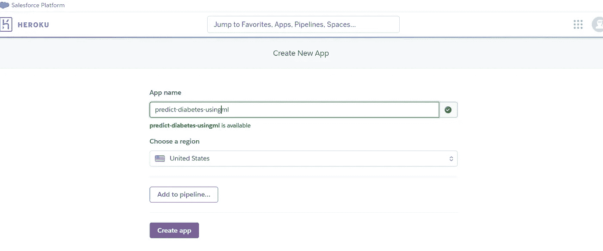*

*作者图片*

**

*连接到右边的 Github 库(图片由作者提供)*

*恭喜，我们能够部署我们的机器学习应用程序了。现在，让我们访问 web 应用程序链接，并使用不同的属性值检查成为糖尿病患者的概率。*

*请随意使用 web 应用程序。以下是链接:*

# *https://predict-diabetes-using-ml.herokuapp.com/*

**

*主页(图片由作者提供)*

*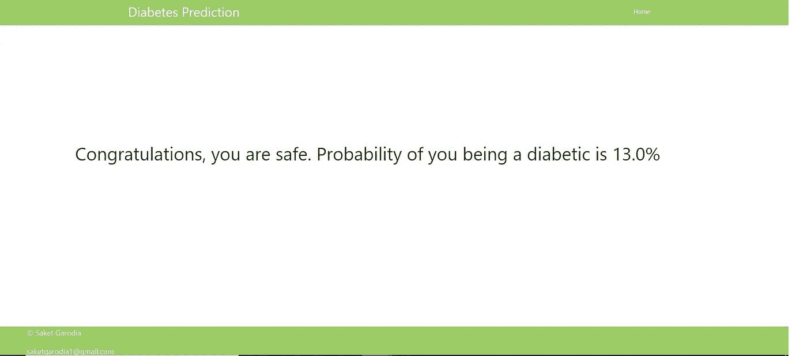*

*非糖尿病人的输出(图片由作者提供)*

*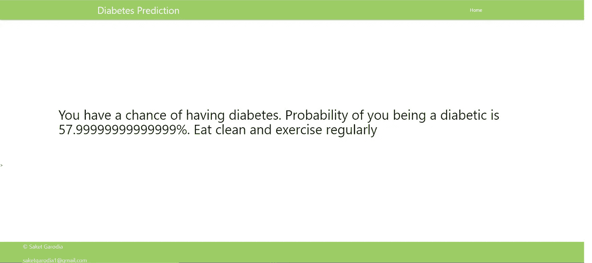*

*糖尿病患者的输出(图片由作者提供)*

*按照我的代码，这里是我的 Github 库的链接:https://Github . com/garo disk/Diabetes-prediction-app-using-ML*

# ***感谢阅读。***

*你可以在 **Linkedin 上联系我:**[https://www.linkedin.com/in/saket-garodia/](https://www.linkedin.com/in/saket-garodia/)*

*以下是我的一些其他博客:*

***推荐系统(使用 Spark)**:[https://towards data science . com/building-a-Recommendation-engine-to-recommended-books-in-Spark-f 09334d 47d 67](/building-a-recommendation-engine-to-recommend-books-in-spark-f09334d47d67)*

***模拟***

*[https://towards data science . com/gambling-with-a-statistics-brain-AE 4 E0 b 854 ca 2](/gambling-with-a-statisticians-brain-ae4e0b854ca2)*

***购物篮分析***

*[](https://medium.com/analytics-vidhya/market-basket-analysis-on-3-million-orders-from-instacart-using-spark-24cc6469a92e) [## 使用 Spark 对 Instacart 的 300 万份订单进行购物篮分析。

### 使用 FP-growth 算法分析超市产品之间的关联

medium.com](https://medium.com/analytics-vidhya/market-basket-analysis-on-3-million-orders-from-instacart-using-spark-24cc6469a92e) 

**电影推荐系统**

[](https://medium.com/analytics-vidhya/the-world-of-recommender-systems-e4ea504341ac) [## 推荐系统的世界

### 数据科学领域的推荐系统有哪些？

medium.com](https://medium.com/analytics-vidhya/the-world-of-recommender-systems-e4ea504341ac) 

**信用违约分析**

[https://medium . com/analytics-vid hya/credit-default-analysis-using-machine-learning-from scratch-part-1-8d bad 1 FAE 14？sk = c 2559676 ba 1b 34 b 01 ad 9 c 6 beab 69180 f](https://medium.com/analytics-vidhya/credit-default-analysis-using-machine-learning-from-scratch-part-1-8dbaad1fae14?sk=c2559676ba1b34b01ad9c6beab69180f)

参考资料:

[](https://www.upgrad.com/blog/deploying-machine-learning-models-on-heroku/) [## 在 Heroku | upGrad 博客上部署机器学习模型

### 机器学习是一个连续的过程，包括数据提取、清理、挑选重要特征、建模…

www.upgrad.com](https://www.upgrad.com/blog/deploying-machine-learning-models-on-heroku/)  [## Gunicorn - WSGI 服务器- Gunicorn 20.1.0 文档

### Gunicorn 'Green Unicorn '是一个用于 UNIX 的 Python WSGI HTTP 服务器。这是从 Ruby 的 Unicorn 移植过来的 fork 前工人模型…

docs.gunicorn.org](https://docs.gunicorn.org/en/stable/) [](https://devcenter.heroku.com/articles/python-gunicorn) [## 用 Gunicorn 部署 Python 应用程序

### 并发处理传入 HTTP 请求的 Web 应用程序比……更有效地利用 dyno 资源。

devcenter.heroku.com](https://devcenter.heroku.com/articles/python-gunicorn) [](https://stackabuse.com/deploying-a-flask-application-to-heroku/) [## 将 Flask 应用程序部署到 Heroku

### 简介在本教程中，您将学习如何将 Flask 应用程序部署到 Heroku。该应用程序可以像一个简单的…

stackabuse.com](https://stackabuse.com/deploying-a-flask-application-to-heroku/) [](https://www.analyticsvidhya.com/blog/2020/04/feature-scaling-machine-learning-normalization-standardization/) [## 机器学习的特征缩放:理解标准化与

### 要素缩放简介我最近在处理一个数据集，该数据集包含多个要素，跨越不同的…

www.analyticsvidhya.com](https://www.analyticsvidhya.com/blog/2020/04/feature-scaling-machine-learning-normalization-standardization/) [](/build-deploy-diabetes-prediction-app-using-flask-ml-and-heroku-2de07cbd902d) [## 使用 Flask、ML 和 Heroku 构建和部署糖尿病预测应用程序

### 面向机器学习爱好者的端到端项目部署👍

towardsdatascience.com](/build-deploy-diabetes-prediction-app-using-flask-ml-and-heroku-2de07cbd902d) 

谢谢大家！！*