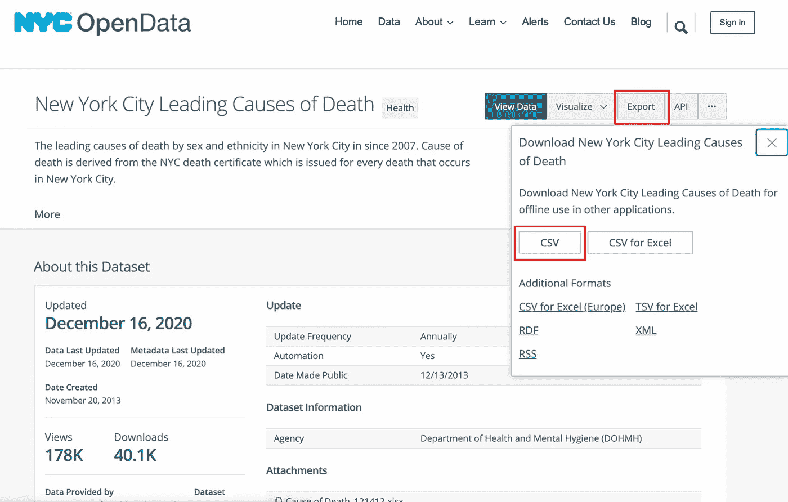

# 使用纽约死亡率数据的端到端闪亮应用教程

> 原文：<https://towardsdatascience.com/end-to-end-shiny-app-tutorial-using-nyc-mortality-data-d29ad99506b9?source=collection_archive---------24----------------------->

## 面向初学者的概念概述和逐步指南


照片由[energepic.com](https://www.pexels.com/@energepic-com-27411?utm_content=attributionCopyText&utm_medium=referral&utm_source=pexels)从[派克斯](https://www.pexels.com/photo/bright-burning-celebrate-celebration-288478/?utm_content=attributionCopyText&utm_medium=referral&utm_source=pexels)拍摄

许多数据科学家和数据分析师使用 Shiny 来创建交互式可视化和 web 应用程序。虽然 Shiny 是一个 RStudio 产品，并且非常用户友好，但 Shiny 应用程序的开发与您可能通过 RMarkdown 文件中的 tidyverse 进行的数据可视化和探索有很大不同。因此，即使对于有经验的 R 用户来说，也可能有一点闪亮的学习曲线，本教程旨在通过一个简短的概念概述以及一步一步创建一个示例 Shiny 应用程序来介绍 Shiny 的用法和功能。

在本教程中，我们将创建以下闪亮的应用程序，可以在它的完整交互形式[这里](https://emilyahalford.shinyapps.io/nyc_death/?_ga=2.43849575.35565365.1609372789-887224666.1609372789)找到。相关的 GitHub repo 可以在[这里](https://github.com/emilyhalford/nyc_death_post)找到。该仪表板允许用户按年份、性别和种族/民族探索代表纽约人十大死亡原因的数据。我们将有一个条形图，显示与这些主要死亡原因相关的死亡人数，以及一个描述主要死亡原因、相关死亡人数、相关死亡率以及相关年龄调整死亡率的表格。


# 简短闪亮的概述

## 什么是闪亮的？

Shiny 是一个 R 包，旨在促进交互式 web 应用和仪表板的创建。所有的编码都可以在 R 中完成，所以有效地使用 Shiny 不需要任何 web 开发技能。然而，Shiny 确实使用 CSS、HTML 和 JavaScript 框架，因此熟悉这些语言可以促进更高级的应用程序开发。您可以轻松托管和部署闪亮的应用程序，RStudio 分别通过 [shinyapps.io](https://www.shinyapps.io/?_ga=2.119500553.1244963174.1609634115-1244862065.1607966601) 和 [Shiny Server](https://rstudio.com/products/shiny/shiny-server/?_ga=2.119500553.1244963174.1609634115-1244862065.1607966601) 方便地提供云和内部部署选项。

我强烈建议花些时间探索一下[闪亮的画廊](https://shiny.rstudio.com/gallery/)。这是一个很好的资源，在这里你可以看到其他人用 Shiny 构建了什么，以及所有的底层代码。画廊里还有闪亮的演示，由闪亮的开发者设计，通过简单的例子来说明各种功能。

## 用户界面

闪亮的应用程序由用户界面(UI)和响应 UI 并生成输出的服务器组成。

UI 本质上负责应用程序的外观和输入。通过改变应用程序的布局和颜色，或者通过创建额外的选项卡，可以在 UI 中设置外观。

用户通过小部件创建输入，这些小部件编码在闪亮应用的 UI 部分。小部件可以有多种形式，比如按钮、复选框、滑块和文本输入。RStudio 的[闪亮小部件库](https://shiny.rstudio.com/gallery/widget-gallery.html)允许你浏览可用的小部件选项，以及产生它们的相关代码。

## 计算机网络服务器

服务器是您构建输出的地方，例如图形、地图、值和表格。服务器将包含生成这些输出的代码，以及关于输出应该如何根据 UI 中的给定输入而改变的 R 指令。

# 数据源和数据清理

我们将在本教程中使用的数据集可通过 NYC OpenData 公开获取。该数据代表了 2007 年至 2014 年间纽约市居民按性别和种族分列的十大死亡原因。鉴于我在公共卫生方面的训练，我认为探索种族和性别与死亡原因之间的关系以及这些关系如何随着时间的推移而变化会很有趣。

为了下载这些数据，请访问 NYC OpenData [站点](https://data.cityofnewyork.us/Health/New-York-City-Leading-Causes-of-Death/jb7j-dtam)获取该数据源。数据将以 CSV 文件的形式出现在下面突出显示的“导出”下。当您单击 CSV 按钮时，下载应该会立即开始。



这些数据相当整洁，但是我们还需要做一些清理工作。我将文件名改为“nyc_death.csv ”,并将其放在一个新的 R 项目中名为“data”的文件夹中。

首先，让我们将“tidyverse”包加载到一个新的 RMarkdown 文件中:

```
library(tidyverse)
```

下一个代码块执行一些基本的清理过程。首先，我们使用 read_csv()函数加载死亡率数据。然后，我们使用“看门人”包中的 clean_names()函数将所有变量名放入 snake case 中。接下来，我们执行一些过滤。出于此应用程序的目的，我们只需要具有已识别的种族/民族的个人，这样我们就可以过滤掉种族 _ 民族值为“未声明/未知”或“其他种族/民族”的条目该数据集还包括每个种族和性别组合的前 10 大死亡原因，以及所有其他原因。我们只需要这些死亡的主要原因，所以过滤掉 leading_cause 值为“所有其他原因”的行最后，我们将 as.numeric()应用于我们将使用的三个变量，以便它们具有适合我们分析的格式:

```
death = read_csv("./data/nyc_death.csv") %>% 
  janitor::clean_names() %>% 
  filter(
    race_ethnicity != "Not Stated/Unknown",
    race_ethnicity != "Other Race/ Ethnicity",
    leading_cause != "All Other Causes"
  ) %>% 
  mutate(
    deaths = as.numeric(deaths),
    death_rate = as.numeric(death_rate),
    age_adjusted_death_rate = as.numeric(age_adjusted_death_rate))
```

在进行了这种基本清理之后，我们的数据看起来像这样:


总的来说，这看起来不错。然而，我们的 leading_cause 变量的值非常长，并且包括死亡原因代码。我们的目标观众是普通观众，所以这些死因代码可能没有那么多信息。这个变量也将用于我们 Shiny 应用程序的条形图部分，x 轴标签直接来自这个 leading_cause 变量。这些非常长的描述会导致我们的条形图的 x 轴标签可读性很差。因此，将这些值编辑成简短的、描述性的标签而没有死因代码是有意义的。

做出这种改变的第一步是确定我们需要改变什么样的价值观。因此，我们需要知道这个数据集中存在的 leading_cause 变量的所有唯一值。unique()函数可以给我们这些信息:

```
unique(death$leading_cause)
```

我们可以看到 leading_cause 有 19 个独特的值，我们需要考虑缩短:


为了编辑这些值，我们需要深入下面的长 mutate()步骤。在 mutate()步骤的第一行，我们使用 str_replace_all()删除这个 leading_cause 变量中的所有括号。正如您在上面看到的，目前所有的值都有包含在括号中的死亡原因代码。当文本中包含括号时，我们用来替换文本的函数 str_replace()无法正常工作，因此立即删除括号是有意义的。

接下来，我们简单地使用 str_replace()来替换每个死亡原因值的文本。(注意:我直接从 unique()输出中复制了这些值，以便于我自己使用——但是如果您这样做的话，不要忘记删除括号！)str_replace()函数接受以下三个参数:应该进行字符串替换的变量名、要替换的文本模式以及要替换的内容。正如您将在下面看到的，这些 str_replace 步骤中的每一步都将 leading_cause 作为感兴趣的变量，然后是原始死因标签，最后是在我们的条形图中看起来更好的缩短版本:

```
death = 
  death %>% 
    mutate(
    leading_cause = str_replace_all(leading_cause, "[//(//)]", ""),
    leading_cause = str_replace(leading_cause, "Influenza Flu and Pneumonia J09-J18", "Influenza & Pneumonia"),
    leading_cause = str_replace(leading_cause, "Accidents Except Drug Posioning V01-X39, X43, X45-X59, Y85-Y86", "Accidents"),
    leading_cause = str_replace(leading_cause, "Cerebrovascular Disease Stroke: I60-I69", "Cerebrovascular Disease"),
    leading_cause = str_replace(leading_cause, "Assault Homicide: Y87.1, X85-Y09", "Assault"),
    leading_cause = str_replace(leading_cause, "Essential Hypertension and Renal Diseases (I10, I12)", "Hypertension & Renal Dis."),
    leading_cause = str_replace(leading_cause, "Human Immunodeficiency Virus Disease HIV: B20-B24", "HIV"),
    leading_cause = str_replace(leading_cause, "Diseases of Heart I00-I09, I11, I13, I20-I51", "Diseases of Heart"),
    leading_cause = str_replace(leading_cause, "Alzheimer's Disease G30", "Alzheimer's Disease"),
    leading_cause = str_replace(leading_cause, "Chronic Liver Disease and Cirrhosis K70, K73", "Chronic Liver Disease/Cirrhosis"),
    leading_cause = str_replace(leading_cause, "Malignant Neoplasms Cancer: C00-C97", "Malignant Neoplasms"),
    leading_cause = str_replace(leading_cause, "Diabetes Mellitus E10-E14", "Diabetes Mellitus"),
    leading_cause = str_replace(leading_cause, "Mental and Behavioral Disorders due to Accidental Poisoning and Other Psychoactive Substance Use F11-F16, F18-F19, X40-X42, X44", "Accidental Poisoning/Substance Use"),
    leading_cause = str_replace(leading_cause, "Septicemia A40-A41", "Septicemia"),
    leading_cause = str_replace(leading_cause, "Chronic Lower Respiratory Diseases J40-J47", "Chronic Lower Respiratory Dis."),
    leading_cause = str_replace(leading_cause, "Nephritis, Nephrotic Syndrome and Nephrisis N00-N07, N17-N19, N25-N27", "Nephritis"),
    leading_cause = str_replace(leading_cause, "Certain Conditions originating in the Perinatal Period P00-P96", "Perinatal Period Conditions"),
    leading_cause = str_replace(leading_cause, "Viral Hepatitis B15-B19", "Viral Hepatitis"),
    leading_cause = str_replace(leading_cause, "Intentional Self-Harm Suicide: X60-X84, Y87.0", "Suicide"),
    leading_cause = str_replace(leading_cause, "Congenital Malformations, Deformations, and Chromosomal Abnormalities Q00-Q99", "Congenital Malformations")
    )
```

现在，我们的 leading_cause 变量中的值看起来更整洁，并且在我们的条形图中会更好地工作:


我们的数据现在可以使用了，最后一步是导出这个最终数据集，以便在我们闪亮的应用程序中使用。这是通过 write_csv()函数完成的:

```
write_csv(death, "./data/cleaned_nyc_data.csv")
```

现在我们准备好开始闪亮登场了！

# 闪亮的应用程序开发

## 创建新的闪亮应用程序

我们要做的第一件事是在 r 中创建新的 Shiny app，在 RStudio 中选择文件→新建文件→ Shiny Web App:


系统将提示您选择应用程序名称、类型和位置。应用程序类型指的是 UI 和服务器是否共存于一个文件中，或者是否分别有单独的文件。这种选择很大程度上是个人喜好问题。对于包含大量代码的复杂应用程序，使用多文件类型通常更容易，一些人发现即使对于简单的应用程序，这种分离也更简单。就个人而言，我喜欢把简单应用的所有代码放在一个地方，所以我选择了“单个文件”你可以给你的应用程序起任何名字，并把它放在你电脑的任何地方，但在这里我把它命名为“nyc_mortality ”,并把它放在我的桌面上。做出选择后，点击右下角的“创建”:


你的应用。r 文件现在应该出现了。RStudio 非常擅长向用户提供关于其作品的有用信息，Shiny 也不例外。当你创建一个新的应用程序时，这个自动填充的代码实际上是一个完整的应用程序。你可以点击右上角的“运行 App”试试看:


这个旧的忠实喷泉数据应用程序将会出现，它在左侧包含一个滑块小部件，在右侧包含一个直方图。您可以使用滑块来更改直方图中的条柱数量。玩一会儿这个，让你自己熟悉闪亮的应用程序如何以最简单的形式工作。


当你准备好了，清除旧的忠实间歇泉数据代码，以便我们可以用我们自己的代码替换它。您可以删除除第一行之外的所有内容:

```
library(shiny)
```

最后一行:

```
shinyApp(ui = ui, server = server)
```

注意:我有时会发现，与其立即删除所有的示例代码，不如将这些代码作为模板，在我创建应用程序时逐渐替换它们。这实际上是我第一次创建这个应用程序时所做的！

在我们继续之前，让我们加载我们将用于创建此应用程序的其他包，并让我们清理的数据可用。

加载库:

```
library(dplyr)
library(ggplot2)
library(readr)
```

确保您的应用程序中有我们之前创建的已清理数据集。r 文件是。完成后，您可以简单地使用 read_csv()使我们的数据可用:

```
nyc_mortality = read_csv("cleaned_nyc_data.csv")
```

让我们继续编写我们自己闪亮的应用程序。

## 编写 UI 代码

回顾一下，这是我们将要创建的应用程序:


请记住，UI 本质上控制了用户看到的内容和与之交互的内容。因此，我们将尝试使用我们的 UI 代码完成三件事情:创建“2007–2014 年纽约市种族和性别死亡率”标题，在右侧创建年份、性别和种族/民族选择器，并为我们将在服务器步骤中创建的图和表设置布局。

我们在一个定义 UI 的长代码块中完成所有这三件事。所有这些代码都包含在 fluidPage()命令中。请记住，Shiny 使用了驼色外壳，这对于我们这些习惯使用蛇形外壳的人来说可能有点令人沮丧。首先，我们使用 titlePanel()函数创建标题，只需用引号将它括起来。接下来，我们在侧边栏中创建三个小部件。这部分代码很多，我们一步一步来。

我们的侧边栏只有一个面板，所以所有三个小部件都包含在 sidebarLayout()函数中的一个 sidebarPanel()函数中。我们的第一个小部件是一个下拉选择器，它是用 selectInput()函数创建的。inputId 参数决定了您在编写服务器代码时如何引用这个小部件，而 label 参数是您设置将在应用程序本身的小部件上方显示的文本的位置。choices 参数顾名思义—在这里，您可以指定小部件中可供选择的选项。有几种不同的方法来指定选择，我们将在下面介绍其中的三种。对于 selectInput()小部件，我们的选择只是数据集中表示的所有年份的列表。

接下来是我们的第一个单选按钮()小部件。我们再次分配一个 inputId 和 label，但是现在我们创建的选择略有不同。在原始数据中，性别的两个选项是“F”和“m”。在某些情况下，这已经足够提供信息了，但是在这些单选按钮选择器旁边写上“女性”和“男性”会更清楚，看起来也更好。我们可以简单地做到这一点，在“选择”论证中指出“女性”=“F”和“男性”=“m”

然后，我们添加第二个 radioButtons()小部件。同样，inputId 和 label 参数非常简单，但是我们在这里采用第三种方法来处理 choices 参数。我们希望能够根据每个可用的种族/民族进行筛选，但不想挖掘数据来找出这些值是什么。幸运的是，我们可以通过再次使用 unique()函数来绕过这一步。此函数使单选按钮微件的可用选项成为 nyc_mortality 数据集中 race _ ethylation 变量的所有唯一值。

最后但同样重要的是，我们设置了主面板的布局。正如您在上面看到的，这个面板将包含一个条形图和一个表格。我们实际上还没有创建这些输出——我们只是告诉 Shiny 一旦我们创建了它们，它们会去哪里。我们用 mainPanel()函数来实现这一点，每个输出都有一行代码。首先使用 plotOutput()函数调用条形图，在引号中，我们将未来的条形图命名为“deathPlot”接下来使用 DT 包中的 dataTableOutput()函数调用我们的表，并将其命名为“deathTable”。

```
ui = fluidPage(# Application title
    titlePanel("NYC Mortality by Race and Sex, 2007-2014"),# Sidebar with a 3 inputs 
    sidebarLayout(
        sidebarPanel(
           selectInput(inputId = "year",
                       label = "Select Year:",
                       choices = c("2007",
                                  "2008",
                                  "2009",
                                  "2010",
                                  "2011",
                                  "2012",
                                  "2013",
                                  "2014")),
            radioButtons(inputId = "sex",
                        label = "Sex:",
                        choices = c(
                            "Female" = "F",
                            "Male" = "M"
                        )),
            radioButtons(inputId = "race",
                         label = "Race/Ethnicity:",
                         choices =               unique(nyc_mortality$race_ethnicity))
        ),# Show plot and table
        mainPanel(
           plotOutput("deathPlot"),
           DT::dataTableOutput("deathTable")
           )
        )
    )
```

我们的 UI 现在应该可以运行了，我们可以继续运行服务器了。

## 服务器编码

回想一下，服务器是我们创建输出的地方(在本例中是我们的条形图和表格)，也是我们告诉他们如何对用户通过小部件创建的输入做出反应的地方。

服务器是一个接受输入和输出参数的函数，我们创建定制服务器的所有代码都在这个函数中。首先，我们创建一个我标记为“selections”的对象，它根据用户在小部件中的输入过滤 nyc_mortality 数据。这是使用 reactive()函数完成的，这是有意义的，因为这些图对用户输入做出“反应”。在 reactive()函数中，我们首先需要在 UI 中创建的三个输入。这些名称应该与在 UI 中创建的 inputId 名称完全一致。接下来，我们告诉 nyc_mortality 数据集根据“年份”输入过滤年份变量，根据“性别”输入过滤性别变量，根据“种族”输入过滤种族 _ 民族变量。

我们现在可以创建两个输出:条形图和表格。我们从柱状图开始，它已经被确定为“死亡图”。请记住，您为该图指定的名称必须与您在 UI 的 mainPanel()函数中指定的名称完全匹配。我们告诉 Shiny 使用 renderPlot()函数输出一个图，然后使用 ggplot()以相当标准的方式创建这个图。如果您熟悉 ggplot()，那么这段代码看起来会很熟悉，尽管我们做了一些调整，使这个图对用户输入作出反应。第一个变化来自“数据”参数。我们没有将数据源指定为 nyc_mortality(我们一直在使用的清理过的数据集)，而是将数据指定为我们刚刚创建的“selections()”对象。我们不想一次性绘制 nyc_mortality 数据集中的所有数据，相反，我们只想绘制用户选择的年份、年龄和性别组合的数据。通过将“selections()”指定为我们的数据源，我们只将 nyc_mortality 数据集的过滤版本传递给我们的绘图。然后我们继续讨论 aes()规范，告诉 ggplot 你希望 x 轴和 y 轴是什么。在我们的案例中，我们希望这些主要的死亡原因作为我们的 x 轴，相关死亡的数量作为我们的 y 轴。然而，ggplot 自动在 x 轴上按字母顺序排列字符变量，这对于我们的绘图不是特别有用的排列。相反，按照死亡人数递减来排列死亡的主要原因更有意义。我们使用 reorder()函数来实现这一点，并在函数中指定 leading_cause 变量应该按照死亡人数的减少(用“-”指定)来排序。

接下来我们告诉 ggplot，这个图应该是一个使用 geom_bar()的条形图。“stat = 'identity '”位代码表明 ggplot 不需要尝试聚合我们的数据——我们将通过“death”变量直接提供 y 值。在代码的 geom_bar()部分，我们要做的最后一件事是使用“color”和“fill”参数为我们的图形条指定蓝色。最后，我们使用标准的 ggplot()代码为我们的图表提供一个标题和轴标签，然后将 x 轴标签倾斜 45 度角，使我们的图表可读性更好。

最后，我们使用“DT”包创建一个名为 deathTable 的表。在 DT 包的 renderDataTable()函数中，我们使用了同样来自 DT 包的 DataTable()函数。我们再次使用 selections()对象，而不是完整的 nyc_mortality 数据集。在括号中，我们指定了我们感兴趣的四列:leading_case、deaths、death_rate 和 age_adjusted_death_rate。colnames()函数允许我们为每个变量指定更易读的名称。这些名称将作为列标题出现在我们的最终表格中。在“选项”参数下，我们指出数据应该根据第 2 列(死亡人数)降序排列。就像我们的柱状图一样，按死亡人数降序排列死因比按字母顺序排列的默认选项信息量更大。

```
server = function(input, output) {selections = reactive({
      req(input$year)
      req(input$sex)
      req(input$race)
      filter(nyc_mortality, year == input$year) %>%
          filter(sex %in% input$sex) %>%
          filter(race_ethnicity %in% input$race)})output$deathPlot = renderPlot({
        ggplot(data = selections(), aes(x = reorder(leading_cause, -deaths), y = deaths)) +
        geom_bar(stat = 'identity', color = 'steelblue', fill = 'steelblue') +
        labs(
          title = "Top 10 Leading Causes of Death",
          x = "Causes",
          y = "Number of Deaths"
        ) +
        theme(axis.text.x = element_text(angle = 45, hjust=1))
    })

    output$deathTable = 
      DT::renderDataTable({
      DT::datatable(selections()[,c("leading_cause", "deaths", "death_rate", "age_adjusted_death_rate")],
                    colnames = c("Leading Cause of Death", "Number of Deaths", "Death Rate", "Age-Adjusted Death Rate"),
                    options = list(order = list(2, 'des')),
                    rownames = FALSE,
        )

    })
}
```

现在我们的服务器也编码好了！如果您之前不小心删除了它，请确保您的服务器代码后面有以下代码行:

```
shinyApp(ui = ui, server = server)
```

该应用程序现已完成，请点击右上角的“运行应用程序”。


花些时间摆弄左侧面板中的小部件，以确保输出正确反应。如果一切都正常，我们就可以开始托管应用程序了！


# 托管闪亮的应用程序

虽然有许多方法可以托管闪亮的应用程序，但 shinyapps.io 对于第一次使用闪亮应用程序的用户来说是理想的，因为它免费且易于使用。因此，我们将使用这个工具来托管我们的应用程序。

如果您没有链接到 RStudio 的 shinyapps.io 帐户，您可以遵循 RStudio 创建的本简单指南的第[2.1 节至第 2.3.1 节。](https://docs.rstudio.com/shinyapps.io/getting-started.html)

一旦建立了连接，选择闪亮应用右上角的“发布”。接下来，从出现的下拉菜单中选择“发布应用程序…”。


将出现以下窗口。您的 shinyapps.io 帐户应该已经连接，并且应该已经检查了必要的文件。让左下角的“启动浏览器”处于选中状态，这样一旦部署完成，你完成的应用程序就会在你的浏览器中弹出。确保你对应用程序的标题满意，然后点击“发布”！


部署将立即开始，可能需要几分钟时间。完成后，您的浏览器应该会打开并显示您新部署的应用程序。如果你登录到你的 shinyapps.io 账户，你应该会看到你的应用已经启动并运行了！


# **结论**

Shiny 是一个非常有用的工具，R 用户可以用它来构建各种仪表板和交互式产品。它能做的比我们在本教程中介绍的要多得多，但希望你现在能理解 Shiny 的基础知识。既然你已经创建了自己的闪亮应用，我建议你再回头看看闪亮图库。希望你现在对这些应用程序是如何创建的有了更好的理解，也许你会为你的下一个闪亮的项目带来灵感。

最后一点建议——闪亮开发的一个缺点是很难一路检查你的工作。在这个例子中，我们在应用程序能够运行之前编写了所有的代码。当你开发更复杂的应用程序时，我建议在添加更多功能和复杂性之前，先从简单开始，以确保你的应用程序能够正常工作。当这成为可能的时候，它可以帮你省去很多麻烦。

只要您在添加代码时小心谨慎，并充分利用您可以在线获得的丰富资源(尤其是由 RStudio 创建的资源！)，探索 Shiny 众多令人激动的功能应该没有问题。