# 端到端时间序列分析和预测:萨里马克斯、LSTM 和预言家三重奏(上)

> 原文：<https://towardsdatascience.com/end-to-end-time-series-analysis-and-forecasting-a-trio-of-sarimax-lstm-and-prophet-part-1-306367e57db8?source=collection_archive---------1----------------------->

## 预测赫尔辛基市选定地点的日总能耗


塔皮奥·哈贾在 [Unsplash](https://unsplash.com/s/photos/helsinki?utm_source=unsplash&utm_medium=referral&utm_content=creditCopyText) 上拍摄的照片

与[合作的阿历克斯·勒](https://medium.com/u/e9bc30ee7f3c?source=post_page-----306367e57db8--------------------------------)。

第二部分:[端到端时间序列分析与预测:萨里马克斯、LSTM 和先知三人组(第二部分)|作者:孙乐| 2021 年 12 月|中](https://medium.com/@minhsonle199/end-to-end-time-series-analysis-and-forecasting-a-trio-of-sarimax-lstm-and-prophet-part-2-4ca0046073ab)

# **简介**

时间序列，或按时间顺序排列的一系列数据点，是一种普遍存在的数据类型。经济学家通过观察经济在过去的表现来分析经济；天气预报部分基于历史数据等等。总的来说，任何涉及时间维度的定量问题都不可避免地涉及到处理时间序列数据。因此，时间序列分析和预测一直是一个活跃的研究领域，对学术界和商界都有切实的回报。

在本文中，我们将带您了解目前用于预测时间序列的 3 种最流行的技术/工具:经典的 SARIMAX 模型、LSTM 神经网络和 Prophet。所有的内容将基于我们上面提到的项目。其范围是分析和预测赫尔辛基市选定地点的总能耗水平。具体来说，我们将按照以下顺序浏览这篇文章:

1.  数据
2.  探索性数据分析
3.  基线模型
4.  萨里马克斯
5.  LSTM
6.  先知

对于更多“铁杆”观众来说，你可以在项目网站上的[我们的笔记本中直接看到代码(不幸的是，有注释:)。](https://quan-possible.github.io/energy-demand-prediction/)

# **数据**

我们从 [www.avoindata.fi](https://www.avoindata.fi/en) 获取数据集，这是一个由芬兰数字和人口数据服务机构维护的开放式数据存储库。你可以在*能源*类别中找到，标题为[‘赫尔辛基市公用事业和服务设施的能源消耗数据’](https://www.avoindata.fi/data/en_GB/dataset/helsingin-kaupungin-palvelukiinteistojen-energiankulutustietoja)在数据集的页面上，有一个链接将你带到 [API 文档](https://helsinki-openapi.nuuka.cloud/swagger/index.html#/)。

对于我们的项目，我们使用了 2017 年至 2020 年(不含)三年的每日和每小时电力消耗数据。这是因为我们发现这只是用于建模的适量数据——不需要旧数据，并且由于疫情，2020 年本身在能源消耗方面已经是一个显著的异常值——不需要新数据。获取的原始数据集大致如下:

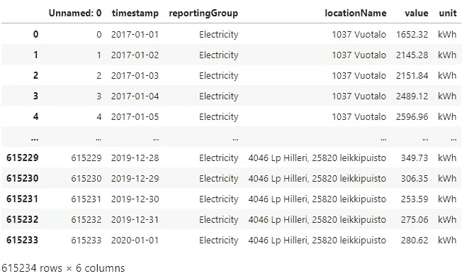

马上，我们可以看到有很多冗余信息，甚至包括大楼地址。要获得总能耗，需要对沿`locationName`特征的值求和。然而，这一过程因位置缺失值的常见程度而变得复杂，这意味着需要进行插值。然而，经过一些工作后，我们得到了想要的数据形式(当然，你可以在[笔记本](https://quan-possible.github.io/energy-demand-prediction/daily)中看到我们所做的详细工作):

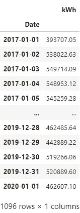

数据准备到此为止。现在我们进入可视化的有趣部分！

# **探索性数据分析**

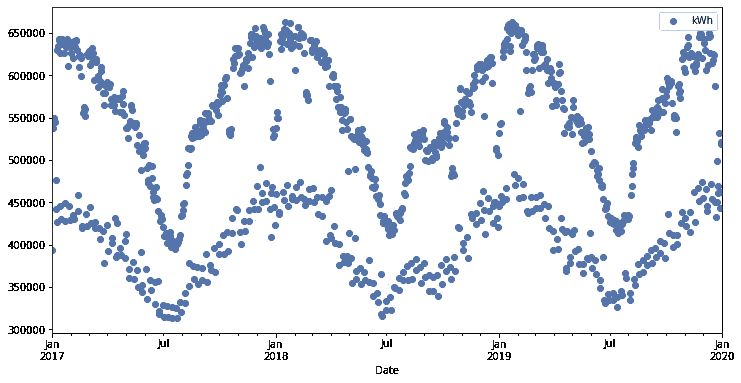

整个数据集的图

通过对数据的初步了解，我们已经可以识别出显著的年度(季节性)电力需求模式，在冬春季达到峰值，然后在夏季降至最低点。我们的假设可以通过查看每年的数据来进一步验证。

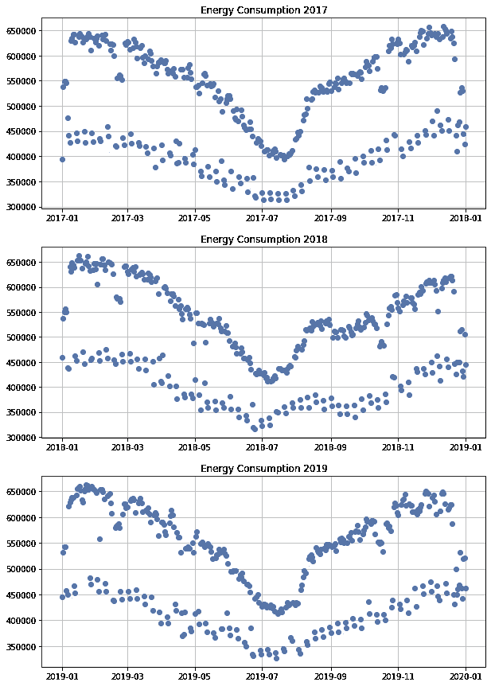

数据正如我们预期的那样，在 3 年中几乎呈现出相同的模式。也就是说，我们可以在 2018 年 9 月看到一些异常情况，能源需求意外大幅下降。对此进行了进一步的调查，但没有确定的结果。

更进一步，我们可以放大每年的数据，分析月、周、日的模式。

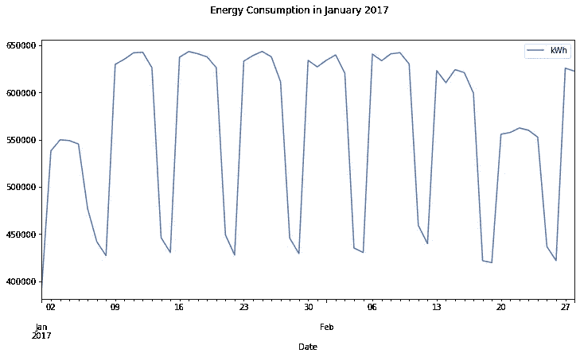

以 2017 年前两个月的数据为例。这里的重复模式非常引人注目。通过将它们与各自的日期进行比较，很明显数据具有 7 天的季节性，换句话说，是每周一次。从该图中，我们可以看到能源消耗在工作日达到高峰，然后在周末显著下降。这非常符合我们的预期，因为消耗大量能源的工厂和办公室都遵循这样的时间表。

> 时间序列分解

现在我们对数据有了更好的感觉，我们将通过使用一种叫做 [*时间序列分解*](https://otexts.com/fpp2/decomposition.html) *的统计技术来获得更多的技术。*从概念上讲，它的工作原理是将时间序列分成 3 个部分:

*   趋势周期——长期或不固定频率的数据增加或减少。随着时间的推移，随着人口和商业的增加，能源需求也会增加。
*   季节性-当时间序列受季节性因素影响时会出现模式。例:我们刚刚在数据中看到的每周模式。
*   残差——去除上述两种成分后的余数。由于每个时间序列本质上都是一个随机过程，因此数据中总会存在随机噪声。一栋建筑可能有几个坏了的灯泡，或者一些员工生病了，能量水平因此波动。

特别是，我们使用了在包`[statsmodels](https://www.statsmodels.org/stable/index.html)`内的类`[STL](https://www.statsmodels.org/devel/generated/statsmodels.tsa.seasonal.STL.html)`中实现的[黄土分解](https://otexts.com/fpp2/stl.html)。为清楚起见，我们仅对一年的数据进行分解:

```
stl **=** STL(ts2017,seasonal**=**7,robust**=True**)
res **=** stl**.**fit()
fig **=** res**.**plot()
```

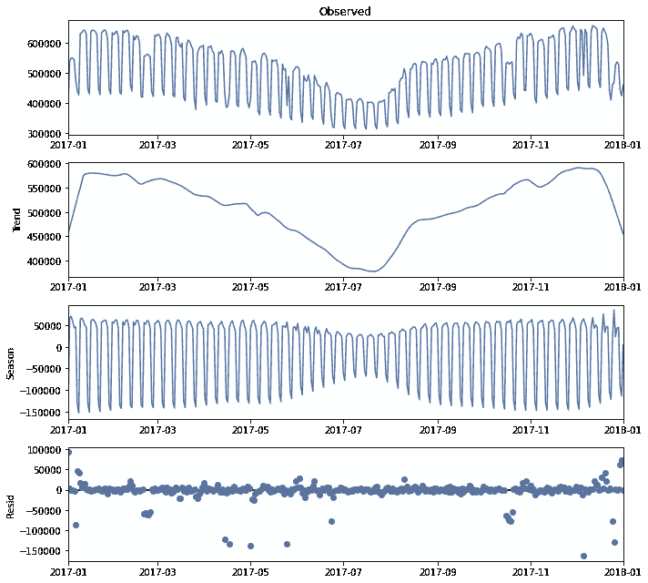

可见，剧情只是进一步印证了我们对数据的既有信念。分解完成后，探索阶段就结束了。现在，是建模时间了！

# 基线模型

在每个建模过程中，都需要一个基线模型，其结果可以用来评估我们的主要模型。在我们的案例中，我们选择使用线性回归模型，因为它简单高效。

关于建模过程本身，我们的测试集在 2019 年 12 月合成了所有数据。你可能已经猜到了，由于假期的原因，预测这个时间段是非常具有挑战性的。别担心，这正是我们的意图！我们想看看这些模型是如何处理非常时期的。而且，一点点挑战只会让事情变得更有趣，不是吗？

事不宜迟，我们用几行代码通过线性回归得到预测:

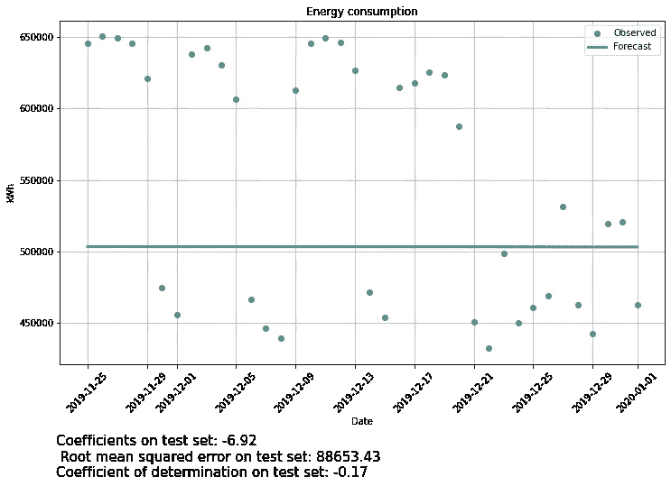

现在我们知道，我们的模型需要比大约 90，000 千瓦时的误差做得更好！

# 萨里马克斯

要使用这种技术，我们首先需要了解基本知识。

> 什么是 SARIMAX？

带外生因素的季节性自回归综合移动平均线，或 [SARIMAX](https://www.statsmodels.org/dev/examples/notebooks/generated/statespace_sarimax_stata.html) ，是 [ARIMA](https://en.wikipedia.org/wiki/Autoregressive_integrated_moving_average) 类模型的扩展。直观地说，ARIMA 模型由两部分组成:自回归项(AR)和移动平均项(MA)。前者将某一时间的值视为过去值的加权和。后者也将相同的值建模为加权和，但是是过去的残差(confer。*时间序列分解*。还有一个综合项(I)来区分时间序列(我们将在下面进一步讨论)。由于这是一个涉及大量数学知识的丰富话题，我们强烈建议你做[进一步阅读](https://otexts.com/fpp2/arima.html)以获得更好的理解。

总的来说，ARIMA 是一个非常正派的模特。然而，这种香草版本的问题是它不能处理季节性——这是一个很大的弱点。萨里玛来了——萨里玛的前身。SARIMA 模型的一个简写符号是:

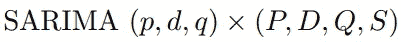

其中 *p* =非季节性自回归(AR)订单， *d* =非季节性差异， *q* =非季节性移动平均(MA)订单， *P* =季节性 AR 订单， *D* =季节性差异， *Q* =季节性 MA 订单， *S* =重复季节性模式的长度。从现在起，我们将使用这种符号。通过添加季节性 AR 和季节性 MA 组件，SARIMA 解决了季节性问题。

SARIMAX 只是通过增加处理外部变量的能力来扩展这个框架。Holidays 是首选，但是如果需要的话，您也可以获得您自己的特定于领域的特性。在我们的例子中，我们从包`[holidays](https://pypi.org/project/holidays/)`中获取了芬兰的假期列表:

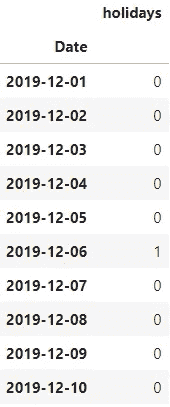

我们在项目中使用的 [SARIMAX 实现](https://www.statsmodels.org/stable/generated/statsmodels.tsa.statespace.sarimax.SARIMAX.html)也来自于包`statsmodels`。

> 落后

滞后只是一个系列中时间步长的延迟。考虑一个时间索引 *t，*相对于 *t* 的滞后 1 时间索引简单来说就是 *t-1，*滞后 2 就是 *t-2，*等等。

> 平稳性

平稳时间序列的均值、方差和自相关结构不随时间变化。换句话说，它没有任何周期/趋势或季节性。ARMA 模型系列实际上就是建立在这个概念上的。

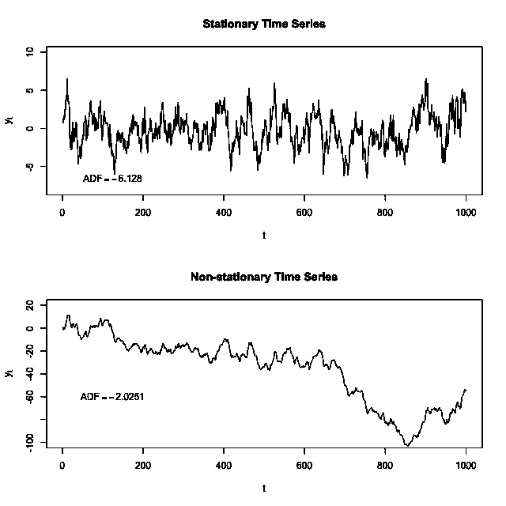

来源:维基百科

> 自相关函数(ACF)和偏自相关函数(PACF)

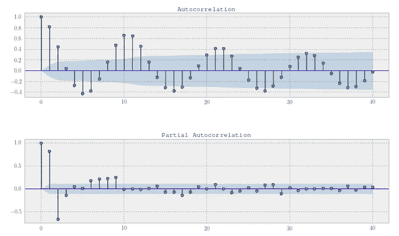

这两个函数都测量时间 *t* 的数据与其过去的值 *t-1，t-2，…* 的相关程度，但是有一个关键的不同。ACF 还测量了相关滞后之前的间接相关性，而 PCAF 没有。在实践中，他们的图对许多任务至关重要，尤其是为 SARIMAX 模型选择参数。你可以在这里阅读更多关于如何解读这样的情节[。](https://online.stat.psu.edu/stat510/lesson/3/3.1)

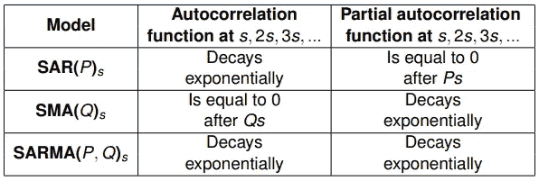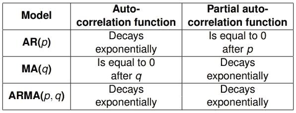

有了基础知识之后，我们继续使用 [Box-Jenkins 程序](https://en.wikipedia.org/wiki/Box%E2%80%93Jenkins_method)对时间序列进行建模。

## 模型识别

> 差分以实现平稳性

我们首先确保我们的数据是稳定的。查看我们最初制作的图表，很明显，数据并不是稳定的，没有如此明显的趋势和季节性。然而，我们可以通过使用一个统计测试使我们的猜测更加科学:[增强的 Dickey-Fuller 测试](https://en.wikipedia.org/wiki/Dickey%E2%80%93Fuller_test)，也在`statsmodels`包中实现。

```
**def** test_stationarity(timeseries,maxlag):
    *# Perform Dickey-Fuller test:*
    print('Results of Dickey-Fuller Test:')
    dftest **=** adfuller(timeseries,maxlag**=maxlag,**
                      autolag**=**'AIC')
    dfoutput **=** pd**.**Series(dftest[0:4], index**=**['Test Statistic','p-value','#Lags Used','Number of Observations Used'])
    **for** key,value **in** dftest[4]**.**items():
        dfoutput['Critical Value (%s)'**%key**] = value
    print (round(dfoutput,3))
```

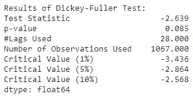

正如所料，p 值大于 0.05。因此，我们不能拒绝零假设，时间序列不是平稳的。现在的问题是，“我们如何做到这一点？”程序中的答案是差分——由积分项的 *d* 和 *D* 阶表示。对数据求差仅仅意味着取数据点与其滞后版本之间的差。直观上，这类似于对函数求导。

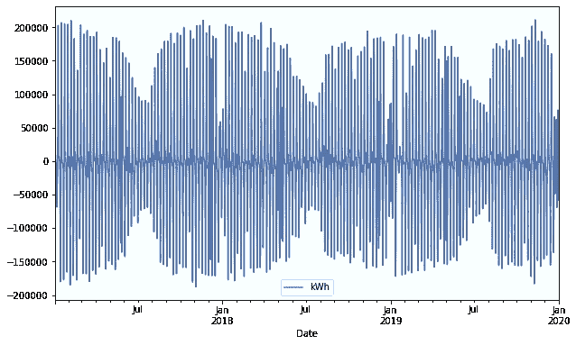

这看起来更像！我们再次求助于迪基-富勒试验进行验证。

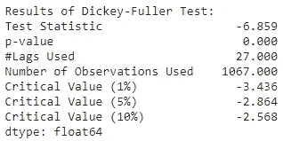

完美！现在我们知道了 SARIMAX 中的综合术语的参数:季节性和非季节性术语的 1。建模过程的下一步是使用 ACF 和 PACF 图找到 AR 和 MA 项的顺序。

> 使用 ACF 和 PACF 图确定 p 和 q

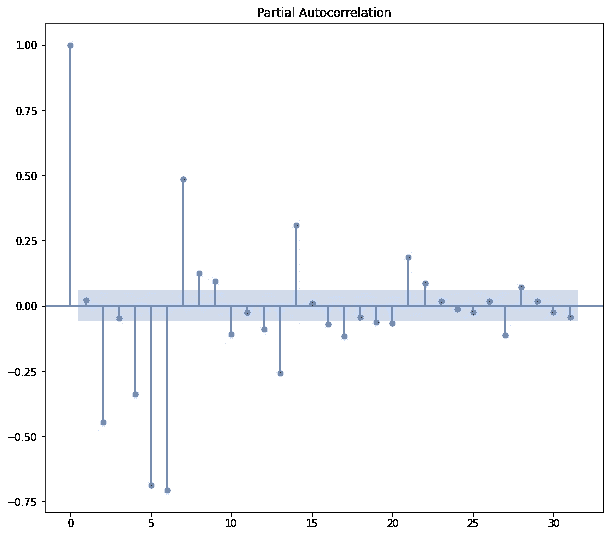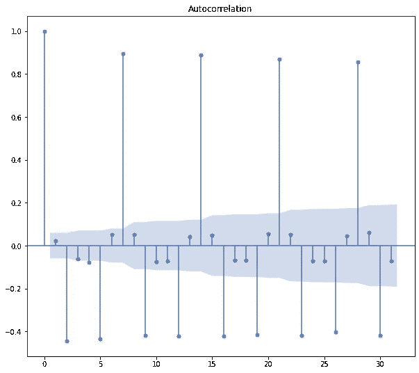

在图中，我们可以发现错综复杂的自相关模式，没有明确的解释。因此，季节性和非季节性 AR 和 MA 条款的订单无法果断选择，使我们的流程变得复杂。这证明了现实生活中的统计数据可能比教科书上的例子要混乱得多，我们不得不面对自己选择的不确定性。幸运的是，我们可以通过使用一种叫做[网格搜索](https://en.wikipedia.org/wiki/Hyperparameter_optimization)的优化方法来避免任何不科学的猜测。

## 模型估计

> 网格搜索

该算法简单地对所有参数组合进行穷举搜索。将根据我们选择的损失函数来选择它们中最好的一个。在我们的案例中，我们按照 ARMA 建模过程中的标准使用流行的[赤池信息标准(AIC)](https://en.wikipedia.org/wiki/Akaike_information_criterion) 。

```
**def** sarimax(ts,exo,all_param):
    results **=** []
    **for** param **in** all_param:
        **try**:
            mod **=** SARIMAX(ts,
                          exog **=** exo,
                          order**=**param[0],
                          seasonal_order**=**param[1])
            res **=** mod**.**fit()
            results**.**append((res,res**.**aic,param))
            print('Tried out SARIMAX{}x{} - AIC:{}'**.**format(param[0], param[1], round(res**.**aic,2)))
        **except** Exception **as** e:
            print(e)
            **continue**

    **return** results*# set parameter range*
p,d,q **=** range(0,3),[1],range(0,3)
P,D,Q,s **=** range(0,3),[1],range(0,3),[7]
*# list of all parameter combos*
pdq **=** list(itertools**.**product(p, d, q))
seasonal_pdq **=** list(itertools**.**product(P, D, Q, s))
all_param **=** list(itertools**.**product(pdq,seasonal_pdq))

all_res **=** sarimax(train,exo_train,all_param)
```

搜索结束后，我们列出了前 5 名模特:

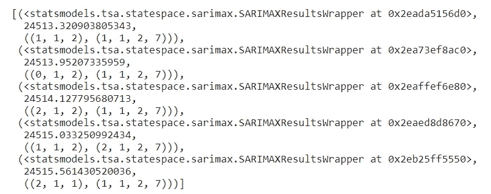

我们可以马上使用第一组参数。即使这个模型违反了[简约原则](http://rpierse.esy.es/rpierse/files/fe2.pdf)(参数总和< 6)，裕量足够小，我们可以从一些灵活性中获益。

## 模型验证

> 残留诊断

为了确定模型的拟合优度，我们可以使用标准假设来检查其残差:它们应该正态分布在 0 附近，或者换句话说，[白噪声](https://en.wikipedia.org/wiki/White_noise)。

我们可以通过查看显示残差分布的各种图来验证这一点。这可以使用`plot_diagnostics`方法方便地生成。此外，还可以使用 [Ljung-Box 测试](https://en.wikipedia.org/wiki/Ljung%E2%80%93Box_test)进行更精确的测试。

```
res**.**plot_diagnostics(figsize**=**(15, 12))

plt**.**show()
print("Ljung-box p-values:\n" **+** str(res**.**test_serial_correlation(method**=**'ljungbox')[0][1]))
res**.**summary()
```

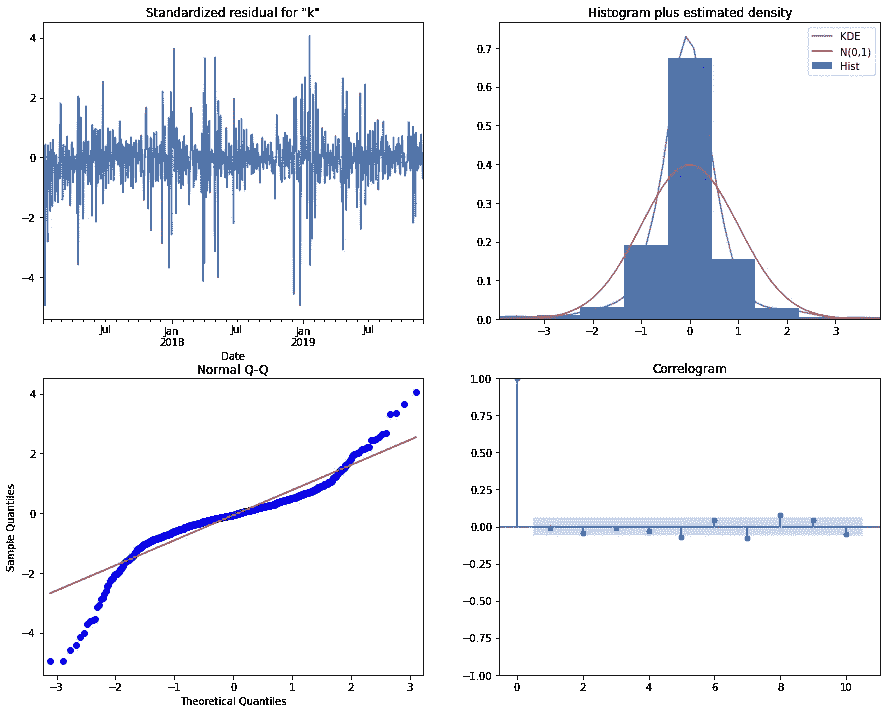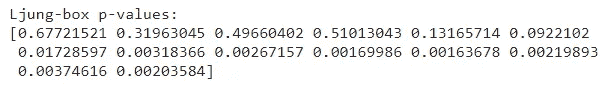

在图中，残差似乎正态分布在 0 附近，这是我们需要的条件，尾部略重。然而，看一下 Ljung 盒统计，我们不能拒绝数据不是独立分布的假设，因为从 6 开始，对于某些滞后，p 值小于α=0.05。

尽管如此，让我们使用这个模型在测试集上进行预测，并自己进行判断。

```
fig, ax **=** plt**.**subplots(figsize**=**(12,7))
ax**.**set(title**=**'Energy consumption', ylabel**=**'kWh')ts**.**plot(ax**=**ax, style **=** 'o')
pred**.**predicted_mean**.**plot(ax**=**ax, style**=**'o')
ci **=** pred_ci**.**loc[demo_start:]
ax**.**fill_between(ci**.**index, ci**.**iloc[:,0], ci**.**iloc[:,1], color**=**'r', alpha**=**0.1)
```

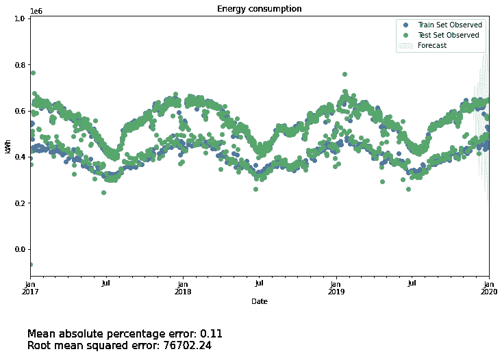

总的来说，[样本内](https://stats.stackexchange.com/questions/260899/what-is-difference-between-in-sample-and-out-of-sample-forecasts#:~:text=An%20in%2Dsample%20forecast%20utilizes,outside%20of%20the%20estimation%20period.&text=This%20is%20done%20to%20assess,2012%20to%20estimate%20the%20model.)预测似乎非常符合时间序列！没有明显的误差模式，除了该模型似乎比周末更好地预测了工作日的能量水平。现在，让我们看看它如何在测试集上预测:

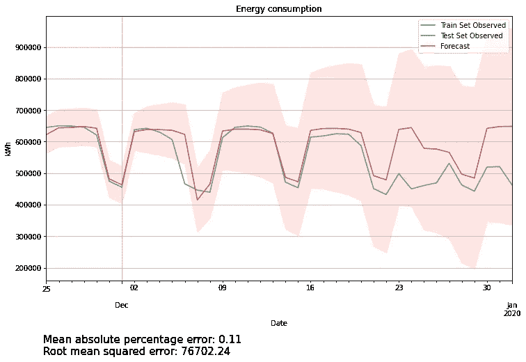

样本外预测看起来也很令人满意！在该月的前 2 周，预测值与实际值吻合得很好，预测中没有系统误差。然而，可能有一个例外，12 月 6 日的数值是非常不正确的。幸运的是，我们知道原因很简单:那天是芬兰的独立日。

关于寒假季节，模型不幸地没有做得那么好。在此期间，尽管增加了外生的“假期”变量，但预测始终高估了用电量。显然，不仅圣诞假期能量下降，整个寒假期间也是如此。并且，该信息没有被合并到模型中。这解释了为什么错误率仍然很高——与基线模型相比没有太大的改进。

我们用一个不同的训练测试分割在幕后重做了这个过程，结果比预期的好得多。误差率下降到 30，000 千瓦时左右或低于 5%。对于一类 50 年前理论化的模型来说还不错，对吧？然而，所有这些都显示了在非常时期进行预测的挑战，强调了对更好技术的需求。除此之外，当数据表现可预测时，该模型仍然显示出预测的前景。

哎呀…这个帖子已经太长了！此外，这似乎是一个很好的地方停下来，所有的 SARIMAX 部署都包括在内。在下一篇文章中，我们将会谈到时间序列分析教科书中的“现代”部分。我们会发现用 Prophet 拟合时间序列的过程。也就是说，非常感谢你穿过文本墙走了这么远:)。下次见！

第二部分:[端到端时间序列分析与预测:萨里马克斯、LSTM 和先知三人组(第二部分)|孙乐| 2021 年 12 月|中](https://medium.com/@minhsonle199/end-to-end-time-series-analysis-and-forecasting-a-trio-of-sarimax-lstm-and-prophet-part-2-4ca0046073ab)

同样，对于渴望更多未来预测的感兴趣的观众，你可以在[项目网站](https://quan-possible.github.io/energy-demand-prediction/)上的我们的笔记本中看到所有的代码以及更多的技术评论。