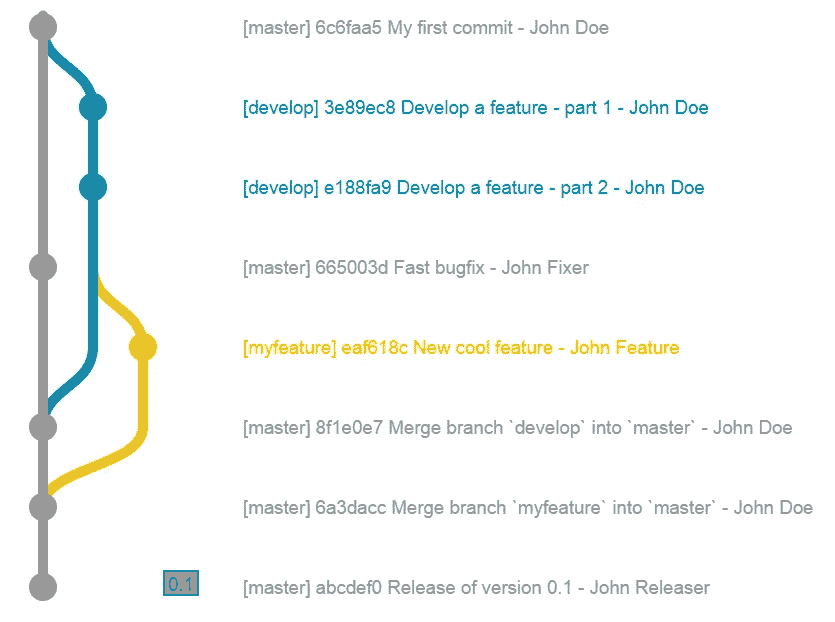

# 数据科学工程基础

> 原文：<https://towardsdatascience.com/engineering-essentials-for-data-science-4a7a92a1ff3e?source=collection_archive---------16----------------------->

## [*小窍门*](https://towardsdatascience.com/tagged/tips-and-tricks)

## 你的代码周围的代码


照片由[内森·沃特斯](https://unsplash.com/@nathangwaters?utm_source=medium&utm_medium=referral)在 [Unsplash](https://unsplash.com?utm_source=medium&utm_medium=referral) 拍摄

“[数据科学分析基础”帖子](/analytics-essentials-for-data-science-25da994f4bed)中的编程概念涵盖了当数据摆在你面前时如何处理数据。如果您的工作流看起来像是从 Google Drive 下载一个 CSV 文件到您的笔记本电脑上，分析数据，然后将 PDF 文件附加到报告中，那么这些概念就足够了。

然而，当您开始一个需要组合来自数百个 CSV 的数据的项目时，会发生什么呢？点击和拖动只能让你到此为止——即使你有耐心，你的经理可能没有！在你不得不通过一个没有好的用户界面的 API 来访问数据之前，这也只是一个时间问题。

类似地，也许你被分配到一个项目，该项目有一个现有的代码库，程序员希望在处理代码时有最佳实践。虽然一次性的脚本可能在学校期间就已经停止了，但是[1] [如果你不能以一种易于阅读、重用和被他人修改的方式来组织你的代码，你就活在借来的时间里](https://en.wikipedia.org/wiki/Technical_debt)。

这就是分析数据之外的编程技能的用武之地。在本帖中，我们将涵盖以下软件工程概念:

*   访问数据
*   版本控制
*   面向对象编程
*   虚拟环境
*   写作测试

# 访问数据

在这一节，我们将介绍 ***如何使用代码来访问数据。*** 这是一项跨越整个[分析-工程领域的技能](/the-analytics-engineering-spectrum-of-data-science-jobs-3cf05c5f2d0b)，但我认为与其说是一项分析技能，不如说是一项“工程”技能。

作为一名数据科学家，你很少会通过 Google Drive 或 Dropbox 的点击式[图形用户界面](https://www.computerhope.com/jargon/g/gui.htm)来访问数据。相反，您将访问的大部分数据将驻留在 **SQL** (结构化查询语言)数据库或**API**(应用程序编程接口)之后。也有可能你需要使用**网络抓取**来访问不提供 API 的网站上的数据。本节将介绍这三种访问数据的方式。

## 结构化查询语言

除非你的公司很小，否则它的数据会比一两个硬盘所能容纳的还要多。随着数据量的增长，以最小化[冗余](http://www.databasedev.co.uk/data-redundancy.html)和[检索时间](https://use-the-index-luke.com/sql/testing-scalability/data-volume)的方式组织数据至关重要；优化[安全性和可靠性](https://looker.com/definitions/database-security#exit-popup)；正式陈述[数据的不同部分如何相互关联](https://www.ibm.com/cloud/learn/relational-databases)；并让多个用户同时读取(和写入)数据。

实现这一点的主要方法是使用关系数据库，您可以使用 SQL 对其进行查询。[2]关系数据库本质上是一组表，表之间有定义的关系。

例如，如果你拥有一家网上商店，你不需要在顾客订购的每件商品旁边保存顾客的每一个细节；您可以将客户信息分离到一个表中(`customers`)，将订单信息分离到另一个表中(`orders`)，只需用`orders`中的一个名为`customer_id`的列将订单与客户相关联。使用 SQL，您可以轻松快速地从两个表中提取相关数据，即使表增长到数千万或数亿行。[3]

在您的角色中，您可能会非常频繁地使用 SQL，可能每天都在使用，所以我强烈建议您花时间来完善这项技能。幸运的是，SQL 不是一种庞大的语言，你可能只需要从数据库中*查询*数据，而不是*创建*数据库或表格，这更属于[数据工程师](https://www.xplenty.com/blog/data-engineering-what-does-a-data-engineer-do-how-do-i-become-one/)的领域。在这篇文章中，我们将关注简单到中级的查询。

下面是一个用主流 SQL 语言之一的 Postgres 编写的简单查询。我们从表`students`中选择`name`和`animal`列，使用`AS`关键字为返回的表中的列创建[别名](https://www.tutorialspoint.com/sql/sql-alias-syntax.htm)或临时名称。最终结果经过过滤，因此返回的行中只有学生最喜欢的动物是海象的行。[4]

我们也可以为表格使用别名，下面我们将为`users`、`sql_pros`和`transactions`使用别名。在这个例子中，我们以两种方式连接表；在第一个查询中，我们使用了一个`LEFT JOIN`，它保留了`users`中的所有行，但是删除了`sql_pros`中没有 ID 的行。在第二个查询中，我们执行了一个`FULL JOIN`，它保留了`users`和`transactions`中的所有行。

对于各种连接，要记住的主要事情是连接后要保留的行:只保留在两个表中匹配的行(`INNER`)、全部在左(`LEFT`)或右(`RIGHT`)或全部在两个表中(`FULL`)。

聚合数据是另一个关键的 SQL 技能。下面，我们创建一个包含学生姓名和平均成绩的表格。因为在这个例子中,`name`列与`grades`在不同的表中，所以我们在聚合后连接这些表。

对于更复杂的查询，我喜欢引入`WITH {tab} AS`结构，它允许您编写基于其他查询输出的查询。在下面的查询中，我们执行以下步骤:

1.  为每个用户创建一个带有平均值和标准偏差`price` *的查找表*
2.  加入我们对原始`orders`表的查找
3.  使用我们的查找来过滤掉不在每个用户的平均订单价格的三个标准差范围内的任何行

这个查询方便地返回离群值，我们可以更仔细地检查。注意，这是一个查询，但是由于使用了`WITH`语法，我们可以在逻辑上将它视为两个查询。

最后，我们快速提一下*写*到一个数据库。写入数据库，尤其是生产环境中的数据库，很可能会受到软件工程团队的严格监督——一个好的团队会有适当的程序来[验证写入的数据与表模式](https://stackoverflow.com/questions/14051672/how-to-verify-datatype-before-entering-into-the-table/14051929)、[防止 SQL 注入攻击](https://www.acunetix.com/websitesecurity/sql-injection/)，以及[确保所有写入都被记录](https://docs.aws.amazon.com/AmazonCloudWatch/latest/logs/WhatIsCloudWatchLogs.html)。但是如果您*对您想要写入的数据库拥有完全控制权，下面是添加行的基本语法:*

这是更新和删除的语法。非常确定你知道你在做什么，因为没有“撤销”命令！[5]

## 与 API 交互

除了 SQL，你访问数据的另一个主要方式是通过 API 或者应用编程接口。[6]

API 就像银行的入口:这是(希望)访问银行内容的唯一方式，你必须遵循一定的规则才能进入:你不能携带武器，你必须步行进入，如果你没有穿衬衫，你会被拒之门外，等等。另一种方式认为它就像一个电源插座——除非你的和弦插头形状正确，否则你无法通电。

`requests`库让我们直接从 Python 中查询 API。对于没有任何安全需求的 API 来说，这个过程很简单:你只需要 API 在互联网上的位置，也就是它们的 [URL](https://en.wikipedia.org/wiki/URL) ，或者通用资源定位器。我们所做的就是向 URL 提出一个 [HTTP](https://developer.mozilla.org/en-US/docs/Web/HTTP) `GET`请求，然后解码从服务 API 的服务器返回的 [JSON](https://developer.mozilla.org/en-US/docs/Learn/JavaScript/Objects/JSON) 。

但是有时我们需要一些额外的步骤来访问数据。在访问公司的专有数据时，有(或者应该有！)严格限制谁被授权与数据交互。在下面的例子中，我们使用`boto3`来访问[亚马逊网络服务 S3](https://aws.amazon.com/s3/) 、云存储市场领导者中的一个文件。注意，当我们与 S3 建立连接时，我们需要传递安全凭证(存储在`os.environ`对象中)。

## 网页抓取

如果你想从一个没有提供方便的 API 的外部网站上收集数据怎么办？为此，我们求助于[网页抓取](https://www.scrapinghub.com/what-is-web-scraping/)。网页抓取的基本前提是编写代码，遍历网页的 [HTML](https://developer.mozilla.org/en-US/docs/Learn/Getting_started_with_the_web/HTML_basics) ，找到指定的[标签](https://eastmanreference.com/complete-list-of-html-tags)(例如标题、表格、图片)并记录它们的信息。抓取对于自动化来说是理想的，因为 HTML 具有高度规则的、基于树的结构，所有元素都有清晰的标识符。

虽然抓取听起来很复杂，但实际上相当简单。我们首先通过*用`requests.get`从一个网站请求*HTML 来模仿一个网络浏览器(例如 Firefox，Chrome)。(然后，我们的浏览器实际上呈现内容，但我们将坚持 HTML 作为一个很长的字符串。)

然后，我们使用 Python 的 [Beautiful Soup](https://www.crummy.com/software/BeautifulSoup/bs4/doc/) 库将 HTML 组织成一个大型嵌套字典。然后，通过指定我们感兴趣的 HTML 标签，我们可以从这个对象中提取我们想要的信息。下面，我们打印出维基百科网页抓取页面的所有标题。


照片由 [Unsplash](https://unsplash.com?utm_source=medium&utm_medium=referral) 上的 [AltumCode](https://unsplash.com/@altumcode?utm_source=medium&utm_medium=referral) 拍摄

# 版本控制

当你做一个不能在几分钟内完成的项目时，你需要检查点来保存你的进度。即使项目已经完成，也许你会对一个额外的特性有一个很好的想法，或者你会找到一种方法来改进一段代码。

除非变化很小，**你不会想要修改*工作的版本*，而是想要一个*副本*** ，在那里你可以进行修改并与原始版本进行比较。类似地，对于更大的项目来说，如果新的变更破坏了代码，能够回滚到旧的检查点是至关重要的。如果有多人在处理同一个文件，这一点尤其重要！

这就是像 [Git](https://git-scm.com/) 这样的版本控制系统发挥作用的地方。相比之下，有几十个文件称为`my_project.py`、`my_project_final.py`、`my_project_final_REAL.py`等。相反，你有一个树状的项目时间表,漂浮在你电脑的一个文件夹里。代码有一个“主”**分支**，你只能修改*副本*。

每当您[更新一个分支](https://www.atlassian.com/git/tutorials/saving-changes/git-commit)时，所有的变更都会被自动标记，并且对主分支的[变更需要至少一个其他人的审核](https://docs.github.com/en/free-pro-team@latest/github/collaborating-with-issues-and-pull-requests/about-pull-requests)。(从技术上来说，他们不会，但实际上在任何职业环境中都是如此。)

随着时间的推移，您的项目结构可能看起来像这样。



来源:[堆栈溢出](https://stackoverflow.com/questions/1057564/pretty-git-branch-graphs)

灰色的线是`master`分支(现在称为`main` 【7】)，蓝色和黄色的线是在不同点分支的副本(`develop`和`myfeature`)，经过修改，然后合并回`master`。**在更大的公司，你可以有几十个分支并行运行**，这对于让开发团队同时在同一个代码库上工作是必不可少的。然而，客户看到的唯一分支是`main`。

使用 Git 的实际代码很简单。下面是 Mac 终端中 [bash](https://opensource.com/resources/what-bash) 中的一些命令，在这里我们:

1.  从我们所在的分支切换到`main`分支
2.  创建一个新的分支，`DS-123-Add-outlier-check`[【8】](http://localhost:4000/DS-transition-4/#8-version-control)，那是`main`的一个副本
3.  将分支从我们的本地计算机推到 [GitHub](https://techcrunch.com/2012/07/14/what-exactly-is-github-anyway/) 上

```
git checkout main
git checkout -b DS-123-Add-outlier-check
git push --set-upstream origin DS-123-Add-outlier-check
```

现在，在我们的新分支上，我们可以自由地对代码进行我们想要的任何更改。假设我们通过添加一个移除异常值的步骤来修改`preprocessor.py`。当我们想要保存我们的更改时，我们在终端中键入以下内容。

```
git add preprocessor.py
git commit -m "Add outlier check"
git push
```

这些步骤只体现在`DS-123-Add-outlier-check`上，不体现在`main`上。这让我们准备代码，直到它准备好被推送到`main`。

如果我们破坏了一些东西，想恢复到以前的状态呢？我们使用提交的[散列](https://www.mikestreety.co.uk/blog/the-git-commit-hash)检查提交，告诉 Git 忽略有错误的提交，然后将我们的更改推送到分支。

```
git checkout abc123  # go to old checkpoint
git revert bad456    # "delete" the bad checkpoint
git push             # update the branch
```


Neil 和 Zulma Scott 在 Unsplash 上的照片

# 面向对象编程

随着项目中代码数量的增长，它通常遵循这种增长组织的模式:

1.  带有一个接一个原始命令的脚本
2.  归入**功能**的命令
3.  功能归入[类**类**类](https://www.programiz.com/python-programming/class)类
4.  分类归入[模块**模块**模块](https://www.learnpython.org/en/Modules_and_Packages)

生产级 Python 最适合组织的第四级，在这一级可以轻松地跨上下文添加、修改和重用代码。一个团队的代码通常会根据公司产品(例如“数据质量警报”、“价格预测”、“客户流失预测”)组织成**模块**，这些模块又包含**类**，这些类包含协同工作的功能集合。下面是一个名为`Student`的类的简单例子。

类别可以存储在具有相同名称的`.py`文件中，分组到具有相似类别的文件夹中。模块是包含所有文件夹的目录。我们可以有一个`data_processing`模块，例如，具有这样的目录结构[9]:

```
data_processing
|   init.py
|   cleaners
|   |   init.py
|   |   data_cleaner.py
|   visualizers
|   |   init.py
|   |   error_logger.py
|   |   dashboarder.py
|   services
|   |   init.py
|   |   data_loader.py
|   |   database_writer.py
```

在`cleaners`子目录中，`data_cleaner.py`包含了一个`DataCleaner`类，其中包含了清理数据的方法。`data_cleaner.py`的前 60 行可能如下所示:

这个代码块比其他代码块长很多，它甚至不包括帮助函数`_find_outliers`或调用`DataLoader`的代码。对于生产级编码，**你需要围绕你的核心功能**构建更多的架构来确保你的代码:

1.  可以被其他人阅读和修改，而不仅仅是你
2.  是否足够模块化以用于管道和多种环境
3.  如果它收到一些意外的输入，不会使这些管道停止工作

上面的代码有一个详细的[文档字符串](https://www.programiz.com/python-programming/docstrings)、[类型提示](http://veekaybee.github.io/2019/07/08/python-type-hints/)、[参数默认值](https://www.geeksforgeeks.org/default-arguments-in-python/)设置为文件顶部的[全局变量](https://www.programiz.com/python-programming/global-local-nonlocal-variables)，以及一个针对意外行为的[警告日志](https://www.toptal.com/python/in-depth-python-logging)。

这些附加组件有助于解释我们的代码对其他开发人员以及我们自己有什么作用！作为进一步的预防措施，我们可以加入[错误处理](https://wiki.python.org/moin/HandlingExceptions)来处理错误数据类型的参数，否则会导致脚本失败。


瑞安·赫顿在 [Unsplash](https://unsplash.com?utm_source=medium&utm_medium=referral) 上拍摄的照片

# 虚拟环境

除非我们的代码非常简单，否则我们需要导入外部库(比如`pandas`和`numpy`)。正如比尔·索鲁尔所说的，这些外部依赖“是魔鬼”代码是不断进化的，有时你一年前写的脚本在使用它的依赖项的最新版本时不再有效。 Python 3 与 Python 2 的[向后不兼容是出了名的，比如`pandas` v1.0](https://docs.python.org/release/3.0.1/whatsnew/3.0.html) [弃用或移除了](https://www.infoworld.com/article/3513440/pandas-10-brings-big-breaking-changes.html)几个`Series`和`DataFrame`操作。

防止改变依赖关系的一种方法是拍摄项目外部库的“快照”以及它们的确切版本号。然后我们可以创建一个**虚拟环境**，让我们重现当你创建你的项目并且一切正常运行时“外部代码世界”的样子。

在终端中，我们可以使用 Python 内置的`virtualenv`模块来创建虚拟环境。在这里，我们创建一个名为`venv`的。

```
python -m virtualenv venv
```

然后，我们可以通过键入以下代码进入这个虚拟环境:

```
source venv/bin/activate
```

我们的新环境没有我们的全球环境所拥有的外部库。例如，即使您在创建虚拟环境之前安装了`scikit-learn`，在`venv`中也不存在`scikit-learn`。每当我们创造一个新的环境时，我们都是从一张白纸开始！

因此，我们需要在`venv`内部安装我们项目所需的每个库。如果需要，我们可以使用`<package>==<version>`语法指定版本号。

```
pip install pymongo
pip install scikit-learn==0.24
```

一旦我们的虚拟环境下载了所有软件包，并且您验证了您的应用程序的工作情况，我们就可以使用以下命令将所有软件包及其版本号保存到文件`requirements.txt`中。`pip freeze`返回所有下载的库，并且`>`操作员将输出导入文件，而不是在屏幕上打印。

```
pip freeze > requirements.txt
```

将来，为了确保我们的项目如预期的那样工作，我们可以创建一个新的虚拟环境，并安装所有依赖关系的精确版本`pip install -r requirements.txt`。这对于相对小规模的工作来说非常有用，但是如果您正在部署一个包，例如[到 PyPI 本身](https://realpython.com/pypi-publish-python-package/)以便其他人下载，[您会想要深入更高级的](https://setuptools.readthedocs.io/en/latest/setuptools.html#declaring-dependencies) `[setuptools](https://setuptools.readthedocs.io/en/latest/setuptools.html#declaring-dependencies)` [方法](https://setuptools.readthedocs.io/en/latest/setuptools.html#declaring-dependencies)。


[约书亚·厄尔](https://unsplash.com/@joshuaearle?utm_source=medium&utm_medium=referral)在[未塑](https://unsplash.com?utm_source=medium&utm_medium=referral)上的照片

# 写作测试

当我们编写一个函数时，代码应该按照我们希望它做的去做。但是更进一步，我们的代码也应该*不做其他任何事情*。虽然这看起来很明显，但是这个额外的步骤需要我们的代码中有很多额外的架构。这里有一个简单的例子:

当得到非数字输入时，我们的`multiply`函数转向字符串和列表连接。这可能不是我们想要的！

人们很容易认为这些例子无关紧要，但如果`multiply`在管道深处，接收前一个函数的输出，而前一个函数接收前一个函数的输出，这种情况很容易发生。例如，我们可以有一个`find_anomalies`函数，如果没有异常就返回`0`，如果有*异常就返回一个值列表。*(不要这样做——尝试总是从函数返回相同的数据类型。)*如果`multiply`接受`find_anomalies`的输出，我们将根据`find_anomalies`返回的结果得到截然不同的结果，这可能会破坏我们的管道。*

捕捉这些问题并学习如何编写更好的代码的方法是编写**测试。测试基本上就像它听起来的那样:对于一些输入有一个“正确的答案”输出，你检查你的代码是否产生正确的输出。测试在检查多少代码上有所不同:你可以为整个应用程序编写测试，为组件的子集编写测试，或者为单个功能编写测试。下面我将简要介绍最后一种类型，**单元测试**。**

**一套好的功能单元测试将涵盖三种类型的输入:*好的*、*特殊的*和*坏的*。**一个*好的*输入就像它听起来的那样:这个函数打算接收的输入，就像我们的`multiply`函数的整数或浮点数。一个*特殊的*输入是一种“边缘情况”，可能是触发内部逻辑产生不同输出的某种情况。最后，一个*坏的*输入是我们的函数无法处理的——我们的函数*应该失败*。

让我们重写`multiply` [10]，然后写一些测试。第 8-12 行，大约是我们函数的 83%,现在完全致力于确保`multiply`不会中断。这些代码行真的做到了——我们最终不需要为错误的输入编写测试，因为我们不能向`multiply`扔任何东西导致它中断。相信我，我试过了。

然后我们可以使用`pytest`库来编写我们的测试。第一步是明确定义我们的输入类型及其预期输出。我喜欢使用嵌套字典，其中顶层是我们的测试用例(例如，`int-int`，意味着`a`和`b`都是整数)，内层是我们的参数名及其值的字典。然后我们可以使用 [**kwarg 符号](https://www.geeksforgeeks.org/args-kwargs-python/)将字典解包到我们正在测试的函数中。[11]

实际的测试发生在`assert`语句中，如果第一个参数返回`True`，这些语句将保持沉默，如果第二个参数返回`False`，这些语句将引发一个`AssertionError`。如果测试失败，最好在断言字符串中详细说明，因为这将帮助您查明错误。

我建议将您的测试组织在一个目录中，该目录反映了您的存储库的结构，如下所示。

```
src
|   custom_math
|   |   easy
|   |   |   add.py
|   |   |   subtract.py
|   |   hard
|   |   |   multiply.py
|   |   |   divide.py
|   tests
|   |   test_easy
|   |   |   test_add.py
|   |   |   test_subtract.py
|   |   test_hard
|   |   |   test_multiply.py
|   |   |   test_divide.py
```

然后，您可以导航到您的项目的根文件夹(上面的`src`，然后只需键入`pytest tests`来运行所有的测试。请注意，函数、类和文件名需要以`test`开头或结尾，以便`pytest`将它们识别为测试。

一旦你做到了这一点，通过[模仿依赖函数](https://changhsinlee.com/pytest-mock/)和[断言异常](https://docs.pytest.org/en/reorganize-docs/new-docs/user/pytest_raises.html)，让你的测试更上一层楼。

# 总结想法

正如[“数据科学统计要点”](/stats-essentials-for-data-science-cfcdee17af68)的帖子一样，当谈到数据科学的有用软件工程实践时，很难不写一本教科书。当我开始转向数据科学时，我最大的知识缺口是工程。在部署模型时，除了实际的分析之外，还有很多东西。你如何创建一个*应用*而不是一个一次性的脚本？你如何可持续地编写成千上万行代码，或者与其他人一起开发潜在的数百万行代码？

这篇文章中的概念，从管理依赖性到编写弹性代码，应该有助于填补这一知识空白。如果你渴望更多，看看 [Python decorators](https://realpython.com/primer-on-python-decorators/) ，[创建自己的 API 端点](https://flask.palletsprojects.com/en/1.1.x/)， [Docker 容器化](https://docs.docker.com/get-started/overview/)，以及像 [Heroku](https://www.heroku.com/) 这样的应用托管服务。如果你对这篇文章感兴趣，可以看看我写的关于数据科学工程的其他文章，告诉我你想知道更多的内容。

最好，
马特

# 进一步阅读

[](/stats-essentials-for-data-science-cfcdee17af68) [## 数据科学统计基础

towardsdatascience.com](/stats-essentials-for-data-science-cfcdee17af68) [](/analytics-essentials-for-data-science-25da994f4bed) [## 数据科学的分析基础

towardsdatascience.com](/analytics-essentials-for-data-science-25da994f4bed) [](https://betterprogramming.pub/how-to-efficiently-validate-input-types-in-python-functions-1f662f45c24c) [## 如何在 Python 函数中有效地验证输入类型

### 油漆工来拯救

better 编程. pub](https://betterprogramming.pub/how-to-efficiently-validate-input-types-in-python-functions-1f662f45c24c) [](/3-levels-of-technical-abstraction-when-sharing-your-code-50ddc6e73946) [## 共享代码时的 3 个技术抽象层次

### 探索 GitHub、Docker 和 Heroku

towardsdatascience.com](/3-levels-of-technical-abstraction-when-sharing-your-code-50ddc6e73946) 

# 脚注

## 1.你的代码周围的代码

这一针既是针对我的，也是针对其他人的。在研究生院，我有数百行长的 R 脚本，重新运行它们以不同的方式处理数据总感觉像在做手术。不应该是那样的！回过头来看，如果有一些基本的软件工程和项目管理最佳实践，博士学位会变得容易得多。也许为了下一个博士学位…

## 2.结构化查询语言

关系数据库的一个流行的替代品是 NoSQL，或者非关系数据库(也称为“不仅仅是 SQL”))与具有严格定义的关系的表相比，像 [MongoDB](https://www.mongodb.com/) 这样的 NoSQL 数据库在如何存储数据方面允许更大的灵活性。查看我在这篇文章中对 SQL 和 NoSQL 数据库的深入研究。

[](/a-hands-on-demo-of-sql-vs-nosql-databases-in-python-eeb955bba4aa) [## Python 中 SQL 与 NoSQL 数据库的实践演示

### 用 SQLAlchemy 和 PyMongo 打动你的朋友

towardsdatascience.com](/a-hands-on-demo-of-sql-vs-nosql-databases-in-python-eeb955bba4aa) 

## 3.结构化查询语言

在索引正确的数据库[中搜索、插入和删除记录的规模预计为 *O* (日志 *n* )](https://cs.stackexchange.com/questions/59453/why-is-b-tree-search-olog-n) 。这意味着*对于每一个数量级*，遍历数据只需要*一个额外的步骤！我觉得这令人难以置信。*

## 4.结构化查询语言

在这篇文章的研究中，我偶然发现了这个(有点争议的) [SQL 风格指南](https://www.sqlstyle.guide/)。这是一篇有趣的文章，我决定采用这篇文章中 SQL 示例的一些布局技巧。我学到的主要东西是在代码中间有一条空白的“河”, SQL 关键字在左边，代码的其余部分在右边——这使得快速浏览查询正在做什么变得非常容易。但是，如果我找不到一种简单的方法来自动格式化代码，我怀疑我是否会坚持使用它来进行快速分析。

## 5.结构化查询语言

如果这真的发生在你身上，希望你公司的工程团队定期备份数据库，并且能够[回滚到更早的版本](https://www.codeproject.com/Questions/389399/how-to-do-undo-a-sql-query)。如果他们没有，而你不小心删除了你公司的所有数据，那么 [Quora 建议你辞职](https://www.quora.com/What-would-you-do-if-you-accidentally-deleted-all-data-of-a-production-MySQL-database-at-the-first-day-as-a-backend-developer)，找一家工程实践更好的公司！

## 6.与 API 交互

事实上，API 和 SQL 是携手并进的。当您从 API 请求数据时，您的请求很可能被转换成 SQL 查询，然后在数据库上执行。

## 7.版本控制

2020 年 10 月， [GitHub 将默认分支](https://www.zdnet.com/article/github-to-replace-master-with-main-starting-next-month/)从`master`重命名为`main`，删除了对奴隶制不必要的引用。

## 8.版本控制

Git 分支的最佳命名惯例是通过它们的 [JIRA](https://www.atlassian.com/software/jira) 票据 ID 来引用它们。如果您的公司将 Git 与 JIRA 集成在一起，其他开发人员将会看到该分支是否正在开发中，是否有一个活跃的拉请求，或者是否已经被合并到`main`。一个更好的(“最好的”-呃？)做法是在分支名称中包含是否是[热修复](https://en.wikipedia.org/wiki/Hotfix)，支持请求，部分[路线图](https://roadmunk.com/roadmap-templates/software-roadmap)等。

## 9.面向对象编程

`init.py`文件允许从目录外导入类。这使得下一个代码块中的`from ..services import DataLoader`能够工作。类似地，[如果你已经安装了](https://realpython.com/python-wheels/) `[data_processing](https://realpython.com/python-wheels/)` [模块](https://realpython.com/python-wheels/)，你可以在任何脚本中通过输入:

```
# With init files
from data_processing import DataLoader
```

如果没有 init 文件，您需要键入:

```
# Without init files
from data_processing.services.data_loader import DataLoader
```

这不仅不太方便，而且如果您决定重新排列`data_processing`模块中的目录，还会有外部脚本崩溃的风险。你可以在这里阅读更多关于 init.py 文件[的内容。](https://stackoverflow.com/questions/448271/what-is-init-py-for)

## 10.写作测试

如果我们真的想彻底，我们应该创建一个助手函数来检查`multiply`的输入。这使得我们的功能集中在尽可能少的任务上，使得编写测试和调试更加容易。这看起来是这样的:

## 11.写作测试

我发现解包元组和字典让编写测试变得有趣多了。这里是拆包和不拆包的符号。