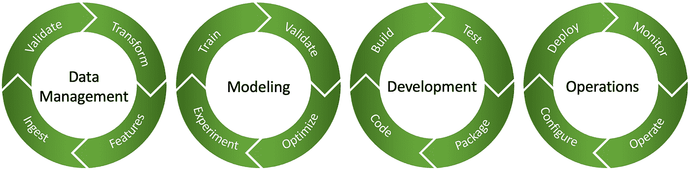
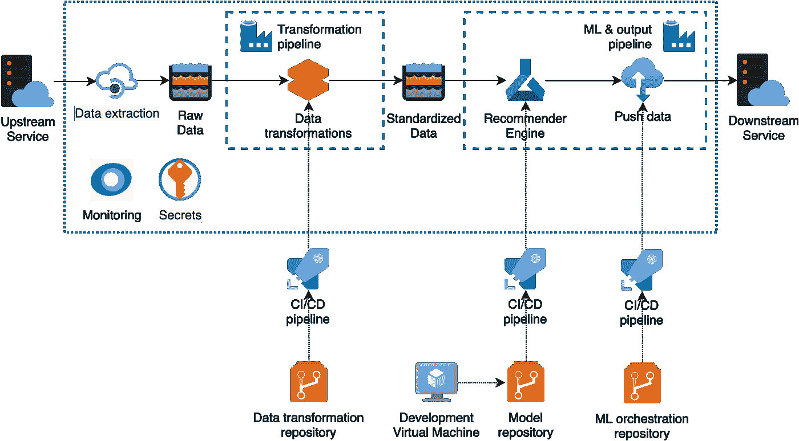

# 利用喜力的全球规模，设计当地建议

> 原文：<https://towardsdatascience.com/engineering-local-recommendations-leveraging-heinekens-global-scale-158d77d2b8dd?source=collection_archive---------27----------------------->

(图片由喜力公司提供)

喜力公司正在利用数据和分析技术对其 157 年的历史进行创新。推荐系统越来越多地通过过滤信息来支持我们的业务流程。例如，我们的销售团队为酒吧的啤酒组合提供建议的系统。然而，我们的国际规模既是优势也是挑战。我们的目标是利用我们的国际影响力，协调各子公司的推荐基础设施。通过机器学习操作方法，我们在 Azure 平台上创建了标准化的推荐系统。自助服务、自动化和协作的文化使我们能够快速将推荐系统扩展到本地子公司。这项工作被 RecSys 会议接受。

喜力公司在 70 多个国家设有子公司，是最国际化的啤酒酿造商。在这些子公司中，对分析解决方案的需求增加，如过滤信息以预测偏好的推荐系统。这有助于我们的销售团队更好地建议商店(如酒吧)向顾客提供哪些啤酒。在开始的情况下，这些子公司独立开发他们的推荐系统。导致各种技术选择和数据来源的多样性。从全球角度来看，这种缺乏标准化是一个重大的工程挑战，因为它支持复杂，维护昂贵，并且没有利用喜力的规模。在期望的情况下，本地推荐系统在子公司之间被协调。确保没有技术债务的高交付速度。因此，这项工作集中在如何在企业内扩展标准化的推荐系统，同时保留分散的所有权并结合本地规范？

## MLOps 方法

我们从使用机器学习操作(MLOps)方法应对这一挑战的经验中汲取了经验。MLOps 由关注效率、可靠性和再现性的系统启动实践组成。它是 ML 和 DevOps(开发运营)的结合。这是一次重要的合并，因为机器学习解决方案是由代码和数据形成的。与只覆盖代码的常规软件工程相比。我们的 MLOps 生命周期有四个阶段，因为我们相信数据管理是成功的推荐系统的基础部分。这个生命周期不是单向或单一的过程。推荐系统通过并行动作进化。

机器学习操作生命周期(图片由作者提供)

MLOps 方法有五种最佳实践:

*   **管道自动化:**通过自动化操作和连接管道中的服务来消除手动操作和延迟。例如，通过发布具有持续集成和持续部署管道的解决方案。
*   **数据可用性:**通过功能存储访问经验证的数据集，并在数据目录中进行索引，以确保可重复的机器学习。
*   **可交换工件:**所有的机器学习模型、代码、配置都是版本控制的、描述性的、PEP8 一致的。带有文档的解决方案模式可用于常见的架构工件。在生产中，代码脚本比笔记本更受欢迎。
*   **可观察性:**深入了解系统组件以确保性能并确定问题的根本原因。度量、事件、日志和跟踪都被收集起来，产品团队可以访问，而不仅仅是工程师。
*   基于策略的安全性:发布分为四个环境:开发、测试、验收和生产。对这些环境的授权是通过基于属性的访问控制(ABAC)来管理的，它具有控制平面和数据平面功能。机密存储在特定于环境的密钥库中。

## 推荐系统示例

根据这种 MLOps 方法，我们创建了一个可在企业内扩展的推荐系统。推荐系统是运行在 Azure 云上的内部解决方案模式的解耦架构。数据管理阶段从上游服务获取原始数据，并将其转换为集中可用的标准化数据集。在建模阶段，使用 Azure ML 工作空间对这些数据进行建模，该工作空间充当推荐引擎。开发阶段创建内部解决方案模式，确保资源之间的可靠性和互操作性。操作阶段使用 CI/CD 管道自动部署资源。这一阶段还为当地利益相关者提供了可访问的可观察性，以发现和检查可能的问题。这种标准化的解决方案减少了每个子公司的工程时间，同时保持了有效整合本地规范和分配所有权的灵活性。

推荐系统(作者图片)

通过资源和解决方案模式标准化跨子公司的推荐系统简化了同事之间的协作。他们可以轻松地交换知识、机器学习模型和其他工件。内部教程是一致的，如果需要，全球团队会提供额外的支持。从而受益于喜力啤酒的全球规模和经验。

## 结论

满足企业中推荐系统的本地需求需要具有最小技术债务的高效工程。我们解决了在企业内部扩展本地推荐系统的挑战。本文描述了一种 MLOps 方法和相应开发的推荐系统。从这个过程中，我们了解到喜力推荐系统的工程应该促进三个原则:自助服务、自动化和协作。

> 自助服务、自动化和协作

这些原则授权子公司开发在整个公司内统一的推荐系统。从而利用喜力的规模来实现高交付速度，同时仍然结合当地的规格。我们相信，这些工程原则对其他有类似数据驱动的雄心和挑战的企业也很有价值。此外，我们认为这些并不局限于推荐系统，而是适用于在全球范围内扩展各种类型的机器学习应用

## 会议文件和视频

这项关于推荐系统的工程工作被接受为第 15 届 ACM 推荐系统会议的行业海报。这是一个主要的国际论坛，由领先的研究人员和从业人员介绍该领域的研究和技术。今年，这是喜力和我自己的主场比赛，在阿姆斯特丹的 Beurs van Berlage 和全球在线举行混合会议。阅读[短文](https://dl.acm.org/doi/10.1145/3460231.3474616)(开放访问)中的完整作品或观看[闪电谈话](https://youtu.be/7W_edLXt6SI)。

这篇文章站在(喜力公司)人才的肩膀上。他们的想法、代码和反馈塑造了我们的思想，并为这项工作做出了贡献。