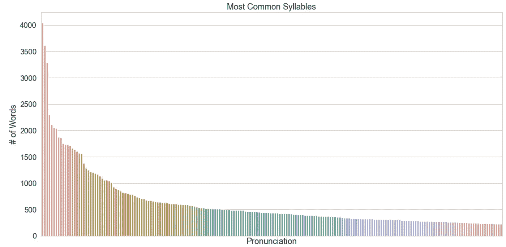

# 英语拼写比你想象的还要糟糕

> 原文：<https://towardsdatascience.com/english-spelling-is-even-worse-than-you-thought-284047e5f1d6?source=collection_archive---------52----------------------->

## 八万多字的拼写和发音分析


发音网络。稍后查看更多|作者图片

我们都知道单词片段‘ough’[可以有很多不同的发音](https://en.wikipedia.org/wiki/Ough_(orthography))。

*   C **到**
*   D **到**
*   Pl **到**
*   尽管如此
*   穿过**到**
*   +更多(不太常见)的

这是一个经常被引用的英语拼写错误的例子。学习不同地发音同一个字母集需要大量的经验，并且在学习新单词时是令人沮丧的。

另一个例子是拼写土豆的“正确”方法。

> [https://www.facebook.com/grammarly/posts/986701041348886:0](https://www.facebook.com/grammarly/posts/986701041348886:0)

虽然这将它推向了极端，但它仍然是这种现象的一个有效例子。它让你思考。

如果我们发出的每个声音都只有一种拼写方式，那会好得多，不是吗？

**输入** [**国际音标**](https://en.wikipedia.org/wiki/International_Phonetic_Alphabet) **。**

这个字母表试图标准化“以书面形式表示语音”，这听起来很棒！最后，不含糊！

> 问题是，人类能够发出的不同声音数量巨大。

****en*和 ***th*** *中的 **th** 音有唯一字母真的值得吗？事实上，这些声音之间有一个连续的频谱；一个从哪里开始，另一个从哪里开始？****

**

***国际音标肺辅音图**通过识别 ***方式*** *和* ***位置*** *音* |截图来自[维基百科](https://en.wikipedia.org/wiki/International_Phonetic_Alphabet)*

*音调符号(每个字母周围的小符号)试图代表*甚至更微妙的*发音差异。这样做的结果是超过一百个不同的字母来代表声音。*

## *概括起来*

*英语的字母数量相对于单词发音的数量来说太少了，这迫使字母代表多种发音，使得学习这门语言变得困难。*

*国际音标有更多的字母来代表单词的发音，导致了令人难以置信的臃肿的书面文本(公平地说，这不是它存在的原因)。*

# *想象这个问题*

**

*国际语音词典(ISLE)的一部分|作者截图*

*<https://github.com/ethanr-2000/bad-spelling-generator>  

作为开发[错误拼写生成器](http://badspellinggenerator.com/)的一部分，我想出了一种将拼写和发音分解成音节的方法——在书面文本和语音之间提供一致的链接。

比如**劝**有一个 **p ə ɹ的发音。s w ei d** ，所以我根据和 **suade** 将单词分解为**。**

这里的数据源是国际语音词典，取自 Python 包 [Pysle](https://github.com/timmahrt/pysle) 。它包含了成千上万的单词和它们的发音。

> 由于单一的数据来源，这些单词更倾向于美式发音。在数据分析过程中要注意这种偏差。

我运行了一些 Python 脚本，从 80，000 多个英语单词中创建了关于音节发音和拼写的数据库。让我们一起探索这些数据，看看我们会发现什么。* 

## *最易发音的音节*

*同理**到**有很多发音，让我们看看哪组字母的*发音最多*。*

**

*一个音节有多少种发音方法？|作者图片*

*音节 **su** 和 **cha** 的 17 种独特发音！？我认为很糟糕！*

*看看苏的数据，我们就能明白这实际上意味着什么。这是每个发音的打印输出，也是它所在单词的一个例子:*

```
*Pronunciations for the letters 'su':
0 	| ʃə 	| cen**su**rable
1 	| sə 	| cap**su**lar
2 	| zə 	| re**su**rrect
3 	| ʃu 	| cen**su**al
4 	| ʒə 	| clau**su**la
5 	| su 	| ba**su**to
6 	| ʃʊ 	| as**su**rance
7 	| ʒu 	| audiovi**su**al
8 	| zu 	| je**su**
9 	| sʌ 	| blood**su**cker
10 	| ʒʊ 	| cae**su**ra
11 	| sjʊ 	| con**su**lar
12 	| zjə 	| cha**su**ble
13 	| sju 	| di**su**nite
14 	| sʊ 	| e**su**rient
15 	| zʊ 	| u**su**fruct
16 	| zju 	| unpre**su**ming*
```

*我对这种多样性感到惊讶。作为一个以英语为母语的人，你在日常生活中不会想到这个词，但几乎所有这些词你都可以凭经验正确发音。*

*诚然有些非常相似，但是试着把**苏**中的每一个字都念成*血* ***苏*** *满满*你就会意识到一个细微的变化会产生多么大的差别。*

## *拼写最易变的音节*

*把前面的图表翻过来，我们来看看*的读音*有哪些*的拼法*。*

**

*每种声音有多少种拼法？|作者图片*

*发音 **si** (发音**见**)有超过 40 种不同的拼法？这似乎不合理。我们来看一下数据。*

*这是音节拼法的列表和一个可以找到它的例句。*

```
*Spellings for pronunciation 'si':
0 	| c 	| c
1 	| cae 	| caecilian
2 	| ce 	| abecedarian
3 	| cea 	| ceases
4 	| cee 	| divorcee
5 	| cei 	| ceiling
6 	| ceip 	| receiptor
7 	| cey 	| pricey
8 	| ci 	| acierate
9 	| cie 	| facie
10 	| cis 	| precis
11 	| coe 	| biocoenosis
12 	| cy 	| abbacy
13 	| pse 	| psephological
14 	| sai 	| saiva
15 	| scae 	| muscae
16 	| sce 	| ascesis
17 	| scei 	| transceiver
18 	| sci 	| biosciences
19 	| scie 	| bioscience
20 	| se 	| antiserum
21 	| sea 	| battersea
22 	| see 	| endorsee
23 	| sei 	| caseinogen
24 	| seig 	| seigneur
25 	| seu 	| transeunt
26 	| sey 	| anglesey
27 	| si 	| albigensian
28 	| sie 	| besieging
29 	| sig 	| monsignor
30 	| ssae 	| fossae
31 	| sse 	| colosseum
32 	| ssee 	| addressee
33 	| ssey 	| odyssey
34 	| ssi 	| aglossia
35 	| ssie 	| aussie
36 	| ssis 	| chassis
37 	| ssy 	| bessy
38 	| sy 	| apostasy
39 	| ze 	| yangtze
40 	| zi 	| ritziest
41 	| zy 	| chintzy*
```

*除了 18 和 19(有点可疑)，我要说都是有效的。*

*你认为用 40 种不同的方法来写一个声音合理吗？英语好像是这么认为的。*

## *最常见的音节*

*作为一个题外话，我感兴趣的是在我使用的单词列表中最常出现的音节。*

*简单地计算每个音节的字数的问题是，它不能公平地代表最“常见”的声音。这是因为我们不知道每个词在日常生活中的相对使用频率。*

*考虑到这一点，请看下图。*

**

*前 20 个最常见的音节音是什么？|作者图片*

***，如 **a** bandon，是用词最多的，紧随其后的是 **ri** (ree)和 **li** (lee)。前三个之后，会有一个很大的下降。***

***让我们缩小来看看前 200 个音节。***

******

***最常见的前 200 个音节是什么？|作者图片***

***在第 100 个最常见的音节附近，出现该音节的单词不到 500 个(80，000+个)，这似乎表明绝大多数单词使用相同的几个音。***

***这让我想起了帕累托法则，也就是 80/20 法则，20%的原因构成了 80%的结果。在这里，*原因*是声音，*效果*是使用它们的单词。***

***以下是该数据的“帕累托图”。***

******

***与不太常见的音节相比，语言中最常见的音节有多大分量？|作者图片***

***在这种情况下，效果更加不均衡。大约 20%的音节音构成了我们发出的所有声音的 90%。***

## ***言语的网络***

***我想要回答的下一个问题是这些音节是如何连接在一起的。假设已知一个单词中有另一个音节，那么每个音节出现在这个单词中的可能性有多大？***

***例如，如果我知道一个单词以 **si、这个音开始，那么接下来最有可能是什么音呢？由此产生的网络图是我最喜欢的视觉效果之一。*****

***我计算了前 20 个最常见的音节之间出现的频率。节点大小代表音节出现的总字数。***

******

***哪些音节经常出现在一起？|作者图片***

*****的**和**的**之间的紧密联系表明它们经常出现在单词中，而 **di** 和 **tI** 之间的微弱联系表明这些音节很少出现在单词中。***

***总的来看，似乎两个音节越相似，它们之间的联系就越小。***

# ***元音的荒谬***

***最后，让我们记住我们如何开始这篇文章。***

***通过比较音节发音和拼写，我们能够识别发音差异很大的拼写，以及可能来自大量不同拼写的声音。***

> ***我们一直专注于音节，但在这个发音不一致的世界里，元音**和**是最糟糕的罪犯。***

***让我们看看每个元音能发出的所有不同的音。在下面的热图中，深色代表字母/声音组合的大量单词。***

******

***五个元音分别发什么音？|作者图片***

***我们看到的是，有一些特定的声音，即使不是全部，也可以由大多数元音发出。 **i** 、 **ʌ** 、 **ɑ** 、 **ə** 、 **I** 这几个音都可以由 3 个以上的元音组成！***

***这还没有考虑元音组合(如 **ai)** ，以及不同的口音和方言，这些会让元音听起来更加混乱！***

***我想说的是，单词中使用的元音并不能明确地识别它所代表的声音，这可能会让任何试图学习这门语言的人感到沮丧。***

# ***关键要点***

***如果用一句话来概括这篇文章，那将是:**书面语很少提供对口语的直观理解。*****

***当然，它可以给你指明正确的方向，但这需要多年的经验。即使这样，结果也是模糊的。***

***如果你想看到这种现象的发生，可以看看 Bad Spelling Generator，它通过替换其他单词中发音相同的音节来重新拼写单词。结果可能是荒谬的。***

***<http://badspellinggenerator.com/>  

如果你喜欢这篇文章，可以考虑关注我，看看我的其他作品，比如这个关于从推文中提取情感的项目。

</tracking-dysons-public-image-using-46-166-tweets-68af509923a6> ***