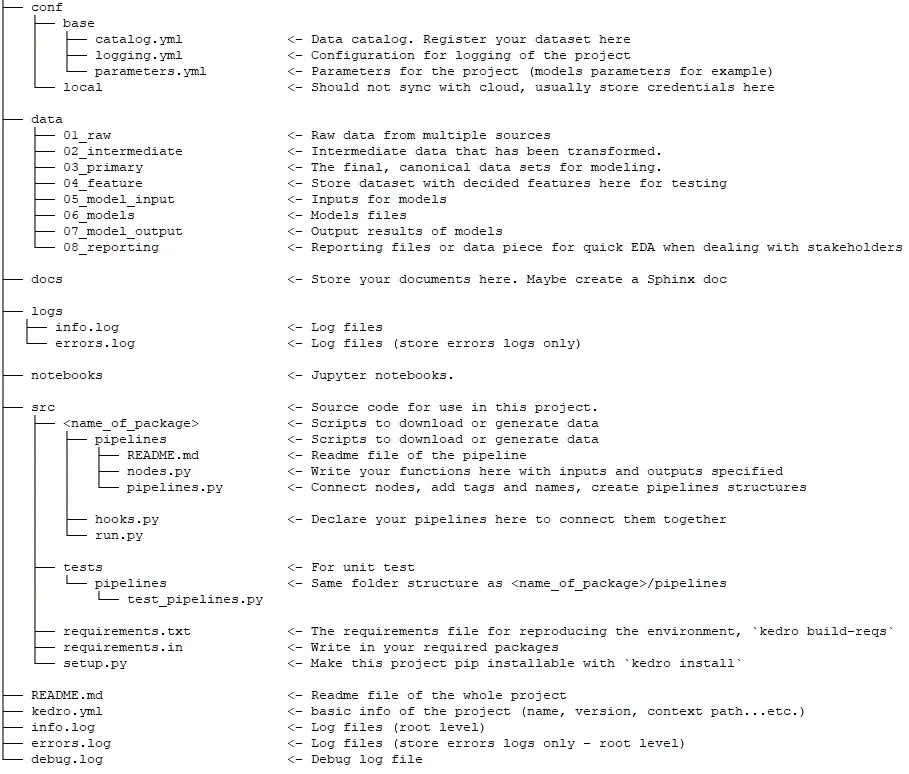
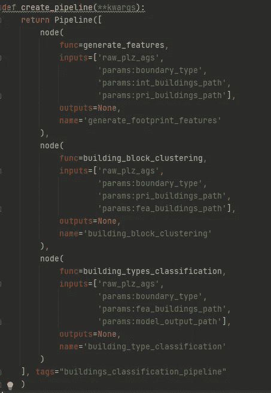
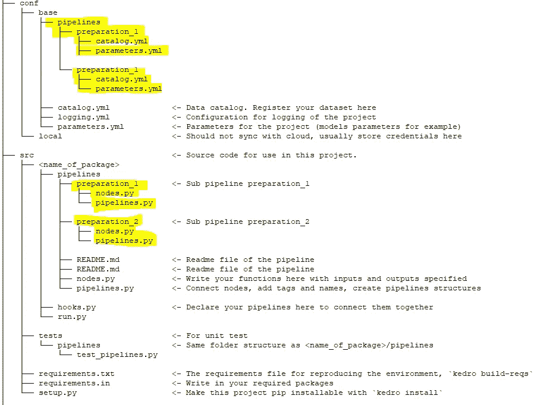
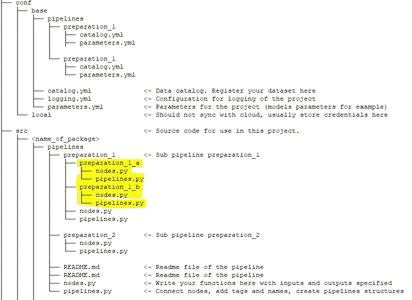
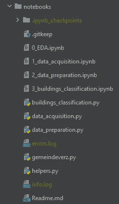
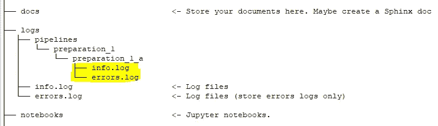
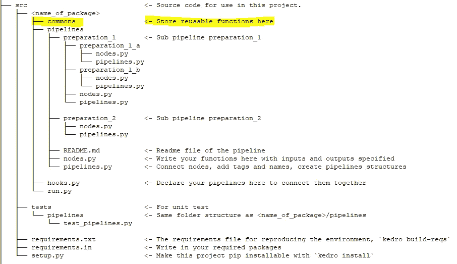

# 用这些小贴士提升你的 kedro 体验

> 原文：<https://towardsdatascience.com/enhance-your-kedro-experiences-with-these-tips-3036c3b7564?source=collection_archive---------30----------------------->

## 从软件包安装、批量保存到子流水线和日志记录。愿这些建议能让你的 kedro 生活更轻松。


[田宽](https://unsplash.com/@realaxer?utm_source=unsplash&utm_medium=referral&utm_content=creditCopyText)在 [Unsplash](https://unsplash.com/s/photos/pipeline?utm_source=unsplash&utm_medium=referral&utm_content=creditCopyText) 上拍照

## 目录

[什么是 kedro，我们为什么要使用它？](#927f)
[#1。设计结构采用模块化管道](#e58d)
[#2。使用 Jupyter 笔记本建立流程](#010f)
[#3。对单独的管道使用日志记录](#4d1f)
[#4。批量保存结果](#e31b)
[#5。](#cc44)
软件包版本控制 [#6。常用功能存储位置](#01da)

本文假设您知道如何独立开发 kedro 项目，或者至少在其官方页面上浏览过“[宇宙飞船](https://kedro.readthedocs.io/en/stable/03_tutorial/01_spaceflights_tutorial.html)”示例。我将简单介绍一下这个工具，然后看看我的提示列表，这是我用***【kedro 】(适用于所有版本= < 0.17.0)*** 进行了几个月的试验(和努力)的结果

我已经写了一个关于地理人口分析的“ **kedro 动手**”系列，本文中的知识已经在那里实现了:

[](/kedro-hands-on-build-your-own-demographics-atlas-pt-1-16f2cb6676d5) [## Kedro 手把手:建立自己的人口统计图谱。角。1:数据收集和清理

### 如何使用 OSM(开放街道地图)和 OGD(开放政府数据)和 kedro 建立自己的简单人口地图集…

towardsdatascience.com](/kedro-hands-on-build-your-own-demographics-atlas-pt-1-16f2cb6676d5) 

# 什么是 kedro，为什么要用它？

> Kedro 是一个开源 Python 框架，用于创建可复制、可维护和模块化的数据科学代码。它从软件**工程**中借用概念，并将其应用于**机器学习代码**；应用的概念包括模块化、关注点分离和版本控制。[1]

该工具由麦肯锡公司的 [QuantumBlack 在 2017-2018 年开发，由于其全面性和易于实施，已被许多组织采用。这个包目前只针对 Python(抱歉 R-用户)，它不是一个工作流调度器(但是你可以使用一个插件，比如 kedro-airflow)。](https://medium.com/u/777702680128?source=post_page-----3036c3b7564--------------------------------)

> 使用 Kedro 的主要优势是以一种非常流畅的方式在数据科学领域应用软件和数据工程的概念。

[Jo Stichbury](https://medium.com/u/49dd0198b639?source=post_page-----3036c3b7564--------------------------------) 关于 kedro 的文章是一个很好的开始:

[](/kedro-prepare-to-pimp-your-pipeline-f8f68c263466) [## 准备给你的管道拉皮条

### 用于生产就绪数据管道的新 Python 库

towardsdatascience.com](/kedro-prepare-to-pimp-your-pipeline-f8f68c263466) 

# #1.模块化管道设计结构

在开始任何项目之前，坐下来规划整体结构是明智的。当旋转一个新的 kedro 项目时，它会创建一个标准的文件夹结构，如下所示:



作者图片

对于一个简单的数据科学项目，上面的结构已经足够好了。然而，当处理一个更复杂的项目时，虽然您可以添加更多的节点并使管道更长，但它会击败 kedro 的“干净组织”优势。所以我的经验法则是“如果管道有 5 个以上的节点，让我们看看我是否能把它们分成子管道”(如果不能，尽量把节点数保持在 5 到 10 之间)。为什么“**5**”—因为对我来说，在 Pycharm 窗口中，你不用向下滚动就能看到大约 5 个节点。

> 如果管道有 5 个以上的节点，让我们看看是否可以将它们分成子管道



[例如:我的 CheapAtlas 项目](/kedro-hands-on-build-your-own-demographics-atlas-pt-1-16f2cb6676d5)中有 3 个节点的管道。作者图片

为了避免这些混乱，您可以创建一个子管道(或官方文档中的[模块化管道](https://kedro.readthedocs.io/en/latest/06_nodes_and_pipelines/03_modular_pipelines.html#what-are-modular-pipelines)):

```
kedro pipeline create <pipeline_name>
```

当运行上面的命令时，除了生成额外的文件夹，kedro 还将添加参数和目录 YAML 文件到:

```
conf/base/pipelines/<sub_pipeline_name>/
```

因此，如果您为数据准备流程名称`preparation_1`和`preparation_2` 创建 2 个子管道，则文件夹结构将更新如下:



conf 和 src 文件夹中的更改。作者图片

在这里，设置`*conf/base/pipelines*`中的 YAML 文件将拥有**优先于根`*conf/base*`文件夹中的 YAML 文件。换句话说，您可以单独为`**preparation_1**` 或`**preparation_2**` 指定目录中的哪些数据集和哪些参数，而无需在根目录. yml 和 parameters.yml 中列出所有数据集和参数**

> 也可以在子管道下创建子管道。但这一次，你需要做一些手动复制文件和文件夹。

不仅如此，您可以在子管道中创建子管道，这使得组织任务更加清晰。但是，在这种情况下，您还不能使用 kedro CLI。所以我们必须自己创建文件夹和复制样板文件。继续上面的例子，如果我想在`**preparation_1**`下创建一个子管道`**preparation_1_a**` 和`**preparation_1_b**` 会发生什么



亚-亚管道。作者图片

这样，`*conf/base/pipelines/preparation_1*`下的 YAML 文件将同时应用于`**preparation_1_a**` 和`**preparation_1_b**`。要连接它们，您需要在`**preparation_1/pipelines.py**` 中的 *create_pipeline()* 下指定您想要连接的所有子子管道，而不是像普通的 pipelines.py 文件那样列出所有节点(请将< name_of_package >改为您的项目包名称)

preparation_1 文件夹下的 pipelines.py。作者图片

# #2.使用 Jupyter 笔记本建立流程

搬到 kedro 不代表放弃笔记本。我本人非常喜欢与 Jupyter Lab 合作(最近他们发布了 3.0 版本！)因为我可以轻松地快速测试和构建我的流。Kedro 还安装了 Jupyter Notebook，但是您应该升级软件包，因为它们使用的是旧版本的 0.4x。

```
pip uninstall jupyter
pip install jupyter
pip install jupyterlab
```

然后，您可以通过以下方式启动 Jupyter 集群(记住将终端光标放在项目文件夹中):

```
kedro jupyter lab
```

你可以阅读 kedro 关于与笔记本整合的官方文档。对我来说，使用笔记本进行 EDA 是一个很大的优势，因为你可以轻松地制作图表材料。此外，用多个笔记本建立一个完整的机器学习工作流也更容易理解:你可以从 0_EDA 到 1_data_preparation 等等开始，并将它们都放在`**notebooks**`文件夹下。



【CheapAtlas 项目的 Jupiter 笔记本文件夹示例。作者图片

# #3.对单独的管道使用日志记录

Kedro 官方文档有一些关于日志记录的指南，我认为这是调试的关键部分。通常，当不使用记录器时，您可以直接**将结果打印**到 CLI 终端。但是，如果您的 kedro 管道生成大量日志或打印出大量信息，那么就很难使用终端窗口进行追溯(而且您甚至没有在外部保存日志文件)。

要启用记录器，最好将其插入到`**nodes.py**`中的函数中

```
# for logging
import logging
log = logging.getLogger(__name__)< codes here >
logging.info(abc)
logging.warn(abc)
logging.error(abc)
```

我通常会尽量多地记录`*warnings*` 和`*errors*` ，但尽量少记录`*infos*` ，因为讽刺的是，它们是你最不想存储的信息。要了解有关不同级别的日志记录的更多信息，请参考此处:

 [## 日志记录-Python-Python 3 . 9 . 1 文档的日志记录工具

### 源代码:Lib/logging/__init__。py 这个模块定义了实现灵活事件记录的函数和类…

docs.python.org](https://docs.python.org/3/library/logging.html) 

另一个技巧是指定**处理程序**来记录到管道的特定文件夹中——这意味着如果您正在运行子-子管道，日志应该保存在该管道的相应文件夹中。从上面的例子中可以看出，如果您只想保存`**prepration_1_a**` 子管道的日志，文件应该保存在这里:



为日志文件分而治之。作者图片

同样，结构看起来很清楚，但是如果您的管道不是那么复杂并且不生成长日志，我仍然建议坚持默认设置，只使用一个日志文件。

# #4.批量保存结果

我同意 Lou Kratz 关于 kedro 的一个问题是，kedro 不支持像用增量数据集读取那样好的写入结果。这意味着，如果您正在处理一个运行了 6-7 个小时的大型数据集，突然内存不足或遇到一些错误…您的结果将不会被保存(哎哟！).问题已经在这里[提出](https://github.com/quantumblacklabs/kedro/issues/499)，让我们等待更新。

[](/kedro-6-months-in-138c27aed13b) [## Kedro 6 个月

### 在各个项目和团队使用了 6 个月的 kedro 之后，列举自己的想法，带回家。

towardsdatascience.com](/kedro-6-months-in-138c27aed13b) 

与此同时，我们可以通过将保存结果分成多个文件并使用日志记录来跟踪它们来实现一种变通方法。如果您想将结果保存到一个文件中，使用`pandas.write_csv`的**追加**功能，如下所示。使用这种方法，当在`*pipelines.py*` 中声明节点时，您不必指定`**Outputs**`(参见我在技巧#1 中的 3 个节点的例子)。记得直接在`*nodes.py*`写日志跟踪进程就行了

```
import os
idx = (put the tracking index in the code section before this)# if file does not exist write header 
if not os.path.isfile('filename.csv'):
   df.to_csv('filename.csv', header='column_names')
else: # else it exists so append without writing the header
   df.to_csv('filename.csv', mode='a', header=False)
   # logging here for tracking with idx as the index
   logging.info(f'Append result for element {idx} complete!')
```

> 将结果分成多个保存文件或使用 pandas.write_csv()的 append 函数，并使用日志记录来跟踪进度

# #5.包版本控制

而 kedro 的功能是用`kedro build-reqs`自动建立一个包需求列表，你可以用`pip install -r requirements.txt`安装所有的需求。然而，我发现这给我的项目带来了很多麻烦(因为一些已知的原因，比如`pip vs conda install`以及 python version = >，结果是使用 3.7 在这一点上是最稳定的——当然，还有一些未知的原因)。

过了一段时间，我发现保持事情一致性的最好方法是在`requirements.in` 中放入“硬锁”包版本，而不是依赖自动命令。一篇关于为什么`requirements.txt`不够以及如何使用`pip freeze`和`pip-compile` [的好文章，在这里](https://modelpredict.com/wht-requirements-txt-is-not-enough)。

# #6.常用功能存储位置

在开发管道时，有时您希望重用已经在其他管道中开发的代码块。为了避免引用存储代码的`nodes.py`,最好创建一个文件夹来存储`src/common`中的那些函数，然后使用它作为引用的中心点。

> 在项目开始时，最好在 src/common 中为可重用函数创建一个文件夹，以便您可以在以后引用它们

继续上面的例子，当开发 preparation_1_b 时，您注意到有一个来自`preparation_1_a/nodes.py`的函数，您希望**重用**。通常情况下，你会这样写`preparation_1_b/nodes.py`:

`from <name_of_package>.preparation_1.preparation_1_a.nodes import a,b,c`

你应该做的是

`from <name_of_package>.commons.helpers import a,b,c`



在 src/commons 中存储可重用的函数。作者图片

感谢阅读！如果你能留下回复，我会很高兴，我们可以进一步讨论这个话题。

# 参考

[1] QuantumBlack。(2020).*什么是 Kedro？— Kedro 0.17.0 文档*。[在线]可从以下网址获取:[https://kedro . readthedocs . io/en/stable/01 _ introduction/01 _ introduction . html](https://kedro.readthedocs.io/en/stable/01_introduction/01_introduction.html)【2021 年 1 月 24 日获取】。

‌