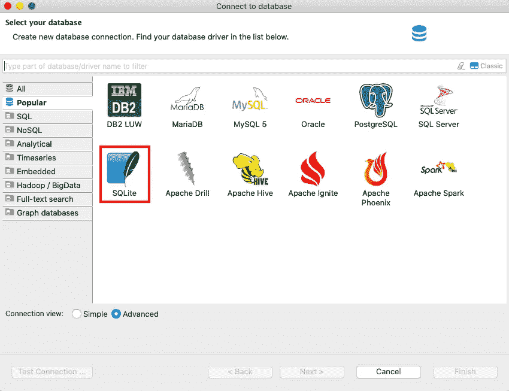
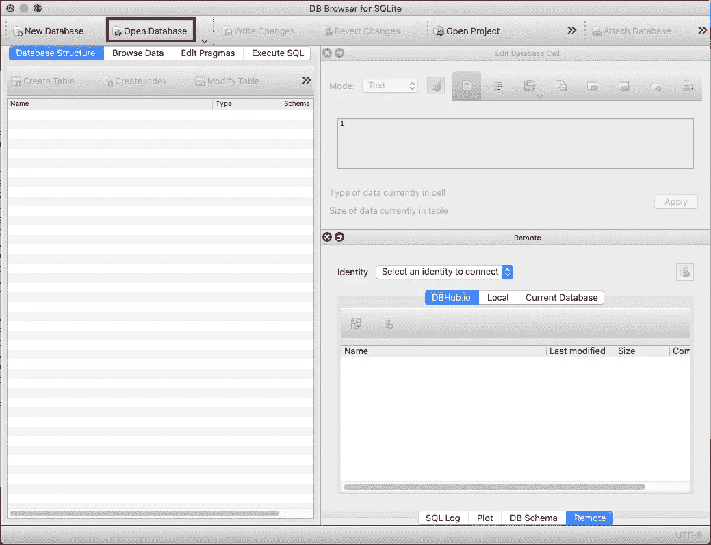

# 用 SQLite 增强你的熊猫技能

> 原文：<https://towardsdatascience.com/enhance-your-pandas-skills-with-sqlite-c542ad266da1?source=collection_archive---------28----------------------->

## python 内置数据库 SQLite 的一个简单技巧，使您的数据操作更加灵活和轻松。


照片由[威廉·艾文](https://unsplash.com/@firmbee?utm_source=medium&utm_medium=referral)在 [Unsplash](https://unsplash.com?utm_source=medium&utm_medium=referral) 上拍摄

Pandas 是一个强大的 Python 包，可以处理你的数据。但是，您是否遇到过一些任务，让您觉得‘如果我能在这里使用 SQL 查询就好了！’？我个人觉得在 pandas 中连接多个表并只提取那些您想要的列时特别烦人。例如，您想要连接 5 个表。您完全可以只用一个 SQL 查询就做到这一点。但是在熊猫身上，你要做 4 次归并，a+b，(a+b)+c，((a+b)+c)+d，…更糟糕的是，每次合并时，pandas 将保留所有列，尽管您可能只需要另一个表中的一两列。如果你和我有相同或相似的问题，你来对地方了。

这个问题让我想到了 SQLite，这是一个内置的轻量级 Python 数据库。内置意味着它是 Python 自带的，你不必再运行任何 pip/conda install 来安装这个包。有多神奇？！让我们看看这个魔术是如何运作的。有两种方法可以实现这一点，要么使用内置的 sqlite3 包，要么也可以使用 sqlalchemy。我将在下面说明这两个问题。

只需导入软件包，无需任何其他安装(您可能需要安装 sqlalchemy):

```
import sqlite3 as sl
import sqlalchemy as sa
from sqlalchemy import create_engine
```

不要担心驱动程序或连接字符串等。您可以像下面这样简单地创建连接:

```
# SQLite
sl_conn = sl.connect(‘{your db name}.db’)# SQLAlchemy
engine = create_engine('sqlite:///PATH/TO/DB/{your db name}.db',echo=True)
sa_conn = engine.connect()
```

如果数据库不存在，这将自动创建数据库，然后连接到它。否则，它将直接连接到数据库。多方便啊？

请注意，这将创建一个 db 文件。在 sqlalchemy 的`create_engine`中，将`echo`属性设置为 True 将会打印出日志。如果不想看到整个日志被打印出来，设置为 False。

一旦你创建了连接，通过熊猫的`to_sql`和`read_sql`功能与数据库进行交互就更加容易了。

假设您已经有了一些想要使用 SQL 查询的 pandas 数据帧。第一步是将数据帧导入到我们刚刚创建的数据库中。

```
# sa_conn and sl_conn can be used interchangeably
df_1.to_sql(‘table_1’, sa_conn, if_exists='replace')
df_2.to_sql(‘table_2’, sl_conn, if_exists='replace')
df_3.to_sql(‘table_3’, sa_conn, if_exists='replace')
```

您可以在数据库中指定表名，它不必与数据帧的名称相同。使用`if_exists`来指定如果该表已经存在于数据库中，您想要做什么。选项包括“失败”、“替换”、“追加”。

*   ' fail ':引发 ValueError。(默认)
*   ' replace ':在插入新值之前删除该表。
*   ' append ':向现有表中插入新值。

一旦数据库中有了表，就可以开始使用 SQL 查询它们。

```
query = ```
        SELECT 
            *
        FROM table_1
        INNER JOIN table_2 ON table_1_key=table_2_key
        INNER JOIN table_3 ON table_1_key=table_3_key
        ```
joined_table = pd.read_sql(query, sa_conn)
```

首先将您的查询定义为一个字符串，如果查询很长并且有多行，使用`````，然后使用 pandas 的函数`read_sql`从数据库中提取数据并将其转换为 pandas dataframe。

使用 SQL 客户端工具与数据库进行交互也是完全不需要动脑筋的。可以使用 DBeaver 或者 DB Browser for SQLite (DB4S)之类的工具。

**迪贝弗**

打开 DBeaver 并选择 SQLite 作为数据库驱动程序。



浏览到之前生成的 DB 文件，然后单击 finish。


# DB4S

DB Browser for SQLite 也不例外。单击“打开数据库”,然后导航到数据库文件并打开它。



恭喜你！！现在你知道如何利用 Python 的内置数据库工具 SQLite，将你的熊猫技能带到另一个水平！通过集成 pandas 和 SQL 查询，您的数据处理技能变得更加灵活和强大。