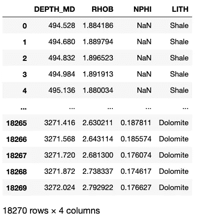

# 用边缘图增强你的散点图

> 原文：<https://towardsdatascience.com/enhance-your-plotly-express-scatter-plot-with-marginal-plots-de469d42f12a?source=collection_archive---------5----------------------->

## 在您的 Plotly Express 散点图上显示额外信息


图示测井数据的散点图，在两个轴上显示边际图。图片由作者提供。

散点图是数据科学中常用的数据可视化工具。它们允许我们在二维图上画出两个数值变量，如点。从这些图中，我们可以了解这两个变量之间是否存在关系，以及这种关系的强度如何。

在这个简短的教程中，我们将使用优秀的 [Plotly](https://plotly.com) 库来可视化一个数据集，我们将了解如何在 y 轴和 x 轴的边缘添加边缘图，以增强我们对数据的可视化和理解。

我已经介绍了在 plotly 和 matplotlib 中创建散点图，您可以在下面找到:

*   [使用 Python 中的 matplotlib 创建测井数据散点图](https://andymcdonaldgeo.medium.com/membership)
*   [使用 Plotly Express 创建交互式散点图](/using-plotly-express-to-create-interactive-scatter-plots-3699d8279b9e)

本教程的一部分在我的散点图视频中有所涉及

# 普洛特利图书馆

Plotly 是一个基于网络的工具包，用于生成强大的交互式数据可视化。这是非常有效的，可以用很少的代码行生成图。这是一个受欢迎的库，包含各种各样的图表，包括统计、金融、地图、机器学习等等。

Plotly 库有两种主要用途:

*   Plotly Graph Objects，这是一个用于创建图形、轨迹和布局的低级接口
*   Plotly Express，它是 Plotly 图形对象的高级包装器。Plotly Express 允许用户键入更简单的语法来生成相同的绘图。

# 使用 Plotly Express 创建散点图

**加载库&数据**

第一步是加载 [pandas](https://pandas.pydata.org/) ，它将用于加载我们的数据，以及 [plotly.express](https://plotly.com/python/plotly-express/) 用于查看数据。

```
import pandas as pd
import plotly.express as px
```

一旦导入了库，我们就可以导入数据了。

我们将在本文中使用的数据集来自 Xeek 和 FORCE([https://xeek.ai/challenges/force-well-logs/overview](https://xeek.ai/challenges/force-well-logs/overview))举办的岩性预测机器学习竞赛。竞赛的目的是从由 98 口训练井组成的数据集中预测岩性，每口井的测井完整性程度不同。目的是根据测井测量预测岩相。要下载该文件，请导航到上面链接的数据部分。原始数据源可在:[https://github . com/bolgebrygg/Force-2020-机器学习-竞赛](https://github.com/bolgebrygg/Force-2020-Machine-Learning-competition)下载

```
df = pd.read_csv('xeek_subset_example.csv')
```

然后我们可以调用`df`来查看数据帧的前五行和后五行。



包含测井数据的数据帧。图片由作者提供。

我们得到的是上面的数据帧。我们的数据集包含两个测井测量值(ρb-体积密度和 NPHI-中子孔隙度)，一个深度曲线和一个地质解释的岩性。

## 创建散点图

用 Plotly Express 创建散点图非常简单，我们指定数据帧和我们想要绘制的列。

```
px.scatter(data_frame=df, x='NPHI', y='RHOB', range_x=[0, 1],range_y=[3, 1], color='LITH')
```

这将返回以下散点图。目前，它看起来有点乱，因为许多岩性有重叠的价值。这是因为解释的岩性是基于许多不同的测井测量和岩屑描述而产生的。


测井数据散点图的简单图示。图片由作者提供。

点击图例中的 **LITH** 名称，可以隐藏单个 LITH 组。


简单绘图表示滤波后的测井数据散点图。图片由作者提供。

# 向 Plotly Express 散点图添加边际图

边缘图是可以附加到 y 轴和 x 轴边缘的迷你图。Plotly Express 中有四种不同类型的边际图。

## 箱线图

箱线图是一种基于五个关键数字显示数据分布的图形和标准化方法:最小值、第一个四分位数(第 25 个百分位数)、中值(第二个四分位数)。/第 50 个百分位数)、第 3 个四分位数(第 75 个百分位数)和“最大值”。最小值和最大值分别定义为 Q1-1.5 * IQR 和 Q3 + 1.5 * IQR。任何超出这些限制的点都被称为异常值。


箱线图的图形描述，突出显示关键组成部分，包括中位数、四分位数、异常值和四分位数间距。作者创建的图像。

边缘箱线图可以添加到单个轴上，如下所示

```
px.scatter(data_frame=df, x='NPHI', y='RHOB', range_x=[0, 1],range_y=[3, 1], color='LITH', 
          marginal_y='box')
```


用 y 轴上的一系列箱线图来表示散点图。图片由作者提供。

或者通过指定关键字参数`marginal_y`和`marginal_x`的值来指定两个轴。

```
px.scatter(data_frame=df, x='NPHI', y='RHOB', range_x=[0, 1],range_y=[3, 1], color='LITH', 
          marginal_y='box', marginal_x='box')
```


用轴上的箱线图来表示散点图。图片由作者提供。

## 地毯图

Rug 图用于显示数据分布，可添加如下内容:

```
px.scatter(data_frame=df, x='NPHI', y='RHOB', range_x=[0, 1],range_y=[3, 1], color='LITH', 
          marginal_y='rug', marginal_x='rug')
```


用轴上的地毯图来表达散点图。图片由作者提供。

## 直方图

直方图是一种优秀的数据可视化工具，看起来类似于条形图。然而，直方图使我们能够深入了解一组数据中的值的分布，并使我们能够在一个简洁的图中显示大量数据。在岩石物理学和地球科学领域，我们可以使用直方图来识别异常值，也可以挑选关键的解释参数。例如，来自伽马射线的粘土体积或页岩体积端点。

要将边缘图更改为直方图，我们的操作如下:

```
px.scatter(data_frame=df, x='NPHI', y='RHOB', range_x=[0, 1],range_y=[3, 1], color='LITH', 
          marginal_y='histogram', marginal_x='histogram')
```


用轴上的直方图边缘图来表示散点图。图片由作者提供。

## 小提琴情节

Violin 图类似于 box 图，但它们也结合了核密度估计图的强大功能。除了说明箱线图显示的关键统计点之外，它还允许我们深入了解数据的分布。

```
px.scatter(data_frame=df, x='NPHI', y='RHOB', range_x=[0, 1],range_y=[3, 1], color='LITH', 
          marginal_y='violin', marginal_x='violin')
```


用轴上的小提琴边际图来表达散点图。图片由作者提供。

## 混合边际图

您不必在两个轴上绘制相同的图，您可以在 x 轴上使用直方图，在 y 轴上使用小提琴图。

```
px.scatter(data_frame=df, x='NPHI', y='RHOB', range_x=[0, 1],range_y=[3, 1], color='LITH', 
          marginal_y='violin', marginal_x='histogram')
```


用轴上的混合边际图来表示散点图。图片由作者提供。

# 摘要

在这个简短的教程中，我们看到了如何使用测井数据在 plotly express 散点图上显示各种边际图。这些图可以增强我们的数据可视化，并为我们提供有关数据分布的更多信息。

***感谢阅读！***

如果您觉得这篇文章有用，请随时查看我的其他文章，这些文章介绍了 Python 和测井数据的各个方面。你也可以在[*GitHub*](https://github.com/andymcdgeo)*找到我在这篇文章和其他文章中使用的代码。*

*如果你想联系我，你可以在*[*LinkedIn*](https://www.linkedin.com/in/andymcdonaldgeo/)*或者我的* [*网站*](http://andymcdonald.scot/) *找到我。*

有兴趣了解更多关于 python 和测井数据或岩石物理学的知识吗？跟我上 [*中*](https://andymcdonaldgeo.medium.com/subscribe) *。*

如果你喜欢阅读这些教程，并想支持我作为一名作家和创作者，那么请考虑报名成为一名媒体成员。一个月 5 美元，你就可以无限制地阅读数千篇各种主题的文章。如果您使用 [**我的链接**](https://andymcdonaldgeo.medium.com/membership) **，**注册，我将为您赚取一小笔佣金，无需额外费用！

<https://andymcdonaldgeo.medium.com/membership> 