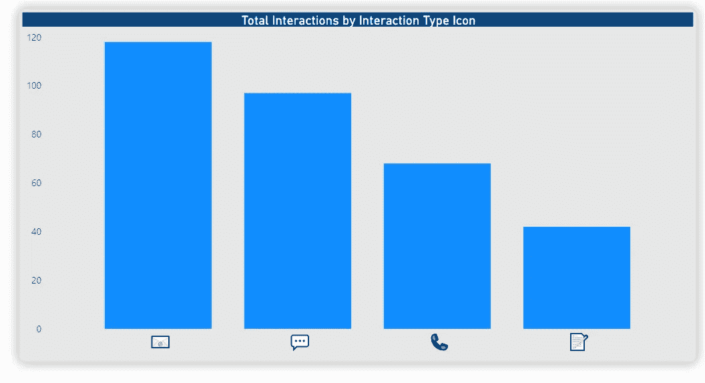
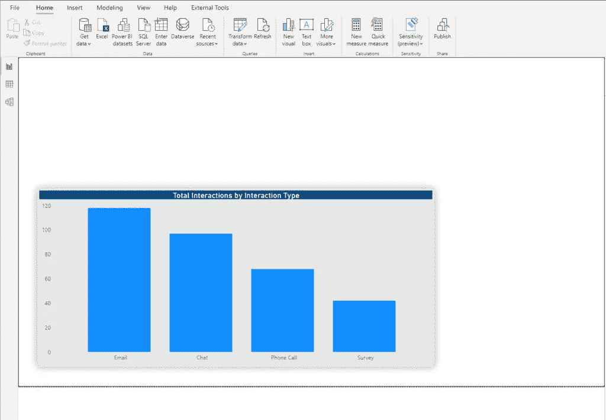
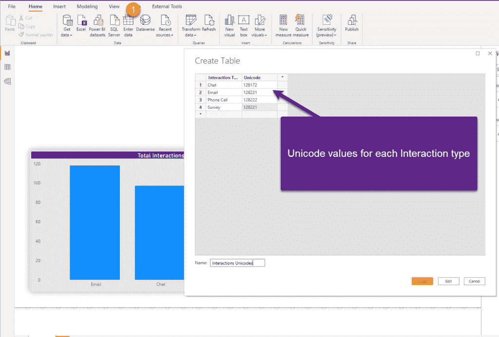
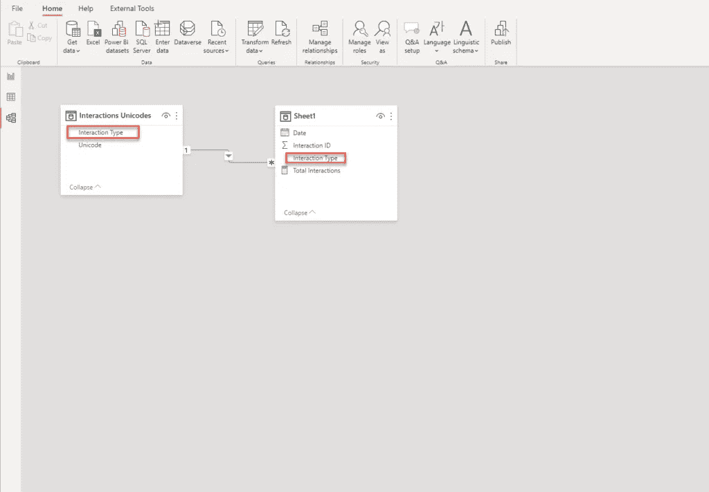
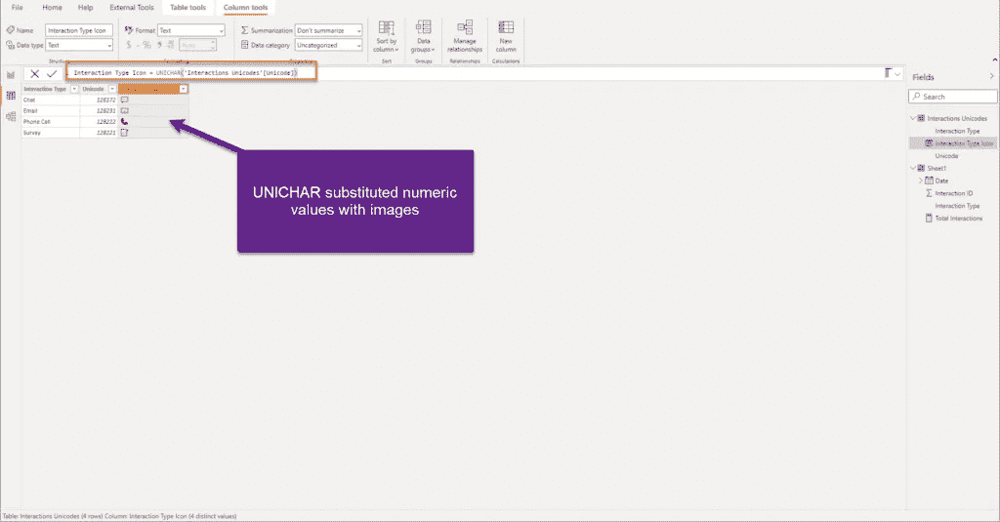
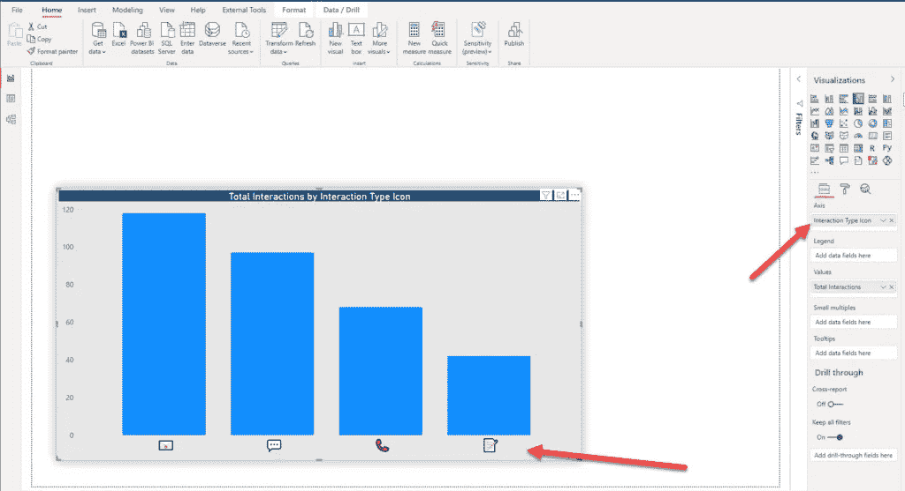

# 利用安讯士上的图像增强您的电力 BI 报告

> 原文：<https://towardsdatascience.com/enhance-your-power-bi-report-with-images-on-axis-a4227b650e4a?source=collection_archive---------32----------------------->

## 你有没有想过在 axis 上使用图像而不是“常规”文本？或者，甚至在切片机内？检查这个简单的技术，你就可以开始了！



作者图片

如果你经常关注我的故事，你应该已经注意到我经常试图增强 Power BI 提供的内置可视化效果。在我看来，在某些情况下，作为一名 Power BI 开发人员，你可以超越自我，使用简单的技巧将用户体验提升到一个新的水平。

不久前，我正在为我们的客户支持部门创建一个报表解决方案。基本上，支持代理执行四种不同类型的与客户的交互—聊天、电子邮件、电话和调查。此外，管理人员需要一份报告来衡量每种特定类型的交互数量，以便他们可以确定高峰时间并为特定任务分配代理。

## 搭建舞台

对于这个例子，我将保持事情简单。有一个包含交互唯一 id、交互日期和交互类型的表。第一步是创建一个[显式度量](/understanding-explicit-vs-implicit-measures-in-power-bi-e35b578808ca)，它将计算交互的数量。

```
Total Interactions = COUNT(Sheet1[Interaction ID])
```

这是我此刻的视觉效果:



作者图片

如你所见，这里没什么特别的，“经典”柱形图。所以，让我们试着给它注入一些活力。我已经写过 DAX 中的 *UNICHAR()* 函数，以及[如何在某些场景中利用这个函数](/customizing-google-analytics-visual-in-power-bi-7b36378d02e2)。该函数返回 Unicode 字符，以表示您提供的数值。

现在，这个想法是用文字的视觉表现来代替文本值:聊天、电子邮件、调查和电话。有一系列不同的符号可以用 Unicode 表示。[这里的](https://www.vertex42.com/ExcelTips/unicode-symbols.html#music)是非常全面的符号列表，以及它们的 Unicode 值。

## 替换文本值

第一步是在 Power BI 数据模型中创建一个新表，它将保存关于 Unicode 值的数据。



作者图片

将表加载到数据模型后，我将切换到模型视图，并在该表和我的原始表之间建立“一对多”关系:



作者图片

之后，我将在我的交互 Unicodes 表中创建一个新的 DAX 列。神奇的事情发生了——**我们将使用 *UNICHAR()* 函数，作为参数，我们将提供来自 Unicode 列**的值:

```
Interaction Type Icon = UNICHAR('Interactions Unicodes'[Unicode])
```

瞧，现在看看这一列中的值！



作者图片

当我们建立了表之间的关系后，让我们抓取该列，并将其放在柱形图的 x 轴上:



作者图片

看起来很酷，对吧？您可以增加/减少 x 轴的字体大小，就像您对“正常”文本所做的一样——并且您的图标将被调整大小！

此外，我们还可以将这些图标用作切片器！让我向您展示如何使用它来增强您的用户体验。


作者图片

正如你在上面的插图中看到的，我已经很好地格式化了切片器，看起来像一组按钮(通过使用水平方向)，所以我现在可以通过点击它来切片我的数据！我还创建了一个矩阵视觉，你可以看到我们的图标在那里，就像普通的文本列一样。最后，UNICHAR()函数将返回文本值，您可以像处理普通文本一样处理它。

## 结论

要记住的关键事情是:在创建 Power BI 报告时，不要让这个技巧成为主要的“工作方式”!当然，在大多数情况下，你应该坚持在你的视觉效果中显示价值的传统方式。但是，在某些情况下，应用这种技术可以增强用户体验。

在我看来，如果你决定使用这个技巧，有两件事非常重要:

*   ***处理有限数量的类别***——正如你在我的例子中看到的，有固定数量的可能类别(聊天、电话、电子邮件和调查)，所以没有轴/切片器被太多图标弄得混乱的危险
*   ***图标必须提供“常规”文本值*** 的上下文——用户必须明白每个图标代表什么。如果不是这样，你的报告将会导致混乱而不是清晰，这也是在使用这种技术之前要三思的另一个有效的理由

像往常一样，尝试在增强用户体验和使用这些非标准技术可能导致的额外开销之间找到适当的平衡。

感谢阅读！

[成为会员，阅读 Medium 上的每一个故事！](https://datamozart.medium.com/membership)