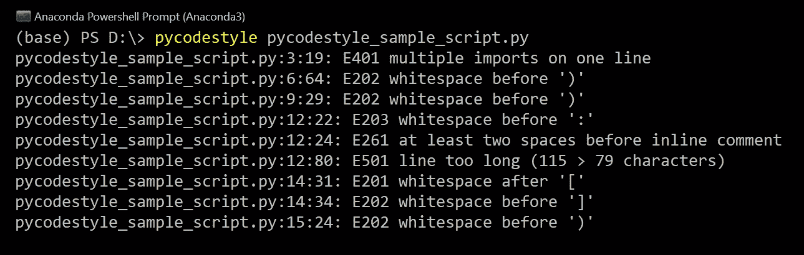
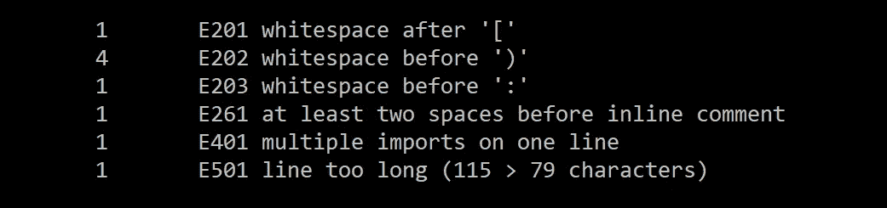

# 使用 pycodestyle 增强 Python 代码的可读性

> 原文：<https://towardsdatascience.com/enhance-your-python-codes-readability-with-pycodestyle-9838976077cb?source=collection_archive---------24----------------------->

## 基于 PEP-8 风格约定自动检查 Python 脚本的可读性和质量


Emmanuel Ikwuegbu 在 [Unsplash](https://unsplash.com?utm_source=medium&utm_medium=referral) 上拍摄的照片

编程是数据从业者工具箱中不可或缺的技能，虽然创建一个脚本来执行基本功能很容易，但是大规模编写良好的可读代码需要更多的工作和思考。

鉴于 Python 在数据科学中的受欢迎程度，我将深入研究使用 ***pycodestyle*** 进行**样式向导检查**，以提高 Python 代码的质量和可读性。

## 内容

> *(****1****)*[*关于 PEP-8*](#844a) *(****2****)*[*动机*](#302b) *(****3****)*

# 关于 PEP-8

***pycodestyle*** 检查器根据 **PEP-8** 样式约定提供代码建议。那么 PEP-8 到底是什么？

PEP 代表 **Python 增强提议**，而 [PEP-8](https://www.python.org/dev/peps/pep-0008/) 是概述编写 Python 代码最佳实践的指南。于 2001 年创作，其主要目标是通过标准化代码样式来提高整体代码的一致性和可读性。

需要注意的一点是，PEP-8 旨在作为指南，而**不是**旨在被解释为始终严格遵守的圣经指示。

# 动机

快速浏览一下 [PEP-8 文档](https://www.python.org/dev/peps/pep-0008/)会立即发现有太多的**最佳实践需要记住。**

此外，已经花了这么多精力编写了这么多行代码，您肯定不希望浪费更多时间来手动检查脚本的可读性。

这就是 ***pycodestyle*** 发挥作用的地方，它可以自动分析您的 Python 脚本，并指出代码可以改进的具体领域。


格伦·卡斯滕斯-彼得斯在 [Unsplash](https://unsplash.com?utm_source=medium&utm_medium=referral) 上的照片

# 装置

这个包被命名为 *pep8* ，但是为了减少混淆，被重新命名为 ***pycodestyle*** 。这是在 Python 的创造者([吉多·范·罗苏姆](https://en.wikipedia.org/wiki/Guido_van_Rossum) ) [强调](https://github.com/PyCQA/pycodestyle/issues/466)工具不应该以样式指南命名之后，因为人们可能会根据 *pep8* (工具)的行为与 PEP-8(样式指南)进行“斗争”。

**pip** 是首选的安装程序，您可以通过在终端中运行以下命令来安装或升级 ***pycodestyle*** :

```
# *Install pycodestyle*
pip install pycodestyle# *Upgrade pycodestyle*
pip install --upgrade pycodestyle
```

# 基本用法

最直接的用法是在 Python 脚本上运行 ***pycodestyle*** 。py 文件)作为终端中的命令。让我们使用下面的示例脚本(名为*pycodestyle _ sample _ script . py)*进行演示:

我们通过运行这个简单的命令让 ***pycodestyle*** 开始工作:

```
pycodestyle pycodestyle_sample_script.py
```

输出指定了违反 PEP-8 样式约定的代码位置:



运行 pycodestyle | Image by Author 后的输出

每行中用冒号分隔的一对数字(如 3:19)分别指**行号**和**字符号**。

例如，`6:64 E202 whitespace before ')'`的输出意味着在第 **6** 行中，在第**64**字符标记处有一个意外的空白。

您可以通过解析*统计数据*参数来查看错误发生的频率:

```
pycodestyle --statistics -qq pycodestyle_sample_script.py
```



pycodestyle 确定的错误频率|按作者分类的图片

在上面的输出中，我们看到在右括号“ **)** ”前出现了 4 次意外的空白。

# 高级用法

我们也可以将 ***pycodestyle*** 直接导入到我们的 Python 代码中来执行**自动化测试。**这对于自动测试多个脚本的编码风格一致性非常有用。

例如，可以编写以下类来自动检查是否符合 PEP-8 约定:

```
**import** **unittest**
**import** **pycodestyle**

**class** **TestCodeFormat**(unittest.TestCase):

    **def** test_conformance(self):
        *"""Test that the scripts conform to PEP-8."""*
        style = pycodestyle.StyleGuide(quiet=**True**)
        result = style.check_files(['file1.py', 'file2.py'])
        self.assertEqual(result.total_errors, 0, "Found style  
        errors")
```

该工具也可以被**配置**，以便基于我们定义的样式规则首选项来完成测试。例如，我们可以删除不希望在检查中检测到的特定错误:

```
style = pycodestyle.StyleGuide(ignore=['E201', 'E202', 'E501'])
```

或者，我们可以指导 ***pycodestyle*** 一起使用不同的配置文件(包含一组特定的样式规则)。

```
**import** **pycodestyle**

style = pycodestyle.StyleGuide(config_file='/path/to/tox.ini')
```

还有更多功能可以满足您的需求，请访问[***pycodestyle***的文档页面](https://pycodestyle.pycqa.org/en/latest/intro.html)了解更多详情。

# 结论

在本文中，我们看了如何使用***pycodestyle****工具来检查我们的 Python 脚本是否符合 PEP-8 代码样式约定。*

*代码被阅读的次数比被编写的次数多，所以我们的代码是一致的、可理解的和结构整洁的是至关重要的。相信我，你的合作者和你未来的自己会为此感谢你的。*

*欢迎您加入我的数据科学学习之旅！关注此[媒体页面](https://kennethleungty.medium.com/)以了解更多数据科学内容，或者在 [LinkedIn](https://www.linkedin.com/in/kennethleungty/) 上联系我。编码快乐！*

## *参考*

*   *[PEP-8—Python 代码风格指南](https://www.python.org/dev/peps/pep-0008/)*
*   *[pycodestyle 官方文档](https://pycodestyle.pycqa.org/en/latest/)*

*[](/the-fortune-500-bar-chart-race-9612dc9d0e63) [## 在条形图竞赛中可视化财富 500 强公司

### 使用 Python 和 fluorescent 可视化世界最大公司的排名和收入趋势

towardsdatascience.com](/the-fortune-500-bar-chart-race-9612dc9d0e63) [](/analyzing-english-premier-league-var-football-decisions-c6d280061ebf) [## 英超 VAR 足球决策分析

### 使用 Python 回顾英国足球中有争议的视频助理裁判的实现

towardsdatascience.com](/analyzing-english-premier-league-var-football-decisions-c6d280061ebf) 

请随意查看[远程 Python 职位](https://remotepython.io/)，这是一个关于远程 Python 相关机会的职位公告板。*