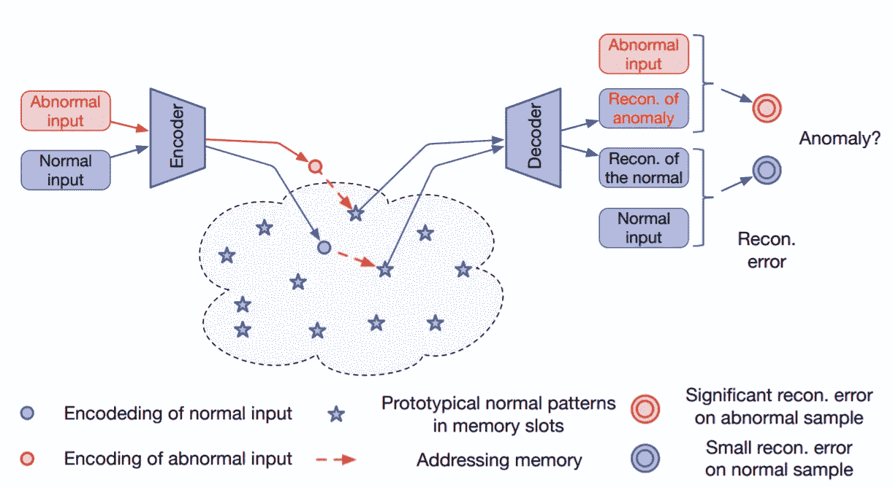
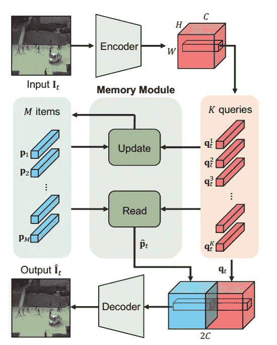
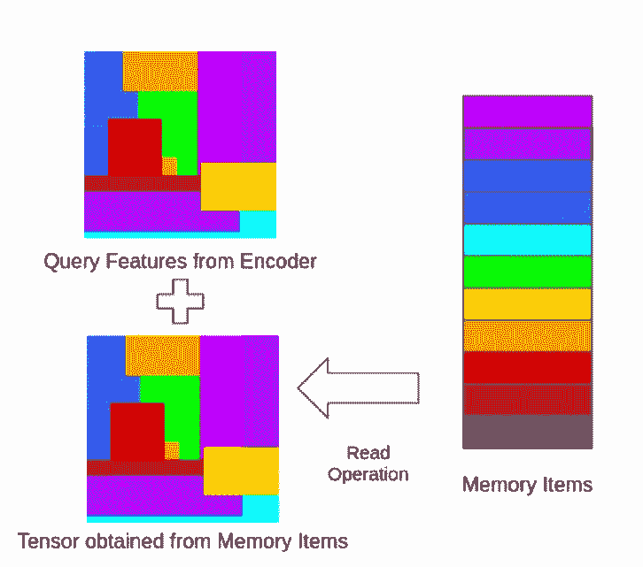
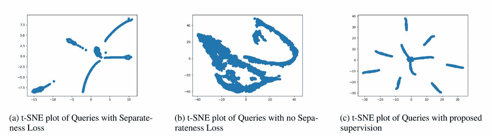
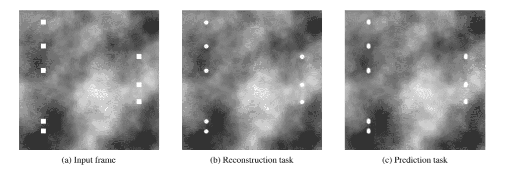
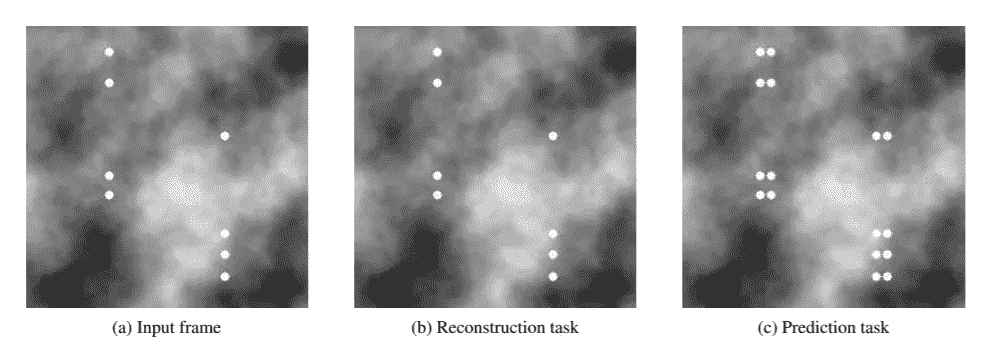
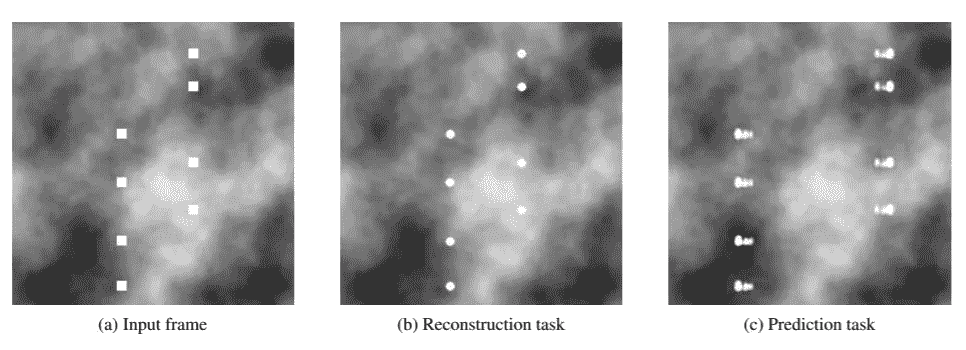
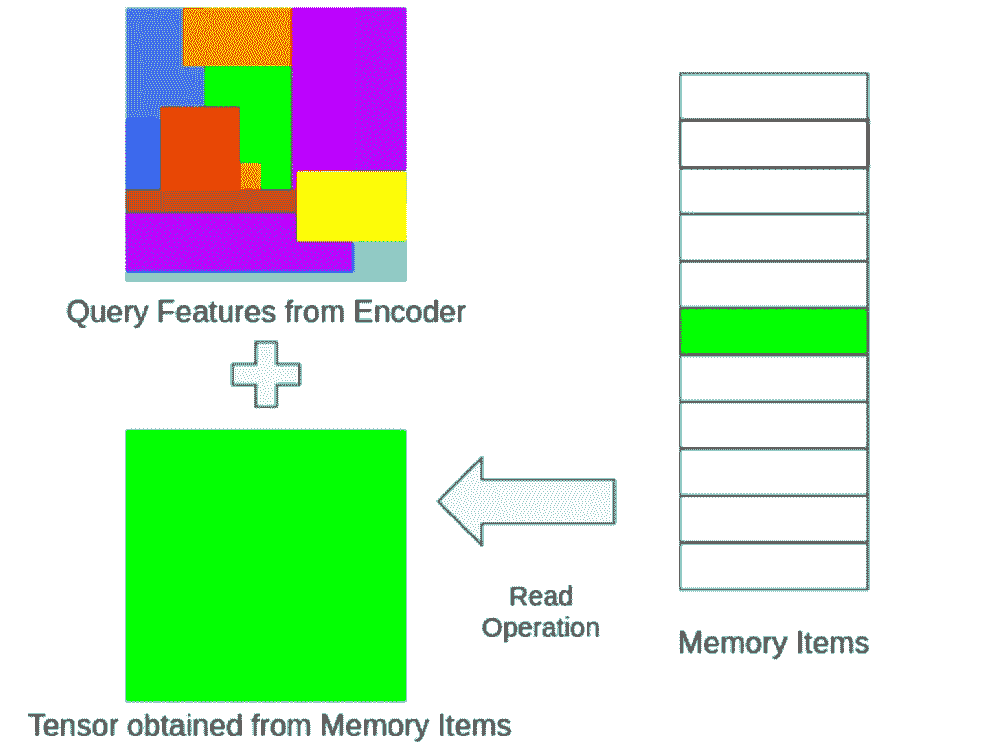
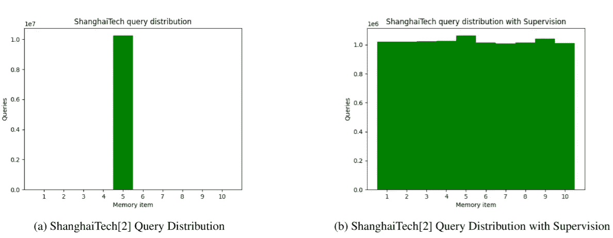

# 用用于异常检测的存储器模块增强自动编码器

> 原文：<https://towardsdatascience.com/enhancing-autoencoders-with-memory-modules-for-anomaly-detection-692dfad5e4fb?source=collection_archive---------18----------------------->

## [理解大数据](https://towardsdatascience.com/tagged/making-sense-of-big-data)

## 视频、异常和自动编码器

照片由[马修·汉密尔顿](https://unsplash.com/@thatsmrbio?utm_source=medium&utm_medium=referral)在 [Unsplash](https://unsplash.com?utm_source=medium&utm_medium=referral) 上拍摄

# 视频、异常和自动编码器

检测视频流中的异常是一项艰巨的任务。即使深度学习技术的兴起可以利用闭路电视摄像头生成的大量数据，这项任务仍然很难解决，因为顾名思义，异常是罕见的，几乎不可能为监督学习标注所有类型的异常。在本文中，我们将介绍如何检测视频馈送中的异常，以及当代作品如何使用内存模块来提高性能。

正如我们所提到的，一个注释良好的、全面的数据集对于异常检测来说是非常难以构建的。这就是为什么无监督学习被用于异常检测，即深度自动编码器。

> **自动编码器**是一种[人工神经网络](https://en.wikipedia.org/wiki/Artificial_neural_network)，用于以[无监督](https://en.wikipedia.org/wiki/Unsupervised_learning)的方式学习[高效数据编码](https://en.wikipedia.org/wiki/Feature_learning)。

自动编码器以无人监督的方式进行训练，也就是说，我们给神经网络分配表示学习的任务。本质上，神经网络具有编码器-解码器架构，其中编码器学习压缩的特征集(表示)，解码器使用该表示来重构输入(通常，但不总是)。

# 自动编码器如何用于异常检测？

对于异常检测，自动编码器的任务是重建输入。仅在来自正常场景的图像上训练自动编码器，并且假设当模型遇到异常数据时，自动编码器将具有高重建误差。然而，这一假设在实践中并不成立。经验表明，卷积神经网络(CNN)的表示能力非常强大，足以以低重构误差重构甚至异常的帧。

> 已经观察到，有时自动编码器“概括”得很好，以至于它也可以很好地重建异常，导致异常的漏检。

# **内存模块在这一切中处于什么位置？**

Gong 等人和 Park 等人的工作试图通过向网络架构添加存储模块来解决这个问题。这两部作品都试图记忆正常数据的原型元素，并使用这种记忆来扭曲异常数据的重构。更简单地说，他们不仅仅使用来自编码器的表示，还使用“存储项”来降低 CNN 的表示能力。在这些工作中，记忆模块的使用略有不同。让我们剖析一下这些实现。

# **龚等，MemAE**

基于 MemAE 的异常检测。这个可视化显示了一个简化的版本，其中只有一个记忆项目被查询。MemAE 专门从存储器项目重建输出。图片由[巩等人](https://arxiv.org/pdf/1904.02639.pdf)提供。

MemAE 本质上是一个编码器-解码器，在编码器和解码器之间添加了一个存储模块。编码器用于构建输入的表示，该表示用于查询最相关的存储项目，该存储项目用于解码器的重建。在训练阶段，记忆项目被更新以“记忆”正常数据的原型特征。当运行推理时，存储项目被冻结，并且由于存储模块仅识别正常数据，当异常实体出现在输入中时，它将挑选次优特征。异常帧的重构误差将比正常帧的重构误差高得多，这反过来用于异常检测。

# **Park 等人，异常检测的记忆引导常态(MNAD)**

学习记忆引导的异常检测常态。我们将这个网络称为 MNAD。蓝色+红色特征块将被称为更新特征。注意红色的钥匙上有一个相应的(类似的)蓝色记忆物品。图片由[朴等人](https://openaccess.thecvf.com/content_CVPR_2020/papers/Park_Learning_Memory-Guided_Normality_for_Anomaly_Detection_CVPR_2020_paper.pdf)提供。

继 MemAE 之后，Park 等人引入了类似的解决方案来处理 CNN 自动编码器的表示能力。他们建议使用编码器表示和存储项目作为解码器的输入来进行重建。他们将编码器表示(HxWxC)拆分为 HxW 键(1x1xC)，而不是专门使用内存项目进行重建。这些键用于在训练阶段更新记忆项目和获取相关记忆项目。一旦存储器项目被聚集，它们就被堆叠到编码器表示，并被输入到解码器，用于输入的重建。

颜色意味着相似。编码器按键上堆叠有类似的存储项目。当输入是正常帧时，这将很好地耦合，但是密钥、存储器对对于异常帧将是次优的。

其思想是通过构建 2C 宽的表示(如图所示的 updated_features)将内存项用作某种噪声，其中编码器键上堆叠有类似的内存项。如果该帧是异常的，则存储项目不会像正常帧那样紧密匹配。

# **这些作品的核心区别是什么？**

这两个作品的主要区别在于 MemAE 试图最佳地记忆项目，使得存储器模块可以单独地构造具有足够信息的表示，以帮助解码器重构输入；而 MNAD 试图将存储项目用作某种噪声过滤器。updated_features 将是编码器特征和相关存储器项目的串联。在异常输入的情况下，存储器项将仍然对应于正常场景特征，而编码器特征将是异常帧的特征，这在理论上应该增加重建误差。

MemAE 还建议使用 3D Convs 来处理视频中的时间信息，而 MNAD 则通过作为输入批次(4-5 个输入帧)提供的运动线索来处理时间信息。

MNAD 引入了一个测试时间内存更新方案，该方案允许在所有推理时间内对内存模块进行微调。

# **这些变化给 MNAD 带来了什么？**

因为 MNAD 使用编码器表示和存储器模块来构建 updated_features，所以存储器模块没有必要具有大量的存储器项目(MemAE 为 2000 个，MNAD 为 10 个),并且因为存储器模块的大小很小，所以该模块必须具有在查询中很好分布的不同特征。MNAD 引入了特征分离性损失和紧凑性损失，这激励了用不同的存储项目来填充存储模块。

特征分离性损失促使模型减小每个特征与其最近特征之间的距离，同时增大该特征与第二最近特征之间的距离。这看起来就像三重损失。

> **三重损失**是用于[机器学习](https://en.wikipedia.org/wiki/Machine_learning)算法的[损失函数](https://en.wikipedia.org/wiki/Loss_function)，其中基线(锚)输入与正(真)输入和负(假)输入进行比较。从基线(锚)输入到正(真)输入的距离最小，从基线(锚)输入到负(假)输入的距离最大。⁹

紧凑性损失激励模型减少编码器构建的表示的类内变化。

总之，这两种损失有助于增加存储在存储模块中的存储项目的多样性，并增加存储模块的辨别能力。

t-SNE 图描绘了具有分离性损失、没有分离性损失和具有我们提出的对力分布的监督的特征(将在本文后面讨论)。

# **哪个好？**

MNAD 始终优于大多数竞争对手，作者主要将性能归功于其内存模块的实现方式和测试时间内存更新方案。

# **这些结论具体而准确吗？**

我们为 RC2020 challenge⁴重新实施了 MNAD，并写了一份关于其可重复性的 report⁵。

> 这项活动的主要目标是鼓励发表和分享可靠的和可复制的科学成果。为了支持这一点，本次挑战赛的目标是通过邀请社区成员选择一篇论文来调查顶级会议上发表的论文的可重复性，并通过复制计算实验(通过新的实施方案或使用作者提供的代码/数据或其他信息)来验证论文中的实证结果和主张。⁴

让我们更深入地挖掘一下这个理论在多大程度上符合预期。

# **这些任务被低估了吗？**

MNAD 使用两个代理任务来测试他们的模型。

1.  重建任务。
2.  预测任务。

对于重建任务，模型被馈送 1 幅图像，并且模型的任务是重建该帧。

对于预测任务，该模型被馈送一批 5 个图像(用于时间信息),并且该模型的任务是预测第 6 帧。

这两个任务的模型架构非常类似于 U-Net。主要区别在于，跳过连接**需要移除**以用于重建任务。这是因为其中一个输入要素是目标要素，通过跳过连接，模型将基本学会将输入复制到输出。

这引发了两个问题。

1.  预测任务允许在输入要素中嵌入时态信息，那么该任务是否在一定程度上提高了性能？
2.  预测任务还允许模型跳过连接；跳过连接如何影响模型的行为？

从经验上来说，我们表明跳过连接会带来一些性能提升。为了绝对确定是这种情况，我们必须在重建任务中向模型引入 skip 连接。为了实现这一点，我们在输入中添加了不同概率(5%、25%、40%)的椒盐噪声，并让模型对输入进行降噪。由于输入要素不再包含精确的目标要素，因此模型无法通过跳过连接来复制输入。我们看到了一个原始的性能增益 **~4%** ，但是它没有超过预测任务的基准。值得注意的是，预测任务确实将时间信息嵌入到输入特征中，这意味着在预测任务上训练的模型将能够对时间和时空异常进行分类，而在重建任务上训练的模型将完全错过时间异常。

因此，根据经验，这两个问题的答案是**是的。**预测任务允许嵌入时间信息和引入跳过连接，这两者都显示出改进的性能。

# 这个任务到底是如何影响模型行为的？

重建任务没有任何时间信息，因为它只接受一个输入并重建一个输出，因此只能识别空间异常。另一方面，预测任务允许将时间信息嵌入到输入特征中，这有助于模型识别空间、时间和时空异常。

为了显示任务如何影响模型的性能，我们综合生成了一个具有空间、时间和时空异常的数据集。正常情况包括半径为 10 个像素的圆以每帧 5 个像素的速度移动。空间异常包括以相同速度移动的正方形，而时间异常包括以每帧 10 个像素的速度移动的圆形。时空异常是以每帧 10 个像素移动的方块。

下图显示了在预测任务中训练的模型中，输出假象是如何更加突出的。

**空间异常**:数据以前从未有过正方形，两个模型都将正方形重建为填充正常数据的圆。

**时间异常**:圆圈移动得更快，这影响了预测任务的输入批次(由于输入中没有时间信息，因此重建时缺少该信息)，只有在预测任务中训练的模型显示出伪影。

**时空异常**:输入中有移动速度比普通圆形更快的正方形。两种模型都将正方形转换成圆形，但是在预测任务上训练的模型也引入了时间假象，这使得分类任务更容易。

# 这些是唯一可能被低估的因素吗？

MNAD 在 UCSD Ped2⁶、中大 Avenue⁷和 Shanghaitech⁸数据集上进行了基准测试。上海理工大学的数据集比 UCSD 的 Ped2 数据集和 CUHK 大道要复杂得多。当在 Shanghaitech 数据集上重现 MNAD 的结果时，我们注意到在一个使用内存项的试探法中有很多 NaN 值。深入研究后，我们发现内存模块也没有按预期工作。这些特征只与一小部分记忆项目相关。这种偏斜的分布本质上会使内存模块的引入变得完全无用。对于 Shanghaitech 数据集，我们发现所有的特征都只与一个记忆项目相关。这意味着对于异常或正常帧，密钥、存储项目对将是相同的。

记忆张量将总是被映射到这个键，使得记忆模块完全过时。

我们引入了额外的监督，以强制统一分布，这有助于击败报告的分数。这不是一个理想的解决方案，因为我们正在强制一个可能不是最优的特定分布，但是这个黑客确实让管道按照预期工作。

强制统一内存分配。

# **其他观察结果**

我们还观察到，skip 连接在解码输出时涉及的内容非常多，以至于内存模块和中间表示一点也不重要。我们用 0、1 和随机张量代替中间表示，输出在光学上没有变化。这让我们看到了重建和预测任务中测试时间记忆更新的性能差异。预测任务没有受到太大影响，但重建任务将受到巨大打击，这是由于没有跳跃连接来完成繁重的工作。

# **结论**

我们的实验表明，内存模块的添加提高了 UCSD Ped2 和 CUHK 大道等简单数据集的性能。对于像上海理工大学数据集这样更复杂的数据集来说，结论还没有出来。与没有内存条的型号相比，内存条的添加降低了性能。我们发现，在如此复杂的数据集上进行训练，将导致记忆模块被搁置一旁，变得完全过时。我们提出的解决这一问题的额外监督并不理想，但确实让我们将模型评估为比 Park 等人报告的分数略高的分数。对于 ShanghaiTech 数据集，最大的问题仍然是在重建任务上训练的模型的分数略高于预测任务的分数。鉴于重建任务完全忽略了时间异常，这导致了对该数据集的存储模块的功效的质疑。有可能的是，即使在建议的监督之后，该模型也发现更容易严重依赖于跳跃连接，并试图找到表面特征来帮助解码这些特征。也有可能数据集对于模型来说噪音太大。

最后，我们可以通过这些拟议的修订达到报告的分数，但我们的结论是，为上海科技这样的复杂数据集建立稳定的管道仍有工作要做。我希望这篇文章对用于异常检测的内存模块有一个像样的介绍！

# 参考

[1]马克·克莱默(1991)。[“使用自联想神经网络的非线性主成分分析”](https://www.researchgate.net/profile/Abir_Alobaid/post/To_learn_a_probability_density_function_by_using_neural_network_can_we_first_estimate_density_using_nonparametric_methods_then_train_the_network/attachment/59d6450279197b80779a031e/AS:451263696510979@1484601057779/download/NL+PCA+by+using+ANN.pdf) (PDF)。*爱车日报*。**37**(2):233–243。[doi](https://en.wikipedia.org/wiki/Doi_(identifier)):[10.1002/AIC . 690370209](https://doi.org/10.1002%2Faic.690370209)。

[https://arxiv.org/pdf/1904.02639.pdf](https://arxiv.org/pdf/1904.02639.pdf)

[3][https://arxiv.org/pdf/2003.13228.pdf](https://arxiv.org/pdf/2003.13228.pdf)

[https://paperswithcode.com/rc2020](https://paperswithcode.com/rc2020)

[https://arxiv.org/ftp/arxiv/papers/2101/2101.12382.pdf](https://arxiv.org/ftp/arxiv/papers/2101/2101.12382.pdf)

[6]李维新，维杰·马哈德万，和努诺·赛洛斯。拥挤场景中的异常检测和定位。IEEE TPAMI，2013 年。

[7]陆，，和贾亚嘉。MATLAB 中 150 FPS 的异常事件检测。2013 年在 ICCV。

[8]罗伟新，，高胜华.堆叠 RNN 框架下基于稀疏编码的异常检测的再探讨。2017 年在 ICCV。

[9][https://en.wikipedia.org/wiki/Triplet_loss](https://en.wikipedia.org/wiki/Triplet_loss)

【https://github.com/alchemi5t/MNADrc 