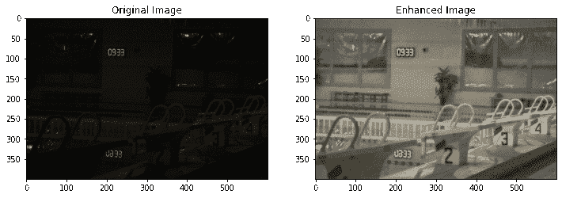
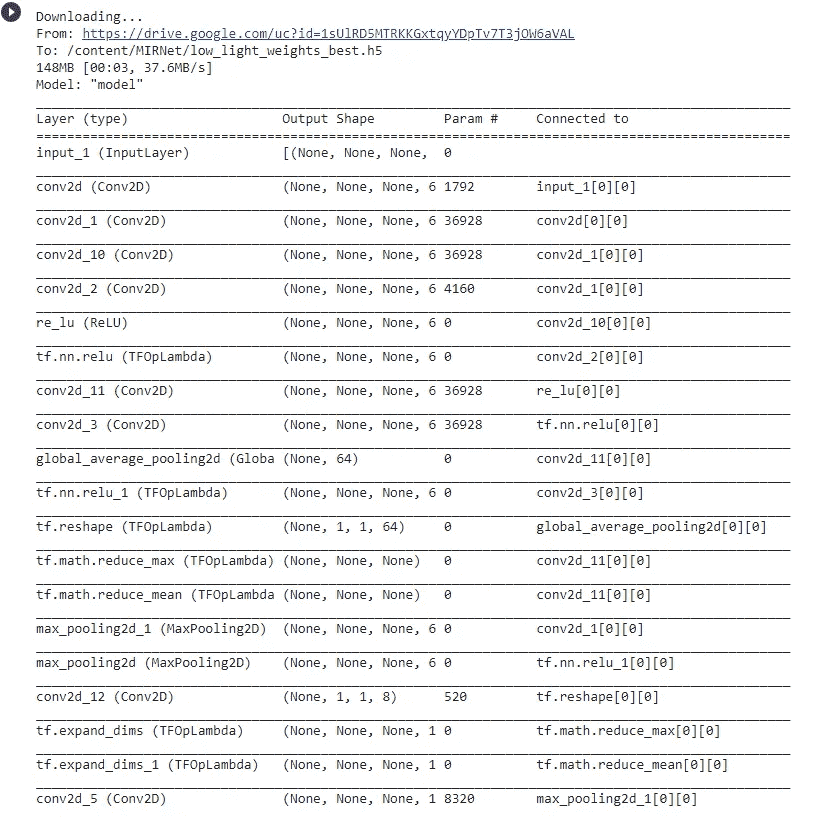
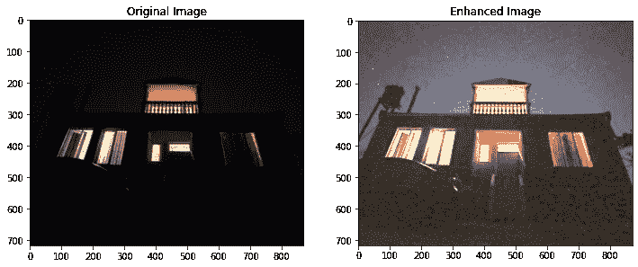

# 利用 MIRNet 增强微光图像

> 原文：<https://towardsdatascience.com/enhancing-low-light-images-using-mirnet-a149d07528a0?source=collection_archive---------34----------------------->

## 在弱光下拍摄的照明图像



图像增强(来源:[https://github . com/sou mik 12345/MIRNet/blob/master/assets/lol _ results . gif](https://github.com/soumik12345/MIRNet/blob/master/assets/lol_results.gif))

在我们的一生中，我们都点击过很多图片，但我特别面临的一个问题是，我相信你们都一定经历过在昏暗的光线下点击图片。如果你没有夜视功能或非常高端的相机，图像可能会非常模糊或光线很弱，这使得图像中的内容几乎看不见。

现在，如果你没有夜视相机，而你又喜欢拍照，那么这篇文章就是为你准备的，因为在这篇文章中，我将向你展示如何增强你所有的弱光图像，使它们清晰可见。所以让我们开始吧。

在本文中，我们将使用 [MIRNet 模型](https://github.com/soumik12345/MIRNet/)进行图像增强。它用于增强低光图像，这是一个预先训练好的模型，可以很容易地从 Github repo 下载。对于这篇文章，我使用的是 [Saumik Rakshit 的](https://github.com/soumik12345/) GitHub repo。

# 克隆 Github 存储库

对于本文，我们将使用 Google Collab。对于初始设置，我们需要打开一个 collab 笔记本，并使用以下命令克隆所需的 Github 存储库:

```
!git clone [https://github.com/soumik12345/MIRNet](https://github.com/soumik12345/MIRNet)
#Setting up current directory
%cd MIRNet
```

# 安装 Wandb

Wandb 用于组织和分析机器学习实验。它与框架无关，比 TensorBoard 更轻。每当我们使用 wandb 运行一个脚本时，超参数和输出度量都会被保存下来，可以进一步可视化。我们将通过运行下面给出的命令来安装它。

```
!pip install -q wandb
```

# 导入所需的库

下一个重要的步骤是导入这个项目所需的所有库。

```
from glob import glob  #
from PIL import Image  #For image operations
from matplotlib import pyplot as plt #for visualization
# Importing required dependencies from MIRNet
from mirnet.inference import Inferer
from mirnet.utils import download_dataset, plot_resultimport tensorflow as tf # For modelling
import numpy as np # For mathematical computation
```

# 下载数据集和预先训练的权重

在这一步中，我们将下载模型和预定义权重的数据。这将为我们的图像增强项目创建具有所需预训练权重的模型。通过运行下面给出的命令，我们将完成这一步。

```
inferer = Inferer()
inferer.download_weights('1sUlRD5MTRKKGxtqyYDpTv7T3jOW6aVAL')
inferer.build_model(num_rrg=3, num_mrb=2, channels=64,      weights_path='low_light_weights_best.h5')inferer.model.summary()
```



预训练模型(来源:作者)

接下来，我们将权重加载到模型中并保存模型。下面给出的命令将解决这个问题。

```
inferer.model.save('mirnet')
```

现在，我们需要将一张图片加载到 google collab 中，以便我们可以使用它进行增强。

```
IMAGE_LOC = '/content/123.JPG'  # change the name of image to you desired image 
```

# 最后一步

这是最后一步，我们将把输入图像传递给模型，模型将生成增强的输出图像。下面给出的代码适用于这种情况。

```
original_image, output_image = inferer.infer(IMAGE_LOC)
plot_result(original_image, output_image)
```



输入图像和增强图像(来源:作者)

在这里，你可以清楚地看到我们的模型是如何将一个低亮度的图像增强为清晰可见的图像的。

继续尝试不同的图片，如果你发现任何困难，你可以在回复部分张贴出来。

这篇文章是与[皮尤什·英加尔](https://medium.com/u/40808d551f5a?source=post_page-----a149d07528a0--------------------------------)合作的

# 在你走之前

***感谢*** *的阅读！如果你想与我取得联系，请随时在 hmix13@gmail.com 上联系我或我的* [***LinkedIn 个人资料***](http://www.linkedin.com/in/himanshusharmads) *。可以查看我的*[***Github***](https://github.com/hmix13)**简介针对不同的数据科学项目和包教程。还有，随意探索* [***我的简介***](https://medium.com/@hmix13) *，阅读我写过的与数据科学相关的不同文章。**