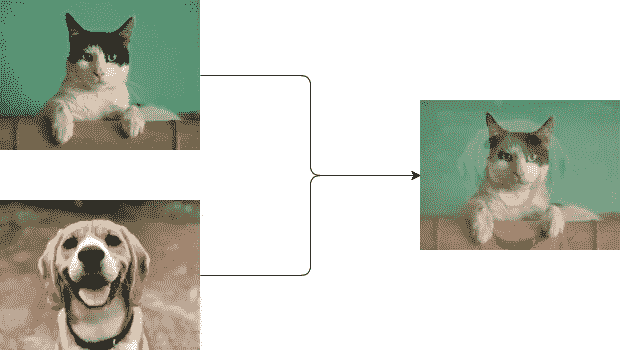

# PyTorch 中的混合增强神经网络

> 原文：<https://towardsdatascience.com/enhancing-neural-networks-with-mixup-in-pytorch-5129d261bc4a?source=collection_archive---------10----------------------->

## 随机混合图像，效果更好？

随着深度学习的指数级改进，图像分类已经成为蓬勃发展的领域之一。传统的图像识别任务严重依赖于处理方法，例如扩展/腐蚀、核和频域变换，然而特征提取的困难最终限制了通过这些方法取得的进展。另一方面，神经网络专注于寻找输入图像和输出标签之间的关系，以为此目的“调整”架构。虽然准确性的提高非常显著，但网络通常需要大量数据来进行训练，因此许多研究现在都专注于执行数据扩充，即从预先存在的数据集增加数据量的过程。

本文介绍了一个简单却惊人有效的增强策略——mixup，通过 PyTorch 实现并比较结果。

# 在混淆之前——为什么要增加数据？

基于一组给定的训练数据来训练和更新神经网络架构内部的参数。然而，由于训练数据仅覆盖可能数据的整个分布的某一部分，网络可能在分布的“可见”部分上过度拟合。因此，我们用于训练的数据越多，理论上就能更好地描述整个分布。

虽然我们拥有的数据数量有限，但我们总是可以尝试稍微改变图像，并将它们用作“新”样本，输入网络进行训练。这个过程被称为数据扩充。

# 什么是 Mixup？

图一。图像混合的简单可视化。

假设我们正在对狗和猫的图像进行分类，给我们一组带有标签的图像(即，*【1，0】*->狗，*【0，1】-*->猫)，混合过程就是简单地平均出两幅图像及其相应的标签作为新数据。

具体来说，我们可以用数学方法写出 mixup 的概念:

其中 *x，y* 是 *xᵢ* (标号 *yᵢ* )和 *xⱼ* (标号 y *ⱼ* )的混合图像和标号，λ是来自给定*β*分布的随机数。

这提供了不同类别之间的连续数据样本，直观地扩展了给定训练集的分布，从而使网络在测试阶段更加健壮。

## 在任何网络上使用 mixup

由于 mixup 仅仅是一种数据扩充方法，它与任何分类网络体系结构都是正交的，这意味着您可以在具有任何网络的数据集中实现这一点，以解决分类问题。

基于原论文[*mixup:Beyond experimental Risk Minimization*](https://arxiv.org/abs/1710.09412)，张等人对多个数据集和架构进行了实验，经验表明 mix up 的好处不仅仅是一次性的特例。

# 计算环境

## 图书馆

整个程序是通过 PyTorch 库(包括 torchvision)构建的。混音的概念需要从 *beta* 分布中生成样本，这可以从 NumPy 库中获得，我们还使用随机库来查找混音的随机图像。以下代码导入所有库:

## 资料组

为了演示，我们在传统的图像分类上应用了混合的概念，CIFAR-10 似乎是最可行的选择。CIFAR-10 包含 10 个类别的 60000 个彩色图像(每个类别 6000 个),以 5:1 的比例分成训练集和测试集。这些图像分类起来相当简单，但比最基本的数字识别数据集 MNIST 还要难。

有许多方法可以下载 [CIFAR-10](https://gas.graviti.com/dataset/graviti/CIFAR10?utm_medium=0608kol-1) 数据集，包括从多伦多大学网站或使用 torchvision 数据集。值得一提的一个特定平台是 [*Graviti 开放数据集*](https://graviti.com/?utm_medium=0608kol-2) 平台，它包含数百个数据集及其对应的作者，以及每个数据集的指定训练任务(即分类、对象检测)的标签。您可以下载其他分类数据集，如 CompCars 或 SVHN，来测试 mixup 在不同场景中带来的改进。该公司目前正在开发他们的 SDK，尽管目前直接加载数据需要额外的时间，但在不久的将来会非常有用，因为他们正在快速改进批量下载。

## 硬件要求

最好在 GPU 上训练神经网络，因为它可以显著提高训练速度。但是，如果只有 CPU 可用，您仍然可以测试程序。要让您的程序自己决定硬件，只需使用以下代码:

# 履行

## 网络

目标是看到混合的结果，而不是网络本身。因此，为了演示的目的，实现了一个简单的 4 层卷积神经网络(CNN ),后面是 2 层全连接层。注意，对于混合和非混合训练过程，应用相同的网络来确保比较的公平性。

我们可以构建如下的简单网络:

## 混合

混合阶段是在数据集加载过程中完成的。因此，我们必须编写自己的数据集，而不是使用 *torchvision.datasets* 提供的默认数据集。

以下是通过合并 NumPy 的 *beta* 分布函数实现的简单混合:

请注意，我们并没有对所有的图像进行混音，而是对大约五分之一的图像进行混音。我们还使用了 0.2 的*贝塔*分布。您可以更改不同实验的混合图像的分布和数量。也许你会取得更好的成绩！

# 培训和评估

下面的代码显示了培训过程。我们将批量大小设置为 128，学习速率设置为 1e-3，总的历元数设置为 30。整个训练进行了两次——有和没有混淆。损失也必须由我们自己定义，因为目前 BCE 损失不允许带小数的标签:

为了评估混淆的影响，我们基于有和没有混淆的三次试验来计算最终精度。在没有混淆的情况下，网络在测试集上产生了大约 74.5%的准确率，而在有了混淆的的**上，准确率提升到了大约 **76.5%** ！**

# 超越图像分类

虽然 mixup 推动了图像分类的最新精度，但研究表明，它的好处扩展到了其他计算机视觉任务，如生成和对对立示例的鲁棒性。研究文献也已经将该概念扩展到 3D 表示中，这也被证明是非常有效的(例如， [*【点混合*](https://arxiv.org/abs/2008.06374) )。

# 结论

所以你有它！希望这篇文章给你一个基本的概述和指导，告诉你如何将 mixup 应用到你的图像分类网络训练中。完整的实现可以在下面的 Github 资源库中找到:

 [## ttchengab/mixup

### 此时您不能执行该操作。您已使用另一个标签页或窗口登录。您已在另一个选项卡中注销，或者…

github.com](https://github.com/ttchengab/mixup.git) 

*感谢您坚持到现在*🙏*！* *我会在计算机视觉/深度学习的不同领域发布更多内容。一定要看看我关于 VAE 的其他文章，一次学习，等等！*