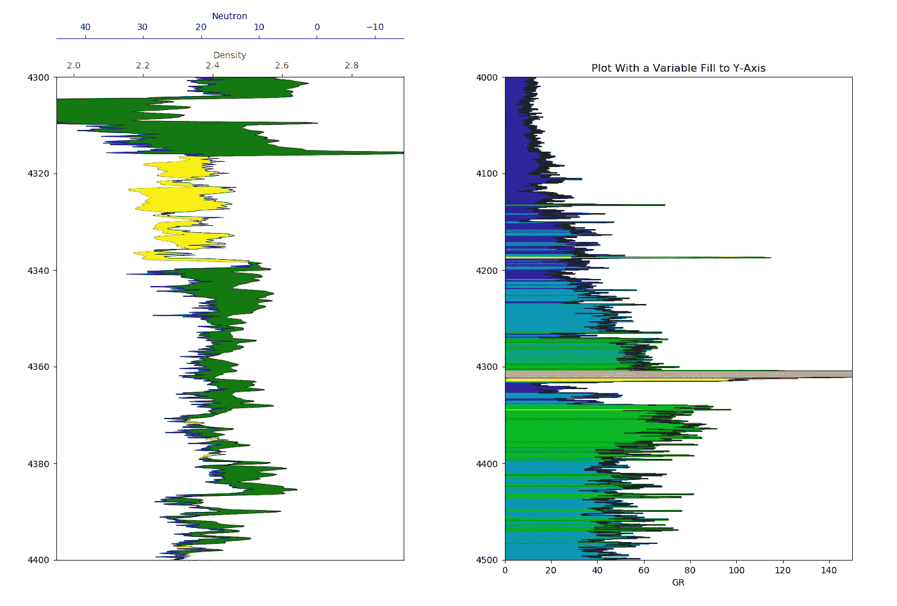
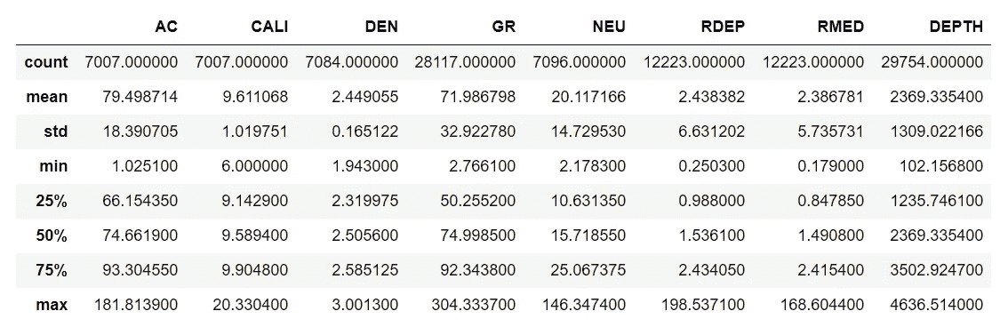
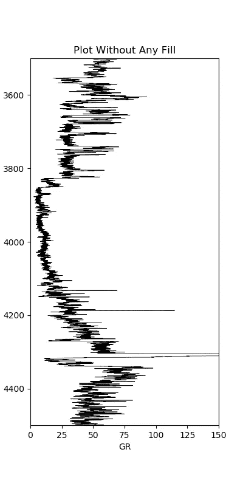
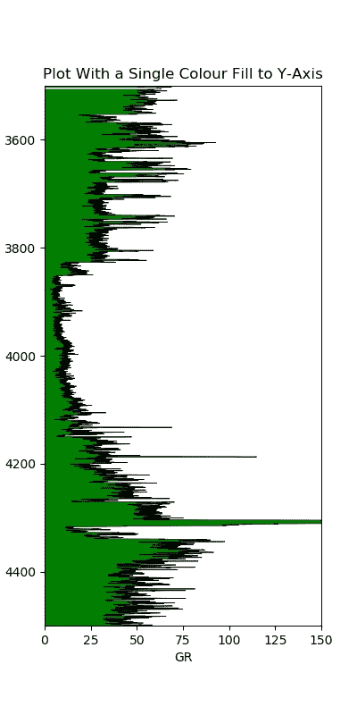
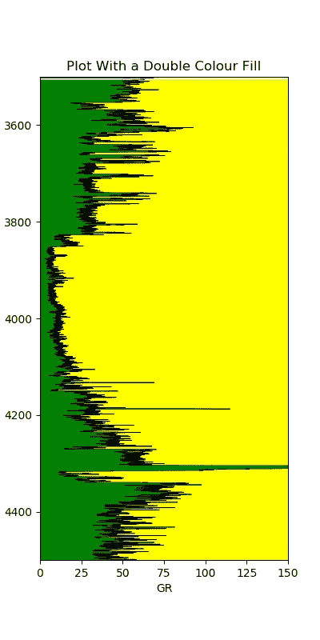
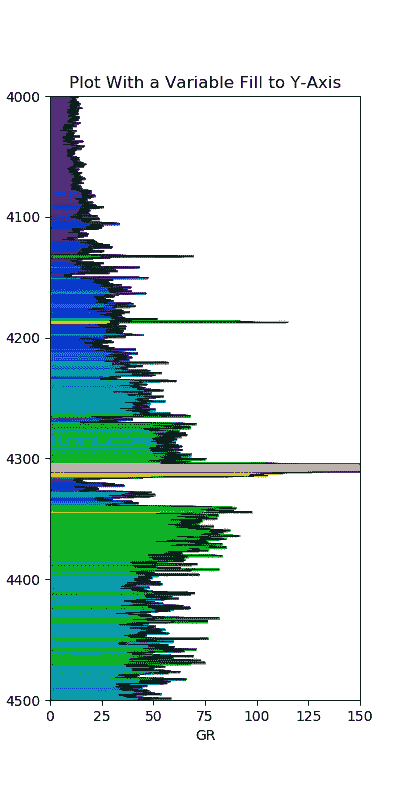
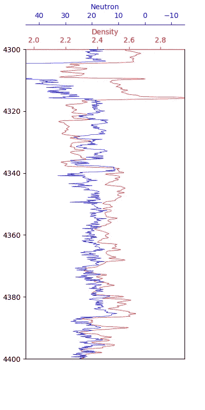
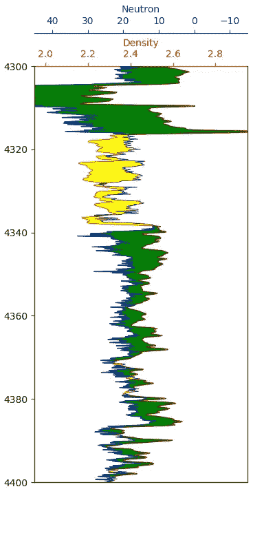

# 使用绘图填充增强测井曲线的可视化

> 原文：<https://towardsdatascience.com/enhancing-visualization-of-well-logs-with-plot-fills-72d9dcd10c1b?source=collection_archive---------19----------------------->

## **使用 matplotlib 和 fill_betweenx()** 将颜色填充应用于测井数据

使用 fill_betweenx 记录绘图阴影。[图片由作者创建]

Matplotlib 是 Python 中一个很棒的库，我总是一次又一次地使用它来处理测井记录。由于其高度的灵活性，开始使用它可能会很棘手，但是一旦您掌握了基础知识，它就可以成为数据可视化的强大工具。

处理测井数据时，通常会对数据应用颜色填充，以帮助快速识别感兴趣的区域。例如，识别岩性或含烃层段。当我在网上搜索实现颜色填充的方法时，大部分时间，文章都指向在一条线和图上的 x 轴之间填充。显示如何将阴影应用于测井曲线的结果明显较少，测井曲线的最长轴通常沿着 y 轴，或者通常沿着 y 轴。

这篇文章是我的 Python &岩石物理学系列的一部分。详情可以在[这里](http://andymcdonald.scot/python-and-petrophysics)找到。

在本文中，我将通过四个不同的例子来说明如何使用简单的填充来增强测井数据的外观。其中包括:

*   从曲线到图/轨迹边缘的简单颜色填充
*   从曲线到图/轨迹两边的颜色填充
*   从曲线到图/轨迹边缘的可变填充
*   两条曲线(密度和中子孔隙度)之间的填充，当它们相交时会发生变化

对于下面的例子，你可以在我的 GitHub 知识库中找到我的 Jupyter 笔记本和数据集，链接如下。

<https://github.com/andymcdgeo/Petrophysics-Python-Series>  

我的 YouTube 频道上的以下视频演示了如何使用 fill_betweenx()应用一些填充。

# 使用 matplotlib 应用填充

## 设置库和加载数据

首先，在开始处理实际数据之前，我们将导入一些公共库。在本文中，我们将使用 [pandas](https://pandas.pydata.org/) 、 [matplotlib](https://matplotlib.org/) 和 [numpy](https://numpy.org/doc/stable/index.html) 。这三个库允许我们加载、处理和可视化我们的数据。此外，通常用于存储和传输数据的数据是。las 文件。为此，我们将使用优秀的 [lasio](https://github.com/kinverarity1/lasio) 库来加载这些数据。你可以在我之前的文章中找到更多关于这个的信息。

导入 pandas，matplotlib，lasio 和 numpy 库。

## 导入和查看 LAS 数据

我们正在使用的数据集来自于 2018 年发布的公开发布的 [Equinor Volve 场数据集](https://www.equinor.com/en/what-we-do/norwegian-continental-shelf-platforms/volve.html)。本教程中使用的文件来自 15/9- 19A 井，其中包含一组很好的测井数据。

要开始加载我们的 las 文件，我们可以使用 lasio 中的以下方法:

使用 lasio 库在 python 中加载 las 文件。

为了使绘图更容易，我们还将把 las 文件转换成 pandas 数据帧，并创建一个包含深度曲线的新列，该列基于数据帧索引。

然后，我们可以通过调用数据帧的`.describe()`方法来找出数据集中包含的内容，如下所示。

返回关于数据帧内容的统计信息。

这将返回一个简单但非常有用的汇总表，详细列出所有曲线的统计数据。

由于我们已经将深度曲线作为一列添加到数据帧中，我们可以很容易地获得数据的最小值和最大值。请注意，这可能不一定是我在上一篇文章[中使用 Matplotlib 可视化油井数据覆盖中看到的所有曲线的全部范围。](/visualising-well-data-coverage-using-matplotlib-f30591c89754)

## 用简单的填充绘制我们的数据

现在我们已经加载了数据，并且确认了我们已经得到了想要的曲线，我们可以开始绘制数据了。在这篇文章中，我将使用`.plot()`方法直接从数据帧中绘图。

在下面的代码中，您会看到我指定了许多参数:

*   x 和 y 轴
*   `c`指定线条的颜色
*   `lw`指定线条宽度
*   `legend`用于打开或关闭图例。适用于多条曲线/直线
*   `figsize`以英寸为单位指定图形的尺寸

代码的其余部分允许设置轴极限(`ylim`和`xlim`)。请注意，当我们在 y 轴上绘制深度时，我们必须翻转数字，以便最深的深度是第一个数字，最浅的深度是第二个数字。

当我们执行代码时，我们得到了我们的绘图:

使用 matplotlib 绘制的伽马射线数据。

我们可以通过添加一个从图的左边缘延伸到曲线值的简单填充来进一步增强这个图。这是通过使用`.fill_betweenx()`实现的。

要使用这个函数，我们需要传递 y 值(深度)，被着色的曲线(GR)和我们从 GR 曲线着色的值(0)。然后，我们可以通过使用`facecolor`参数轻松指定填充的颜色。

使用 fill_betweenx 在曲线和 y 轴之间添加颜色。

当我们运行这段代码时，我们得到了一个稍微好看一点的图形:

y 轴带有颜色填充的伽马射线数据。

我们可以更进一步，通过复制线条并将“阴影”的值与颜色一起更改为“阴影”,以相反的方式绘制阴影:

使用 fill_betweenx 在曲线的左侧和右侧添加额外的阴影。

伽马射线图左侧为绿色阴影，右侧为黄色阴影，便于识别清洁层段和泥质层段。

我们的情节立刻变得更好。我们可以很快看出哪里有更清晰的音程，哪里有更清晰的音程。

## 用可变填充绘制数据

通过在伽马射线曲线和 y 轴之间应用可变填充，我们可以将我们的图带到下一个级别。您会注意到，与上面的代码相比，下面的代码扩展了很多。

我们首先要确定我们将把阴影分成多少种颜色。这是通过将我们的 x 轴值赋给一个变量并使用`span = abs(left_col_value — right_col_value)`计算出它们之间的绝对差值来实现的。这给了我们一系列的价值观。

然后，我们使用`cmap= plt.get_cmap('nipy_spectral')`从大量的彩色地图中抓取我们选择的彩色地图。完整的颜色列表可以在[这里](https://matplotlib.org/3.1.0/tutorials/colors/colormaps.html)找到。对于这个例子，我选择了 nipy_spectral。

下一段代码看起来与上面类似，除了 x 限制现在由变量`left_col_value`控制。还有`right_col_value`。这允许我们只在一个地方而不是在多个地方改变极限值。

最后一部分是 for 循环，它遍历在第 14 行创建的数组中的每个颜色索引值，并从颜色图中获取一种颜色。然后(第 26 行)我们使用 fill_betweenx 方法来应用该颜色。注意，我们现在在参数中使用了`where = curve >= index`。这允许我们在曲线值大于或等于索引值时使用合适的颜色。

运行代码后，我们会生成以下图形:

使用 fill_betweenx 使用可变渐变填充的伽马射线图。

乍一看，我们的绘图要好得多，并允许根据显示的颜色轻松识别相似值的区域。

## 在两条不同比例的曲线之间应用明暗处理

最后一个例子说明了如何将岩性阴影应用于密度和中子孔隙度曲线。这两条曲线通常根据交叉进行着色。当密度移到中子孔隙度的左边时，我们可能有一个多孔储集岩。当交叉以相反的方式发生时，密度在中子孔隙度的右边，我们可能有页岩。

请注意，这是非常简化的，这两条曲线相互交叉有许多不同的原因。

显示密度和中子孔隙度数据的第一步是将它们添加到图中。在这种情况下，我们必须创建一个图形并添加多个轴，而不是使用`df.plot()`。为了让我们画出中子孔隙度，我们必须把它作为一个额外的轴加进去。使用`ax1.twiny()`我们可以共享两条曲线之间的深度曲线。

matplotlib 图上的密度和中子孔隙度。

我们现在可以添加阴影。这比预期的要复杂一点，因为两条曲线的比例不同。通常，中子孔隙度从 45 到-15 孔隙度单位(p.u)(十进制为 0.45 到-0.15)，密度从 1.95 到 2.95 g/cc。

我们必须添加额外的代码，将一条曲线缩放到另一条曲线的单位比例。第 21 行和第 30 行之间的代码部分是从下面的 stackoverflow 帖子中获得的:这里的和这里的。

当我们运行这段代码时，我们得到了下面的图。

以不同比例测量的中子孔隙度和密度数据的可变颜色填充。

这使我们能够很容易地识别潜在储油层的位置。为了确认这些部分是什么，需要进行进一步的分析。在进行解释时，您应该始终查看其他测井曲线，以帮助您理解和解释。

# 摘要

总之，在处理测井数据时，matplotlib 是一个强大的数据可视化工具。我们可以轻松地在轨迹上显示我们的日志，并在线条之间进行填充，以帮助可视化和解释我们的数据。在这篇文章中，我介绍了如何在曲线和绘图边缘之间应用固定颜色填充和可变渐变填充，以及如何在不同比例的两条曲线之间进行填充。

*“作者创作的所有图片”*

***感谢阅读！***

如果你觉得这篇文章很有用，可以看看我的其他文章，看看 Python 和测井数据的各个方面。你也可以在[***GitHub***](https://github.com/andymcdgeo)***找到我和其他人在本文中使用的代码。***

*如果你想联系我，你可以在*[***LinkedIn***](https://www.linkedin.com/in/andymcdonaldgeo/)**或者在我的* [***网站***](http://andymcdonald.scot) *找到我。**

**有兴趣了解更多关于 python 和测井数据或岩石物理学的知识吗？跟我上* [***中***](https://andymcdonaldgeo.medium.com/) *。**