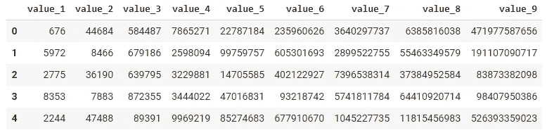
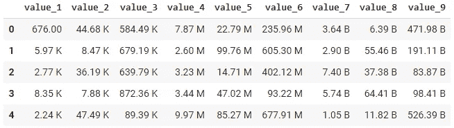
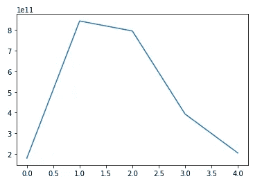
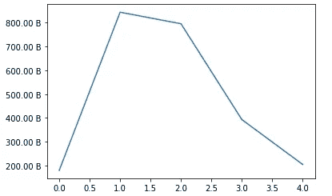
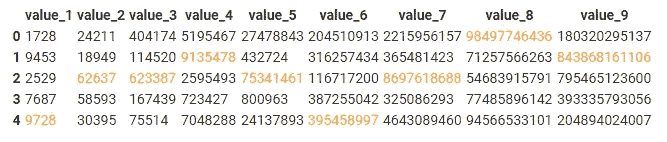
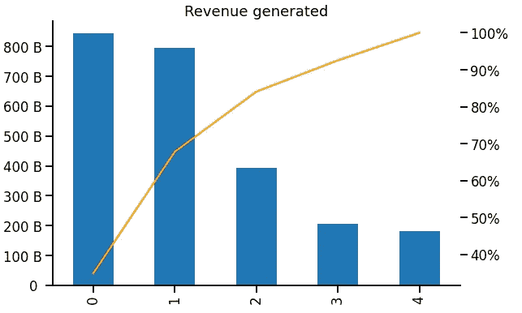

# 增强您的分析可读性——熊猫教程

> 原文：<https://towardsdatascience.com/enhancing-your-analysis-readability-tutorial-with-pandas-a7e093792fa0?source=collection_archive---------23----------------------->

## 改善数据框/图表格式的 3 个技巧


马库斯·斯皮斯克在 [Unsplash](https://unsplash.com?utm_source=medium&utm_medium=referral) 上的照片

# 你的日常生活数据分析

作为一名数据科学家/分析师，您的工作是生成一份包含许多商业决策见解的报告。报告可以通过一些有用的工具制作，如 Microsoft Excel、SAP，也可以用编程语言定制，如 SAS、R 或 Python。结果可以通过内部电子邮件发送给利益相关方，或者通过集中的仪表板发布。

和其他人一样，我是一名数据分析师，在日常生活中使用 python 制作报告或演示文稿。我通常的任务是在 2-3 小时内做一个特别的分析，然后提交给管理团队。

为了得到我想要的结果，我必须启动我的 Jupiter 笔记本内核，并快速编写代码来产生数字。在那之后，我可能会把结果放在微软的 PowerPoint 上，加上一些基本的脚注，然后把它们发给我的主管，让他在一天结束之前作出一个重要的决定。

一个棘手的问题是，由于时间限制，我必须消化信息，编写代码以产生结果，并将其放入 Microsoft PowerPoint 中，以一种**漂亮的格式**呈现出来。

不幸的是，我使用的编程语言可能不包含使您的报告对管理团队来说更好看的功能，例如，在数字中使用逗号，或者不使用科学符号来显示高数字。

如果你提交的报告没有考虑到这些方面，管理团队可能会对你的报告抱怨很多，有时，他们会看都不看就把它扔进垃圾桶。那会让你很恼火，因为你在这上面花费了时间和精力。


丹尼尔·帕斯夸在 [Unsplash](https://unsplash.com?utm_source=medium&utm_medium=referral) 上拍摄的照片

要解决这个问题，您可以将编程语言的结果放到 Microsoft Excel 中，并根据需要手动更改格式。Excel 是一个很好的工具。糟糕的是你必须手动完成。如果我们能在编程过程中实现自动化呢？那就太好了，不是吗？

# 原样

让我们看看我为这个例子制作的数据框。这是公司需要的收入额。如您所见，这是从`pandas`数据帧返回的默认结果。没有任何配置，这就是你得到的。



作者图片

我总是从我的主管或首席执行官那里得到一个评价。

> 你能让**更具可读性**和**更容易比较吗？”**

解决方法可能是将该数字除以一百万，并将单位放在表格的上方。你必须记住的一件事是，它应该在你的演讲中保持一致。如果有 100 张表需要复制呢？很艰难，对吧。

我发现您可以通过编程来修复它。我花了很多时间从网上收集了以下代码片段。非常感谢堆栈溢出！我认为与你们分享它可以让任何发现我的这些问题的人受益。你应该减少花在修饰性评论上的时间，然后把注意力集中在内容的有效性上。

# 如何改善？你可能会问。

## 人类可读格式

我收到的最多的评论是，你能把数字四舍五入，并在末尾加上符号，比如 M 代表百万，K 代表千吗？这样会让你的表格更好看，减少读者眼中不必要的信息。很多时候，我们不需要这么精确来决定去哪里。

这是将您的`pandas`数据框中的数字转换成您想要的格式的函数。

```
def human_readable_format(value, pos=None): '''
    Convert number in dataframe to human readable format
    `pos` argument is to used with the matplotlib ticker formatter.
    ''' assign_unit = 0
    units = ['', 'K', 'M', 'B']
    while value >= 1_000:
        value /= 1_000
        assign_unit += 1 return f"{value:.2f} {units[assign_unit]}"
```



作者图片

Tada！这是你将得到的结果。读起来容易多了，对吧？

这个函数的缺点是它将你的数字转换成一个字符串，这意味着你将失去从一个数据帧中排序的能力。这个问题可以通过先对您想要的值进行排序，然后再应用它们来解决。

您可以将结果保存为 excel 或 CSV 文件，并放入 PowerPoint 中。我的方法通常是截图并直接放入演示中。

这段代码节省了我大量复制多个表的时间，因为当您从主管那里得到评论时，您必须刷新所有的评论。假设演示中有 100 张表。对于手动逐表制作的人来说简直是噩梦。

同样，格式化后，我们也可以在`matplotlib`图中使用它。我认为如果你使用`pandas`库进行数据分析，那么`matplotlib`将是你绘制图表的首选。



作者图片

您可以使用人类可读的格式(如您的表格)来设置此图表的 y 轴，方法是

```
import matplotlib.ticker as mticker
import matplotlib.pyplot as pltfig , ax = plt.subplots();
df['value_9'].plot(ax=ax);
ax.yaxis.set_major_formatter(
    mticker.FuncFormatter(human_readable_format)
)
```

看起来更有说服力。



作者图片

## 突出显示单元格

有时你需要指出表外的重要数字、趋势或信息。您心中有一个逻辑规则，比如突出显示收款金额最大值的月份。该数量可以根据数据中的基础事务而变化。如果您想动态突出显示它，您必须通过编程来实现。

这是第二件我用得最多的东西，让我的桌子看起来更好。它帮助你传达信息，提高你讲故事的能力。强调其余部分中重要的部分。

```
def highlight_max_value(series): # get True, or False status of each value in series
    boolean_mask = series == series.max() # return color is orange when the boolean mask is True
    res = [f"color : orange" if max_val else '' for max_val in boolean_mask] return resdf.style.apply(highlight_max_value)
```



作者图片

有时，您会发现数据中的潜在趋势更容易理解。如果不进行适当的重新排列，你无法从一大堆数据中发现模式。

## 少即是多

最后一个不是给你的数据框/图添加有趣的东西，而是把它去掉。有时候少即是多。数据框或图中的组件越少，传达的信息就越好。读者或接受者只能吸收他们必须吸收的东西。


作者图片

你可以在这里改很多东西，然后就会是这个样子。

```
# Prepare data setrevenue = df[['value_9']].copy()
revenue['pct'] = revenue['value_9'] * 100 / revenue['value_9'].sum()
revenue = revenue.sort_values('pct', ascending=False).reset_index(drop=True)
revenue['cumsum_pct'] = revenue['pct'].cumsum()import matplotlib.ticker as mticker
import matplotlib.pyplot as plt
import seaborn as sns# enlarge font size for the graphsns.set_context('talk')# plot the bar chart to show the revenue amountfig , ax = plt.subplots(figsize=(9,6));
revenue['value_9'].plot.bar(ax=ax);
ax.yaxis.set_major_formatter(mticker.FuncFormatter(human_readable_format))
plt.title('Revenue generated');# plot cumulative revenue in percentage 
# to show the impact of first 3 customersax2 = plt.twinx(ax)
revenue['cumsum_pct'].plot(ax=ax2, color='orange');
ax2.yaxis.set_major_formatter(mticker.PercentFormatter())
sns.despine();
```



作者图片

通过整理数据并添加一些信息，可以使用更直观的图表进行决策。例如，我们知道只有前 3 个客户占我们收入的 80 %以上。所以让他们保持良好的关系比什么都重要。

# **总结**

在一个新的时代，数据分析员使用编程语言得出一份报告或演示。它减少了手动任务的大量时间，但如上所述，还有更复杂的事情要处理。这是一种权衡。

我想我今天与你们分享的技巧和诀窍在某种程度上会有所帮助。我花时间寻找代码片段并适应我的工作。如果它被整合在一个地方，我可以随时回头看，这将是方便的。另外，你们也可以看看这篇文章！

本文所有代码都可以在[这里](https://colab.research.google.com/drive/1AZQ3kBGmpoherJxOP8yIwUZzyid-1i70?usp=sharing)找到！

## 帕泰鲁什·西达

***如果你喜欢这篇文章，并希望看到更多这样的东西。***

*   跟着我上[媒](http://padpathairush.medium.com)
*   其他渠道？ [LinkedIn](https://www.linkedin.com/in/pathairush-seeda-b7a62ab6/) 、 [Twitter](https://twitter.com/data_products) 和[脸书](https://www.facebook.com/DataProds-106431271287292/)