# 用这些建议充实你的 Jupyter 笔记本

> 原文：<https://towardsdatascience.com/enrich-your-jupyter-notebook-with-these-tips-55c8ead25255?source=collection_archive---------1----------------------->


由[谢尔比·迪特](https://unsplash.com/@shelbymary_?utm_source=medium&utm_medium=referral)在 [Unsplash](https://unsplash.com?utm_source=medium&utm_medium=referral) 上拍摄的照片

## 技术工具包

## 增强工作流程文档的实用技巧

Jupyter Notebook(从这里开始的笔记本)的一个漂亮的特性是能够在代码单元格旁边使用降价单元格。这些降价单元格使我们能够更清晰地表达文档，以便将来的用户更容易理解笔记本的工作流程。在这篇文章中，我分享了一些技巧来丰富 markdown 单元格中的文档，而不必安装任何扩展。


照片由[埃琳娜·科劳彭伯格](https://unsplash.com/@elli19?utm_source=medium&utm_medium=referral)在 [Unsplash](https://unsplash.com?utm_source=medium&utm_medium=referral) 上拍摄

# 📝 0.使恢复活力的事物

如果你一直在使用笔记本电脑，你可能已经知道降价的基本知识。如果你需要复习，这里有一个一分钟的关于 Markdown 常用语法的介绍:

```
#### Headers
# Header 1 
## Header 2#### Styles
*Italic*, **bold**, _underscore_, ~~strikethrough~~#### Hyperlink
[hyperlink](https://www.markdownguide.org/)#### Table
| Default | Left-aligned | Center-aligned | Right-aligned |
|---------|:-------------|:--------------:|--------------:|
| Default | Left | Center | Right |#### Others
* Bulleted item 1
    * Bulleted subitem 1
* Bulleted item 2***
1\. Ordered item 1  
    1.1\. Ordered subitem 1  
2\. Ordered item 2***
- [ ] Unchecked box
- [x] Checked box
```

其渲染输出:

更新了基础知识之后，是时候看看 Markdown 单元格更复杂的特性来丰富文档以提高可读性了。

# 🎨 1.颜色代码文本

大段的黑白文字读起来会令人沮丧。丰富黑白文本并提高文本可读性的一种方法是添加颜色来突出和突出关键部分。这里有三种不同的方法来给文本添加颜色:

## 🎨 1.1.彩色文本

我们可以使用 html `<font>`标签来改变文本的颜色。我们可以使用颜色名称或十六进制颜色代码:

```
Example: <font color=green>green text</font>, <font color=blue>*blue italised text*</font> and <font color=#FF0000>**red bold text**</font>.
```


如果你想探索更多的颜色名称，[这个](https://www.techonthenet.com/css/properties/color.php)可能会派上用场。如果颜色名称不能很好地抓住你想要的，你可以探索十六进制颜色来获得更广泛的选择。这里是我最喜欢的探索十六进制颜色的资源。

## 🎨 1.2.突出显示文本

我们还可以用 html `<mark>`标签突出显示文本:

```
In addition, we can also <mark>highlight text</mark>.
```

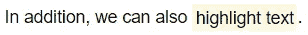

现在更容易将注意力吸引到文本中突出显示的部分。

## 🎨 1.3.使用警报

最后，我们可以使用 [bootstrap alert](https://www.w3schools.com/bootstrap/bootstrap_alerts.asp) 设置背景和字体颜色的格式，使文本文档更容易阅读:

```
<div class="alert alert-info">Example text highlighted in blue background.</div>
<div class="alert alert-success">Example text highlighted in green background.</div>
<div class="alert alert-warning">Example text highlighted in yellow background.</div>
<div class="alert alert-danger">Example text highlighted in red background.</div>
```

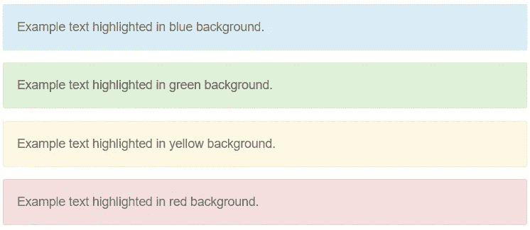

这些格式都很好看！添加颜色可以突出重点，让文档不那么枯燥，从而立即提高笔记本文档的可读性。这样就变得更容易略读，快速获得要点。

# 📍 2.适当设置文本格式

丰富文档的另一种方法是使用合适的更丰富的文本格式。让我们看看三种不同的文本格式:

## 📍2.1 用 LaTeX 插入数学方程

在笔记本文档中经常需要引用数学方程。有了`$`，我们可以使用 LaTeX 显示格式良好的数学公式:

```
$$logloss(\theta) = - {1 \over m} \sum_{i=1}^m (y_i  \ln(\hat p(y_i=1)) + (1-y_i)  \ln(1-\hat p(y_i=1)))$$
```

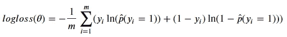

当等式用双`$`包裹时，它将居中对齐。如果我们使用单个`$`，它将是左对齐的。或者，我们也可以使用以下语法来编写公式:

```
\begin{equation} logloss(\theta) = - {1 \over m} \sum_{i=1}^m (y_i  \ln(\hat p(y_i=1)) + (1-y_i)  \ln(1-\hat p(y_i=1))) \end{equation}
```

如果你对 LaTeX 不熟悉，可以看看[这个指南](http://tug.ctan.org/info/short-math-guide/short-math-guide.pdf)或者[这个](https://assets.ctfassets.net/nrgyaltdicpt/4e825etqMUW8vTF8drfRbw/d4f3d9adcb2980b80818f788e36316b2/A_quick_guide_to_LaTeX__Overleaf_version.pdf)来入门。

## 📍 2.2.使用代码块

有时，在 markdown 单元格中显示代码引用而不是在代码单元格中运行它们是很有用的。我们可以使用单引号```来内联显示代码块:

```
If you haven't installed textblob, you can install it with: `pip install texblob`.
```

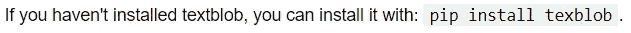

对于更大的代码块，我们可以使用三重反斜线`````:

```
If you haven't installed libraries, you can install them with the following command:
```
conda install pandas, numpy, sklearn -y
pip install textblob
```
```

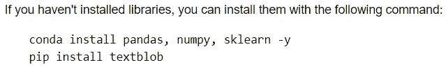

如果我们在第一个三元组```后指定语言名称，代码块将在适用的地方进行彩色格式化:

```
```python
{"minimum": 10, "maximum": 50, "name": "optimiser"}
```
```

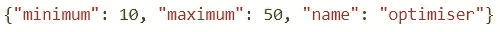

## 📍 2.3.使用引号缩进

缩进是设置文本格式以提高可读性的另一种方式。我们可以用`>`添加缩进:

```
Sample non-indented sentence here.
> **Note:** Indented text.
```

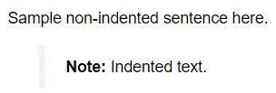

# 📹 3.添加媒体

> 一幅画胜过千言万语。

文档不一定总是用文字。图像和其他媒体可以帮助我们传达用文字难以表达的思想。添加相关媒体是为未来用户提供必要信息来丰富文档的另一个好方法。

## 📷 3.1.嵌入包含 gif 的图像

我们可以使用 html ``标签向 markdown 单元格添加图像:

```

```

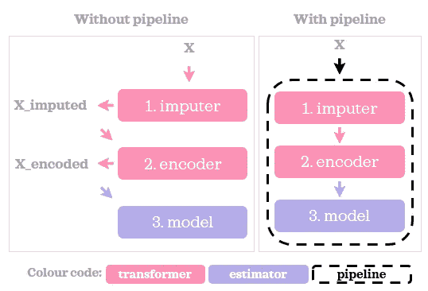

[管道、列变压器和特性联合说明](/pipeline-columntransformer-and-featureunion-explained-f5491f815f)

在这里，`example.jpeg`与笔记本保存在同一个文件夹中。我们可以使用`width`或`height`参数来改变图像的大小。例如，``会将显示的图像调整到所需的宽度，同时保持宽高比。

如果在静态图像中添加图表或其他数据可视化不能很好地捕捉我们想要传达的信息，我们可以嵌入 [GIF，一个使用完全相同语法结构的动画图像](https://www.howtogeek.com/441185/what-is-a-gif-and-how-do-you-use-them/):

```

```


[数据科学 Git 简介](/introduction-to-git-for-data-science-ca5ffd1cebbe)

文件的路径也可以是一个 web 链接:

```

```

## 📹 3.2.嵌入视频

> [一个(一分钟)视频抵得上 180 万字。](https://idearocketanimation.com/4293-video-worth-1-million-words/?nab=0&utm_referrer=https%3A%2F%2Fwww.google.com%2F)’

如果 gif 不够，下一步就是用视频。我们可以使用 html `<video>`标签来显示一段视频:

```
<video controls src="example.mp4"  width=600/>
```

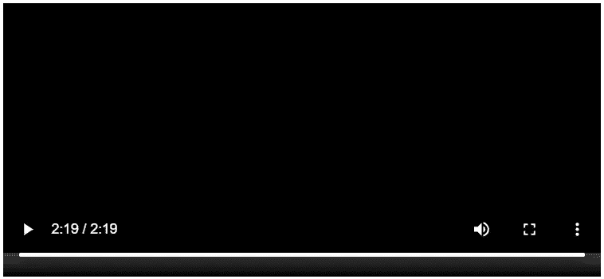

例如，屏幕记录如何完成一项任务，将其保存为视频文件，并将视频嵌入笔记本中，这对未来的用户可能很有用。

## ⚪ ️3.3.添加形状和表情符号

一段很长的纯文本可能会很无聊，读起来没有吸引力。优雅地添加形状和表情符号可以使文本阅读起来更有趣、更有吸引力:

```
&#10148; Bullet point one</br>
&#10148; Bullet point two</br>
&#10148; Bullet point three
```

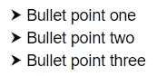

```
✅ Sample text A</br>
✅ Sample text B</br>
✅ Sample text C
```

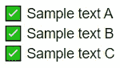

查看[这个](https://texteditor.com/characters/arrows/)来探索更多的形状(和表情符号)。[这个表情符号备忘单](https://github.com/ikatyang/emoji-cheat-sheet/blob/master/README.md)在按名字搜索表情符号时很有用。

瞧啊。这些是我丰富 Jupyter 笔记本文档的技巧。✨:我们可能不会一次使用所有这些功能。但是当合适的机会出现时，知道如何使用它们会让你有所准备。


克里斯·劳顿在 [Unsplash](https://unsplash.com?utm_source=medium&utm_medium=referral) 上拍摄的照片

*您想要访问更多这样的内容吗？媒体会员可以无限制地访问媒体上的任何文章。如果您使用* [*我的推荐链接*](https://zluvsand.medium.com/membership)*成为会员，您的一部分会费将直接用于支持我。*

谢谢你看我的帖子。如果你想了解更多关于减价的信息，请查看本指南。如果你感兴趣，这里有我的一些帖子的链接:

◼️ [用这些技巧整理你的 Jupyter 笔记本](/organise-your-jupyter-notebook-with-these-tips-d164d5dcd51f)
◼️ [有用的 IPython 魔法命令](/useful-ipython-magic-commands-245e6c024711)
◼️[python 虚拟环境数据科学简介](/introduction-to-python-virtual-environment-for-data-science-3c216929f1a7)
◼️[git 数据科学简介](/introduction-to-git-for-data-science-ca5ffd1cebbe?source=your_stories_page-------------------------------------)
◼️[python 中的简单数据可视化，你会发现有用的](/simple-data-visualisations-in-python-that-you-will-find-useful-5e42c92df51e)
◼️ [6 个简单的技巧，让你在 Seaborn (Python)中的情节更漂亮、更定制](/6-simple-tips-for-prettier-and-customised-plots-in-seaborn-python-22f02ecc2393)
◼️️ [5](/5-tips-for-pandas-users-e73681d16d17)

再见🏃💨