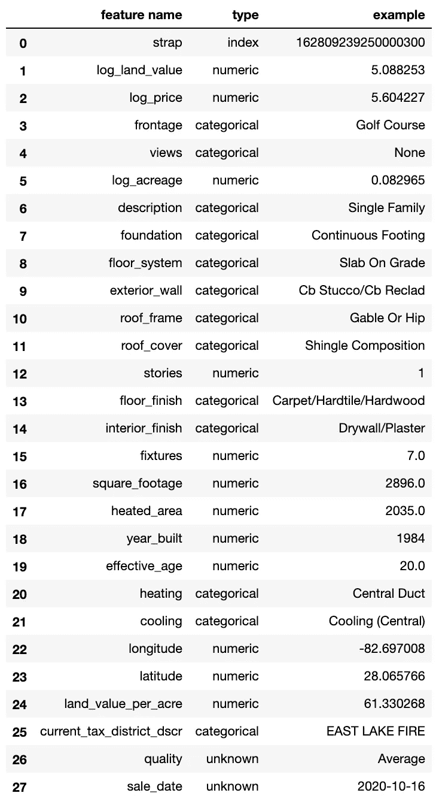
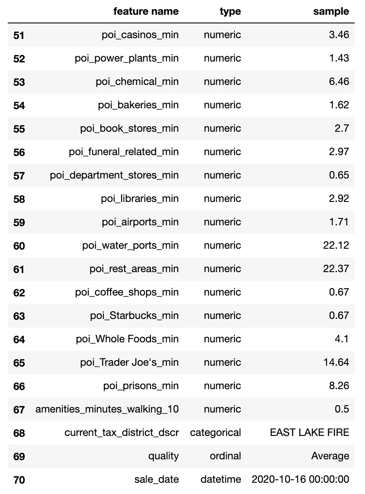

# 无需离开笔记本电脑即可丰富您的位置数据

> 原文：<https://towardsdatascience.com/enrich-your-location-data-without-leaving-your-notebook-3c844b41c45?source=collection_archive---------33----------------------->

## Iggy Python API 简介

照片由[路易斯·森特](https://unsplash.com/@luizcent?utm_source=medium&utm_medium=referral)在 [Unsplash](https://unsplash.com?utm_source=medium&utm_medium=referral) 拍摄

地理信息在房地产等行业的定价中扮演着重要角色。住宅周边的特征——它的(不)舒适性、美学和步行性——都会影响它的价值。

假设你是一家房地产公司的新数据科学家。你的第一项任务是改进你所在小组的定价模式。您有一种直觉，即添加模型要素来描述住宅附近可能会导致更准确的价格预测，但您并不确定。你将如何开始你的实验？

> 如果不花大量时间收集位置数据，不花大量时间*阅读投影、路由算法或空间连接方面的内容*,如何测试您的假设*?*

在 Iggy，我们一直在开发工具，使任何公司都可以轻松地将这种类型的邻里情报纳入其分析中。有了我们的 [API](https://docs.askiggy.com/docs) 和它的新 [Python 包装器](https://pypi.org/project/iggy-python/)，在你的项目中试验位置信息就像一个`pip install`和一些方法调用一样简单。

在围绕我们的房地产场景的几篇文章的第一篇中，我们将快速演示如何使用 Iggy API 通过 Python 中的位置信息来丰富属性数据。只需几个 API 调用，我们就可以快速地向房屋销售数据集中添加描述邻近特征的要素，如必需品的邻近度、树木覆盖度和人口密度。

## 带上你自己的数据集

我们将在本次演示中使用的数据集是自 2019 年以来佛罗里达州[皮内拉斯县](https://www.pcpao.org/)的 1000 套独立的单户住宅销售的公开样本。它包括关于销售日期和价格的信息，以及关于房产本身的一些重要信息。

让我们看看我们必须从什么开始。

生成的数据字典如下所示:

这里有一系列的数据来描述每一处房产:它的物理特征(`square_footage`、`floor_system`)、它的状况(`frontage`)，甚至一些评估数据(`log_land_value`)。当然还有销售信息，包括`sale_date`和`log_price`。

现在，假设现有的定价模型使用其余的特性作为输入来预测每个房屋的销售价格(`log_price`)。虽然现有的信息提供了大量的个人住房特征的细节，但有一些重要的因素被遗漏了。具体来说，这些数据并没有告诉我们任何关于每处房产所在社区的信息:去杂货店或咖啡店方便吗？它是在一个绿树成荫的社区吗？周边空气质量怎么样？

我们这里的数据当然是有用的，但我们不需要太多努力就可以做得更好。

Iggy 通过一组 API 调用，利用邻域智能轻松丰富该数据集:

*   Iggy 的`/lookup` API 端点提供关于输入位置本身的信息。这包括空气质量、光污染和树冠等物理信息，以及人口密度和学校集水区。
*   `/points_of_interest`端点给出了关于周围社区到便利设施的距离的信息(通过步行、骑自行车或开车的时间)。
*   `/amenities_score`给出一个分数，代表一个地点周围生活设施质量的多样性(如公园、面包店、餐馆、杂货店、娱乐)。

我们新的 [Python 库](https://pypi.org/project/iggy-python/)旨在简化在 Python 脚本中访问 Iggy API 的过程。实例化一个`iggyapi`对象需要一个 Iggy API 密匙(你可以通过[我们的主页](https://www.askiggy.com/)上的“获得早期访问”链接来请求):

然后，我们可以使用内置函数调用任何端点。下面是一个调用`/lookup`端点来找出输入点的空气质量的示例:

## Iggy Python 库是为数据科学家构建的

Iggy Python 库通过`iggyfeature`模块提供了一种基于来自 Iggy API 的信息定义“特性”的方法。由于我们从包含地理坐标的数据框开始，我们可以使用`iggyfeature`为依赖 Iggy API 调用的数据框定义新列。

例如，如果我们想要构建一个要素来计算到最近的杂货店的距离，我们可以按如下方式进行:

在上面的要素定义中，我们指定该要素源自 Iggy 的`/points_of_interest`端点(`IggyPOIFeature`)，它专门寻找`grocery_stores`，并且它将返回到输入点 30 英里内的任何杂货店的最小(`calc_method='min'`)距离。

此外，`iggyfeature.IggyFeatureSet`类帮助我们在一行代码中组合一系列特性，并用多个特性丰富整个数据框。

因此，让我们创建一些新的 Iggy 特征来添加到我们的数据中。我们将向每一行添加以下内容:

*   从 28 个类别和 3 个品牌中的一个到最近的兴趣点的距离，包括便利设施(如餐馆、面包店和干洗店)和非便利设施(包括废物管理和监狱)。有关当前可用的兴趣点类型的完整列表，请参见我们的文档。

*   15 分钟步行范围内的餐馆、酒吧、咖啡店、面包店、杂货店的数量

*   该位置的光污染、树冠、空气质量和人口密度指数的值

*   步行或开车 10 分钟内，房子的舒适度得分*为*。宜人性指数是一个 Iggy 指数，用于衡量一个地区生活质量的多样性(如公园、餐馆等)。

使用上面的代码，我们定义了 42 个新的特征或列，可以添加到我们的数据中来描述每个属性的本地邻域。让我们将它们组合成一个`IggyFeatureSet`，并用它来一次性丰富数据帧:

现在，如果我们再次使用 Featuretools 来检查 Iggy 丰富的数据框中的新要素，我们会看到每个房屋销售的新信息元素，每个元素都提供了关于周围邻居的附加上下文。

那里！我们已经向模型中添加了 42 个新的基于位置的要素，而无需进行任何空间连接，甚至无需查看地图。现在，我们可以自由地试验这些新特性，以快速确定它们是否有助于定价模型。

在接下来的一篇文章中，我们将浏览这些分析，看看哪些特性在我们的房地产定价场景中是最重要的。在那之前…

*   如果你有兴趣了解更多关于 Iggy API 的信息，请查看我们的文档[并把](https://www.askiggy.com/docs)和[添加到我们的等待列表](https://form.typeform.com/to/r9lvI921)中以请求你的 API 密钥。
*   我们一直在添加新的数据集！看一看我们的[数据路线图](https://www.notion.so/askiggy/Iggy-Data-List-64a1959b28574547919cab92f49028e8)，了解即将出现的情况。
*   您希望我们包含哪些基于位置的数据？去我们的[Iggy Discord](https://www.askiggy.com/community/discord)社区告诉我们吧。

我们很期待看到你会用 Iggy 做些什么！