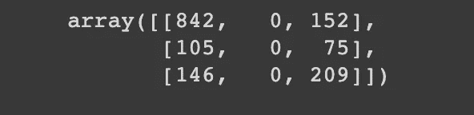
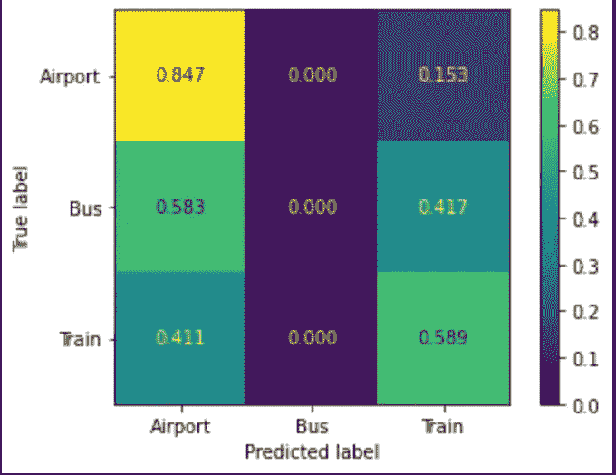

# 集成分类:简要概述及实例

> 原文：<https://towardsdatascience.com/ensemble-classification-a-brief-overview-with-examples-3dac25613073?source=collection_archive---------23----------------------->

## 使用集合分类法将兴趣点分类为机场、火车站和公交车站


查尔斯·德鲁维奥在 [Unsplash](https://unsplash.com/s/photos/rocket-pop?utm_source=unsplash&utm_medium=referral&utm_content=creditCopyText) 上拍摄的照片

***注*** *:本文是关于交通 POI 数据分类系列文章的最后一篇。* [*第一篇文章*](/poi-classification-using-visit-and-popularity-metrics-part-1-ae5e94f92077) *试图使用各种机器学习模型将记录分类为机场、公交车站和火车站。* [*第二篇文章*](/pca-lda-and-svd-model-tuning-through-feature-reduction-for-transportation-poi-classification-8d20501ee255) *的中心思想是使用特征约简算法来调整第一篇文章中的模型，以提供更高的精度。* [*第三篇*](/spark-multilayer-perceptron-classifier-for-poi-classification-99e5c68b4a77) *看起来使用了 Spark 多层感知器分类器来正确地分类这些记录。查看这些文章，了解该项目在寻找 POI 数据分类的最佳方法方面是如何发展的。*

本文将使用集成分类，使用步行交通模式对来自[安全图](http://safegraph.com/)的 POI 记录进行正确分类。SafeGraph 是一家数据提供商，为数百家企业和类别提供 POI 数据。它免费向学术界提供数据。对于这个项目，我选择使用 SafeGraph 模式数据将记录分类为不同的兴趣点。模式数据的模式可以在这里找到:[模式信息](https://docs.safegraph.com/v4.0/docs/places-schema#section-patterns)

# 什么是集合分类:

集成学习是多个“弱学习者”一起使用来创建一个机器学习模型的概念，该模型能够比他们每个人单独使用时表现得更好。大多数时候，这些弱学习者自己表现不好，因为他们要么有高偏差，要么有高方差。在集成模型中组合多个弱学习器的要点是减少这种偏差和方差。


在 [Unsplash](https://unsplash.com/s/photos/candy?utm_source=unsplash&utm_medium=referral&utm_content=creditCopyText) 上由 [Aron L](https://unsplash.com/@hocuspocusphotography?utm_source=unsplash&utm_medium=referral&utm_content=creditCopyText) 拍摄

# 兴趣点数据的集成分类

在我们开始总体分类之前，我们必须首先加载数据。这个特殊的步骤在本系列的第一篇文章和第二篇文章中都有涉及。满足本文需求的数据加载和预处理的基本步骤是:

在我们进入集合分类概念的第一步之前，我们必须首先加载我们将用于这个项目的数据:加载数据的过程可以在[笔记本](https://colab.research.google.com/drive/1A6ZZ0WZX3v4N5sN4pU5Yz_gxx2gThVqd?usp=sharing)中找到，并且已经在系列的第一部分[中详细解释。采取的步骤是:](/poi-classification-using-visit-and-popularity-metrics-part-1-ae5e94f92077)

1.  删除不必要的列- ['parent_safegraph_place_id '，' placekey '，' safegraph_place_id '，' parent_placekey '，' parent_placekey '，' safegraph_brand_ids '，' brands '，' poi_cbg']
2.  创建地面实况列，将每个记录建立为机场、汽车站、机场或未知
3.  删除未知记录以清除无法识别的记录
4.  使用 pyspark 水平分解 JSON 字符串的列
5.  阵列的水平分解列
6.  使用 Sklearn LabelEncoder 包转换类列

作为这些转换的结果，输出的数据如下所示，并具有以下各列:


**Raw_visit_counts:** 在日期范围内，我们的小组中对此兴趣点的访问次数。

**Raw_visitor_counts:** 在日期范围内，来自我们面板的访问该兴趣点的独立访问者的数量。

**Distance_from_home:** 访客(我们已确定其住所的访客)离家的中值距离，以米为单位。

**中值 _ 停留时间:**中值最小停留时间，以分钟为单位。

**分时段停留(分解为< 5，5–10，11–20，21–60，61–120，121–240):**键是分钟的范围，值是在该持续时间内的访问次数

**Popularity_by_day(分解为周一至周日):**一周中的某一天到日期范围内每天(当地时间)的访问次数的映射

**Popularity_by_hour(分解为 Popularity _ 1-Popularity _ 24):**一天中的某个小时到当地时间日期范围内每小时的访问次数的映射。数组中的第一个元素对应于从午夜到凌晨 1 点的时间

**Device_type(分解为 ios 和 Android):** 使用 Android 和 IOS 的 POI 的访客数量。仅显示至少包含 2 个设备的设备类型，包含少于 5 个设备的任何类别都报告为

既然数据已经准备好了，我们可以开始集成学习方面了。

对于本文的这一部分，我们将使用 Sklearn 投票分类器。这是 Sklearn 包中集成学习的内置模型。然而，在使用这种方法之前，我们需要首先训练我们在这个模型中使用的三个弱学习者。我们使用的模型与本系列文章第一部分中的模型相同，包括高斯朴素贝叶斯模型、决策树模型和 K-最近邻模型。

```
#Training all three modelsfrom sklearn.neighbors import KNeighborsClassifierfrom sklearn.naive_bayes import GaussianNBfrom sklearn.tree import DecisionTreeClassifierdtree_model = DecisionTreeClassifier(max_depth = 3).fit(X_train, y_train)gnb = GaussianNB().fit(X_train, y_train)knn = KNeighborsClassifier(n_neighbors = 22).fit(X_train, y_train)
```

既然已经训练了所有三个模型，我们可以使用这些模型来执行该过程的下一个步骤，即调用模型并将创建的模型聚合到字典中以供集合模型使用

```
from sklearn.ensemble import VotingClassifierestimators=[(‘knn’, knn), (‘gnb’, gnb), (‘dtree_model’, dtree_model)]ensemble = VotingClassifier(estimators, voting=’hard’)
```

在训练和测试模型时，我们会收到以下输出:

```
ensemble.fit(X_train, y_train)ensemble.score(X_test, y_test)
```


```
from sklearn.metrics import confusion_matrixprediction = ensemble.predict(X_test)confusion_matrix(y_test, prediction)
```



```
plot_confusion_matrix(ensemble, X_test, y_test, normalize=’true’, values_format = ‘.3f’, display_labels=[‘Airport’,’Bus’,’Train’])
```



该模型的精确度略低于用于创建集合分类模型的模型中最有效的模型的精确度(. 75 vs .68)。该模型的性能比高斯朴素贝叶斯模型(. 265)好得多，并且性能与 K-最近邻分类器(. 679)相当。看到模型的表现优于这三个精度的平均值，可以说对这个特定数据集使用集成分类是提高预测精度的有效方法。和以前一样，模型缺陷的主要原因是数据集中的不平衡和缺少公交车站记录。正如我们在 Spark Deep Learning 文章中看到的那样，这个问题并没有通过手动重新平衡数据来解决，因此未来分类工作的最佳行动方针是不惜一切代价避免严重不平衡的数据，否则准确性会严重下降。

# 结论

通过这个项目，我们能够确定集成分类的重要性以及当使用几个弱学习者来创建模型时该技术可以具有的效率。从这个练习中，我们能够推导出一个比三个弱学习者的平均准确度更好的模型。这是 POI 分类系列文章的结论。通过我们在该系列的最后 4 部分所做的分析，我们可以看到使用机器学习对 SafeGraph 数据进行分类的效率，以及预测的准确性可以相当高。

***提问？***

我邀请你在 [SafeGraph 社区](https://www.safegraph.com/academics)的 **#safegraphdata** 频道问他们，这是一个面向数据爱好者的免费 Slack 社区。获得支持、共享您的工作或与 GIS 社区中的其他人联系。通过 SafeGraph 社区，学者们可以免费访问美国、英国和加拿大 700 多万家企业的数据。