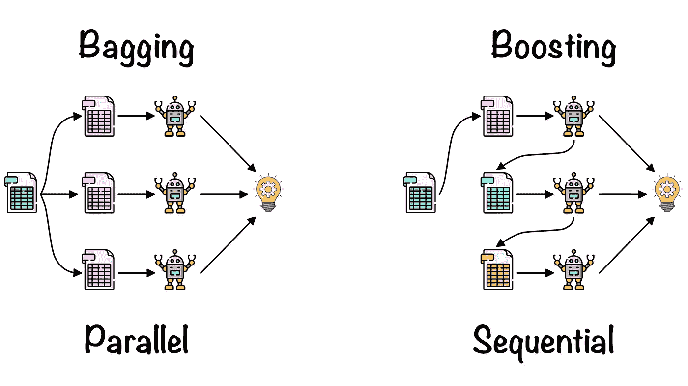
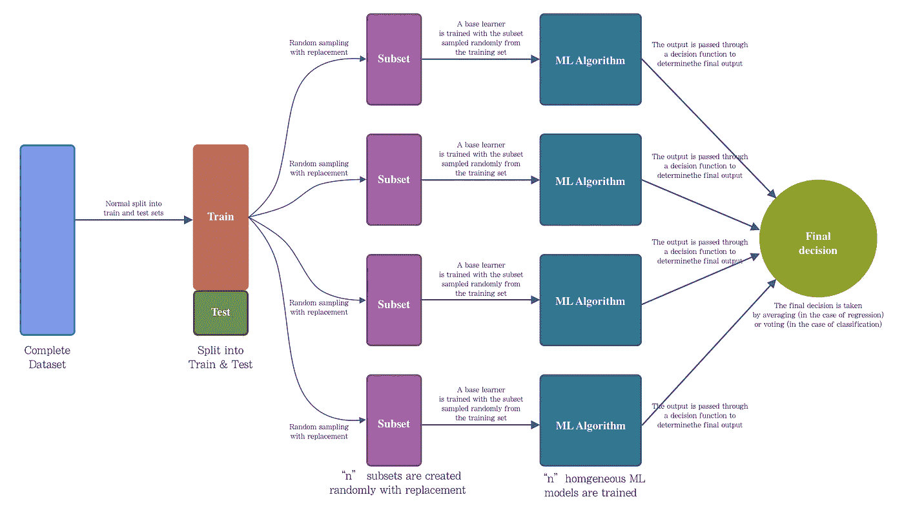
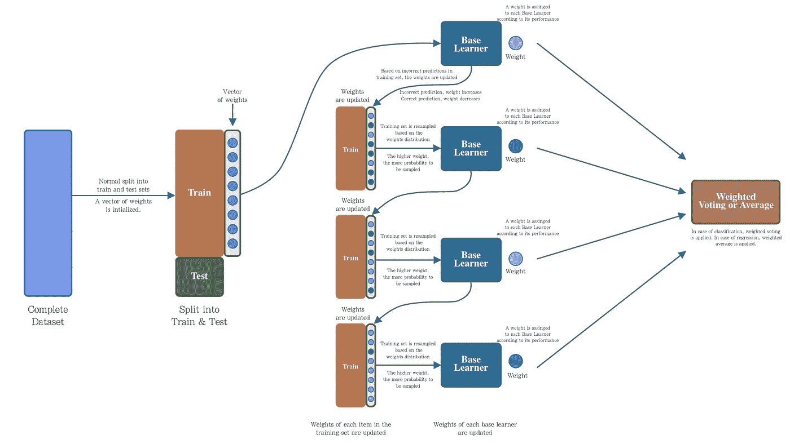
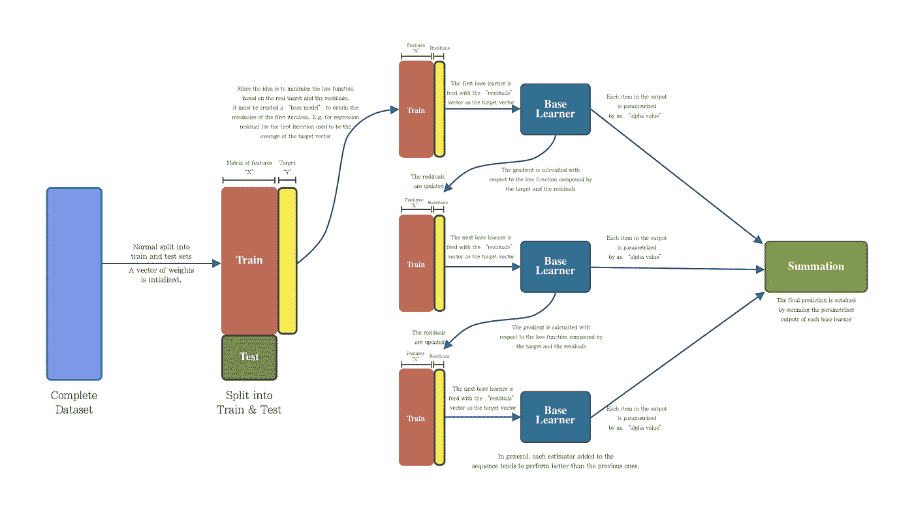

# 集成学习:打包和提升

> 原文：<https://towardsdatascience.com/ensemble-learning-bagging-boosting-3098079e5422?source=collection_archive---------9----------------------->

## [入门](https://towardsdatascience.com/tagged/getting-started)

## 如何组合弱学习者来建立更强的学习者，以减少你的 ML 模型中的偏差和变化



图一。由 [Freepik](https://www.flaticon.com/authors/freepik) 在 [Flaticon](http://www.flaticon.com) 上打包和提升|电子表格、机器人和创意图标

在使用机器学习算法时，偏差和方差的权衡是一个关键问题。幸运的是，机器学习实践者可以利用一些基于**集成学习**的技术来解决偏差和方差权衡，这些技术是**打包**和**提升**。因此，在这篇博客中，我们将解释 **bagging** 和 **boosting** 如何工作，它们的组件是什么，以及如何在你的 ML 问题中实现它们，因此这篇博客将分为以下几个部分:

*   **什么是装袋？**
*   **什么是助推？**
*   AdaBoost
*   **梯度增强**

# 什么是装袋？

**Bagging** 或 **Bootstrap Aggregation** 由 Leo Breiman 于 1996 年正式提出[ [3](https://link.springer.com/article/10.1023/A:1018054314350) ]。 **Bagging** 是一种**集成学习**技术，旨在通过实现一组同构机器学习算法来减少错误学习。 **bagging** 的关键思想是使用多个基础学习器，这些学习器使用来自训练集的随机样本单独训练，通过投票或平均方法，产生更稳定和准确的模型。

**bagging** 技术的两个主要组成部分是:带替换的*随机抽样*(**bootstrapping**)*和*一套同构*机器学习算法(**集成学习**)。 **bagging** 过程很容易理解，首先从训练集中提取出“ *n* 个子集，然后用这些子集训练同类型的“ *n* 个基础学习器。为了进行预测，向“ *n* ”个学习器中的每一个提供测试样本，对每个学习器的输出进行平均(在回归的情况下)或投票(在分类的情况下)。图 2 显示了**装袋**架构的概述。*

**

*图一。打包|作者图片*

*重要的是要注意到*子集*的数量以及每个*子集*的项目数量将由您的 ML 问题的性质决定，对于要使用的 ML 算法的类型也是如此。此外，Leo Breiman 在他的论文中提到，他注意到与回归问题相比，森林分类问题需要更多的子集。*

*为了实现**打包**，scikit-learn 提供了一个函数来轻松完成。对于一个基本的执行，我们只需要提供一些参数，例如*基本学习器*、估计器*数量*和*每个子集的最大样本数量*。*

*代码片段 1。装袋实施*

*在之前的代码片段中，为众所周知的*乳腺癌数据集创建了基于 *bagging 的模型*。*当基础学习器被实现为决策树时，从训练集中随机创建 5 个子集进行替换(以训练 5 个决策树模型)。每个子集的项目数为 50。通过运行它，我们将获得:*

```
*Train score: 0.9583568075117371
Test score: 0.941048951048951*
```

***打包**的一个主要优点是它可以并行执行，因为估算器之间没有依赖性。对于*小数据集*，几个估计器就足够了(比如上面的例子)，*大数据集*可能需要更多的估计器。*

*很好，到目前为止我们已经看到了什么是**装袋**以及它是如何工作的。让我们看看**助推**是什么，它的组成部分以及为什么它与**装袋**有关，让我们开始吧！*

# *什么是助推？*

***Boosting** 是一种**集成学习**技术，与 **bagging** 一样，利用一组*基础学习器*来提高一个 ML 模型的稳定性和有效性。 **boosting** 架构背后的思想是生成顺序假设，其中每个假设都试图改进或纠正前一个假设所犯的错误[ [4](https://www.cs.princeton.edu/courses/archive/spr07/cos424/papers/boosting-survey.pdf) ]。 **boosting** 的中心思想是以**顺序方式**实现*同质 ML 算法*，其中每个 ML 算法都试图通过关注前一个 ML 算法产生的错误来提高模型的稳定性。每个*基础学习器*的错误被认为是通过序列中的下一个*基础学习器*来改进的方式，是**增强**技术的所有变体之间的关键区别。*

***升压**技术多年来一直在研究和改进，升压的核心思想增加了几个变体，其中最流行的有: **AdaBoost** (自适应升压)、**梯度升压**和 **XGBoost** (极端梯度升压)。如上所述，*基于升压的技术*之间的关键区别在于惩罚误差的方式(通过修改 ***权重*** 或最小化**损失函数**)以及数据采样的方式。*

*为了更好地理解一些**增强**技术之间的差异，让我们大致看看 **AdaBoost** 和**渐变增强**是如何工作的，这是增强技术的两个最常见的变体，让我们开始吧！*

# *adaboost 算法*

***AdaBoost** 是一种基于 **boosting** 技术的算法，由 Freund 和 Schapire [ [5](https://www.face-rec.org/algorithms/Boosting-Ensemble/decision-theoretic_generalization.pdf) ]于 1995 年提出。 **AdaBoost** 实现了一个*权重向量*来惩罚那些被错误推断的样本(通过增加权重)并奖励那些被正确推断的样本(通过减少权重)。更新这个*权重向量*将生成一个分布，其中更有可能提取那些具有更高权重的样本(即那些被错误推断的样本)，这个样本将被引入序列中的下一个*基本学习器*。这将重复进行，直到满足停止标准。同样，序列中的每个基础学习者将被分配一个权重，表现越好，权重越高，该基础学习者对最终决策的影响越大。最后，为了进行预测，序列中的每个基础学习者将被提供测试数据，每个模型的每个预测将被投票(对于分类情况)或平均(对于回归情况)。在图 3 中，我们观察到了 **AdaBoost** 操作的描述性架构。*

**

*图 3。AdaBoost:描述性建筑|作者图片*

**Scikit-learn* 提供了实现 **AdaBoost** 技术的函数，让我们看看如何执行一个基本的实现:*

*代码片段 2。AdaBoost 实现*

*正如我们所看到的，我们使用的*基本学习器*是一个*决策树*(建议它是一个决策树，但是，你可以尝试一些其他的 ML 算法)，我们也只为基本学习器序列定义了 5 个估计器(这对我们试图预测的玩具数据集来说足够了)，运行它我们将获得以下结果:*

```
*Train score: 0.9694835680751174
Test score: 0.958041958041958*
```

*很好，我们已经大致了解了 **AdaBoost** 的工作原理，现在让我们看看**梯度增强**怎么样，以及我们如何实现它。*

# *梯度推进*

***梯度增强**方法不像 **AdaBoost** 那样实现权重的*向量。顾名思义，它实现了对给定损失函数优化的*梯度*的计算。**梯度提升**的核心思想是基于以顺序方式最小化每个学习者基础的残差，这种最小化是通过应用于特定损失函数(用于分类或回归)的梯度计算来实现的。然后，添加到序列中的每个*基础学习器*将最小化由前一个*基础学习器*确定的残差。这将重复进行，直到误差函数接近零，或者直到完成了指定数量的*基础学习器*。最后，为了进行预测，每个*基本学习器*被输入测试数据，其输出被参数化并随后相加以生成最终预测。**

**

*图 4。梯度推进:描述性建筑|作者图片*

*就像 **Bagging** 和 **AdaBoost** 一样， *scikit-learn* 提供了实现**渐变增强**的函数，让我们看看如何做一个基本的实现:*

***梯度推进**默认情况下与*决策树*一起工作，这就是为什么在实现中我们没有定义特定的基础学习器。我们定义序列中的每棵树的最大深度为 2，树的数量为 5，每棵树的学习率为 0.1，运行该函数我们得到:*

```
*Train score: 0.9906103286384976
Test score: 0.965034965034965*
```

*太棒了，这样我们就完成了对**打包**、**助推**和部分**助推**实现的探索，就这样！*

# *结论*

*在这个博客中，我们已经看到了两种最广泛应用的**集成学习**技术。*

*正如我们所见，**打包**是一种执行随机样本替换来训练“n”*基础学习者*的技术，这允许模型被并行处理。正是因为这种随机抽样，**装袋**是一种最大限度地减少方差的技术。另一方面， **boosting** 是一种顺序构建的技术，其中序列中的每个模型都试图关注前一个*基础学习器的错误。*虽然**增强**是一种主要允许减少方差的技术，但它很容易过度拟合模型。*

# *参考*

*[1][https://quant dare . com/bagging-and-boosting 之间的区别是什么/](https://quantdare.com/what-is-the-difference-between-bagging-and-boosting/)*

*[2]https://arxiv.org/pdf/0804.2752.pdf*

*[3]https://link.springer.com/article/10.1023/A:1018054314350*

*[4][https://www . cs . Princeton . edu/courses/archive/SPR 07/cos 424/papers/boosting-survey . pdf](https://www.cs.princeton.edu/courses/archive/spr07/cos424/papers/boosting-survey.pdf)*

*[5][https://www . face-rec . org/algorithms/Boosting-Ensemble/decision-theory _ generalization . pdf](https://www.face-rec.org/algorithms/Boosting-Ensemble/decision-theoretic_generalization.pdf)*