# 机器学习中的集成方法

> 原文：<https://towardsdatascience.com/ensemble-methods-in-machine-learning-1f02c9bcb7fe?source=collection_archive---------23----------------------->

## 基于树的集成方法综述

在 [Unsplash](https://unsplash.com/s/photos/orchestra?utm_source=unsplash&utm_medium=referral&utm_content=creditCopyText) 上由 [Samuel Sianipar](https://unsplash.com/@samthewam24?utm_source=unsplash&utm_medium=referral&utm_content=creditCopyText) 拍照

# 概观

机器学习中的集成方法是利用一个以上的模型来获得改进的预测的算法。这篇文章将介绍基于树的集成方法。我们先来看看他们是如何利用 [**德尔菲法**](https://corporatefinanceinstitute.com/resources/knowledge/other/delphi-method/) 和[**Bootstrap Aggregation**](https://corporatefinanceinstitute.com/resources/knowledge/other/bagging-bootstrap-aggregation/)(简称 Bagging)来提高预测能力的。然后，进入 [**boosting**](https://arxiv.org/abs/1403.1452) ，这是一种算法使用弱学习器组合来提升性能的技术。将涵盖 scikit-learn 中的以下 [**集成算法**](https://scikit-learn.org/stable/modules/ensemble.html) :

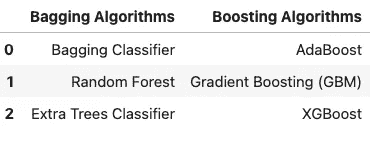

使用基于树的集成方法，我们知道没有一个模型可以给我们完美的估计，所以我们使用多个模型来进行预测，并对它们进行平均。通过这样做，高估和低估很可能会抵消并提高我们的预测。

# 自举聚合

Bagging 是 Bootstrap Aggregation 的缩写，是使集成方法成为可能的主要概念之一。Bootstrap 聚合由两个概念组成:bootstrap 重采样和聚合。 [**Bootstrap 重采样**](https://statisticsbyjim.com/hypothesis-testing/bootstrapping/) 是一种采样技术，其中创建数据集的子集，并进行替换。[**Bootstrap aggregation**](https://www.quantstart.com/articles/bootstrap-aggregation-random-forests-and-boosted-trees/)**是一种利用这些子集，对它们的预测进行平均的技术。这个过程非常适用于决策树，因为它们容易过度拟合，并且有助于减少预测的方差。使用自举聚合来训练集成算法的过程是:**

1.  **取数据集的样本，替换**
2.  **在这个子集上训练分类器**
3.  **重复第 1 步和第 2 步，直到所有分类器都完成了它们自己子集的训练**
4.  **用集合中的每个分类器进行预测**
5.  **使用集成方法，例如最大投票、平均、加权平均，将来自所有分类器的预测聚集成一个。**

**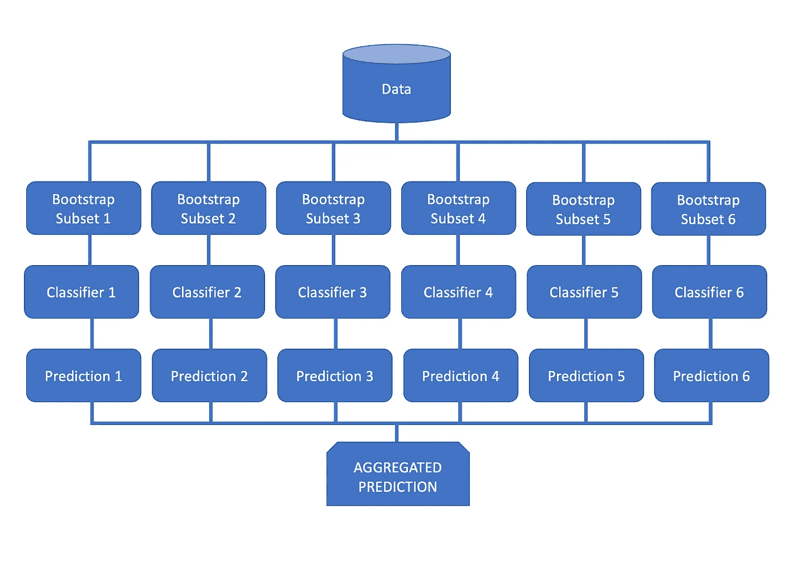**

**作者图片**

**在使用集成分类器之前，让我们先为基线安装一个决策树分类器。我将使用 [**泰坦尼克号数据集**](https://www.kaggle.com/c/titanic) 进行二元分类，目标是`Survived`特征。出于本概述的目的，正在使用的数据集已被清理。我们将使用来自 sklearn 的 [**管道来执行预处理步骤。有关数据集中要素的描述，请参阅下面的数据字典。**](/machine-learning-pipelines-with-scikit-learn-d43c32a6aa52)**

**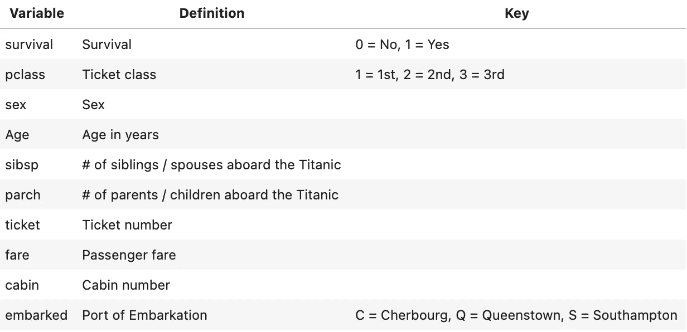****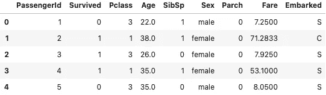****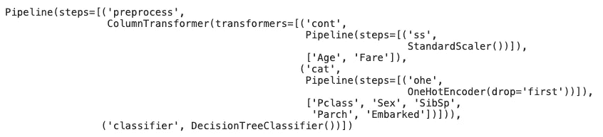****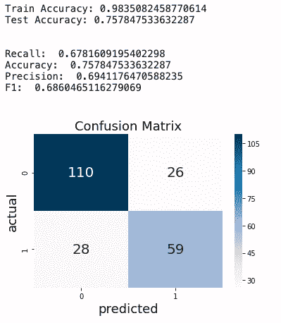**

**决策树分类器以 98%的准确度分数过度适合训练数据。分类器在准确率为 76%的测试数据上表现不佳。为了防止决策树过度拟合，我们可以设置超参数，比如树的最大深度。然而，我们通常会通过创建另一个决策树来获得更好的结果。为了做到这一点，我们可以用一个打包分类器来装配一个打包决策树的集合。bagging 分类器是一种基于树的集成方法，它在从数据中抽取的每个随机子集上拟合一个分类器，然后将各个预测聚合为一个。下面，我们将使用 sklearn 的 [**装袋分类器**](https://scikit-learn.org/stable/modules/generated/sklearn.ensemble.BaggingClassifier.html) 创建一个装袋管道。我们将把`n_estimators`参数设置为 200 (200 个分类树)，把`max_samples`参数设置为 20(用来训练每个估计器的样本数)。**

**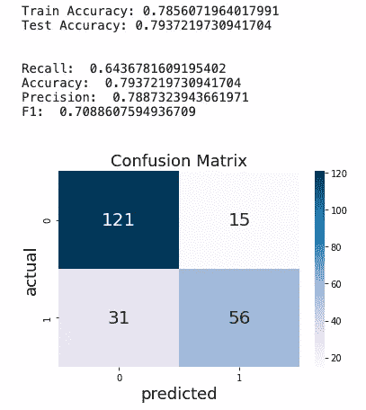**

**通过使用 bagging 分类器，我们能够将测试集的准确率提高到 79%。该分类器没有过度拟合，在训练集和测试集上具有相似的准确度分数。我们**通过替换重新采样数据来引导**，并且**通过使用所有预测来聚集**以得出一个预测。因为我们在同一个模型中引导和聚合，所以我们是**打包**。**

## **随机森林**

****

**在 [Unsplash](https://unsplash.com/s/photos/forest?utm_source=unsplash&utm_medium=referral&utm_content=creditCopyText) 上 [veeterzy](https://unsplash.com/@veeterzy?utm_source=unsplash&utm_medium=referral&utm_content=creditCopyText) 拍摄的照片**

**[**随机森林分类器**](https://scikit-learn.org/stable/modules/generated/sklearn.ensemble.RandomForestClassifier.html) 是一种集成方法，类似于 bagging 分类器，但使用特征的子集，而不是数据集中的所有特征。在随机森林分类器的装袋阶段，对三分之二的训练数据进行采样，并替换集合中的每棵树。这一部分用于构建树，剩余的三分之一用于计算 [**出袋误差**](https://journals.plos.org/plosone/article?id=10.1371/journal.pone.0201904) ，这是对集合中每棵树的性能的连续无偏估计。随机森林还利用 [**子空间采样方法**](https://businessforecastblog.com/random-subspace-ensemble-methods-random-forest-algorithm/) 在集合中的树之间提供更多的可变性。这种方法只为树中的每个节点随机选择一个特征子集。通过使用这些子集，我们将得到一个包含不同决策树的随机森林。有了在数据的不同子集上训练的决策树的集合，该模型将是不太敏感的噪声数据。让我们继续创建一个带有随机森林分类器的管道，我们将把`n_estimators`参数设置为 500，把`max_samples`参数设置为 20。**

**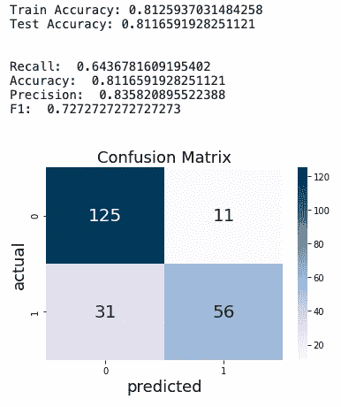**

**随机森林分类器在测试集和训练集上都达到了 81%的准确率。这是对 bagging 分类器的一点改进，但是我们也使用了 500 棵分类树，而不是 200 棵。更详细的解释， [**下面是**](https://www.stat.berkeley.edu/~breiman/randomforest2001.pdf) 一篇关于随机森林的伟大论文。**

## **极度随机化的树**

****

**科林·沃茨在 [Unsplash](https://unsplash.com/s/photos/trees?utm_source=unsplash&utm_medium=referral&utm_content=creditCopyText) 上的照片**

**如果我们想给我们的组合增加更多的随机性，我们可以使用 [**额外的树分类器**](https://scikit-learn.org/stable/modules/generated/sklearn.ensemble.ExtraTreesClassifier.html) 。与随机森林分类器类似，额外的树也将使用要素的随机子集，但不是选择最佳分支路径，而是随机选择一个。这降低了我们的模型对训练数据中的特征的依赖，并且将有助于防止过度拟合。我们将在下面安装一个额外的树分类器，参数`n_estimators`设置为 400，参数`max_samples`设置为 30。额外树算法需要注意的一点是，bootstrap 参数默认设置为 False。为了对替换的数据进行采样，我们需要将该参数设置为 true。**

****

**额外的树分类器比随机森林分类器表现稍好，准确性提高了 1%。**

# **助推**

****

**[比尔·杰伦](https://unsplash.com/@billjelen?utm_source=unsplash&utm_medium=referral&utm_content=creditCopyText)在 [Unsplash](https://unsplash.com/s/photos/boost?utm_source=unsplash&utm_medium=referral&utm_content=creditCopyText) 上的照片**

**[**Boosting**](https://arxiv.org/abs/1403.1452) 是指顺序训练弱学习者建立模型的过程。 [**弱学习者**](https://codesachin.wordpress.com/2016/03/06/a-small-introduction-to-boosting/) 是机器学习算法，表现略好于随机机会。boosting 算法的预测通常分配权重来确定每个学习者输入的重要性。通过组合给予每个学习者的权重，具有正确分类的树的集体权重将否决来自不正确分类的具有较高权重的树。升压过程如下:**

1.  **训练一个弱学习者**
2.  **评估学习者分类错误的地方**
3.  **训练另一个薄弱的学习者，重点放在之前的学习者分类错误的领域**
4.  **重复此过程，直到满足某些停止标准，例如性能稳定期**

## **自适应增压**

**[**Adaboost**](https://scikit-learn.org/stable/modules/generated/sklearn.ensemble.AdaBoostClassifier.html)(adaptive boosting 的简称)是最早发明的 boosting 算法。它通过顺序更新两组权重来工作，一组用于数据点，一组用于弱学习者。被错误分类的点被赋予更大的权重，因此下一个弱学习者可以关注这些点。在序列的末尾，对做出更好预测的学习者给予更高的权重。这尤其适用于对先前学习者没有正确分类的数据点做出正确预测的学习者。给学习者的权重然后被用作最终投票来确定集合的预测。这里的主要思想是 adaboost 通过不断调整采样数据的分布来训练下一个分类器，从而创建新的分类器。**

**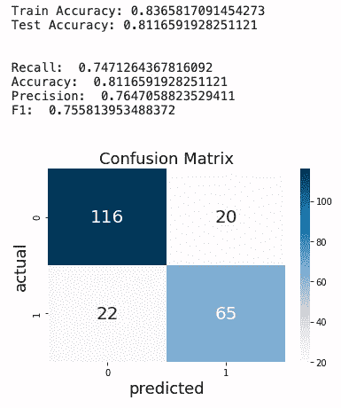**

**仅使用默认参数，adaboost 分类器表现得相当好，并且还获得了比上面使用的强学习器更高的 f1 分数。**

## **梯度推进**

**[**梯度提升树**](https://scikit-learn.org/stable/modules/generated/sklearn.ensemble.GradientBoostingClassifier.html) 算法比 adaboost 更高级，使用 [**梯度下降**](https://ml-cheatsheet.readthedocs.io/en/latest/gradient_descent.html) 。与 adaboost 类似，梯度增强也是从训练弱学习者开始的。然而，它更进一步，计算每个数据点的 [**残差**](https://statisticsbyjim.com/glossary/residuals/) 。这将表明学习者的预测有多错误。使用残差和损失函数计算总损失。梯度和总损失然后被用于训练下一个学习者。学习者错误的损失被赋予更重的权重，这反过来允许我们使用梯度下降来推动算法创建下一个学习者来关注这些数据点。需要注意的是，梯度下降中的步长通常是我们想要限制的。这导致较小的学习率，以帮助找到收敛的最佳值。**

**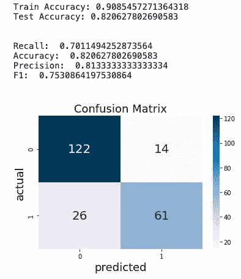**

**梯度提升分类器在测试集上表现良好，准确率达到 82%。然而，这个模型看起来确实过于适合训练数据，准确性分数下降了 9%。**

## **极端梯度推进**

**[**XGBoost**](https://xgboost.readthedocs.io/en/latest/) (极限梯度增强的简称)是目前性能最高的梯度增强算法版本。xgboost 有许多优化，在所有梯度提升算法中提供最快的训练时间。最大的一个问题是 xgboost 已经被配置为在计算机 CPU 的所有内核中均匀分布树的构造。XGBoost 使用 [**二阶导数**](http://homepages.inf.ed.ac.uk/rbf/CVonline/LOCAL_COPIES/BASICMAT/node5.html) 来最小化误差，这与在梯度提升树中使用基本学习器的损失函数相反。**

**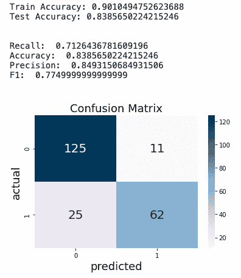**

**XGBoost 分类器在测试集上表现最好，准确率为 84%。这是通过 0.15 的学习率(默认为 0.1)实现的。分类器看起来确实稍微过度适合训练数据，在训练集和测试集之间的准确度分数下降了 6%。**

# **结论**

**机器学习中的集成方法可以显著提高模型的性能。虽然我们讨论了一些不同的算法，但有许多算法利用了这些集成技术，我建议对它们进行深入研究。上面使用的分类器没有优化，可以改进。使用这些分类器执行网格搜索将有助于找到最佳参数，但也将更加耗时。我希望所涉及的概念是清楚的和有帮助的。谢谢你花时间看我的帖子！**

## **参考资料:**

*   ***德尔菲法——概述、流程和应用。(2020 年 7 月 15 日)。检索自*[*https://corporatefinanciinstitute . com/resources/knowledge/other/Delphi-method/*](https://corporatefinanceinstitute.com/resources/knowledge/other/delphi-method/)**
*   **Python 中的集成学习。(未注明)。检索自[*https://www . data camp . com/community/tutorials/ensemble-learning-python？UTM _ source = AdWords _ PPC&UTM _ campaignid = 1565261270&UTM _ adgroupid = 67750485268&UTM _ device = c&UTM _ keyword =&UTM _ match type = b&UTM _ network = g&UTM _ adpossion =&UTM _ creative = 295208661502【中*](https://www.datacamp.com/community/tutorials/ensemble-learning-python?utm_source=adwords_ppc&utm_campaignid=1565261270&utm_adgroupid=67750485268&utm_device=c&utm_keyword=&utm_matchtype=b&utm_network=g&utm_adpostion=&utm_creative=295208661502&utm_targetid=aud-299261629574:dsa-429603003980&utm_loc_interest_ms=&utm_loc_physical_ms=9021719&gclid=Cj0KCQiA6Or_BRC_ARIsAPzuer_IwGctWQXKFKVmaCWUFQg9LwinV7_4g3Ku0TBKROwvCEef34a_XNsaAor-EALw_wcB)**
*   ***1.11。整体方法。(未注明)。检索自*[*https://scikit-learn.org/stable/modules/ensemble.html*](https://scikit-learn.org/stable/modules/ensemble.html)**
*   ***sk learn . ensemble . bagging classifier .(未标明)。检索自*[*https://sci kit-learn . org/stable/modules/generated/sk learn . ensemble . bagging classifier . html*](https://scikit-learn.org/stable/modules/generated/sklearn.ensemble.BaggingClassifier.html)**
*   ***sk learn . ensemble . randomforestclassifier .(未标明)。检索自*[*https://sci kit-learn . org/stable/modules/generated/sk learn . ensemble . randomforestclassifier . html*](https://scikit-learn.org/stable/modules/generated/sklearn.ensemble.RandomForestClassifier.html)**
*   ***Bootstrap 聚合，随机森林和 Boosted 树。(未注明)。检索自*[*https://www . quant start . com/articles/bootstrap-aggregation-random-forests-and-boosted-trees/*](https://www.quantstart.com/articles/bootstrap-aggregation-random-forests-and-boosted-trees/)**
*   **琼斯，C. (2014 年 2 月 12 日)。检索自[*https://businessforecastblog . com/random-subspace-ensemble-methods-random-forest-algorithm/*](https://businessforecastblog.com/random-subspace-ensemble-methods-random-forest-algorithm/)**
*   ***sk learn . ensemble . gradientboostingclassifier .(未标明)。检索自*[https://scikit-learn . org/stable/modules/generated/sk learn . ensemble . gradientboostingclassifier . html](https://scikit-learn.org/stable/modules/generated/sklearn.ensemble.GradientBoostingClassifier.html)**
*   ***sk learn . ensemble . adaboostclassifier .(未标明)。检索自*[*https://sci kit-learn . org/stable/modules/generated/sk learn . ensemble . adaboostclassifier . html*](https://scikit-learn.org/stable/modules/generated/sklearn.ensemble.AdaBoostClassifier.html)**
*   ***迈尔，a .，宾德，h .，格费勒，o .，&施密德，M. (2014 年 11 月 18 日)。Boosting 算法的发展——从机器学习到统计建模。检索自*[*https://arxiv.org/abs/1403.1452*](https://arxiv.org/abs/1403.1452)**
*   ***XGBoost 文档。(未注明)。检索自*[【https://xgboost.readthedocs.io/en/latest/】T21](https://xgboost.readthedocs.io/en/latest/)**