# 集合模型

> 原文：<https://towardsdatascience.com/ensemble-models-5a62d4f4cb0c?source=collection_archive---------0----------------------->

## 简单演练中的整体技术学习指南


Rene b hmer 在 [Unsplash](https://unsplash.com?utm_source=medium&utm_medium=referral) 上拍摄的照片

在我们的生活中，当我们做出一个重要的决定时，比如申请一个大学项目，签一份工作合同，我们倾向于寻求一条建议。我们试图收集尽可能多的信息，并联系多位专家。因为这样的决定会影响我们的未来，所以我们更信任通过这样的过程做出的决定。机器学习预测遵循类似的行为。模型处理给定的输入并产生结果。结果是基于模型在训练期间所看到的模式的预测。

在许多情况下，一个模型是不够的，本文将阐明这一点。什么时候以及为什么我们需要多个模型？如何训练那些模特？这些模型提供了什么样的多样性。因此，让我们直接进入主题，但要快速概述一下。

# 概观

集成模型是一种在预测过程中结合多个其他模型的机器学习方法。这些模型被称为基本估计量。这是一种解决方案，可以克服构建单个评估器的以下技术挑战:

*   高方差:模型对学习特征的输入非常敏感。
*   低准确性:一个模型或一个算法来拟合整个训练数据可能不足以满足预期。
*   特征噪声和偏差:模型在进行预测时严重依赖于一个或几个特征。

# 集成算法

单一算法可能无法对给定的数据集做出完美的预测。机器学习算法有其局限性，并且产生具有高精确度的模型是具有挑战性的。如果我们建立并**结合**多个模型，整体精度可能会得到提升。这种组合可以通过聚合每个模型的输出来实现，它有两个目标:减少模型误差和保持其泛化能力。实现这种聚合的方法可以使用一些技术来实现。一些教科书将这样的架构称为 ***元算法*** 。

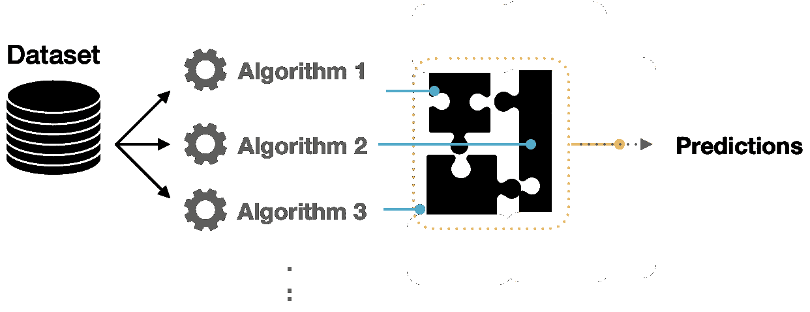

图 1:使用多种算法使模型预测多样化。

# 集成学习

构建集成模型不仅关注所用算法的方差。例如，我们可以构建多个 C45 模型，其中每个模型都在学习专门预测某个方面的特定模式。那些模型被称为**弱学习器**，可以用来获得元模型。在这种集成学习器的架构中，输入被传递给每个弱学习器，同时收集它们的预测。组合预测可用于建立最终的集合模型。

要提到的一个重要方面是，那些弱学习者可以用不同的方式映射具有不同决策边界的特征。

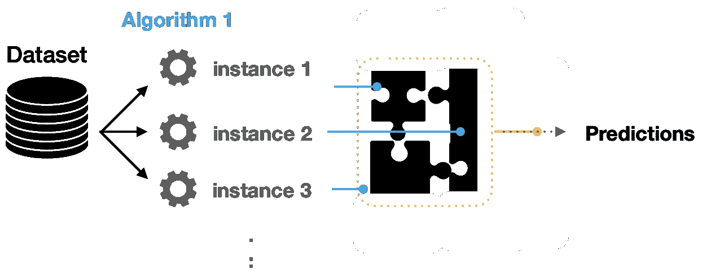

图 2:使用相同算法的多个弱学习器的聚合预测。

# 集成技术

## 制袋材料

bagging 的思想是基于使训练数据可用于迭代学习过程。每个模型使用训练数据集的稍微不同的子集来学习前一个模型产生的误差。装袋减少了差异，最大限度地减少了过度拟合。这种技术的一个例子是**随机森林**算法。

*   **自举:**装袋是基于自举抽样技术。引导通过替换创建多组原始训练数据。替换允许在集合中复制样本实例。每个子集具有相同的大小，并且可以用于并行训练模型。

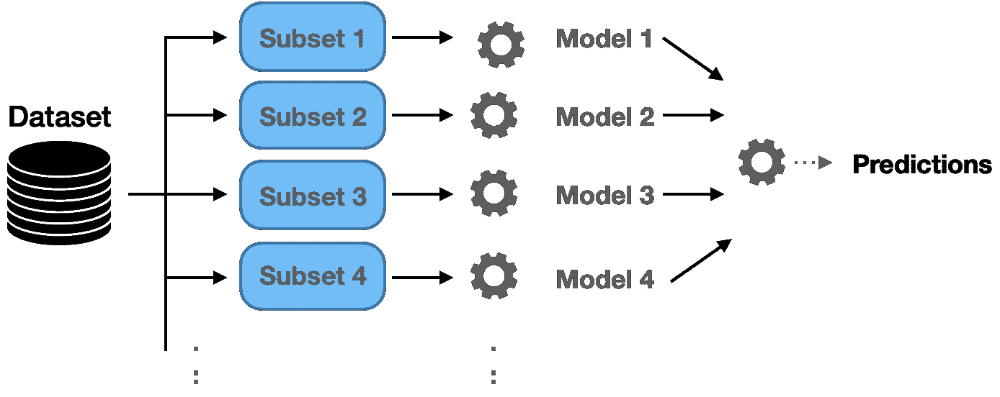

图 3:通过组合来自多个模型的预测进行最终预测的 Bagging 技术。

*   **随机森林:**使用训练样本子集以及特征子集来构建多个分裂树。构建多个决策树来适应每个训练集。样本/特征的分布通常以随机模式实现。
*   **额外树集成:**是另一种集成技术，其中来自许多决策树的预测被组合。类似于随机森林，它结合了大量的决策树。然而，额外树在随机选择分裂时使用整个样本。

## 助推

*   **自适应增强(AdaBoost):** 是一组算法，我们在几个弱学习器的基础上建立模型[1]。正如我们前面提到的，这些学习者被称为弱学习者，因为他们通常很简单，预测能力有限。AdaBoost 的自适应能力使该技术成为最早成功的二元分类器之一。**顺序**决策树是这种适应性的核心，其中每一棵树都基于精确度的先验知识来调整其权重。因此，我们以顺序而不是并行的过程来执行这种技术的训练。在这种技术中，训练和测量估计误差的过程可以重复给定的迭代次数，或者当误差率没有显著变化时。

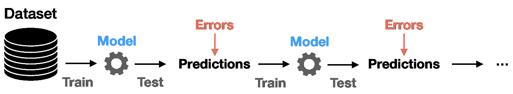

图 AdaBoost 的顺序学习产生更强的学习模型。

*   **梯度推进:**梯度推进算法是具有高预测性能的伟大技术。Xgboost [2]、LightGBM [3]和 CatBoost 是流行的提升算法，可用于回归和分类问题。在证明了他们有能力赢得一些卡格尔比赛后，他们的受欢迎程度显著增加。

## 堆垛

我们之前已经看到，组合模型可以使用聚合方法来实现(例如，投票选择分类或平均选择回归模型)。堆叠类似于助推模型；它们产生更强有力的预测。堆叠是学习如何从所有弱学习者的预测中创建这样一个更强的模型的过程。

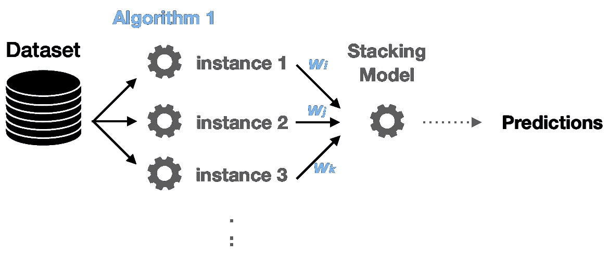

图 5:在集合架构中进行最终预测的堆叠技术。

请注意，这里学习的(作为特征)是来自每个模型的预测。

## 混合

非常类似于堆叠方法，除了最终模型正在学习验证和测试数据集以及预测。因此，所使用的特性被扩展到包括验证集。

## 分类问题

因为分类只是一个归类过程。如果我们有多个标签，我们需要决定:我们应该建立一个单一的多标签分类器吗？还是要建立多个二元分类器？如果我们决定建立一些二元分类器，我们需要解释每个模型的预测。例如，如果我们想要识别四个对象，每个模型都会告诉输入数据是否属于该类别。因此，每个模型都提供了一个隶属概率。类似地，我们可以结合这些分类器建立最终的集成模型。

## 回归问题

在前面的函数中，我们使用得到的概率来确定最佳拟合隶属度。在回归问题中，我们不处理是或否的问题。我们需要找到最佳的预测数值。我们可以对收集的预测进行平均。

## 汇总预测

当我们集成多种算法来调整预测过程以组合多种模型时，我们需要一种聚合方法。可以使用三种主要技术:

*   **最大投票:**该技术中的最终预测是基于对分类问题的多数投票做出的。
*   **平均:**通常用于对预测进行平均的回归问题。例如，在对最终分类进行平均时，也可以使用概率。
*   **加权平均:**有时候，在生成最终预测时，我们需要给一些模型/算法赋予权重。

# 例子

我们将使用下面的例子来说明如何建立一个集合模型。在这个例子中使用了泰坦尼克号的数据集，我们试图用不同的技术来预测泰坦尼克号的存活率。图 6 和图 7 显示了数据集样本和乘客年龄的目标列分布。

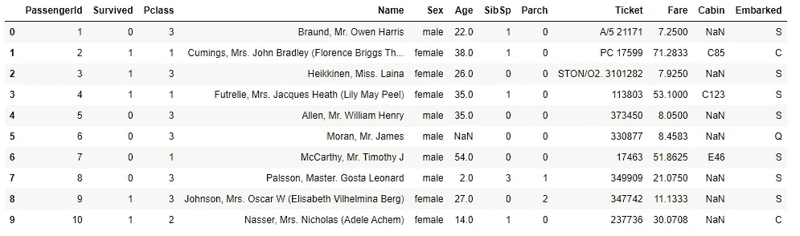

图 Titanic 数据集的一个示例，显示它由 12 列组成。

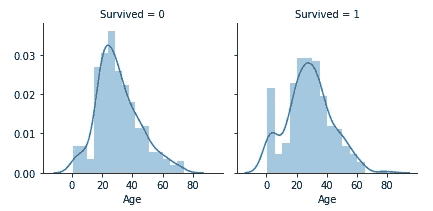

图 7:年龄列到目标的分布。

泰坦尼克号数据集是需要大量特征工程的分类问题之一。图 8 显示了 Parch(父母和子女)等一些特征与家庭规模之间的强相关性。我们将尝试仅关注模型构建以及如何将集合模型应用于此用例。

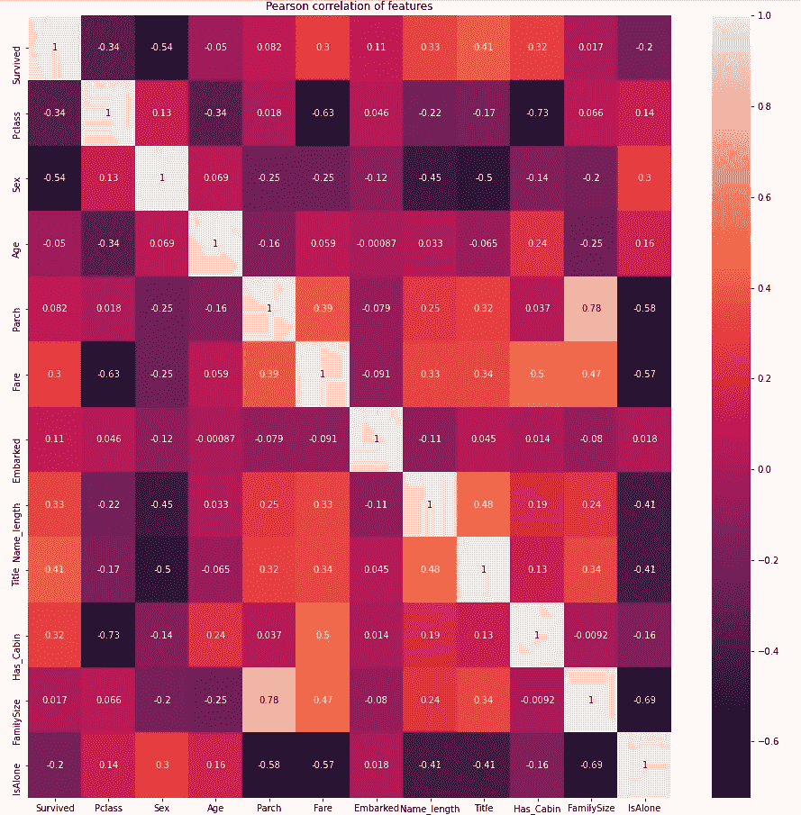

图 8:特性的相关矩阵图。数据集列。

我们将使用不同的算法和技术；因此，我们将创建一个模型对象来增加代码的可重用性。

```
# Model Class to be used for different ML algorithms
class ClassifierModel(object):
    def __init__(self, clf, params=None):
        self.clf = clf(**params)def train(self, x_train, y_train):
        self.clf.fit(x_train, y_train)

    def fit(self,x,y):
        return self.clf.fit(x,y)

    def feature_importances(self,x,y):
        return self.clf.fit(x,y).feature_importances_

    def predict(self, x):
        return self.clf.predict(x)def trainModel(model, x_train, y_train, x_test, n_folds, seed):
    cv = KFold(n_splits= n_folds, random_state=seed)
    scores = cross_val_score(model.clf, x_train, y_train, scoring='accuracy', cv=cv, n_jobs=-1)
    return scores
```

## 随机森林分类器

```
# Random Forest parameters
rf_params = {
    'n_estimators': 400,
    'max_depth': 5,
    'min_samples_leaf': 3,
    'max_features' : 'sqrt',
}
rfc_model = ClassifierModel(clf=RandomForestClassifier, params=rf_params)
rfc_scores = trainModel(rfc_model,x_train, y_train, x_test, 5, 0)
rfc_scores
```

## 额外树分类器

```
# Extra Trees Parameters
et_params = {
    'n_jobs': -1,
    'n_estimators':400,
    'max_depth': 5,
    'min_samples_leaf': 2,
}
etc_model = ClassifierModel(clf=ExtraTreesClassifier, params=et_params)
etc_scores = trainModel(etc_model,x_train, y_train, x_test, 5, 0) # Random Forest
etc_scores
```

## AdaBoost 分类器

```
# AdaBoost parameters
ada_params = {
    'n_estimators': 400,
    'learning_rate' : 0.65
}
ada_model = ClassifierModel(clf=AdaBoostClassifier, params=ada_params)
ada_scores = trainModel(ada_model,x_train, y_train, x_test, 5, 0) # Random Forest
ada_scores
```

## XGBoost 分类器

```
# Gradient Boosting parameters
gb_params = {
    'n_estimators': 400,
    'max_depth': 6,
}
gbc_model = ClassifierModel(clf=GradientBoostingClassifier, params=gb_params)
gbc_scores = trainModel(gbc_model,x_train, y_train, x_test, 5, 0) # Random Forest
gbc_scores
```

让我们将所有的模型交叉验证准确度合并在五个折叠上。

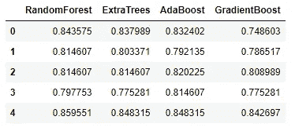

现在让我们建立一个堆叠模型，其中一个新的更强的模型从所有这些弱学习者那里学习预测。我们用于训练先前模型的标签向量将保持不变。这些特征是从每个分类器收集的预测。

```
x_train = np.column_stack(( etc_train_pred, rfc_train_pred, ada_train_pred, gbc_train_pred, svc_train_pred))
```

现在让我们来看看构建 XGBoost 模型只学习结果预测是否会执行得更好。但是，在此之前，我们将快速浏览一下分类器预测之间的相关性。

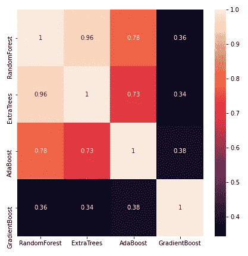

图 9:分类器投票标签之间的皮尔逊相关性。

我们现在将构建一个模型来组合来自多个起作用的分类器的预测。

```
def trainStackModel(x_train, y_train, x_test, n_folds, seed):
    cv = KFold(n_splits= n_folds, random_state=seed)
    gbm = xgb.XGBClassifier(
     n_estimators= 2000,
     max_depth= 4,
     min_child_weight= 2,
     gamma=0.9,                        
     subsample=0.8,
     colsample_bytree=0.8,
     objective= 'binary:logistic',
     scale_pos_weight=1).fit(x_train, y_train)

    scores = cross_val_score(gbm, x_train, y_train, scoring='accuracy', cv=cv)
    return scores
```

先前创建的基本分类器代表 0 级模型，而新的 XGBoost 模型代表 1 级模型。该组合说明了基于样本数据预测训练的元模型。新叠加模型与基础分类器的准确性之间的快速比较如下所示:

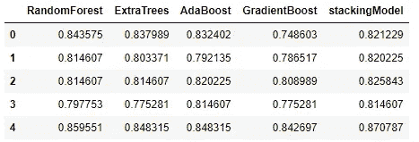

# 仔细的考虑

*   **噪声、偏差和方差:**来自多个模型的决策组合有助于提高整体性能。因此，使用集合模型的一个关键因素是克服这些问题:噪声、偏差和方差。如果集合模型在这种情况下不能提供集体经验来提高精确度，那么就需要对这种应用进行仔细的重新思考。
*   **简单和可解释:**机器学习模型，尤其是那些投入生产环境的模型，更倾向于简单而不是复杂。根据经验，解释最终模型决策的能力随着系综而降低。
*   **一般化**:有许多人声称集成模型具有更强的一般化能力，但是其他报告的用例显示了更多的一般化错误。因此，没有仔细训练过程的集成模型很可能很快产生高过拟合模型。
*   **推理时间:**虽然我们可以轻松接受更长的模型训练时间，但推理时间仍然很关键。将集合模型部署到生产中时，传递多个模型所需的时间会增加，并可能降低预测任务的吞吐量。

# 摘要

集成模型是一种很好的机器学习方法。集合模型有多种用于分类和回归问题的技术。我们已经发现了这种模型的类型，我们如何建立一个简单的集合模型，以及它们如何提高模型的准确性。代码的完整例子可以在[我的 Github](https://github.com/malhamid/Ensemble-Models) 上找到。

谢谢大家！

# 参考

[1] Yoav Freund 和 Robert E. Schapire。在线学习的决策理论概括及其在 boosting 中的应用。计算机和系统科学杂志，55(1):119–139，1997 年 8 月。

[2]陈、田琦和卡洛斯·盖斯特林。" Xgboost:一个可扩展的树增强系统."第 22 届 acm sigkdd 知识发现和数据挖掘国际会议论文集。2016.

[3]柯，，等.“Lightgbm:一种高效的梯度推进决策树”*神经信息处理系统进展*30(2017):3146–3154。