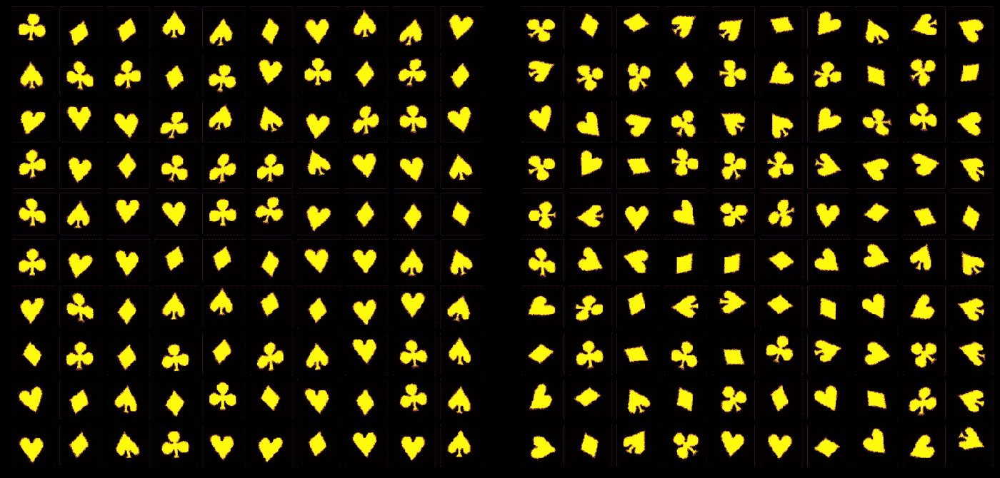
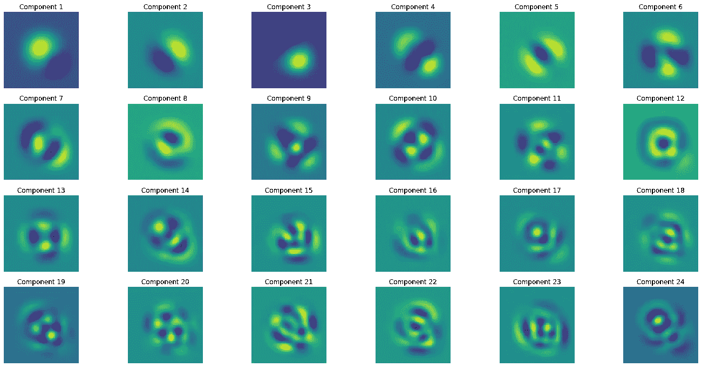
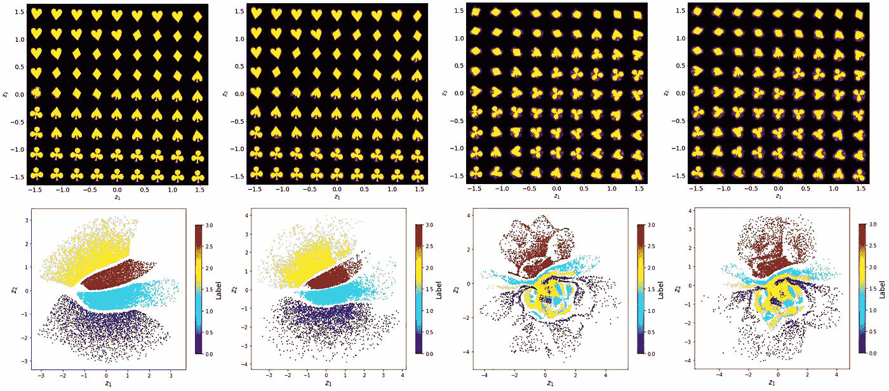
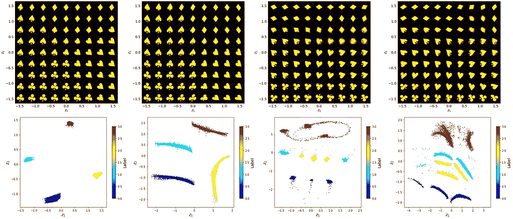
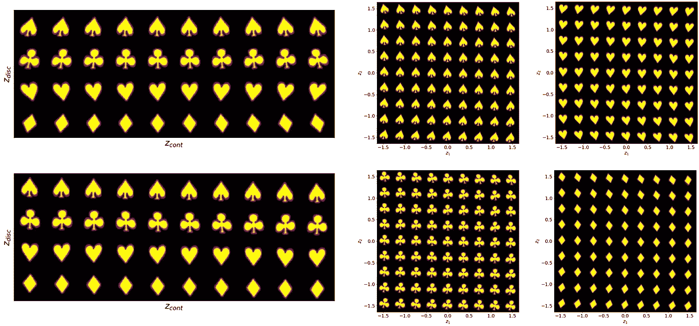
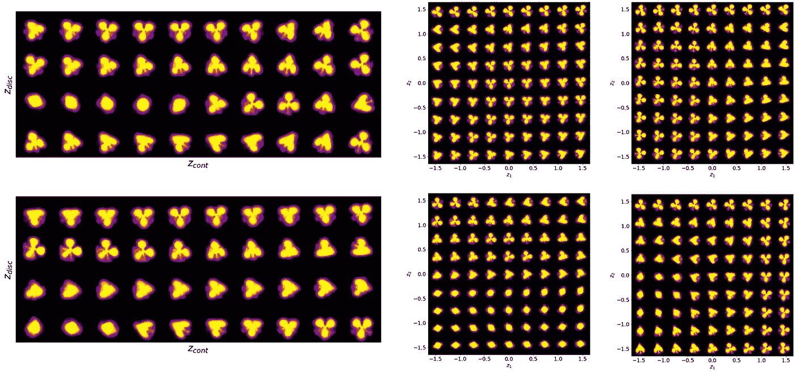
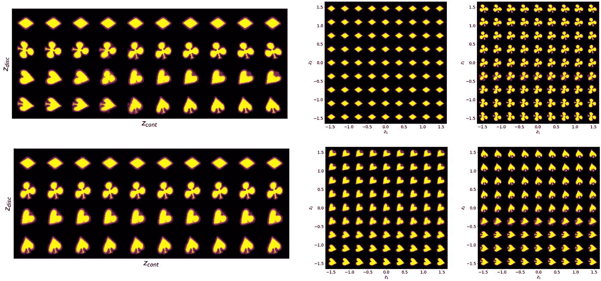
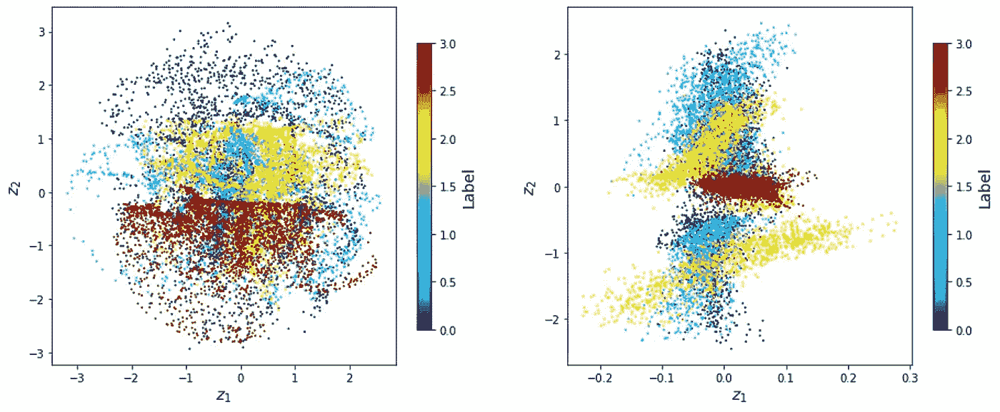
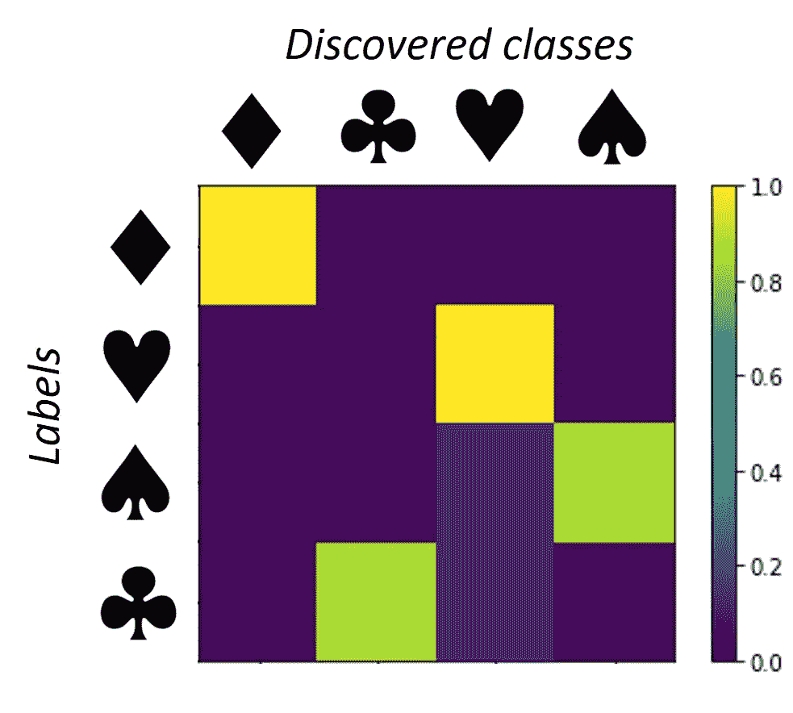

# 进入 j(r)VAE:划分，(旋转)，和排序…卡片

> 原文：<https://towardsdatascience.com/enter-the-j-r-vae-divide-rotate-and-order-the-cards-9d10c6633726?source=collection_archive---------22----------------------->

## [思想和理论](https://towardsdatascience.com/tagged/thoughts-and-theory)

## 引入联合(旋转不变)值，可以执行无监督分类，同时解开相关(连续)的变异因素。

*马克西姆·兹亚迪诺夫&谢尔盖·加里宁*

*美国田纳西州橡树岭橡树岭国家实验室纳米材料科学和计算科学与工程中心*

什么是联合(旋转不变)变分自动编码器，为什么我们需要它们？第一个问题的简短答案是， *j* ( *r* )VAE 是一种变分自动编码器，其中一个潜在变量是离散的，其余的是连续的。因此， *j* VAE 试图通过将数据与特定的离散类相关联来对数据进行聚类，并通过潜在变量来理清类内的数据表示。第二个问题的答案是，在实验世界中，我们经常不知道我们在处理什么，但非常想找到答案。

在他们的职业生涯中，这篇笔记的两位作者都专注于纳米和原子分辨率的成像和光谱学。M.Z .的职业生涯始于在日本东京工业大学进行扫描隧道显微镜和第一性原理计算，探索用氢和氧原子修饰的石墨烯的电子性质。在搬到橡树岭后，他逐渐过渡到数据分析和应用深度/机器学习(ML/DL)领域，他的第一篇 DL 论文专注于电子显微镜数据集的分析。[s . v . k .](https://en.wikipedia.org/wiki/Sergei_V._Kalinin)1996 年作为韩国 PosTech 的访问学生开始熟悉扫描探针显微镜，并从 1998 年作为 U. Penn 的研究生与 Dawn Bonnell 一起工作开始将显微镜作为职业。在 25 年里，他积累了扫描探针显微镜、电子显微镜和化学成像方面的专业知识。所有这些技术的共同点是它们能够产生大量数据，从多晶薄膜颗粒中的极化分布到高温超导体的电子结构，再到支撑量子计算 Kitaev 材料类物理学的结构扭曲。

作为经过培训和培养的显微镜专家，我们试图从这些数据中了解材料的物理和化学性质，或者寻求对材料结构和功能的定性理解(*“是否存在位错？我们看到点缺陷的证据了吗？”*)，或者通过细化定量的物理模型(*)极化在界面上如何表现？挠曲电张量的值是多少？”*)，或者通过发现新奇的现象(*嗯……这就怪了……*”)。然而，多年来，这种分析都是基于人类的分析和理解——花费无数的时间使用当时的可视化软件来寻找特定的对象，同时在分析软件中改变对比度、过滤、颜色方案。很明显，即使对于 2D 图像来说，这也不是最好的策略(尽管在宝丽来时代，这种策略甚至更糟糕)。对于现在电子和扫描探针显微镜中常见的多维光谱数据集，或图像堆栈，如电子显微镜中原子进化的电影，这是不可能的。

因此，问题是机器学习是否可以帮助我们发现数据中的“有趣”对象。如果我们确切地知道我们在寻找什么，即有标签，这就变成了一个经典的监督学习问题。作者在 2017 年率先将深度卷积神经网络(DCNN)用于电子显微镜图像中的原子发现，实现了对包含数百幅图像的海量数据集的分析，并创建了原子缺陷库，探索点缺陷反应等[1–3]。在这种情况下，ML 有效地执行了人工级别的任务，只是速度更快。

然而，在许多情况下，我们的目标是在我们的数据中寻找新的和不寻常的对象和行为。例如，我们可能希望找到形成无定形固体结构的组成构件。或者，我们试图了解高温超导体表面的电子密度模式是如何组织的，以及是否存在任何潜在的顺序。作为第三个例子，我们的目标是从原子晶格的图像中发现铁电畴结构。我们应该如何着手呢？

这种分析的一种可能策略是描述符工程和随后的无监督学习。我们将图像细分为多个子图像，并探索后者。在没有关于该系统的任何先验知识的情况下，可以在矩形网格上选取子图像，非常类似于在 DCNN 的输入卷积层中所做的。或者，它们可以以感兴趣的对象为中心，为分析提供推理偏差。对于原子级解析的数据，将描述符放在原子列的中心是很自然的，而对于铁电畴，我们可以将它们放在畴壁上。附带说明一下，位置编码的选择可能是一个非常有趣的领域。

有了描述符，我们可以寻找不同种类的原子结构(如发现“分子”)或寻找单个结构单元的应变状态。第一个任务是通过聚类完成的。使用合适的算法，无论是*k*-均值、高斯混合模型还是 UMAP，我们都试图将我们的描述符分成不同的组。第二个可以通过基于物理的分析来实现，如果我们确切地知道我们在寻找什么的话。有时我们会这样做——然而，无论你要找的东西在不在那里，找到它总是有风险的，而且会错过新奇的发现。因此，我们希望使用无监督的 ML 来找到数据中的相关特征，这正是变分自动编码器能够解开数据表示并找到数据中的*先验*未知可变性因素的地方。

然而，通常我们需要同时做这两件事！例如，在观察 STEM 中的原子运动时，我们可以观察到结构单元，如理想石墨烯的 5 元环、6 元环和 7 元环以及缺陷，还可以观察到它们在应变下的变形。同样，我们可以在铁电材料中看到美丽的畴结构，人脑会自然地将它们分成不同的类型，并阐明每种类型内的变形。VAEs 能做到吗？

当然，一种方法是在一个潜在空间中编码全部数据集。在这种情况下，每个编码对象对应于一个单独的潜在向量，我们可以简单地对潜在空间中的点进行聚类。然而，在这种情况下，数据的表示(理解为数据集内相关特征的平滑变化)将不会很好地被解开。从某种意义上说，阶级之间的差异主导了这一过程。比较简单的( *r* )VAE 和条件的( *r* )VAE 从我们的[上一篇文章](https://ziatdinovmax.medium.com/how-we-learnt-to-love-the-rotationally-invariant-variational-autoencoders-rvae-and-almost-562aa164c59f)中得到的理清的数据——显然，当类已知时，我们可以更深入地挖掘数据结构，特征在整个潜在空间(而不是分段)变得一致。

那么，我们如何继续呢？一种方法是将其中一个潜在方向离散化，这种方法我们称之为 *j* VAE(关节用 *j* )。在这种情况下，在训练期间，自动编码器既将离散类分配给变量，又找到最佳连续潜在代码，即同时执行分类和解开相关变量。

然而，这并不简单，因为离散(分类)潜在变量不能通过样本反向传播。一种解决方案是用来自 Gumbel-Softmax 分布的可微分样本替换来自分类分布的不可微分样本[4，5]。另一个解决方案是通过完全枚举边缘化离散的潜在变量。这种方法通常与高计算成本相关，尽管最近可用的概率编程库如 Pyro 通过启用[并行枚举](https://pyro.ai/examples/enumeration.html)使这项任务变得更容易。我们对这两种方法都进行了实验，发现它们通常在我们的数据集上产生相似的结果。对于本文，我们利用了基于 Gumbel-Softmax 技巧的方法。

现在，让我们看看例子。我们不使用标准的 MNIST 数据集，而是制作我们自己的扑克牌套装数据集，包括单色梅花、黑桃、方块和红心。我们推测，来自 GalaxyZoo 的星系图像，一些生物物体(细菌，硅藻，病毒)都可以是一个很好的探索主题——无论是从美学还是科学的角度。然而，卡片提供了一个理想的玩具模型。在这里，钻石的形状与其他三只手截然不同。它们旋转 90 度相当于单轴压缩和调整大小，给可能的仿射变换的结果带来了有趣的退化。类似地，红桃和黑桃在相当小的细节上有所不同，而黑桃和梅花(没有尾巴)分别有三重对称和镜像对称。因此，尽管简单，牌套形成了一个有趣的符号集合。

*具有不同仿射变换的卡片集合的典型对象。在左边(a = 12，t = 0.1，s = 10)，在右边(a = 120，t = 0.1，s = 10)。作者提供的图片。*

首先，我们创建一个具有不同参数的纸牌符号生成器。我们从 Word 中的数字化符号开始，将其转换为图像，然后使用一组仿射变换(包括旋转、剪切和平移)来准备我们的数据集。这里，角度从- *a* 到 *a* 均匀分布，平移从- *t* 到 *t* 均匀分布，剪切从- *s* 到 *s* 均匀分布。上面显示了这个数据集的两个实现的例子。换句话说，这里我们有多个定义明确的对象类，它们有几个连续的特征(大小和位置)。现在，让我们假设我们，就像约翰·斯诺一样，对这些物体一无所知，看看机器学习是否能帮助理清这里发生的事情！

*cards 数据集上的主成分分析。作者提供的图片。*

正如我们在[之前的博文](https://ziatdinovmax.medium.com/how-we-learnt-to-love-the-rotationally-invariant-variational-autoencoders-rvae-and-almost-562aa164c59f)中指出的，最近我们几乎停止了主成分分析。在这个数据集上运行快速 PCA 说明了为什么——PCA 组件非常复杂，而且数量很多。对于足够大的数据集，将有与图像中的像素数量一样多的有效分量。所以，不是很有用。

我们可以运行前一篇文章中的代码，快速查看这个数据集上的 VAE 分析。下面显示的是相应的潜在空间和潜在表示。

*VAE 对 t = 0.1 和不同方向和剪切强度的卡片数据集进行分析。从左到右(a = 12，s = 1)，(a = 12，s = 10)，(a = 120，s = 1)，(a = 120，s = 10)。选择颜色方案来代表手。作者提供的图片。*

对于小的旋转无序( *a* = 12)，潜在空间清楚地形成对应于每只手的分离良好的簇，旋转角度和剪切分量在潜在空间的对应部分内平滑地变化。同时，对于大的 *a* = 120，在潜在空间的分布变得非常复杂。我们把这种行为归因于这样一个事实，即由于单位圆(SO(2)李群)不能在曲面上很好地表示，潜在空间表示应该包含包含物体的非物理形状的“cowlick”缺陷。鉴于我们有几个结构，VAE 试图通过角度来确定物体的方向，并根据形状和大小将它们分开，从而形成一个非常复杂的结构。

*对 t = 0.1 和不同方向和剪切强度的卡片数据集进行 rVAE 分析。从左到右(a = 12，s = 1)，(a = 12，s = 10)，(a = 120，s = 1)，(a = 120，s = 10)。选择颜色方案来代表手。作者提供的图片。*

相比之下，上面显示的是对相同数据的 *r* VAE 分析。在这种情况下，通过构建潜在向量，旋转角被分离为独立变量。出现的行为真的很了不起。对于小角度和剪切无序， *a* = 12， *s* = 1，指针在系统的潜在空间中形成四个非常明显的组。如果剪切无序度增加， *a* = 12， *s* = 10，这些团簇拉长，在潜空间形成清晰可见的 1D 流形。当我们增加方向无序度， *a* = 120 时，我们开始看到每手牌有一个以上的群集，例如，有一个群集对应于旋转 120 度的梅花和黑桃的两个方向。换句话说，具有所选先验的 *r* VAE 可以补偿旋转角度的小偏差，但是倾向于发现退化的最小值。作为理解这种行为的一个简单练习，考虑球杆图像围绕中心轴旋转时它们之间的结构相似性(或相关性)。相关性在 120 度和 240 度时有明显的最小值，在这两个角度，主叶重叠，只有小尾巴的位置不同。这里，对于小的剪切变形， *s* = 1，我们有对应于手的旋转变量的明确定义的簇，对于大的剪切变形， *s* = 10，它们再次变成伸长的流形。请注意，在某种意义上，我们已经解开了数据的表示，在这种情况下是剪切。此外，比较钻石和非钻石的流形形状是很奇怪的，前者更细长，更扩散，这完全是因为存在相当于 90 度旋转的仿射变换！

*jVAE 分析为 a = 12，t = 0.1，s = 10。作者提供的图片。*

现在，进入 *j* VAE。欢迎您在附带的笔记本中使用不同的模型参数，这里我们将只显示两个示例的值。对于小的无序， *a* = 12 和 *s* = 10，简单的 *j* VAE(没有旋转潜变量)以无人监督的方式出色地分离了对象。请注意，第一次潜在流形遍历如何捕获关于取向无序(+剪切变形)的信息，而第二次潜在流形遍历如何捕获偏心位移(+剪切变形)。

*jVAE 分析为 a = 120，t = 0.1，s = 10。作者提供的图片。*

对于大混乱来说，简单的 *j* VAE 无法将阶层分开。从上图可以看出，每个推断出的“类别”都包含方块、黑桃、梅花和红心。我们注意到，不同于( *r* )VAE， *j* ( *r* )VAE 倾向于对模型参数的初始化相当敏感(即，解码器和编码器神经网络中的权重的初始化以及训练集的洗牌)，尽管在定性水平上结果基本上保持不变。在笔记本中随意试验不同的种子，看看它们对结果有什么影响。

*jrVAE 分析为 a = 120，t = 0.1，s = 10。作者提供的图片。*

相比之下， *jr* VAE 具有三个“特殊的”连续潜变量，用于吸收旋转和平移无序，对相同的无序参数显示出更好的分离。在这里，梅花和方块都有自己的潜在空间，而红桃和黑桃共享另一个潜在空间(这里我们要补充的是，简单地给 *j* VAE 增加三个(或更多)标准连续潜在变量不会解决它无法对大混乱进行分类的问题)。

*编码后的潜在空间为 jVAE(左)和 jrVAE(右)为 a = 120，t = 0.1，s = 10。作者提供的图片。*

最后，让我们看看我们的 *jr* VAE 类与原始类的对应程度。请注意，推断类的顺序是随机的(取决于初始化)，并不对应于基本事实标签的顺序。我们可以看到，总的来说，在没有任何监督的情况下，它在区分不同类别方面做得相当出色。

*当 a = 120，t = 0.1，s = 10 时，jrVAE 的相关矩阵(推断值与实际值之比)。图片由作者提供。*

请注意，性能可以进一步微调；然而，在这种情况下，我们将把它调向这个特定系统的“已知”答案，而未知系统是未知的。

以上总结了 *j* VAE 和 *jr* VAE 的介绍。请随意使用笔记本，并将其应用到您的数据集中。作者在他们对扫描探针和电子显微镜中的原子分辨和介观成像的研究中使用了 VAE 及其扩展，但这些方法可以应用于更广泛的光学、化学和其他成像，以及跨其他计算机科学领域。还请查看我们的 [AtomAI](https://github.com/pycroscopy/atomai) 软件包，用于将该工具和其他深度/机器学习工具应用于科学成像。

最后，在科学界，我们感谢资助这项研究的赞助商。这项工作在橡树岭国家实验室纳米材料科学中心(CNMS)进行并得到支持，该中心是美国能源部科学用户设施办公室。您可以使用[此链接](https://my.matterport.com/show/?m=MT819FqAwbT)进行虚拟漫游，如果您想了解更多，请告诉我们。

可执行的 Google Colab 笔记本在[这里](https://colab.research.google.com/github/ziatdinovmax/atomai/blob/master/examples/notebooks/Cards_jrVAE_v2a.ipynb)有

**参考文献**

1.齐亚特迪诺夫，m；戴克，o；马克索夫，a。李，谢峰；三，X. H 肖；联合国科特迪瓦行动；瓦苏代万河；杰西；原子分辨扫描透射电子显微镜图像的深度学习:化学识别和跟踪局部转换。ACS Nano 2017，11 (12)，12742–12752。

2.马克索夫，a。戴克，o；王；肖；Geohegan 博士；萨姆普特；瓦苏德万；杰西；加里宁公司；Ziatdinov，m,《WS2 中电子束诱导转变过程中缺陷和相位演化的深度学习分析》。npj 计算。脱线。2019, 5, 12.

3.齐亚特迪诺夫，m；戴克，o；李；萨姆普特；杰西；瓦苏德万；构建和探索石墨烯中的原子缺陷库:扫描透射电子和扫描隧道显微镜研究。Sci。Adv. 2019，5 (9)，eaaw8989。

4.张；顾；使用 Gumbel-Softmax 进行分类重新参数化。arXiv 预印本 arXiv:1611.01144 2016。

5.杜邦，e，学习解开连续和离散的表现。arXiv 预印本 arXiv:1804.00104。