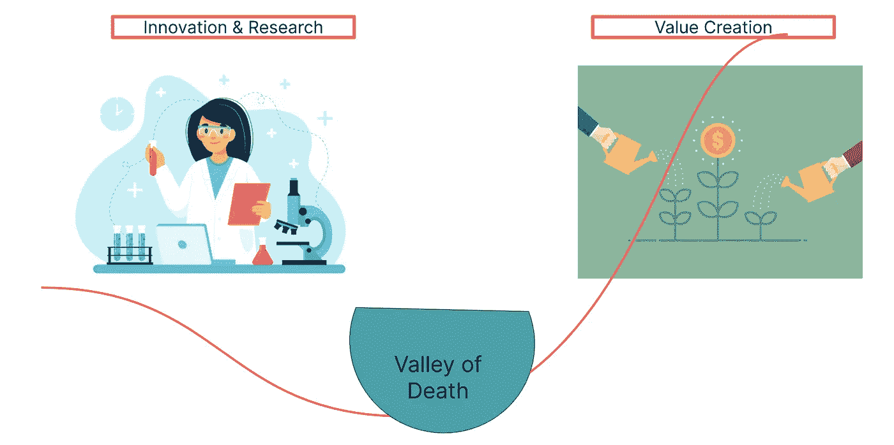
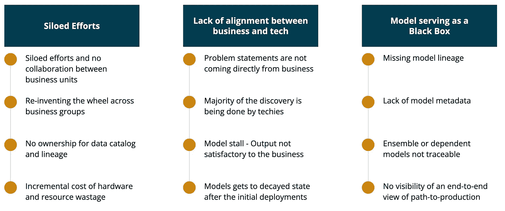
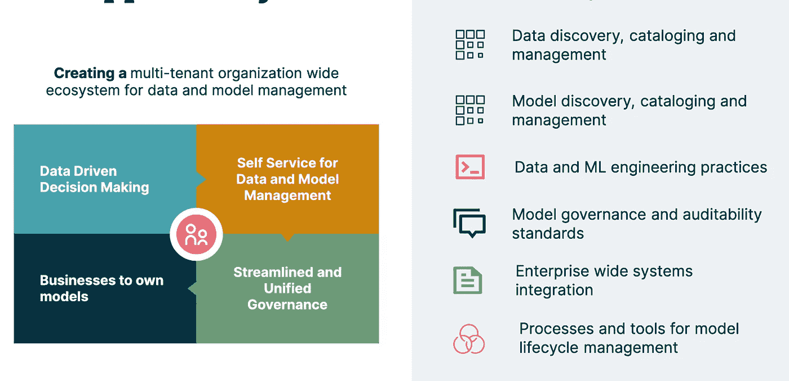
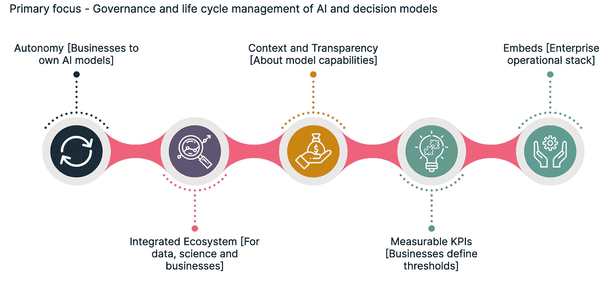
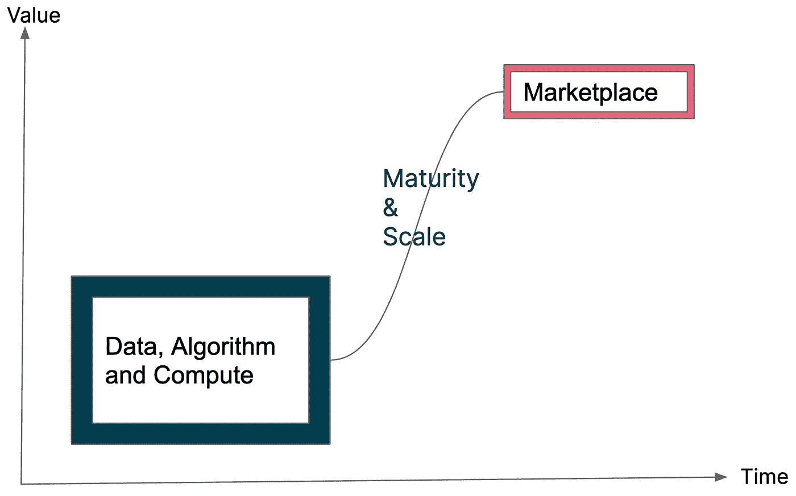
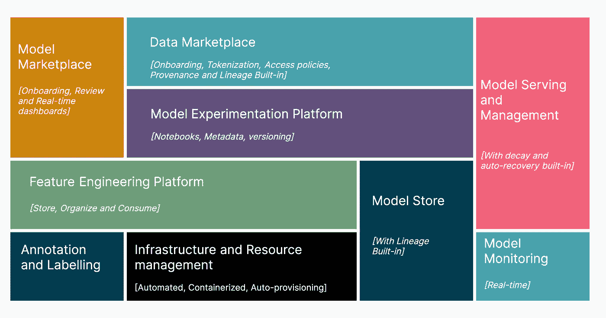
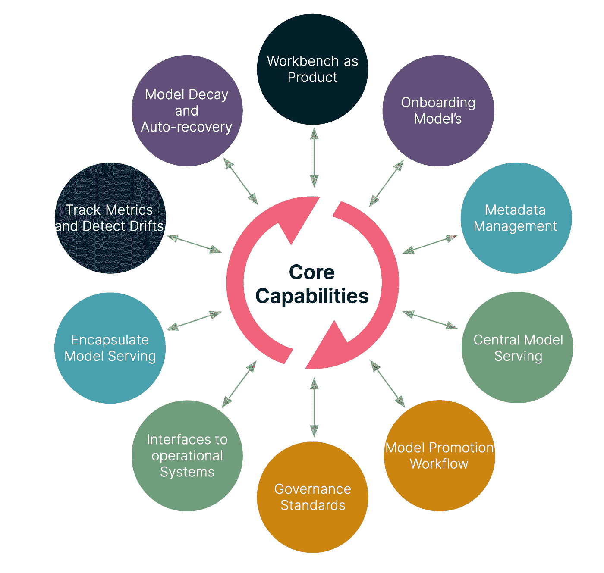

# 具有市场的企业数据科学工作台——使人工智能民主化的生态系统

> 原文：<https://towardsdatascience.com/enterprise-data-science-workbench-with-marketplace-ecosystem-to-democratize-ai-5072db7ce8d3?source=collection_archive---------31----------------------->

# 介绍

[Gartner 表示，到 2025 年，](https://blogs.gartner.com/andrew_white/2021/01/12/our-top-data-and-analytics-predicts-for-2021/) 80%的数据和分析治理计划将被视为重要的业务能力，它们关注的是业务成果，而不是数据标准。问题是，“**企业应该参与人工智能系统的端到端生命周期和决策过程**”。几乎每个企业都有针对其数据科学团队的流程，这些流程专注于教授计算机并做出预测，通常比人类更快、更准确。在将这些**预测应用于商业的过程中，他们意识到跑道还没有准备好起飞**。

让人工智能接近中小企业的最佳方式是让人工智能民主化。这直接将人工智能工具行业置于一个更好的位置，所有年轻玩家都在争夺市场空间。随着思维模式转向“**利用人工智能创造价值，展示更成熟、更具规模的人工智能产品平台”**，企业正在将大量预算投向人工智能运营工具集。

AI 的虚空是“用 AI 创造价值”[图片由作者提供]

informatica 的研究还显示，数据科学团队花费近四分之三的时间来构建和维护人工智能服务。在过去的几年里，这个领域已经被行业巨头如谷歌、苹果、IBM、AWS、优步、脸书和其他引入统一平台的企业产品的技术创新所开发。现在的主张是，数据科学团队应该能够花更多的时间来构建结构和决策模型。这个创新的时代带来了关于数据平台、模型培训和开发、人工智能模型的生产和服务的专门平台和工具。

根据 [Gartner 的预测，到 2024 年](https://blogs.gartner.com/andrew_white/2021/01/12/our-top-data-and-analytics-predicts-for-2021/)，70%的企业将使用云和基于云的人工智能基础设施来运营人工智能，从而大大缓解对集成和升级的担忧。工具集可用性的这种峰值增长带来了关于工具集的企业可见性、资源的优化使用、模型人工制品的重新发明、业务流程的不一致性的挑战，因此仍然使业务远离数据科学团队。以下是面临的三大挑战:

企业对人工智能运营的挑战[图片由作者提供]

# 机会

企业面临的机遇是**“创建一个多租户组织范围的生态系统来运营人工智能”**。数据科学是一项团队运动，企业中包括业务、分析、科学、工程和运营在内的所有团队都需要在方向上保持一致，以展示商业价值。业务度量应该评估模型的适用性，并且应该支持持续的监控。现有信息的可发现性超越了孤立团队的界限。为了长期的可维护性和成本节约，在任何人工智能工具投资之前，需要将现有的企业范围的系统结合起来。

“民主化”是领导人谈论 AI 和 AI 对每个人的价值时的关键目标之一。民主化为在产品线中嵌入智能、标准化和可重用性带来了最小的障碍，增加了企业中所有团队对人工智能的采用，从而提高了管理端到端人工智能工作流的能力。

有鉴于此，企业特意**放弃“筒仓”，因为它是人工智能驱动的增长的敌人。**

运营人工智能的机会[图片由作者提供]

# 基础触角—数据、人员、流程、产品和平台(D4P)

企业学习表明，要创建一个全组织的生态系统，没有**“没有放之四海而皆准的尺寸”**。生态系统需要缝合、粘合和扩展，以建立一个标准化和合规的平台来运行生产就绪的人工智能用例。对于企业来说，这个生态系统的基本触角包括数据、人员、流程、产品和平台[D4P]。为了说明这一点，我们以“新客户注册期间的欺诈检测”的工作流程为例，该流程包括

*   **【数据】**与数百万条记录相比，在几秒钟内检测重复项
*   **【人员】**操作员需要接受欺诈检测等智能功能的培训
*   **【流程】**与注册后检测相比，业务工作流程需要进行更改，以包括实时欺诈检测
*   **【产品】**新客户注册屏幕需要增强以嵌入人工智能
*   **【平台】**需要托管的人工智能服务需要共存于现有产品基础设施中，遵守系统性能 SLA

因此，这个生态系统的基础需要与“D4P”协同构建。设计和产品思维仍然是帮助构建支持业务、技术和运营需求的生态系统的基础层。

# 核心原则

现在，人工智能的时代正被算法提供的价值所引领。对于企业来说，分析和算法被编织到公司的业务结构中，因此要求业务以不同的方式运作，主要关注人工智能的治理和生命周期管理。因此，以下是定义该生态系统特征的核心原则。

核心原则—数据科学工作台和市场[图片由作者提供]

“人工智能的价值”的定义是增强人类决策和互动，而不是专注于自动化。这种思维过程为企业提供了拥有分析和算法的完全自主权。企业与数据、科学和工程团队一起定义增强需求。数据和模型定义由企业确定的可测量的 KPI 控制。工程和 IT 团队正在应对产品和基础设施需求的变化，从而实现人工智能与企业产品套件的无缝集成。

# 积木

“自助服务”是这个生态系统中应该同样适用的基本特征。为了补充这一特点，行业领导者和技术供应商都发布了拖放，无代码人工智能工具，以将预测集成到应用程序中。因此，出现的警示故事是偏见、可发现性和可解释性问题的受害者。自助服务的时间价值如下图所示:

企业人工智能市场的价值[图片由作者提供]

这里的策略是建立一个具有市场的工作台，从而使中小企业、工程和科学成为人工智能专家。数据科学工作台的构建模块将考虑可发现性、自助服务、标准化和整体治理。通过内置的访问、消费、治理和所有权，整体块结构如下图所示:

数据科学工作台和市场的构建模块[图片由作者提供]

# 构建工作台的方法和策略

我们之前讨论过，人工智能工具和库市场每天都充斥着技术供应商推出的新产品。通常，当有多余的选项可用时，团队会兴奋地引入他们选择的工具来满足他们的需求。我认为这种方法是将最好的工具集引入组织的一个很好的策略。现在有了更多的工具集，随着时间的推移，围绕可见性和可维护性的其他挑战也随之而来。“一个集中的工作台和市场解决了许多这样的挑战，并由一个由 CDO、首席信息官、首席技术官和人工智能官组成的中央管理机构来管理。”

工作台的基本元素是构建一个通信层，在这些不同的工具集之间交换信息，因此团队仍然可以自主地使用适合他们需求的工具/库。市场的概念，提供了提出任何想法的机会，从而提供了管理端到端生命周期的能力，包括数据、建模、指标跟踪和模型管理。创建工作流的能力提供了为数据/模型设计端到端流程的灵活性，同时考虑了模型管理和所有权的访问策略、数据令牌化、业务审批、指标和阈值。受开放式座舱设计启发的仪表板提供了高可视性和微调控制，所有相关角色都可以操作。这是核心能力，

核心能力—带有市场的数据科学工作台[图片由作者提供]

# 结论

组织将需要大量定制的解决方案来解决一系列不同的人工智能用例。在大多数企业中，很快就可以获得初始启动投资来构建最初的几个模型，但随着时间的推移，人们的期望是构建一个“引导”工具包和一个面向未来的中央统一平台。带有 marketplace 产品的工作台将是“ [**以数据为中心的人工智能开发**](https://hbr.org/2021/07/ai-doesnt-have-to-be-too-complicated-or-expensive-for-your-business) **的关键使能器，与数据数量相比，它更关注具有全面数据质量的商业价值“**。有了 workbench，灵活的模型开发和测试环境将可以通过有限的访问机制进行访问，从而实现人工智能增强方面的创新。

Butterfield 指出，长期的成功取决于协作的灵活性、跨学科、跨部门、数据的完整性、风险评估的准确性和多模式方式。"**work bench with market platforms "**，帮助建立拥有与科学、工程和运营部门合作的人工智能开发的企业文化。机器学习 PaaS 解决方案将成为焦点，并仍然是企业采用人工智能的关键推动因素。