# 使用 Google Dialogflow 和 Flutter 的企业级多平台聊天机器人(第二部分)

> 原文：<https://towardsdatascience.com/enterprise-grade-multi-platform-virtual-assistant-with-google-dialogflow-and-flutter-part-ii-343327236d8f?source=collection_archive---------34----------------------->

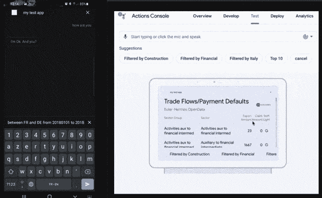

*作者图片*

参见第一部分[这里](https://osy-46577.medium.com/enterprise-grade-multi-platform-virtual-assistant-with-google-dialogflow-flutter-part-i-da6f05edfed?source=friends_link&sk=21e49f458b3a6aa6f13aa18bb1643b4f)

# 1)第一部分概述

第一篇文章描述了如何配置我们的第一个 Dialogflow 代理意图来管理一个简单的对话，其目标是提供两国之间的贸易额。用户可以用不同的方式提出问题，只需要几个训练短语，这些短语包含带有参数的硬编码文本答案，并且还提醒用户所请求的参数。

这篇文章和接下来的文章将更进一步，让你一步一步地构建一个连接到开放数据 Euler Hermes API 的真正的聊天机器人。因为它们技术性更强，所以需要一些编程知识。

# 2)履行

*实现*是在满足某些条件时由 Dialogflow 执行的步骤。这意味着用户提出的问题可以被 Dialogflow 引擎理解，并且用户已经提供了所有请求的参数。然后执行一个代码。它可以是一个 URL，指向你自己用 NodeJS、Java 编写的 Web 服务。NET 或内置 Dialogflow 代码编辑器中的 NodeJS 代码。

**2.1。启用 Webhook**


*作者图片*

首先要做的是激活 Fulfillment Webhook 按钮。

1.  点击左侧的*意图*菜单
2.  选择您之前在第一部分中创建的意向(名为*“生态出口与索赔”)*
3.  滚动到屏幕底部，然后激活按钮'*为此目的启用 Webhook 调用'*
4.  点击顶部的*保存*按钮

**2.2。Webhook 内嵌编辑器**

有两种不同的方式来执行由实现触发的您自己的代码:

1.  **WebService/API** :如果 *Webhook* 切换按钮被启用，您可以添加您的 web 服务 URL，它将接收来自 Dialogflow 的 POST 请求，以响应意图匹配的用户查询的形式。API 可以用不同的语言编写(NodeJS、Java、.网)
2.  使用 **Webhook 内嵌编辑器**允许您通过云函数(NodeJS)在 Dialogflow 中直接构建和管理履行。

在本文中，我们将使用 **Webhook 内嵌编辑器**来更好地理解和更容易地部署代理。

**2.3。使用 Google Assistant 和 NodeJS 代码的基本实现**

这里有一个基本履行代码的例子，它将允许您与 Google Assistant 集成，并在满足履行时显示一个简单的数据表。

首先，点击左侧的*意图*菜单，然后执行以下操作:

1.  创建一个新的意图，并将其命名为'*测试'*
2.  点击新创建的'*测试*意图
3.  只添加一个训练短语: *testxxx*
4.  在“测试”意图/部分“*实现*”的页面底部:启用切换按钮“*为此意图启用 Webhook 调用*

然后，点击*完成*菜单，并在内嵌编辑器中添加以下样本。该部分将负责创建一个包含一些项目的简单表格:

```
...

  // 
  //  >>> Sample for Test Google Assistant Handler 
  //  with testxxx keyword
  // 
  function testGoogleAssistantHandler(agent) {

    // Google Assistant Connection
    if (agent.requestSource === 'ACTIONS_ON_GOOGLE') {
      let conv = agent.conv(); 

      conv.ask('This is a simple table example for Google Assistant.');
      conv.ask(new Table({
        dividers: true,
        columns: ['header 1', 'header 2', 'header 3'],
        rows: [
          ['row 1 item 1', 'row 1 item 2', 'row 1 item 3'],
          ['row 2 item 1', 'row 2 item 2', 'row 2 item 3'],
        ],
      }));
	  console.log("===> JSON : " + conv.json); 
      agent.add(conv); 

	}

  }

...
```

现在，点击*集成*菜单，然后执行以下操作:

1.  点击*谷歌助手*整合链接
2.  显示一个弹出窗口，点击*测试*链接
3.  将显示一个谷歌助手模拟器

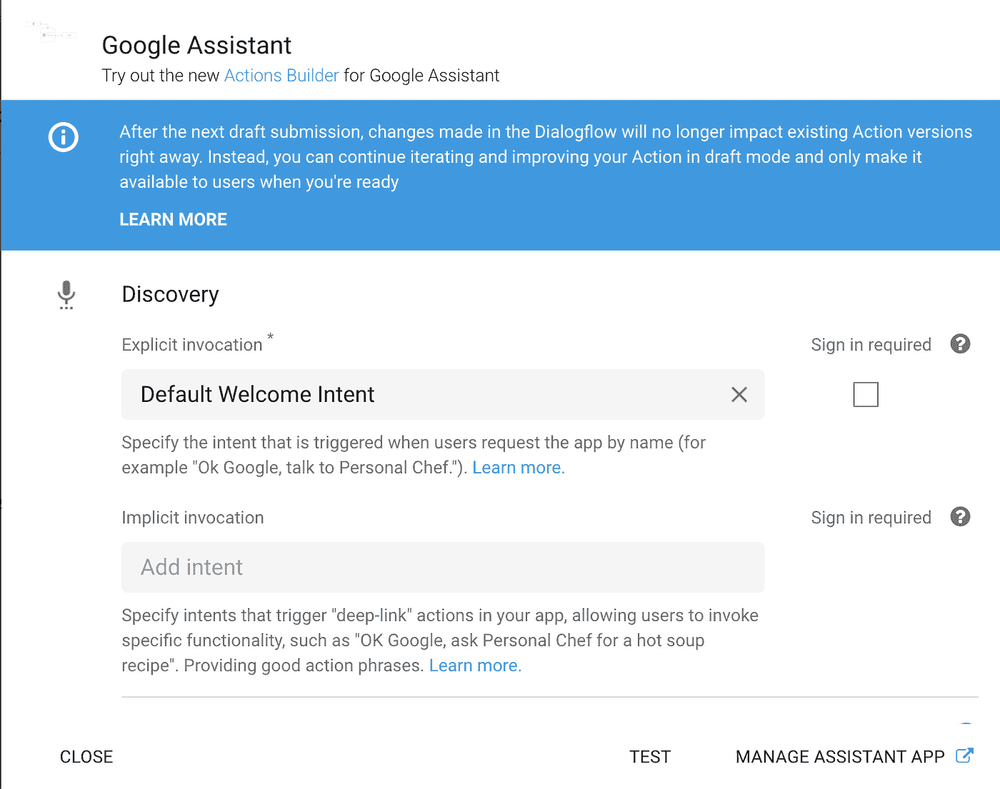

*作者图片*

现在你应该可以看到*谷歌助手*的*动作控制台*了。

1.  首先键入'*与我的测试应用程序*对话'以启动您的代理(或点击同名的建议按钮)
2.  键入以下内容:' *testxxx* '

您应该会看到以下结果:

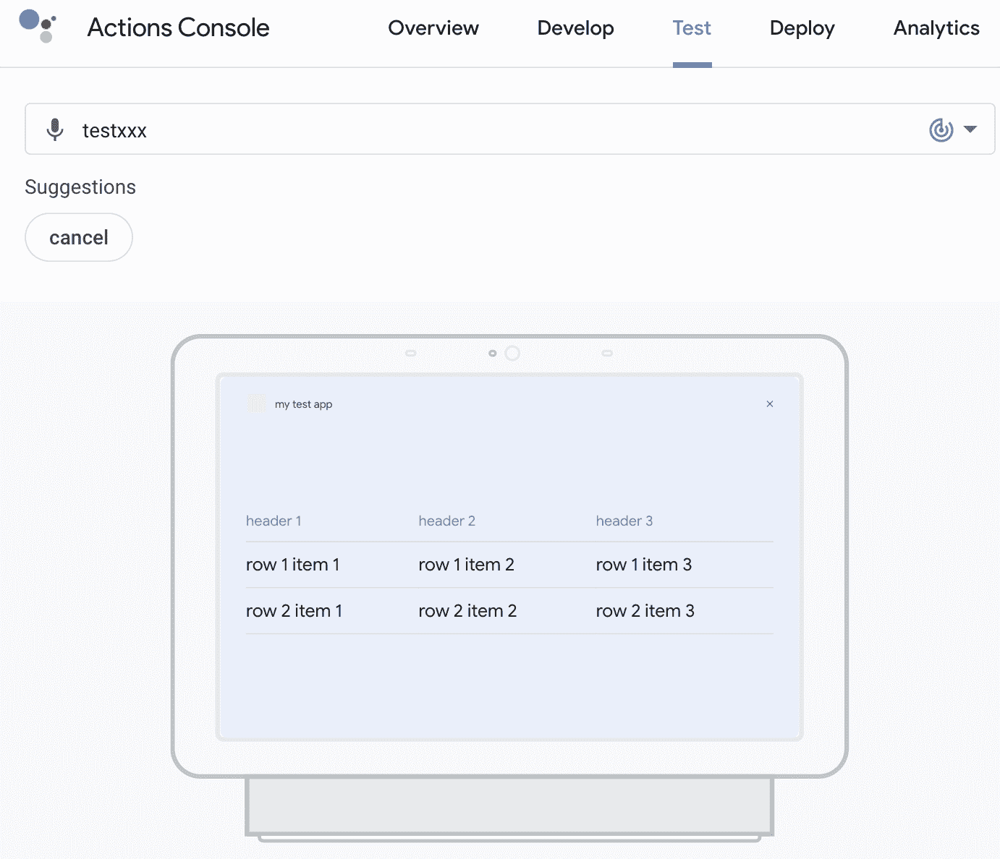

*作者图片*

请注意，您应该在移动应用程序上看到相同的内容。接下来的部分将描述如何为移动设备设置谷歌助手:


*作者图片*

现在你知道我在读' *Le Point* '和' *Le Figaro* '但不仅仅是；)

**2.4。Euler Hermes OpenData API 的使用**

正如在第一部分的文章中所解释的，我们的目标是在两个国家之间进行贸易往来。

在这个对话流中注入了几个基本参数:

*   原始出口国
*   目的地进口国
*   日期范围(从/到)
*   可选:筛选列表所依据的简短文本
*   可选:列表中显示的最大行数

API 结果由以下元素组成:

*   导出组类别
*   出口类别
*   出口金额
*   索赔金额
*   交通灯(红色、橙色、绿色)

下面是我们管理 Euler Hermes API 的通用 NodeJS*gettradeflow*函数。

基本上，参数是从用户对话中注入的。然后调用 API。结果被发送回另一个调用者函数，该函数将负责每个不同目标平台(Web、Google Assistant 或原生移动应用程序)的数据呈现。

```
 // .
  // Call Euler Hermes Web Service and get the data
  // .
  function getTradeFlows (countryCodeExport, countryCodeImport, periodFrom, periodTo, filter, topNN) {
      return new Promise((resolve, reject) => {

        console.log('In Function Get Trade Flows');

        console.log("Country Export: " + countryCodeExport);
        console.log("Country Import: " + countryCodeImport);
        console.log("Period From: " + periodFrom);
        console.log("Period To: " + periodTo);
        console.log("filter: " + filter);
        console.log("TopNN: " + topNN);

        var defaultTopNN = 50;

        // Convert dates into ISO String
        var isoDateFrom = new Date(periodFrom).toISOString().substring(0, 10);
        var isoDateTo = new Date(periodTo).toISOString().substring(0, 10);

        var pathString = "/api/v2/catalog/datasets/exports-vs-claims/aggregates?" + 
           "select=dec_tp_nace_grp_name, buyer_nace_name, sum(exp_eur), sum(clm_eur), traffic_light" +
           "&group_by=dec_tp_nace_grp_name, buyer_nace_name, traffic_light" + 
           "&where=period IN ['" + isoDateFrom + "'..'" + isoDateTo + "']";

        if (countryCodeExport != "") {   
            pathString+= " AND ins_ctry = '" + countryCodeExport + "'";
        }
        if (countryCodeImport != "") {   
            pathString+= " AND buy_ctry = '" + countryCodeImport + "'";
        }
        if (filter != "") {   
            pathString+= " AND '" + filter + "'";
        }
        if (topNN != "") {   
            pathString+= "&order_by=sum(exp_eur) desc"; 
            pathString+= "&limit=" + topNN;  
        }
        else {
            pathString+= "&limit=" + defaultTopNN; 
        }  
        pathString = encodeURI(pathString);
        console.log ('path string:' + pathString);

        var req = https.get({
            host: "opendata.eulerhermes.com",
            path: pathString
            }, function (resp) {
              var json = "";
              resp.on('data', function(chunk) {
                  json += chunk;
            });

            resp.on('end', function(){

              var jsonData = JSON.parse(json);

              var records = jsonData.aggregations;

              if (records === null) {
                  console.log("Rejection - records are null");	
                  reject();
                  return;
              }  	

              var period = "";
              var exportAmount = 0;
              var claimAmount = 0;
              var buyerNaceGroupName = "";
              var buyerNaceName = "";
              var trafficLight = "";
              let rows = [];
              for (var i = 0; i < records.length; i++) {
                //console.log("==> record: " + i + " " + records[i]["buyer_nace_name"]);
                buyerNaceGroupName = records[i]["dec_tp_nace_grp_name"].substring(0, 40);
                buyerNaceName = records[i]["buyer_nace_name"].substring(0, 40);
                exportAmount = kFormatter(records[i]["sum(exp_eur)"]);
                claimAmount = kFormatter(records[i]["sum(clm_eur)"]);
                trafficLight = records[i]["traffic_light"].substring(0, 1);
                rows.push([buyerNaceGroupName, buyerNaceName, exportAmount, claimAmount, trafficLight]);
              }

              console.log ("Trade Flows for:" + rows);
              resolve(rows);

          });

            resp.on('error', (error) => {
              console.log(`Error calling the Euler Hermes API: ${error}`);
              reject();
            });  
      }); 

    });

  }

  // K formatting
  function kFormatter(num) {
      return (num/1000).toFixed(0);
  }
```

**2.5。谷歌助手中的结果展示**

既然我们能够从 Euler Hermes 获得贸易流，那么让我们构建一个基本函数，将数据呈现给用户。

```
 // .
  // Euler Hermes Trade Flows and Payment Handler - Google Assistant
  // . 
  function exportsVSClaimsEHHandler(agent) {

    let conv = agent.conv(); 
    var parameters = "";
    // Google Assistant Connection
    if (agent.requestSource === 'ACTIONS_ON_GOOGLE') {
      	parameters = conv.parameters;
    } 

  	console.log("=======> Parameters " + parameters);
    var countryCodeExport = parameters['geo-country-code-export'];
    var countryCodeImport = parameters['geo-country-code-import'];
    var periodFrom = parameters['date-period-from'];
    var periodTo = parameters['date-period-to'];
    var filter = parameters['filter'];
    var topNN = parameters['topnn']; 

    return getTradeFlows(countryCodeExport, countryCodeImport, periodFrom, periodTo, filter, topNN)
       	.then((rows) => {

      	// Google Assistant Connection
    	if (agent.requestSource === 'ACTIONS_ON_GOOGLE') {

          if (rows.length === 0) {
            conv.ask(`No data has been found for this selection`);
            conv.ask(new Suggestions(intentSuggestions));
            return;
          } 

          conv.ask(`Here's the Trade Flows and Payment Defaults data`);
          conv.ask(new Table({
            title: 'Trade Flows/Payment Defaults',
              subtitle: 'Euler-Hermes OpenData',
              image: new Image({
                  url: 'https://s3-eu-west-1.amazonaws.com/aws-ec2-eu-1-opendatasoft-staticfileset/euler-hermes/logo?tstamp=155013988259',
                  alt: 'Alt Text',
              }),           
              dividers: true,
              columns: ['Sector Group', 'Sector', 
                  {
                      header: 'Export Amount',
                      align: 'TRAILING',
                  }, 
                  {
                      header: 'Claim Amount',
                      align: 'TRAILING',
                  },       
                  {
                      header: 'Traff. Light',
                      align: 'CENTER',
                  }],
              rows: rows    
          }));

          conv.ask(new Suggestions(intentSuggestions));

          agent.add(conv); 
       }  

    });

 }
```

一旦达到 Euler Hermes 交易流的履行，将调用此函数处理程序。

该功能有几个主要步骤:

*   将用户请求中的参数解析为变量(出口和进口国家、周期……)
*   调用我们在上一节中添加的用于管理 Euler Hermes API 的***gettradeflow***函数
*   返回由以下元素组成的列表(表对象):

>部门组

>部门

>出口金额

>索赔金额

>交通灯

现在让我们回到 Google Assistant 模拟器，键入以下请求:

*   *获取 20180101 至 2018 01 02*FR 至 de 之间的贸易流量

您应该会看到以下结果:

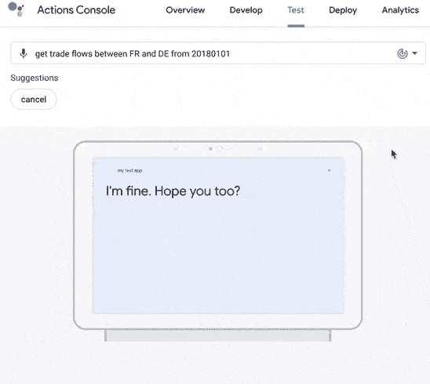

*作者图片*

**2.6。高级功能—使用代理跟进意图启用数据过滤**

现在，我们希望允许用户过滤显示的数据。但问题是，每次用户键入新的请求时，当前的上下文都会丢失，因为 Dialogflow 无法理解该请求链接到了以前显示的贸易流列表。

这可以通过*跟进意图*功能来实现。

下面将允许用户使用文本值进行过滤和/或将列表限制为前 n 条记录。

执行以下步骤来创建新的跟进意向:

*   点击*意图*菜单项
*   将鼠标移至您的*环保出口与索赔*主要意图上
*   应出现名为*创建跟进意图*的按钮。点击它
*   将跟进意图命名如下:'*eco-eh-exports-vs-claims-filter '*

现在让我们添加一些将在我们的脚本和主要意图中使用的上下文变量。

在*上下文*部分，添加以下内容:

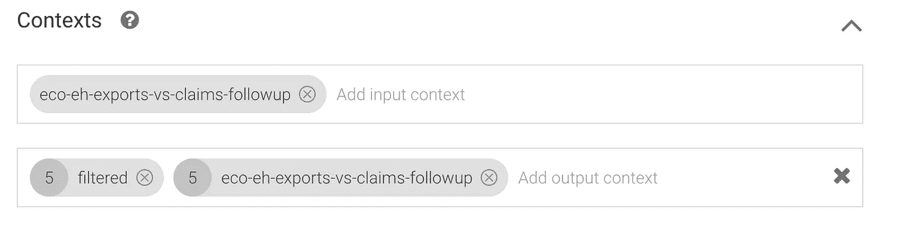

*作者图片*

*   在输入上下文字段中，添加 1 个名为'*eco-eh-exports-vs-claims-follow-up*的变量
*   在*输出上下文*字段中，添加两个变量'*过滤*和*' eco-eh-exports-vs-claims-follow '*(与输入相同)

在*训练短语*部分添加以下短语。这个例子的完整短语列表可以在上一篇文章中下载，但是您也可以添加类似的短语，比如 limit rows 10，top 10，filter by motor，select by motor。突出显示的部分被视为变量。

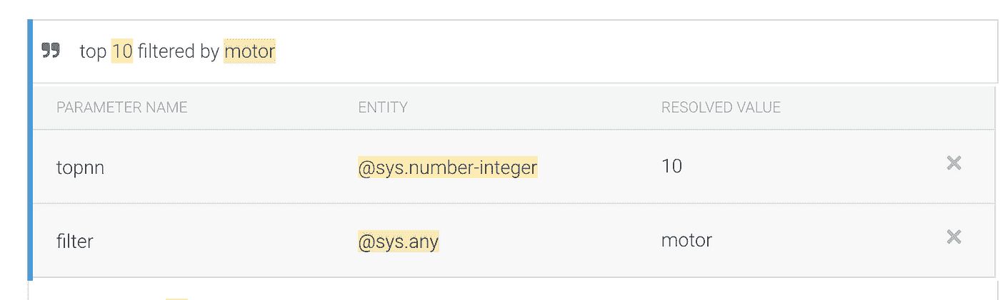

*作者图片*

在与*训练短语*相关的*动作和参数*中添加以下内容:

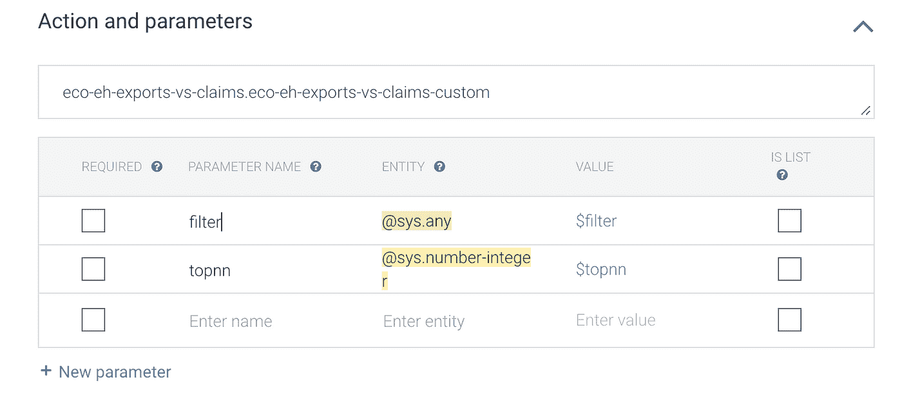

*作者图片*

最后，启用按钮“*启用此意图的 Webhook 调用*

现在你完成了后续的意图。点击*‘保存’*按钮。

让我们更改名为'*eco-eh-exports-vs-claims*'的**主要意图**的输出上下文，以便将上下文从主要意图传输到后续意图。

在*上下文*部分:

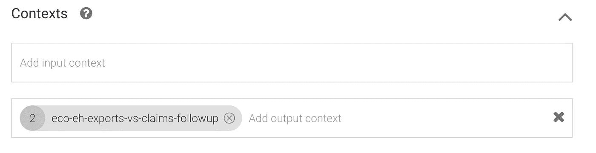

*作者图片*

*   在*输出上下文*字段中，添加 1 个名为*‘eco-eh-exports-vs-claims-follow up’*的变量
*   保存意图

**2.7。处理履约码**中的数据过滤

现在已经配置了后续意图，让我们在实现代码中添加过滤器处理程序的相应代码。

*   点击*履行*菜单项
*   在标准处理程序之后添加以下处理程序代码，以处理筛选列表

请注意，' *filter* '和' *topnn* '参数在此用作结果过滤器。此外，处理程序还将添加一些*建议*按钮，可以帮助用户点击它们，直接过滤特定的国家或部门。

```
 // .
  // Euler Hermes Trade Flows and Payment - Filter Handler - Google Assistant
  // . 
  function exportsVSClaimsEHFilterHandler(agent) {

    let conv = agent.conv();

  	const parameters = conv.contexts.get("eco-eh-exports-vs-claims-followup").parameters;
  	console.log("=======> Parameters " + parameters);
    var countryCodeExport = parameters['geo-country-code-export'];
    var countryCodeImport = parameters['geo-country-code-import'];
    var periodFrom = parameters['date-period-from'];
    var periodTo = parameters['date-period-to'];
    var filter = parameters['filter'];
    var topNN = parameters['topnn'];
  	conv.ask('Current Filter Parameter: ' + filter );

    return getTradeFlows(countryCodeExport, countryCodeImport, periodFrom, periodTo, filter, topNN)
        .then((rows) => {

      	if (rows.length === 0) {
          conv.ask(`No data has been found for this selection`);
          conv.ask(new Suggestions(intentSuggestions));
          return;
        }       

        conv.ask(`Here's the filtered Trade Flows and Payment Defaults data`);
      	conv.ask(new Table({
          title: 'Trade Flows/Payment Defaults',
    		subtitle: 'Euler-Hermes OpenData' + ' filtered by: "' + filter + '"',
          	image: new Image({
      			url: 'https://s3-eu-west-1.amazonaws.com/aws-ec2-eu-1-opendatasoft-staticfileset/euler-hermes/logo?tstamp=155013988259',
      			alt: 'Alt Text',
    		}),           
    		dividers: true,
    		columns: ['Sector Group', 'Sector', 
                        {
        			header: 'Export Amount',
        			align: 'TRAILING',
      			}, 
                        {
        			header: 'Claim Amount',
        			align: 'TRAILING',
      			},       
                        {
        			header: 'Traff. Light',
        			align: 'CENTER',
      			}],
    		rows: rows    
		}));

      	conv.ask(new Suggestions(intentSuggestions));

        agent.add(conv); 

    });

 }
```

# 3)闲聊

您的代理可以学习如何支持闲聊，而无需任何额外的开发。默认情况下，它会用预定义的短语进行响应。

点击左边菜单项上的*小对话*。

现在，您可以使用下面的表格来定制对最受欢迎的请求的响应。

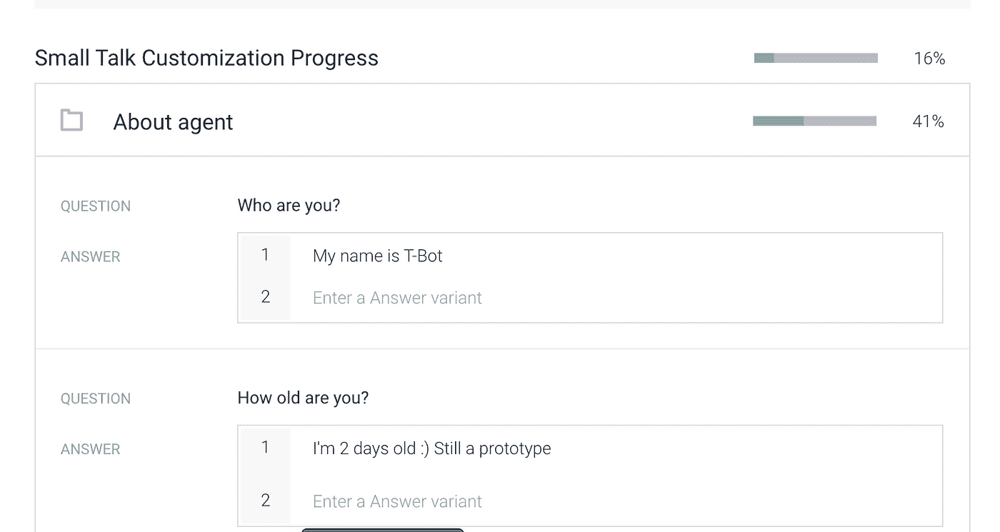

*作者图片*

# 4)代理测试

本节解释如何以两种不同方式测试我们的代理:

*   谷歌助手模拟器(网络应用)
*   移动设备上的谷歌助手

**4.1。谷歌助手模拟器**

现在让我们回到*集成*菜单，运行谷歌助手模拟器。点击“*与我的测试应用程序*对话”按钮，然后再次输入以下请求:

*   *获取从 20180101 到 20180102 的 FR 到 de 之间的贸易流量*

您应该会看到与前面部分相同的结果:


*作者图片*

显示贸易流列表后，尝试键入以下内容来过滤列表。此短语将仅显示包含文本' *motor'* sector '的项目，但仅显示前 10 条记录:

*   *被电机过滤的前 10 名*

您应该会看到以下结果:

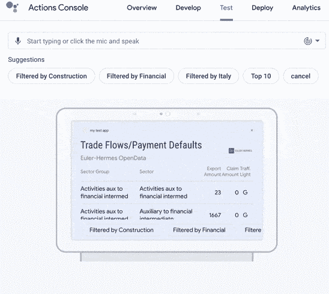

*作者图片*

**4.2。移动设备上的谷歌助手**

让我们在移动设备上测试我们的代理。(在 Android 或 iOS 上)

首先，请确保您使用的是与 Google Dialogflow 相同的 Google 帐户。

然后，执行以下操作，在您的设备上运行并初始化您的 Google Assistant。这个例子适用于 Android，但也可以在 iOS 上完成。

*   按住 Android 设备的*中央按钮*，直到谷歌助手出现
*   点击右上角的“*账户*按钮，选择正确的谷歌账户。如果尚未设置，您可以添加一个新帐户并进行配置。确保主语言设置为'*英语*'。
*   现在，您可以使用键盘或语音来执行以下操作:

>说出或键入“*与我的测试应用程序*对话”来运行代理

>说出或键入以下请求:*获取从 20180101 到 20180102* 的 FR 到 de 之间的贸易流量

您应该会在移动设备上看到以下结果:

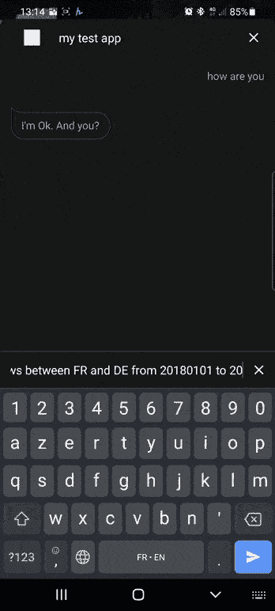

*作者图片*

最后，说出或键入以下内容，像前面一样过滤列表:

*   *按建设筛选出的前 8 名*

您应该会在移动设备上看到以下结果:

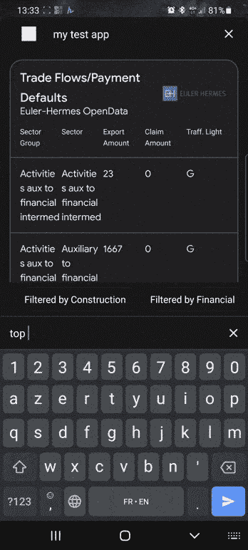

*作者图片*

下一篇文章(第三部分)将向您展示如何:

>超越谷歌助手布局的限制

>在 Flutter 中设计一个多平台应用，能够:

*   安全认证并使用我们的 Dialogflow 代理
*   在移动设备上显示丰富灵活的用户界面
*   管理自定义的负载对话流消息