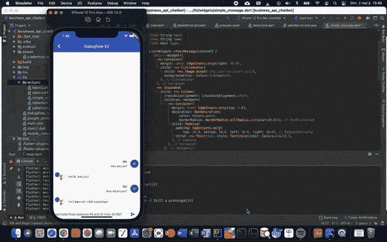
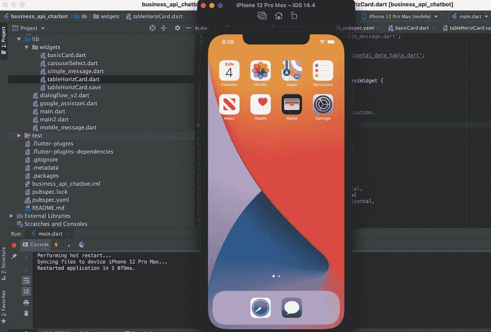
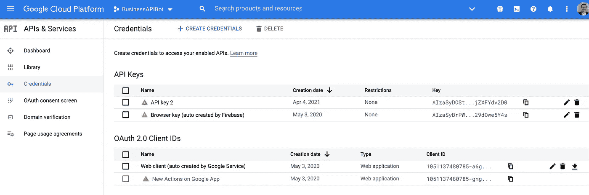
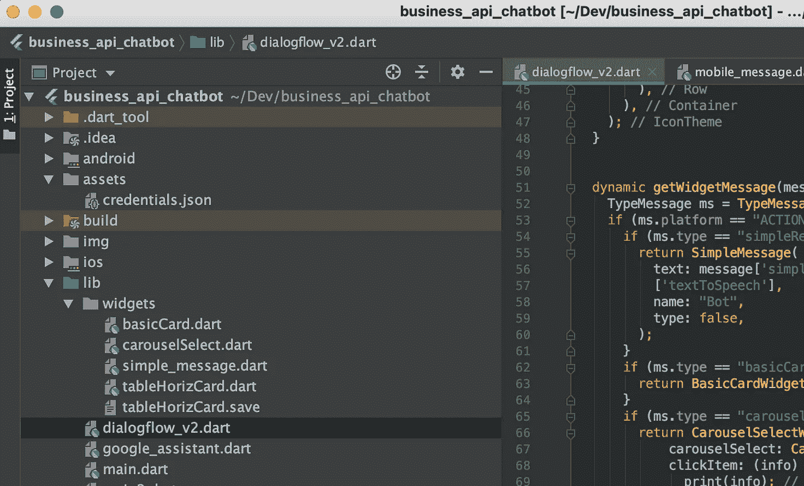
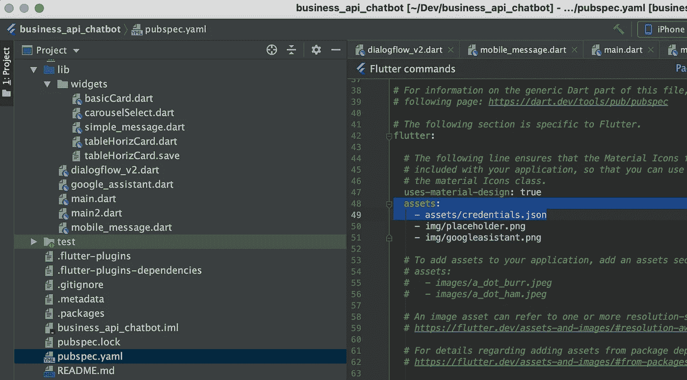
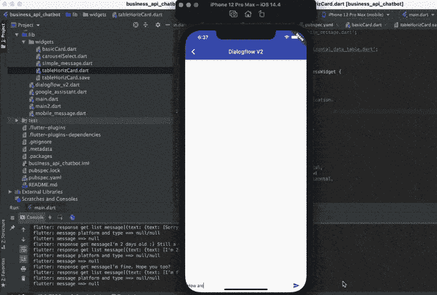

# 使用 Google Dialogflow & Flutter 的企业级多平台虚拟助理(第三部分)

> 原文：<https://towardsdatascience.com/enterprise-grade-multi-platform-virtual-assistant-with-google-dialogflow-flutter-part-iii-303dcd6b9d01?source=collection_archive---------31----------------------->

## 第三部分:在 Flutter 中设计一个简单的 iOS 应用程序，与您的 Dialogflow 代理进行通信



图片:作者

## 参见[第一部分](/enterprise-grade-multi-platform-virtual-assistant-with-google-dialogflow-flutter-part-i-da6f05edfed)和[第二部分](/enterprise-grade-multi-platform-virtual-assistant-with-google-dialogflow-and-flutter-part-ii-343327236d8f)

# 1)第二部分概述

上一篇文章描述了如何使用 Google Dialogflow 构建一个简单的聊天机器人，它能够使用 Euler Hermes Open Data web services API 在两个国家之间交换贸易流。表示层依靠 Google Assistant 来显示结果。但是你可能已经注意到谷歌助手是非常有限的，因为你不能自定义组件的布局。例如，*表格*对象最多可以显示 4–5 列，无需任何水平滚动。

# 2)本文的总结

这一条的目标如下:

*   超越谷歌助手布局的限制
*   设计一个简单的颤振多平台应用程序，能够:
*   >安全认证并使用我们的 Dialogflow 代理
*   >在移动设备上显示丰富灵活的用户界面(这里是 iOS，但也可以是 Android 或 Web 应用程序)
*   >管理定制的*有效负载* Dialogflow 消息，以在 Dialogflow 和我们的 Flutter 应用程序之间交换信息

额外的好处是设计的移动应用程序将是动态的。它可以根据从 NLP 对话后端引擎发送的有效负载消息中包含的业务逻辑做出反应并显示组件。

# 3)颤振引入和 SDK 安装

Flutter 是 Google 的 UI 工具包，用于从单个代码库构建**本地**编译的移动、网络和桌面应用。与同等框架相比，本机意味着高性能。

你可以在这里浏览下面的链接[来探索 Flutter 的 showcase，它展示了使用该框架的一些特性和例子。](https://flutter.dev/showcase)

下载和安装 Flutter SDK 的说明可以在[这里](https://flutter.dev/docs/get-started/install)找到。

您可能还需要安装额外的组件( *XCode* for MacOS…)，这取决于您正在使用的操作系统(MacOS、Windows、Linux)以及您想要用于测试的目标平台(iOS、Android、Web)。

最后，您还需要安装一个开发环境。这里，我们将使用与 Flutters 和 XCode 很好集成的 IntelliJ。[下载](https://www.jetbrains.com/idea/download/)请到以下链接。

# 4)重新审视了对话流履行代码

让我们开始稍微改变一下我们以前的文章(NodeJS)中写的 Google dialog flow Cloud fulfillment 函数。这里的想法是改变代码的方式，它将继续与谷歌助理和我们新的颤振 iOS 应用程序。

这意味着我们的代理人的行为会根据打电话的客户而变化。基本上，添加了一些条件来区分 Google Assistant 消息和我们移动应用程序的消息。

这些条件检查了 *agent.requestSource* 的内容*。ACTIONS_ON_GOOGLE'* 表示请求来自 Google Assistant。如果 *agent.requestSource* 为 *null* ，我们认为它来自我们的移动 Flutter 应用程序。(参见带有“//移动应用程序”注释的代码)

您可能知道，如果您向除 Google Assistant 之外的任何其他应用程序发送 Google Assistant 消息，而 Google Assistant 不是为此设计的(Web、移动应用程序)，那么您发送的消息将被 Dialogflow 上的错误拒绝，并且您的组件将不会显示。

那么，还有办法在 web 或移动应用程序中显示一个*表*或任何其他 Google Assistant 组件吗？答案是肯定的！

在这段代码中，请注意使用 ***有效载荷*** 消息的部分，以避免 Dialogflow 出现此错误消息。构建一个*表*对象，然后将其 JSON 表示存储到*有效负载*消息中。稍后您将看到，这条消息将作为响应发送回移动应用程序。然后，移动应用程序将解析它，并使用一个新的表格小部件向用户显示响应。

**履行源代码:**

```
 // .
  // Euler Hermes Trade Flows and Payment Handler - Google Assistant
  // . 
  function exportsVSClaimsEHHandler(agent) {   

    let conv = agent.conv(); 
    var parameters = "";
    // Google Assistant Connection
    if (agent.requestSource === 'ACTIONS_ON_GOOGLE') {
      	parameters = conv.parameters;
    } 
    // Mobile Connection
    else if (agent.requestSource == null) { 
       	parameters = agent.parameters;
    }  
    console.log("=======> Parameters " + parameters);
    var countryCodeExport = parameters['geo-country-code-export'];
    var countryCodeImport = parameters['geo-country-code-import'];
    var periodFrom = parameters['date-period-from'];
    var periodTo = parameters['date-period-to'];
    var filter = parameters['filter'];
    var topNN = parameters['topnn']; 

    return getTradeFlows(countryCodeExport, countryCodeImport, periodFrom, periodTo, filter, topNN)
       	.then((rows) => {

    // Google Assistant Connection
    if (agent.requestSource === 'ACTIONS_ON_GOOGLE') {

          if (rows.length === 0) {
            conv.ask(`No data has been found for this selection`);
            conv.ask(new Suggestions(intentSuggestions));
            return;
          } 

          conv.ask(`Here's the Trade Flows and Payment Defaults data`);
          conv.ask(new Table({
            title: 'Trade Flows/Payment Defaults',
              subtitle: 'Euler-Hermes OpenData',
              image: new Image({
                  url: 'https://s3-eu-west-1.amazonaws.com/aws-ec2-eu-1-opendatasoft-staticfileset/euler-hermes/logo?tstamp=155013988259',
                  alt: 'Alt Text',
              }),           
              dividers: true,
              columns: ['Sector Group', 'Sector', 
                  {
                      header: 'Export Amount',
                      align: 'TRAILING',
                  }, 
                  {
                      header: 'Claim Amount',
                      align: 'TRAILING',
                  },       
                  {
                      header: 'Traff. Light',
                      align: 'CENTER',
                  }],
              rows: rows    
          }));

          conv.ask(new Suggestions(intentSuggestions));

          agent.add(conv); 

       }  

      // Mobile Connection
      if (agent.requestSource == null) {

        if (rows.length === 0) {
          agent.add(`No data has been found for this selection`);
          agent.add(new Suggestions(intentSuggestions));
          return;
        } 

        agent.add(`Here's the Trade Flows and Payment Defaults data`);
        let payload = new Table({
          title: 'Trade Flows/Payment Defaults',
          subtitle: 'Euler-Hermes OpenData',
          image: new Image({
            url: 'https://s3-eu-west-1.amazonaws.com/aws-ec2-eu-1-opendatasoft-staticfileset/euler-hermes/logo?tstamp=155013988259',
            alt: 'Alt Text',
          }),           
          dividers: true,
          columns: ['Sector Group', 'Sector', 
                    {
                      header: 'Export Amount',
                      align: 'TRAILING',
                    }, 
                    {
                      header: 'Claim Amount',
                      align: 'TRAILING',
                    },       
                    {
                      header: 'Traff. Light',
                      align: 'CENTER',
                    }],
          rows: rows    
        });

        var rr = new RichResponse("Trade Flows for mobile", payload);
        rr.platform = 'ACTIONS_ON_MOBILE';
        rr.type = 'tableCard';
        agent.add(new Payload('platform: ACTIONS_ON_MOBILE', rr, {rawPayload: true, sendAsMessage: true}));

        //agent.add(new Suggestions(intentSuggestions));

      }  

    });

 }
```

# 5)设置一个与我们的 Dialogflow 代理通信的简单 iOS 应用程序

在这里，我们将创建一个带有 IntelliJ 的 iOS 应用程序，它与我们的代理进行通信。对于 Android 手机来说，这应该是完全相同的步骤，这是使用 *Flutter* 的主要好处之一。您可以用相同的代码定位几个平台。

**颤振应用设置**

一旦设置好您的 *Flutter* 和 *IntelliJ* 环境，请创建一个新的 *Flutter* 应用程序，并根据您的需要命名，例如:***business _ API _ chatbot*。**

然后，打开 iOS 模拟器，创建一个新的 iOS 12 设备。

当您准备好运行应用程序时，您的屏幕应该是这样的:



图片:Autor

**API 密钥设置**

首先，进入*谷歌云平台*控制台，在左侧菜单中选择“ *API 和服务*，然后选择“*凭证”*。



图片:Autor

创建并下载 API 密匙，它将允许您从 *Flutter* 应用程序与您的 Dialogflow 代理进行通信。

将密钥命名为' *credentials.json* ，并将密钥保存到您之前创建的 *Flutter* 应用程序的' *assets* 文件夹中。



编辑' *pubspec.yaml* '文件，确保' *asset* '条目设置如下:



# 6)向我们的 iOS 应用程序添加新的小部件，以显示从我们的 Dialogflow 代理发送的 Euler Hermes 数据

最终的应用程序实际上能够显示几个小部件:*简单消息*、*基本卡片*、*转盘*和*数据表*。但是在这里，我们将只关注将在以下部分创建的*简单消息*和*数据表*。

首先，我们需要创建我们的移动消息结构，它应该反映从我们的 Dialogflow 代理发送的*有效负载*消息结构。

基本上，包含 Euler Hermes 数据的*有效负载*消息由列标题和数据行组成:

*   集团部门
*   部门
*   两国间的出口量
*   两个国家之间的索赔金额
*   交通灯(绿色、琥珀色、红色)

*TableCard* 类将存储从我们的 Dialogflow 代理接收的*有效负载*消息提供的所有信息。

请注意， *TypeMobileMessage* 类确保只执行*有效载荷*消息类型。

现在，请创建一个新的 Dart 文件，命名如下: **mobile_message.dart**

```
class TableColumn {
  String colHeader;
  TableColumn(Map column){
    this.colHeader = column['header'];
  }
}

class TableRow {
  String sectorGroup;
  String sector;
  String exportAmount;
  String claimAmount;
  String trafficLight;
  TableRow(Map row){
    this.sectorGroup = row['cells'][0]['text'];
    this.sector = row['cells'][1]['text'];
    this.exportAmount = row['cells'][2]['text'];
    this.claimAmount = row['cells'][3]['text'];
    this.trafficLight = row['cells'][4]['text'];
  }
}

class TableCard {
  List<TableColumn> cols=[];
  List<TableRow> rows=[];
  TableCard(Map response){
    List<dynamic> listCols = response['payload']['items'][1]['tableCard']['columnProperties'];
    for(var i=0;i<listCols.length;i++){
      cols.add(new TableColumn(listCols[i]));
    }
    List<dynamic> listRows = response['payload']['items'][1]['tableCard']['rows'];
    for(var i=0;i<listRows.length;i++){
      rows.add(new TableRow(listRows[i]));
    }
  }
}

class TypeMobileMessage{
  String platform;
  String type;
  TypeMobileMessage(Map message){
    if (message.containsKey("payload")) {
      this.platform = message['payload']['platform'];
      this.type = message['payload']['type'];
    }
  }
}
```

现在让我们看看如何在我们的移动应用程序中显示一条简单的文本消息。下面是一个简单的文本小部件的代码，当我们的 Dialogflow 代理向移动应用程序发回一个回答时，将显示这个小部件。一个谷歌助理图标将与文本消息一起显示，让用户可以轻松识别答案来自我们的 Dialogflow 代理。

请创建新的 Dart 文件，并将其命名为: **simple_message.dart**

```
import 'package:flutter/material.dart';
import 'package:flutter/widgets.dart';

class SimpleMessage extends StatelessWidget {
  SimpleMessage({this.text, this.name, this.type});

  final String text;
  final String name;
  final bool type;

  List<Widget> otherMessage(context) {
    return <Widget>[
      new Container(
        margin: const EdgeInsets.only(right: 16.0),
        child: new CircleAvatar(
          child: new Image.asset("img/googleasistant.png"),
          backgroundColor: Colors.*transparent*,
        ),
      ),
      new Expanded(
        child: new Column(
          crossAxisAlignment: CrossAxisAlignment.start,
          children: <Widget>[
            new Container(
              margin: const EdgeInsets.only(top: 5.0),
              decoration: BoxDecoration(
                  color: Colors.*white*,
                  borderRadius: BorderRadius.all(Radius.circular(20.0))),
              child: Padding(
                padding: EdgeInsets.only(
                    top: 10.0, bottom: 10.0, left: 10.0, right: 10.0),
                child: new Text(text, style: TextStyle(color: Colors.*black*),),
              ),
            ),
          ],
        ),
      ),
    ];
  }

  @override
  Widget build(BuildContext context) {
    return new Container(
      margin: const EdgeInsets.symmetric(vertical: 10.0),
      child: new Row(
        crossAxisAlignment: CrossAxisAlignment.start,
        children: this.type ? myMessage(context) : otherMessage(context),
      ),
    );
  }
}
```

使用新的文本小部件后，您的应用程序应该是这样的:



图片:Autor

最后一步是创建一个新的 ***表*** 小部件，它将包含我们来自 Euler Hermes 的数据。请使用以下代码创建一个新的 Dart 文件，并将其命名为: **tableHorizCard.dart**

```
import 'package:business_api_chatbot/mobile_message.dart';
import 'package:flutter/material.dart';
import 'package:flutter/widgets.dart';

class TableHorizCardWidget extends StatelessWidget {

  TableHorizCardWidget({this.tableCard});
  final TableCard tableCard;

  // This widget is the root of your application.
  @override
  Widget build(BuildContext context) {
    return Container(
      child: Scaffold(
        //backgroundColor: Colors.black54,
        //appBar: AppBar(),
        body: Center(
          child: Container(
            color: Colors.*white*,
            height: 500,
            child: SingleChildScrollView(
              scrollDirection: Axis.vertical,
              child: SingleChildScrollView(
                scrollDirection: Axis.horizontal,
                child: DataTable(
                  columns:
                      <DataColumn>[
                        DataColumn(
                          label: Text(tableCard.cols[0].colHeader, style: TextStyle(fontWeight: FontWeight.*bold*)),
                        ),
                        DataColumn(
                          label: Text(tableCard.cols[1].colHeader, style: TextStyle(fontWeight: FontWeight.*bold*)),
                        ),
                        DataColumn(
                          label: Text(tableCard.cols[2].colHeader, style: TextStyle(fontWeight: FontWeight.*bold*)), numeric:true,
                        ),
                        DataColumn(
                          label: Text(tableCard.cols[3].colHeader, style: TextStyle(fontWeight: FontWeight.*bold*)), numeric:true,
                        ),
                        DataColumn(
                          label: Text(tableCard.cols[4].colHeader, style: TextStyle(fontWeight: FontWeight.*bold*)),
                        ),
                  ],
                  rows: <DataRow>[
                    for (var item in tableCard.rows)
                      DataRow(
                        cells: <DataCell>[
                          DataCell(Text(item.sectorGroup)),
                          DataCell(Text(item.sector)),
                          DataCell(Text(item.exportAmount, textAlign:TextAlign.right,)),
                          DataCell(Text(item.claimAmount, textAlign:TextAlign.right)),
                          DataCell(Text(
                                item.trafficLight, textAlign: TextAlign.center,
                                style: TextStyle(backgroundColor: item.trafficLight == "R" ? Colors.*red* : Colors.*green*))),
                        ],
                    ),
                  ],
                ),
              ),
            ),
          ),
        ),
      ),
      height: MediaQuery
          .*of*(context)
          .size
          .height,
    );
  }
}
```

使用这个新的*表*小部件，您的应用程序应该是这样的。对于我们的文章来说，这个类是非常简单的，但是只需很小的努力就可以有一个复杂得多的布局。例如，固定列显示机制可以在水平滚动中实现。

请注意，您的移动应用程序的行为类似于我们在上一篇文章中创建的 Google Assistant 应用程序。但是，有了这个移动应用程序，有无限的可能性来创建新的丰富的窗口小部件与*摆动*，没有更多的布局限制！


图片:Autor